# Repeating Earthquake Activity at RCM

## Waveforms
[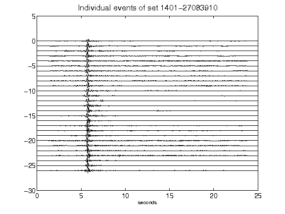](figures/1401-27083910_AllEv.png)[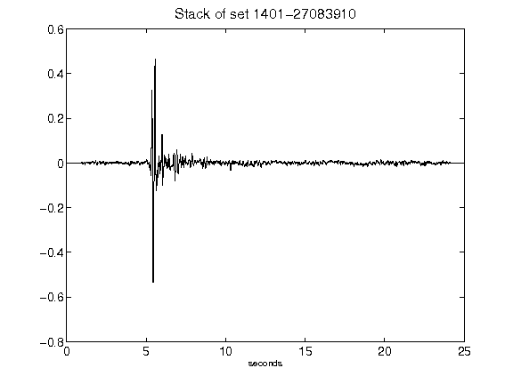](figures/1401-27083910_Stack.png)[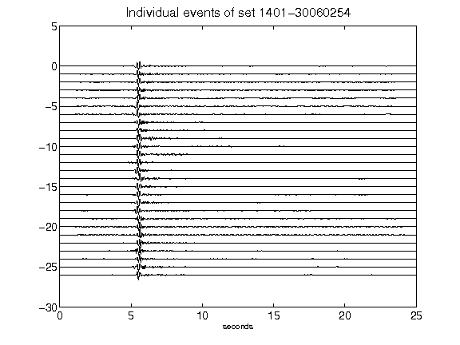](figures/1401-30060254_AllEv.png)[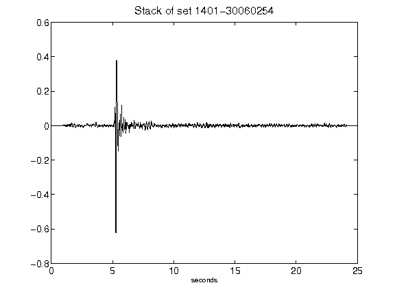](figures/1401-30060254_Stack.png)[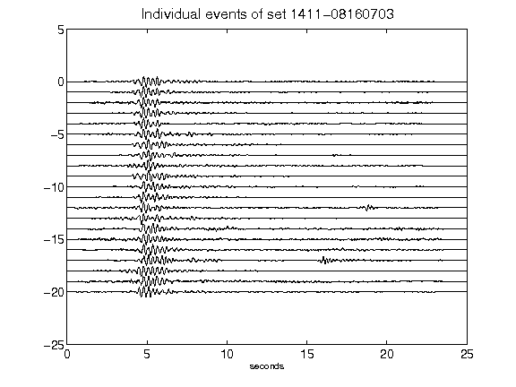](figures/1411-08160703_AllEv.png)[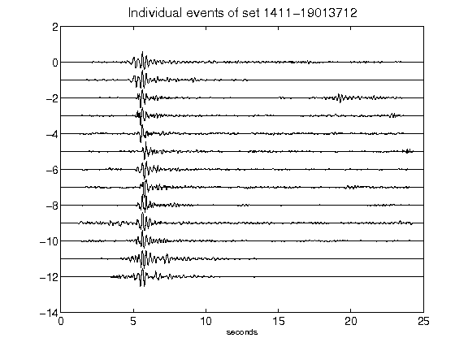](figures/1411-19013712_AllEv.png)[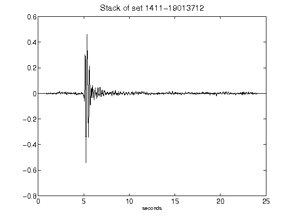](figures/1411-19013712_Stack.png)[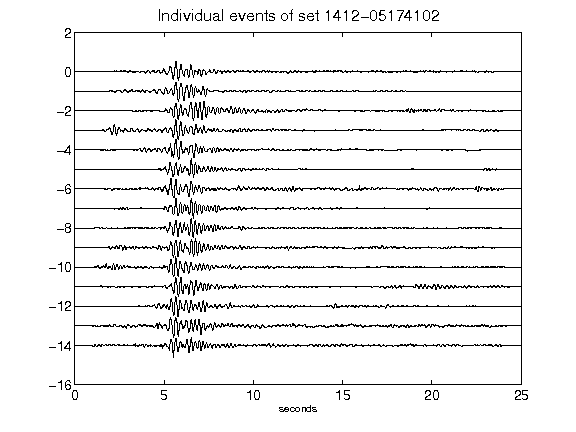](figures/1412-05174102_AllEv.png)[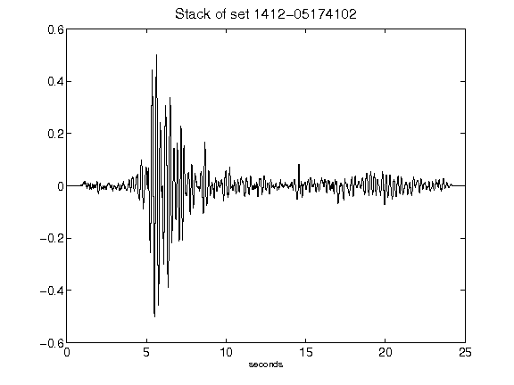](figures/1412-05174102_Stack.png)[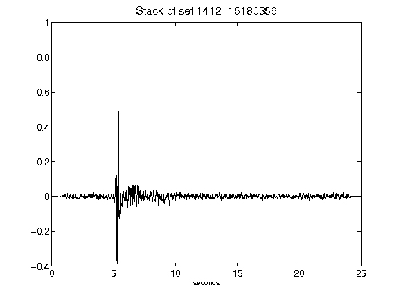](figures/1412-15180356_Stack.png)[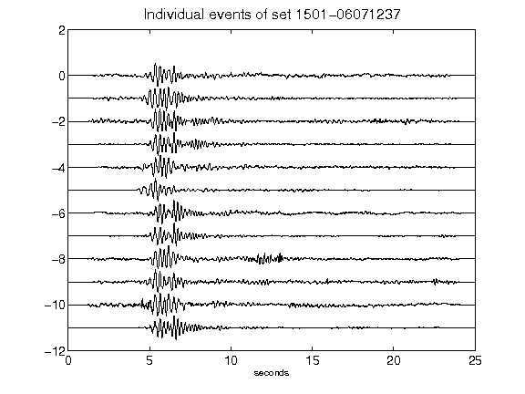](figures/1501-06071237_AllEv.png)[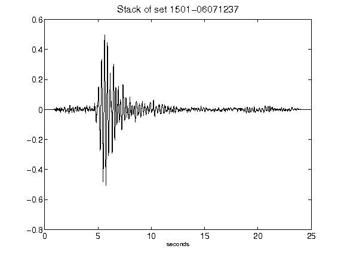](figures/1501-06071237_Stack.png)[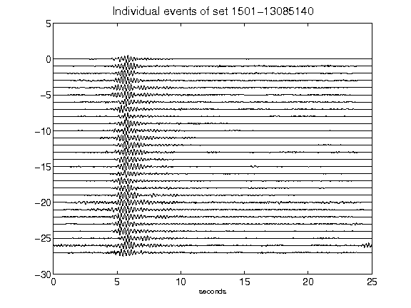](figures/1501-13085140_AllEv.png)[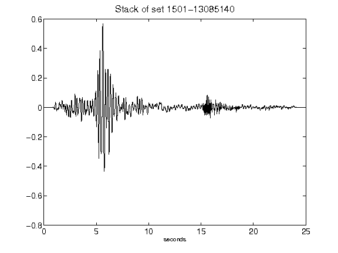](figures/1501-13085140_Stack.png)[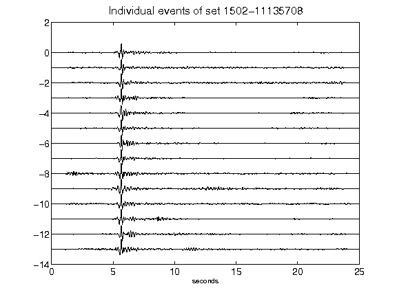](figures/1502-11135708_AllEv.png)[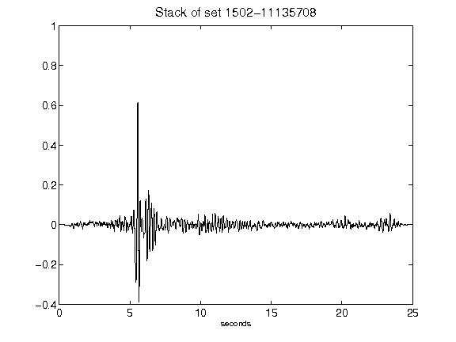](figures/1502-11135708_Stack.png)[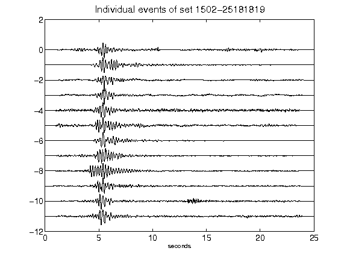](figures/1502-25181819_AllEv.png)[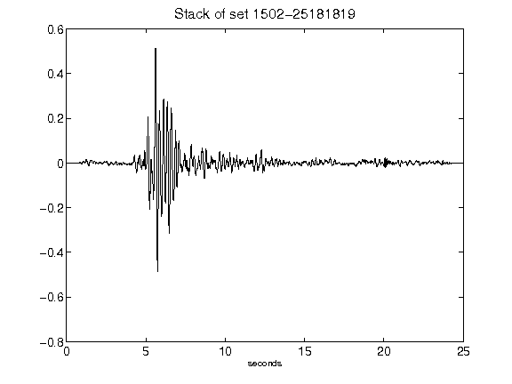](figures/1502-25181819_Stack.png)[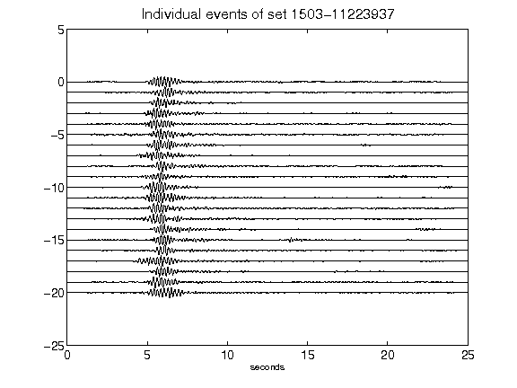](figures/1503-11223937_AllEv.png)[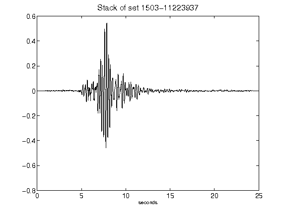](figures/1503-11223937_Stack.png)[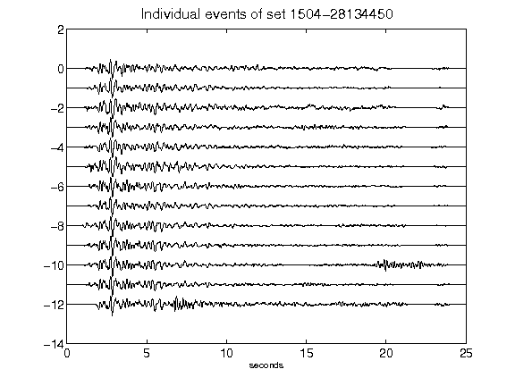](figures/1504-28134450_AllEv.png)[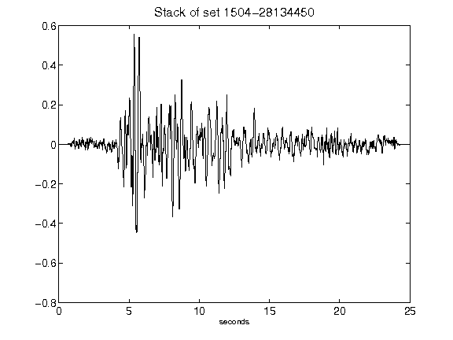](figures/1504-28134450_Stack.png)[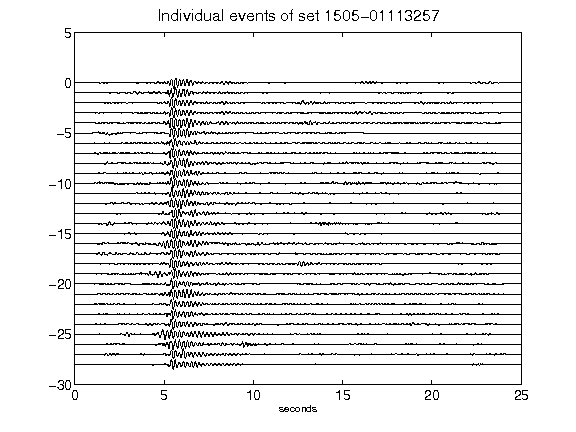](figures/1505-01113257_AllEv.png)[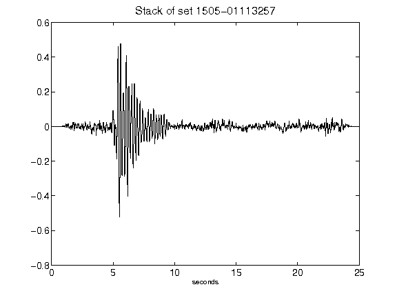](figures/1505-01113257_Stack.png)[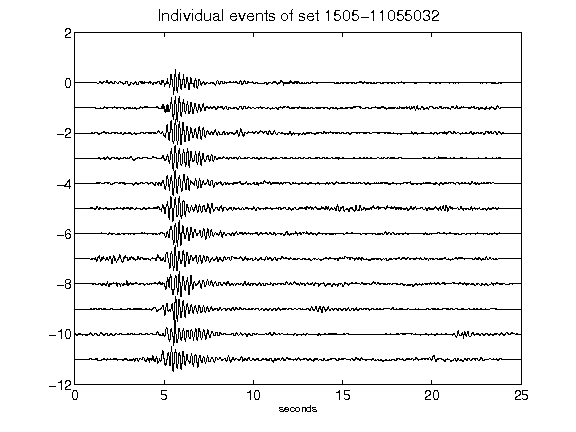](figures/1505-11055032_AllEv.png)[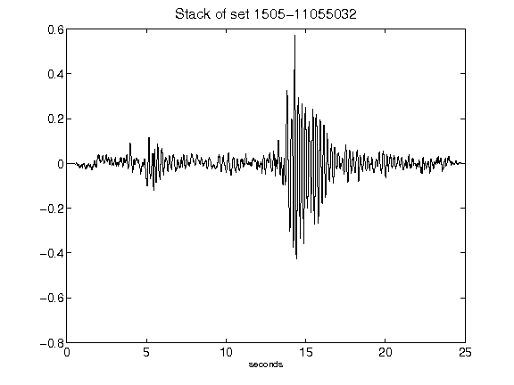](figures/1505-11055032_Stack.png)