# Repeating Earthquake Activity at RCM

## Waveforms
[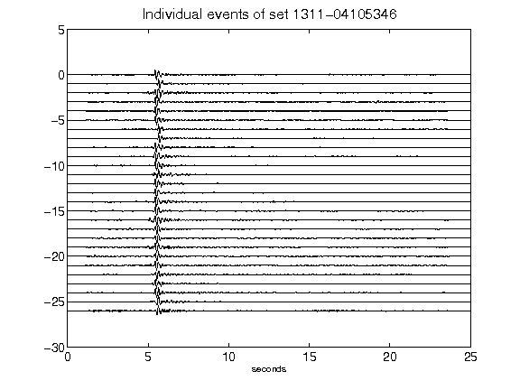](figures/1311-04105346_AllEv.png)[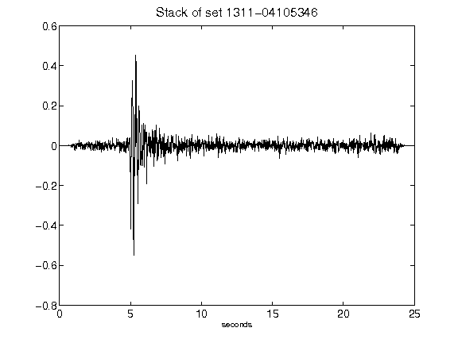](figures/1311-04105346_Stack.png)[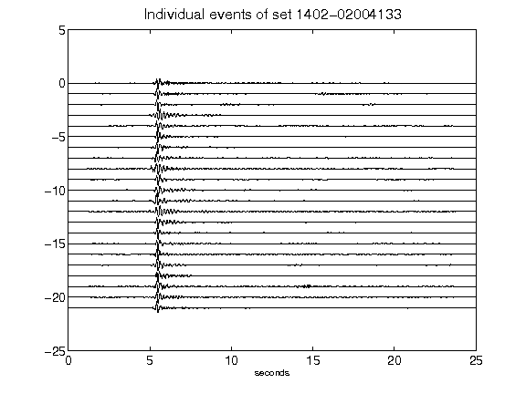](figures/1402-02004133_AllEv.png)[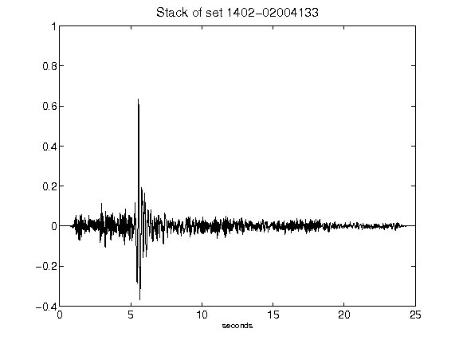](figures/1402-02004133_Stack.png)[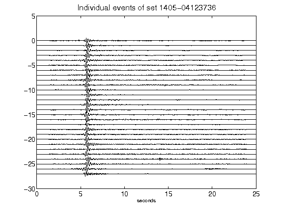](figures/1405-04123736_AllEv.png)[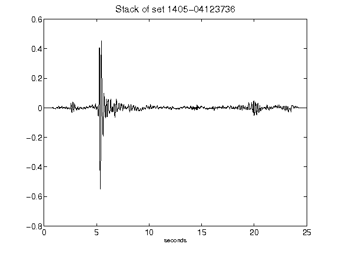](figures/1405-04123736_Stack.png)[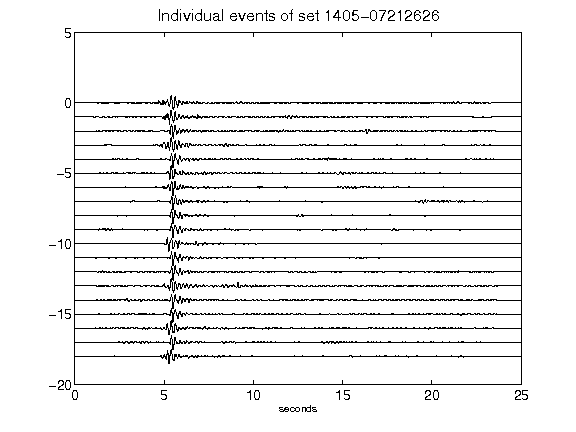](figures/1405-07212626_AllEv.png)[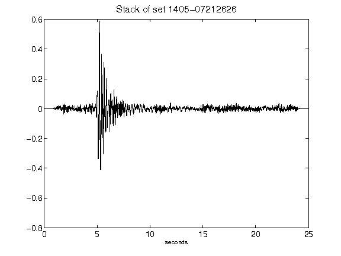](figures/1405-07212626_Stack.png)[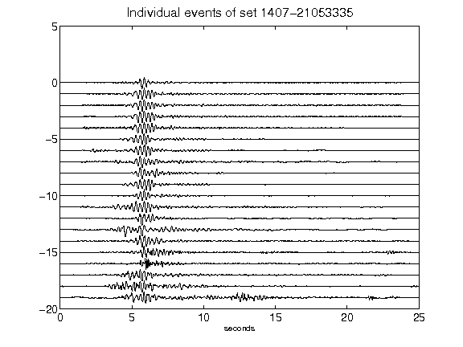](figures/1407-21053335_AllEv.png)[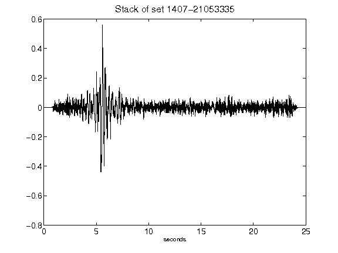](figures/1407-21053335_Stack.png)[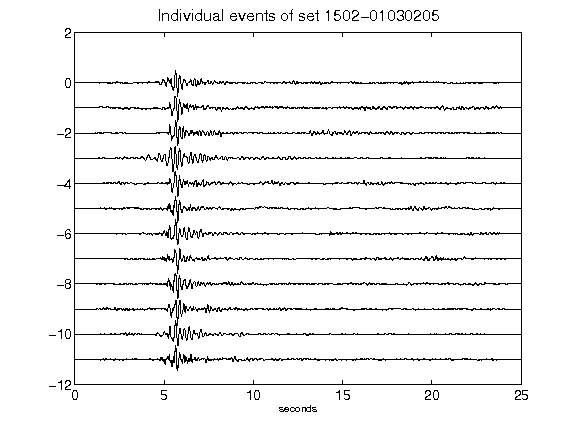](figures/1502-01030205_AllEv.png)[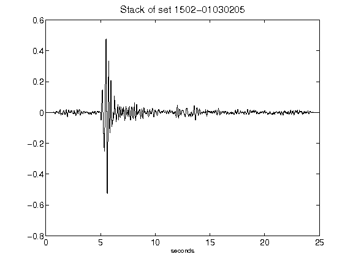](figures/1502-01030205_Stack.png)[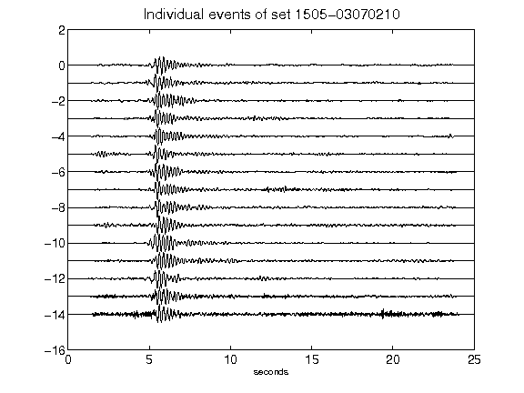](figures/1505-03070210_AllEv.png)[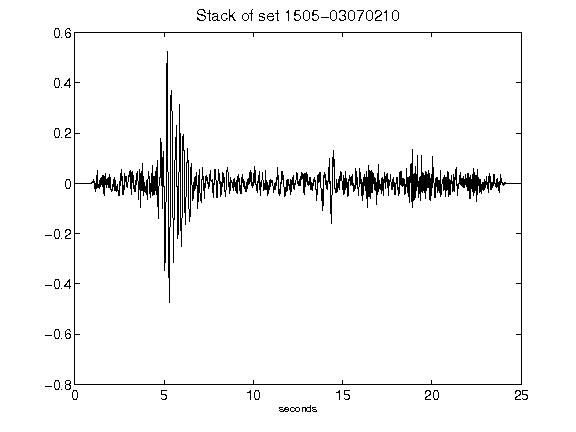](figures/1505-03070210_Stack.png)