# Repeating Earthquake Activity at RCM

## Waveforms
[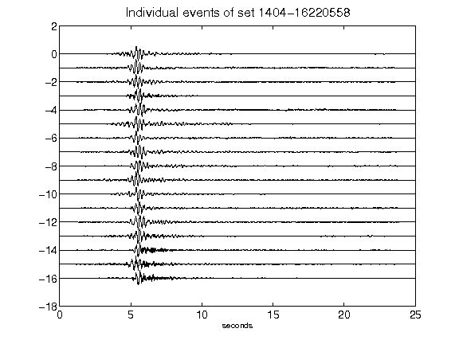](figures/1404-16220558_AllEv.png)[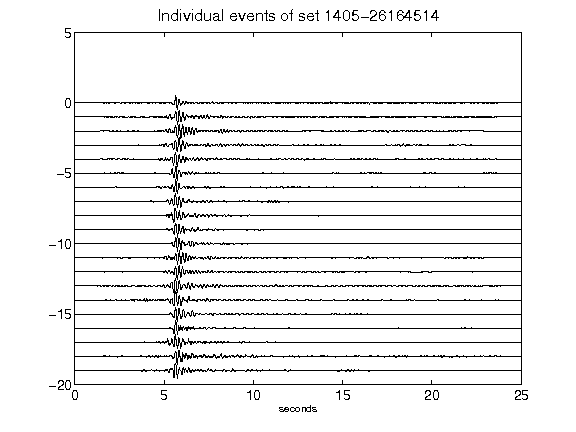](figures/1405-26164514_AllEv.png)[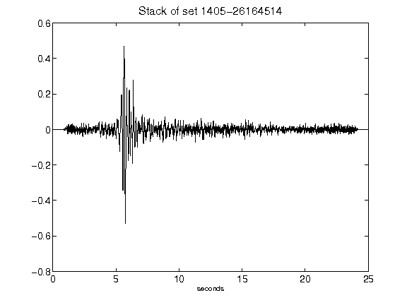](figures/1405-26164514_Stack.png)[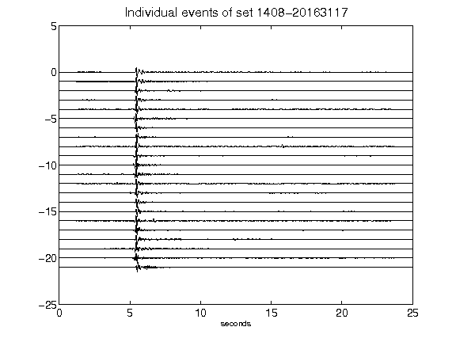](figures/1408-20163117_AllEv.png)[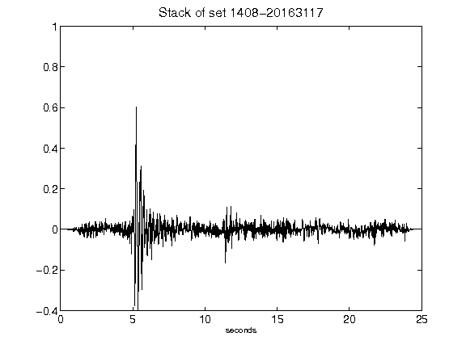](figures/1408-20163117_Stack.png)[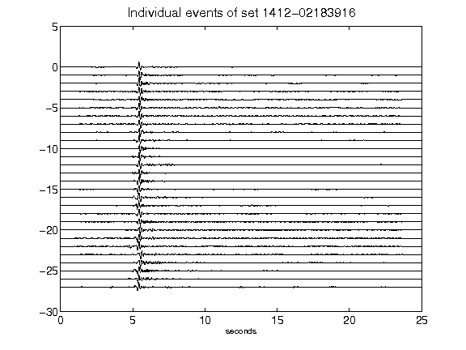](figures/1412-02183916_AllEv.png)[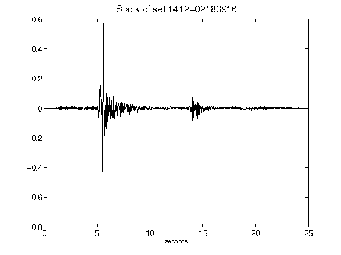](figures/1412-02183916_Stack.png)[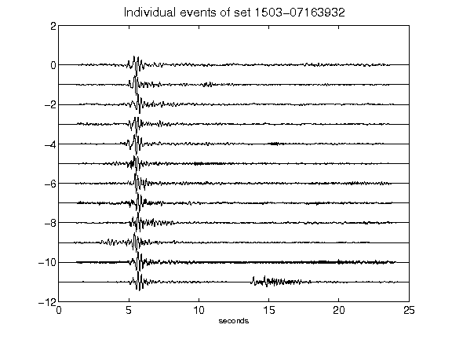](figures/1503-07163932_AllEv.png)[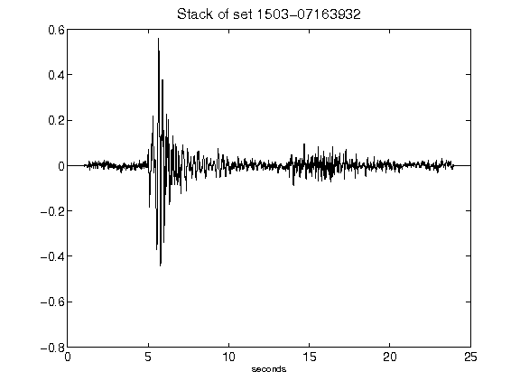](figures/1503-07163932_Stack.png)[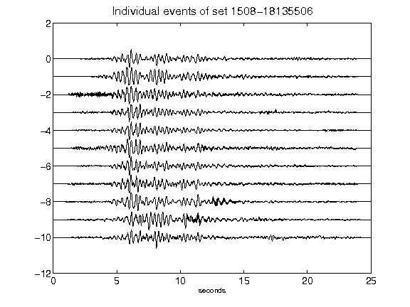](figures/1508-18135506_AllEv.png)[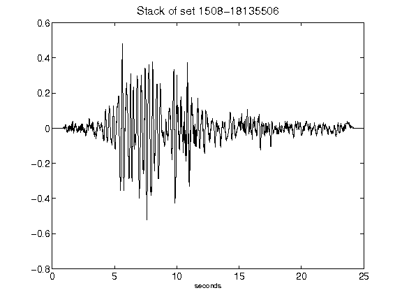](figures/1508-18135506_Stack.png)[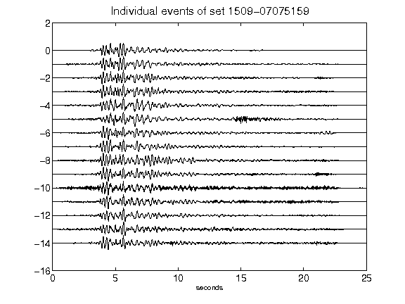](figures/1509-07075159_AllEv.png)[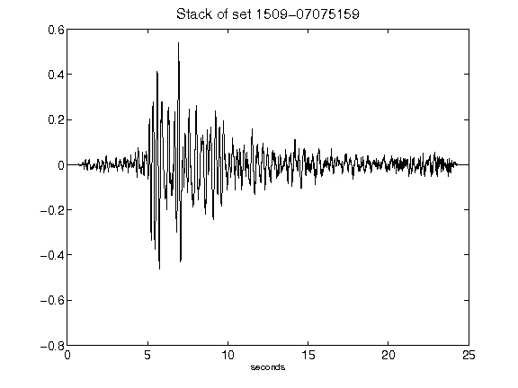](figures/1509-07075159_Stack.png)[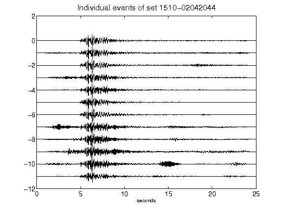](figures/1510-02042044_AllEv.png)[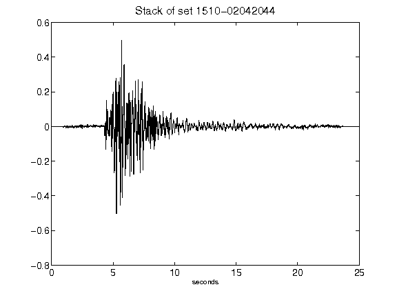](figures/1510-02042044_Stack.png)