# Repeating Earthquake Activity at RCM

## Waveforms
[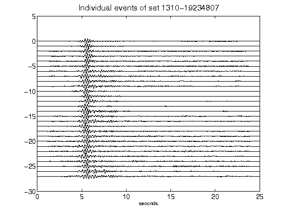](figures/1310-19234807_AllEv.png)[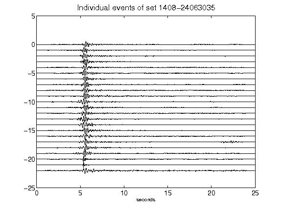](figures/1408-24063035_AllEv.png)[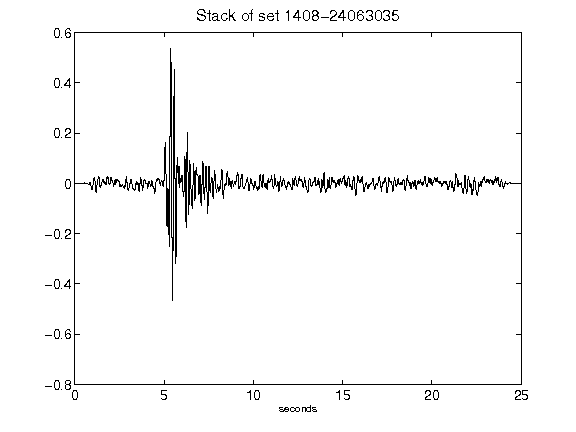](figures/1408-24063035_Stack.png)[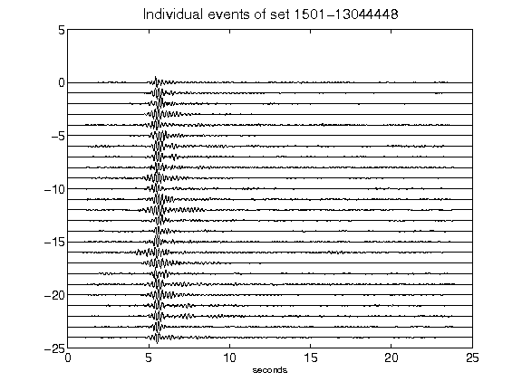](figures/1501-13044448_AllEv.png)[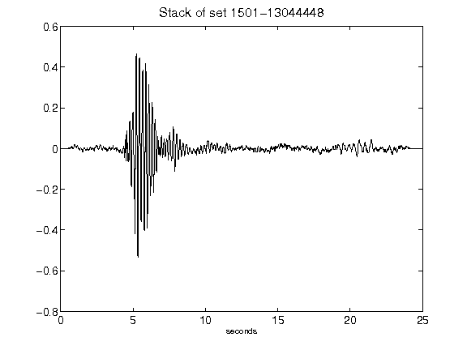](figures/1501-13044448_Stack.png)[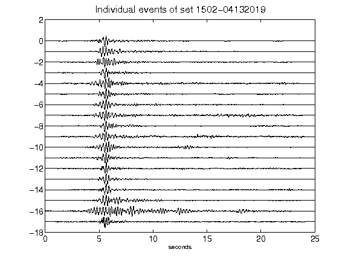](figures/1502-04132019_AllEv.png)[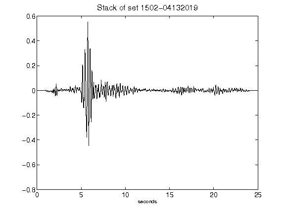](figures/1502-04132019_Stack.png)[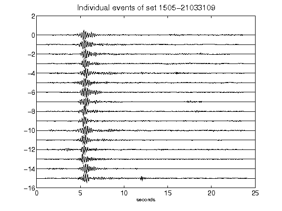](figures/1505-21033109_AllEv.png)[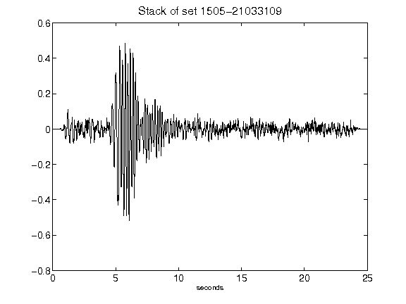](figures/1505-21033109_Stack.png)[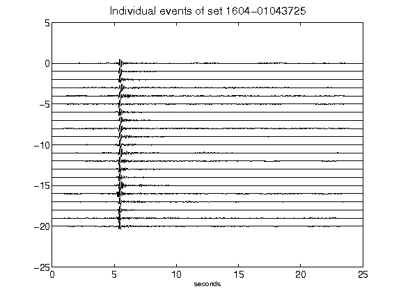](figures/1604-01043725_AllEv.png)[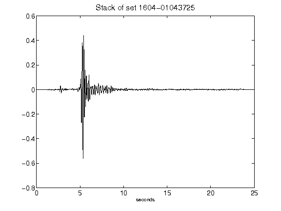](figures/1604-01043725_Stack.png)[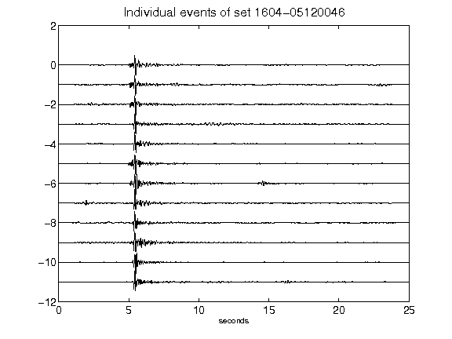](figures/1604-05120046_AllEv.png)[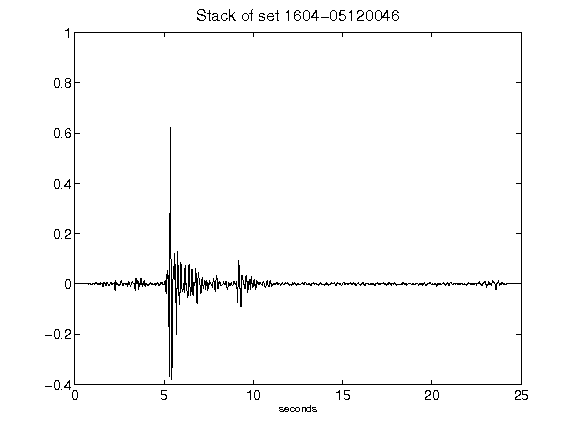](figures/1604-05120046_Stack.png)[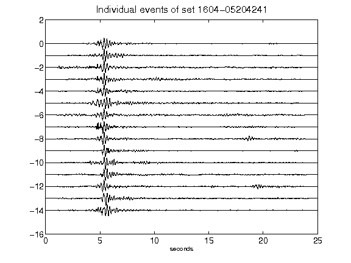](figures/1604-05204241_AllEv.png)[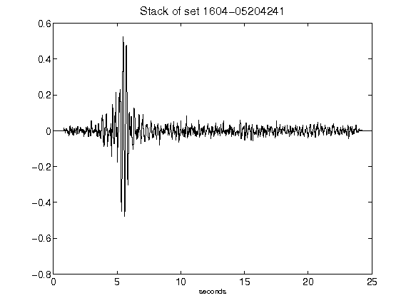](figures/1604-05204241_Stack.png)[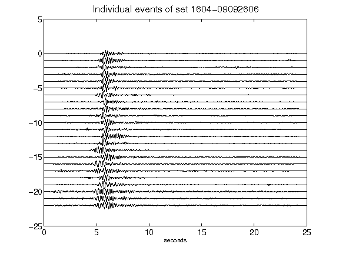](figures/1604-09092606_AllEv.png)[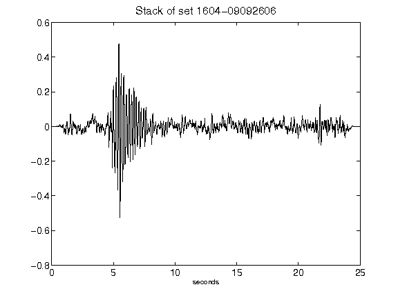](figures/1604-09092606_Stack.png)[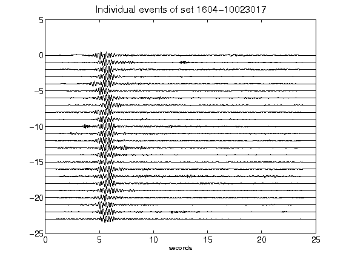](figures/1604-10023017_AllEv.png)[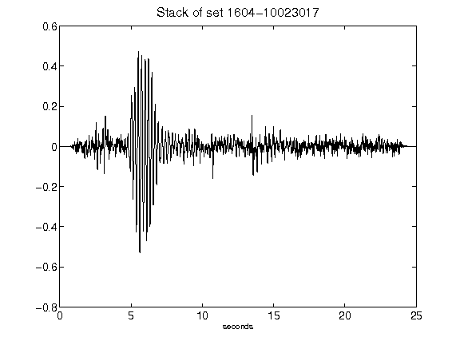](figures/1604-10023017_Stack.png)[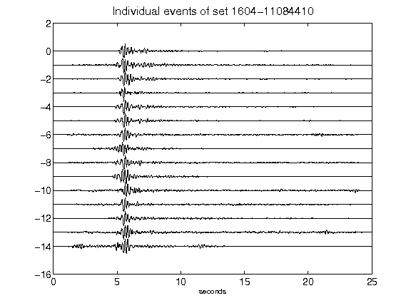](figures/1604-11084410_AllEv.png)[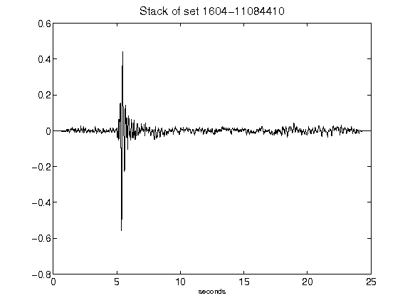](figures/1604-11084410_Stack.png)[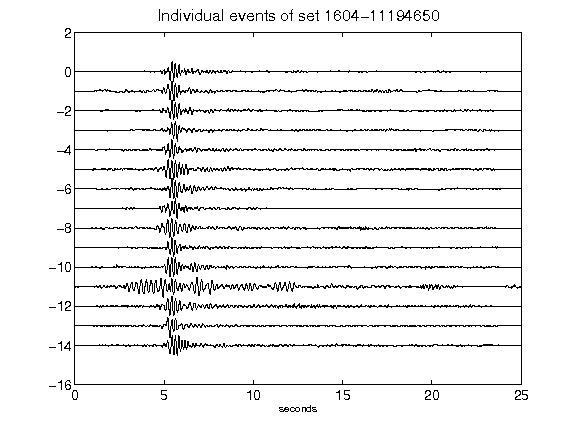](figures/1604-11194650_AllEv.png)[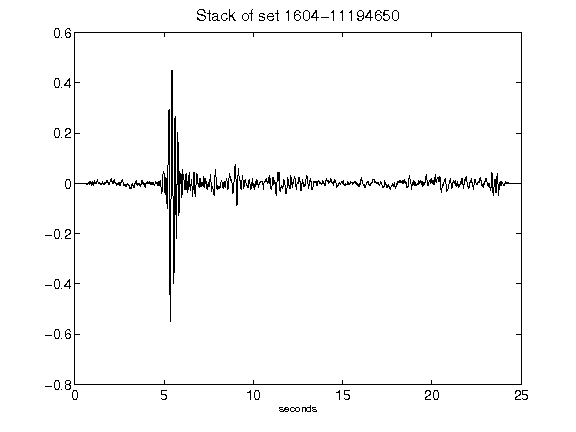](figures/1604-11194650_Stack.png)[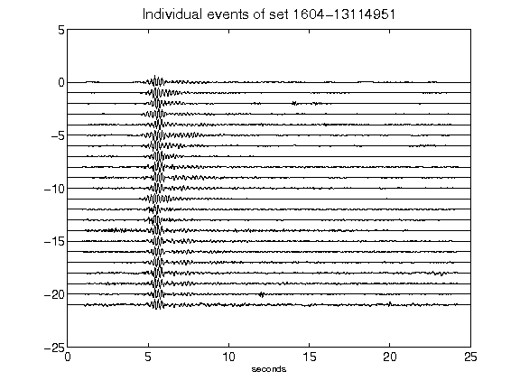](figures/1604-13114951_AllEv.png)[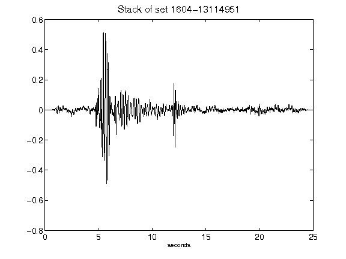](figures/1604-13114951_Stack.png)[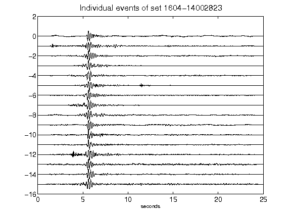](figures/1604-14002823_AllEv.png)[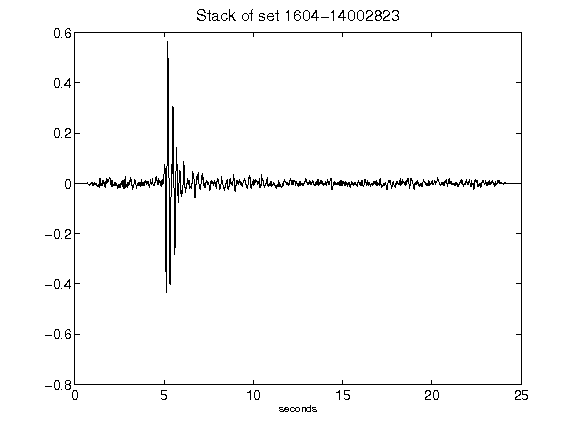](figures/1604-14002823_Stack.png)[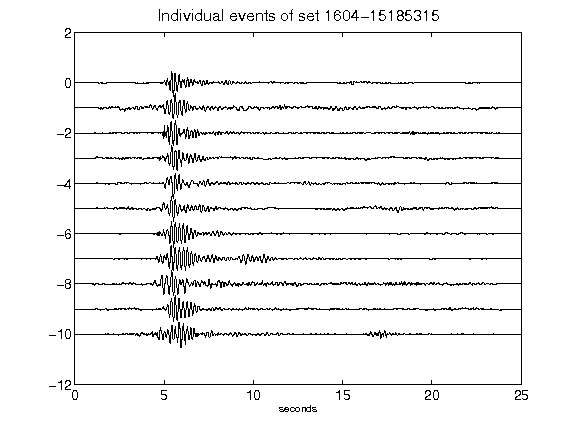](figures/1604-15185315_AllEv.png)[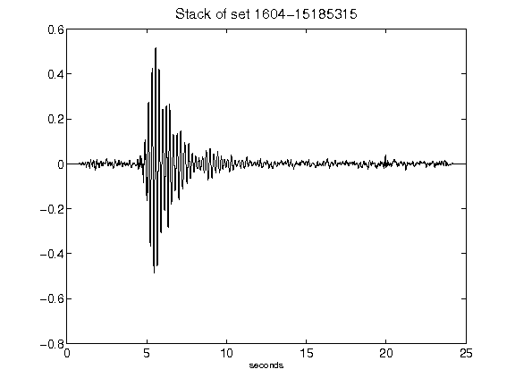](figures/1604-15185315_Stack.png)[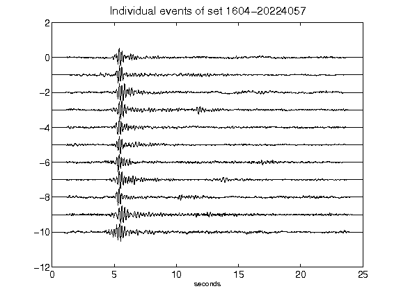](figures/1604-20224057_AllEv.png)