# Repeating Earthquake Activity at RCM

## Waveforms
[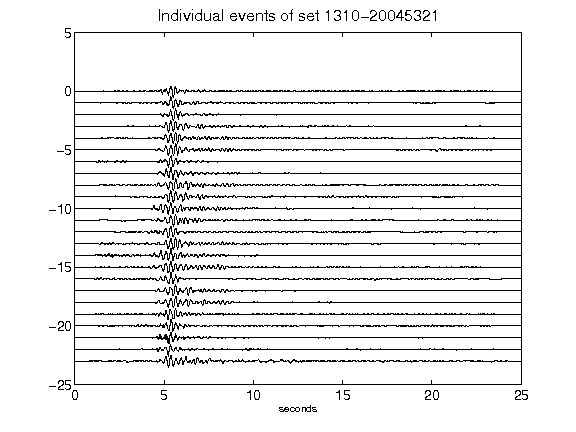](figures/1310-20045321_AllEv.png)[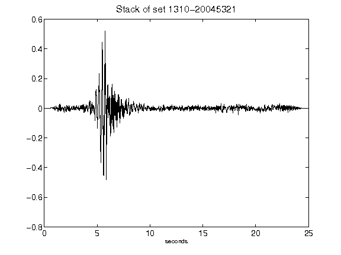](figures/1310-20045321_Stack.png)[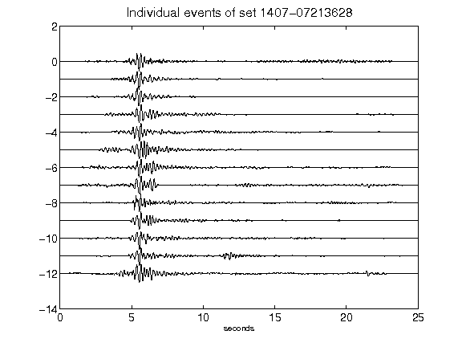](figures/1407-07213628_AllEv.png)[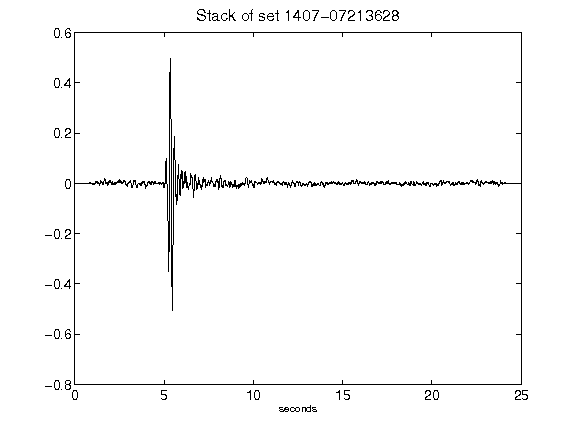](figures/1407-07213628_Stack.png)[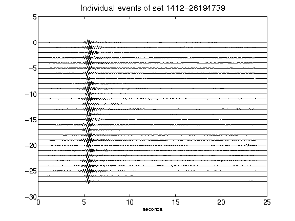](figures/1412-26194739_AllEv.png)[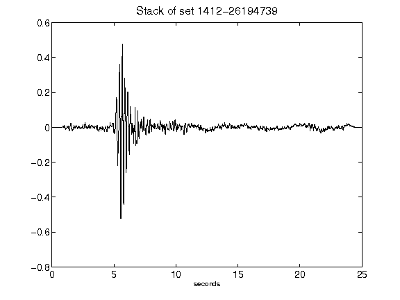](figures/1412-26194739_Stack.png)[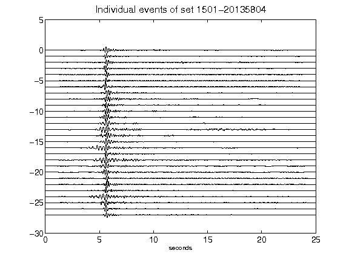](figures/1501-20135804_AllEv.png)[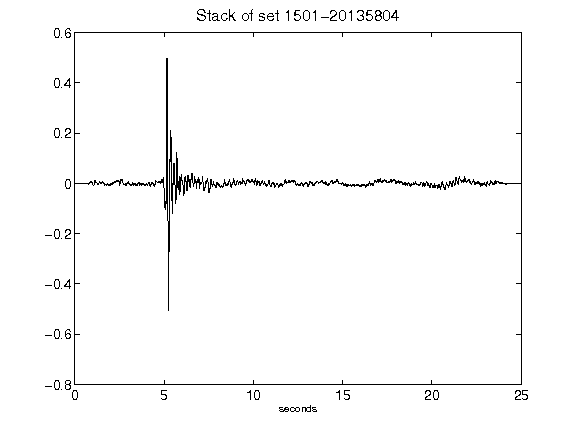](figures/1501-20135804_Stack.png)[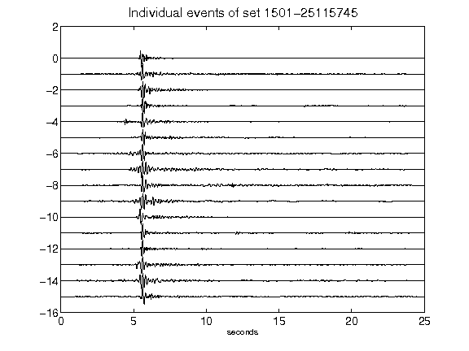](figures/1501-25115745_AllEv.png)[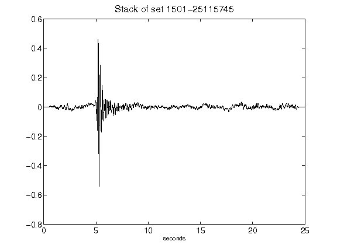](figures/1501-25115745_Stack.png)[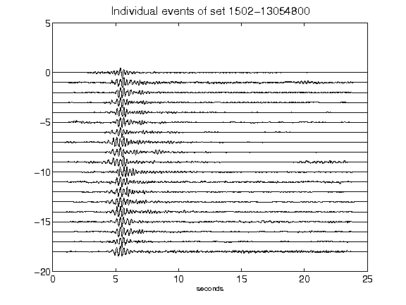](figures/1502-13054800_AllEv.png)[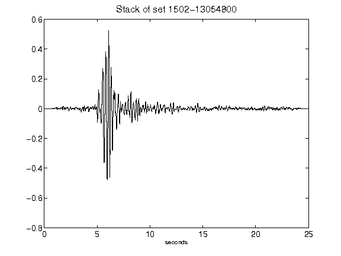](figures/1502-13054800_Stack.png)[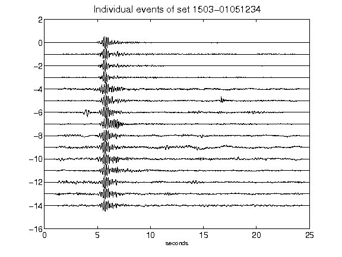](figures/1503-01051234_AllEv.png)[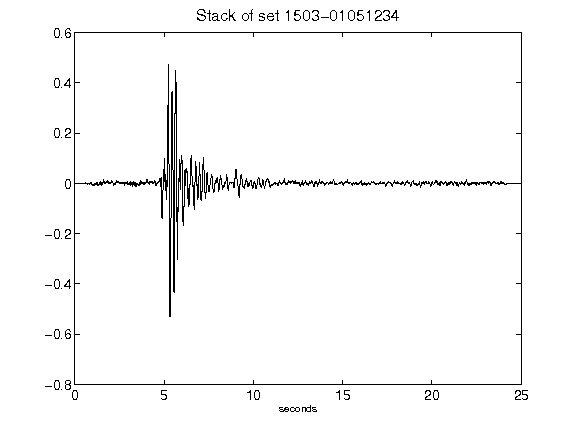](figures/1503-01051234_Stack.png)[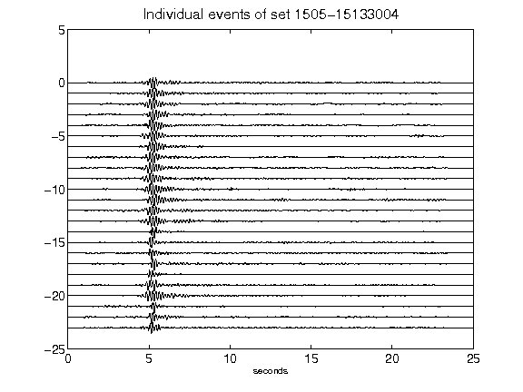](figures/1505-15133004_AllEv.png)[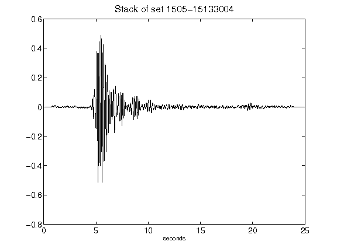](figures/1505-15133004_Stack.png)[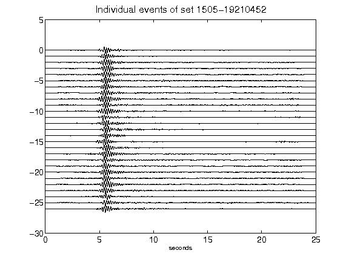](figures/1505-19210452_AllEv.png)[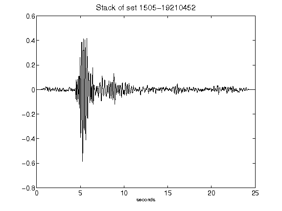](figures/1505-19210452_Stack.png)[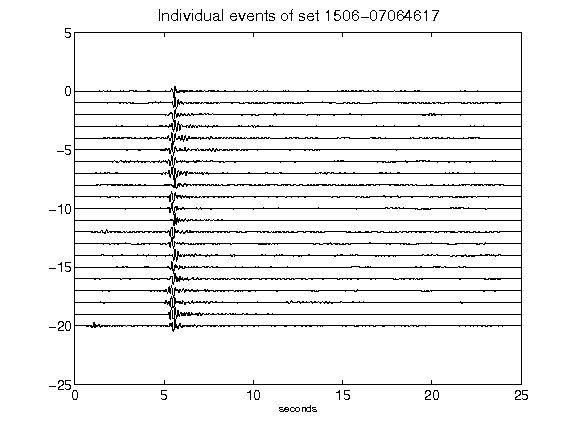](figures/1506-07064617_AllEv.png)[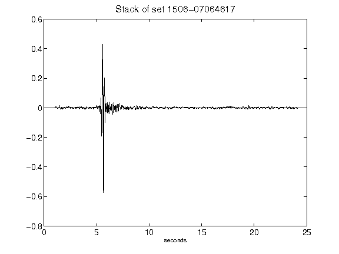](figures/1506-07064617_Stack.png)[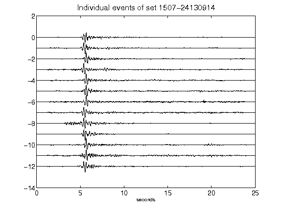](figures/1507-24130914_AllEv.png)[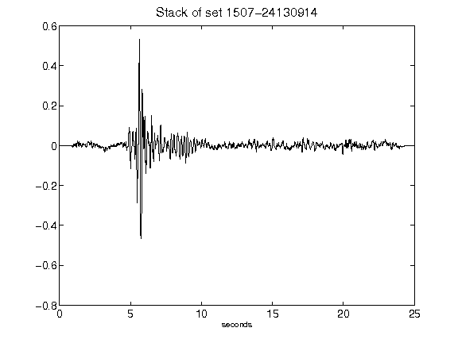](figures/1507-24130914_Stack.png)[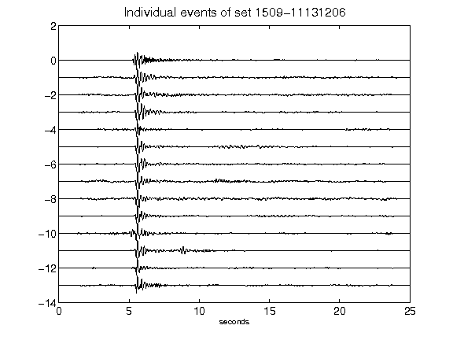](figures/1509-11131206_AllEv.png)[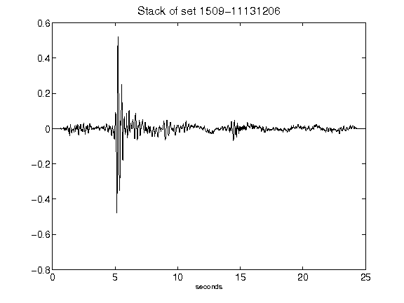](figures/1509-11131206_Stack.png)[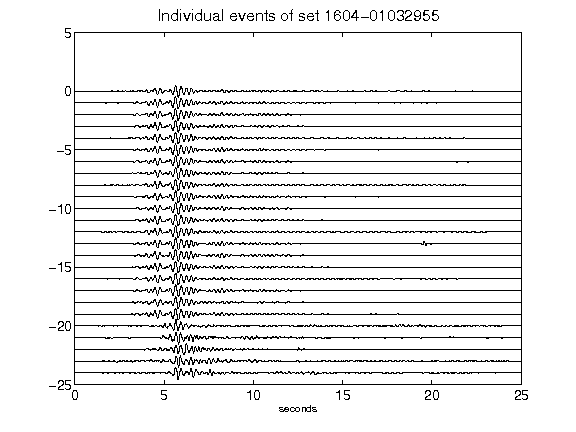](figures/1604-01032955_AllEv.png)[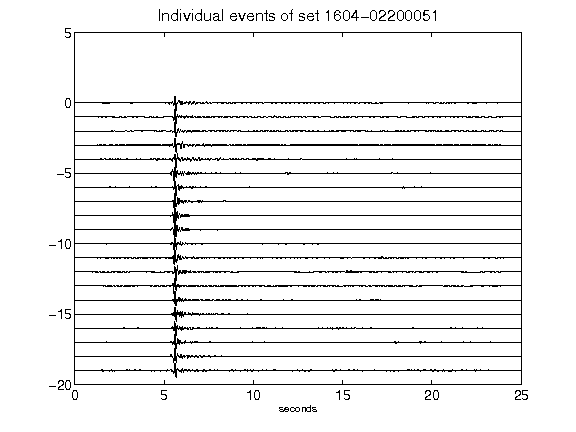](figures/1604-02200051_AllEv.png)[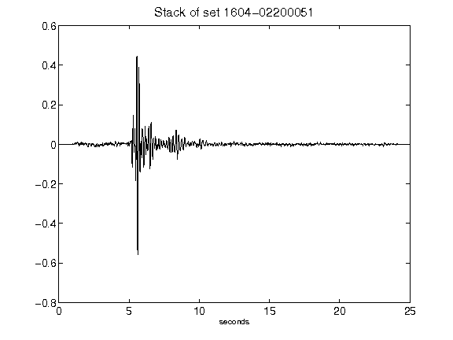](figures/1604-02200051_Stack.png)[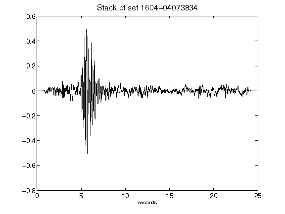](figures/1604-04073834_Stack.png)[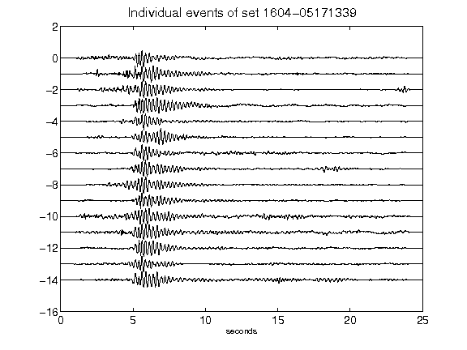](figures/1604-05171339_AllEv.png)[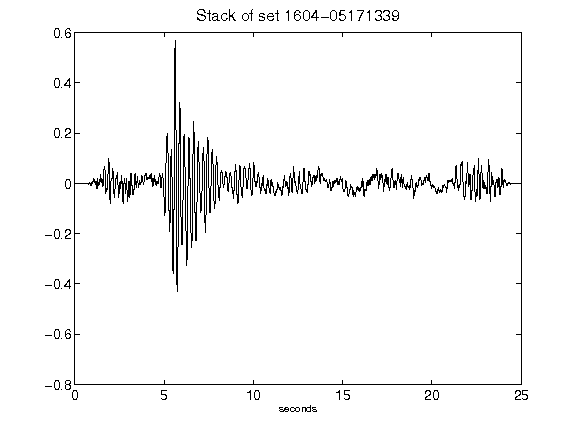](figures/1604-05171339_Stack.png)[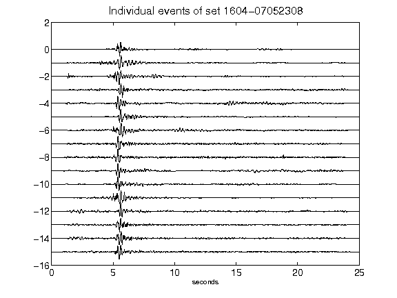](figures/1604-07052308_AllEv.png)[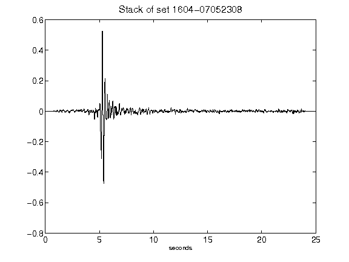](figures/1604-07052308_Stack.png)[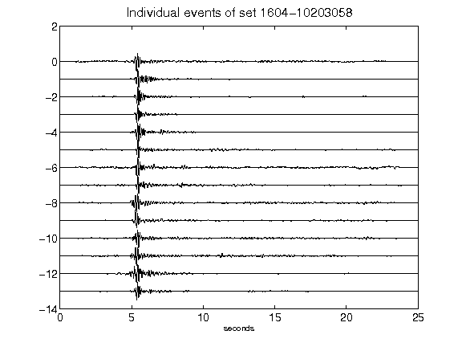](figures/1604-10203058_AllEv.png)[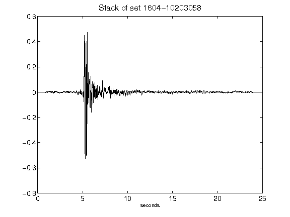](figures/1604-10203058_Stack.png)[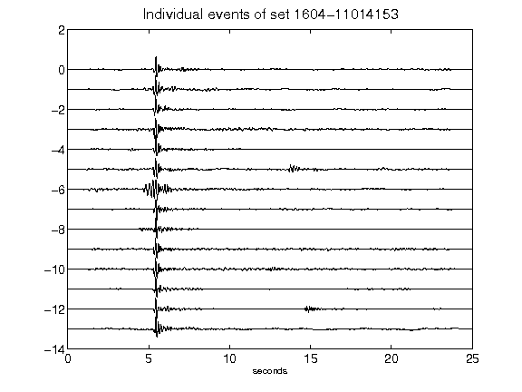](figures/1604-11014153_AllEv.png)[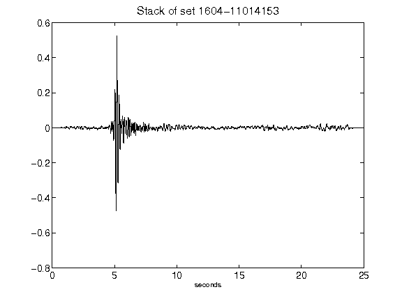](figures/1604-11014153_Stack.png)