# Repeating Earthquake Activity at RCM

## Waveforms
[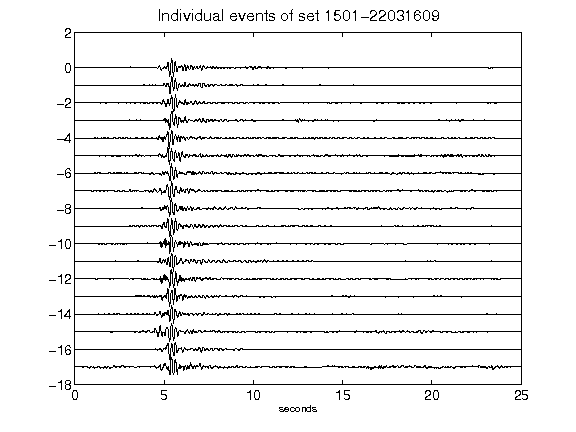](figures/1501-22031609_AllEv.png)[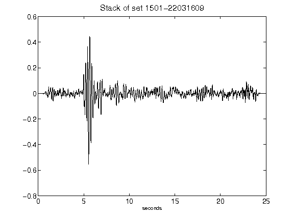](figures/1501-22031609_Stack.png)[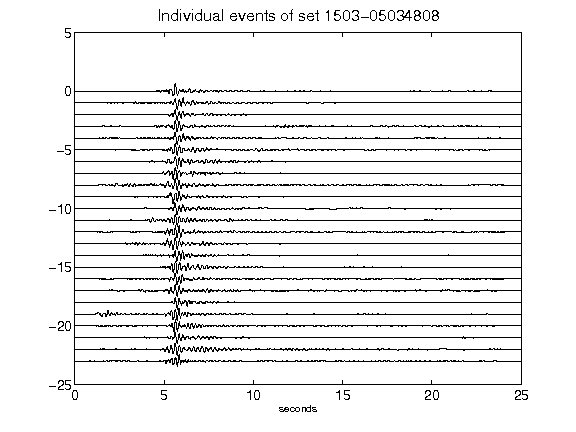](figures/1503-05034808_AllEv.png)[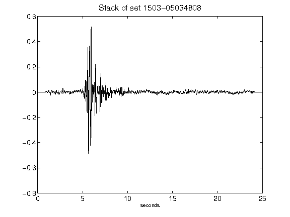](figures/1503-05034808_Stack.png)[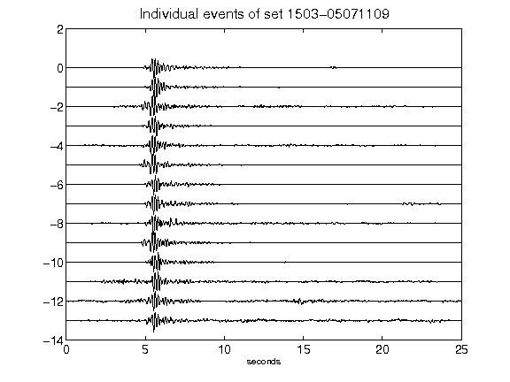](figures/1503-05071109_AllEv.png)[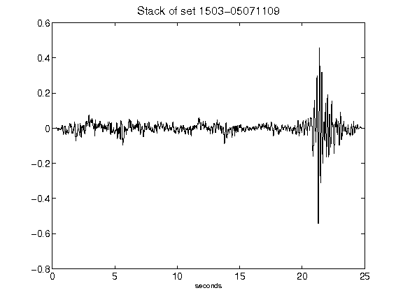](figures/1503-05071109_Stack.png)[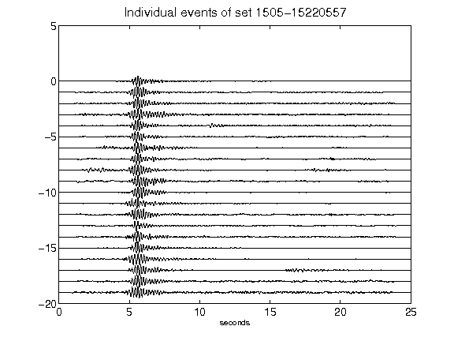](figures/1505-15220557_AllEv.png)[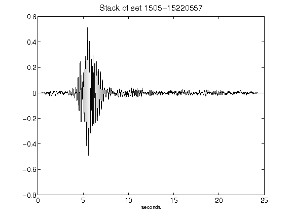](figures/1505-15220557_Stack.png)[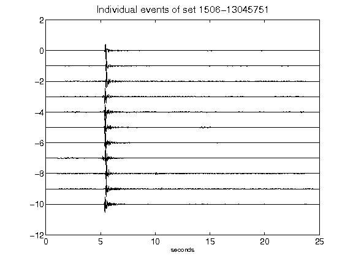](figures/1506-13045751_AllEv.png)[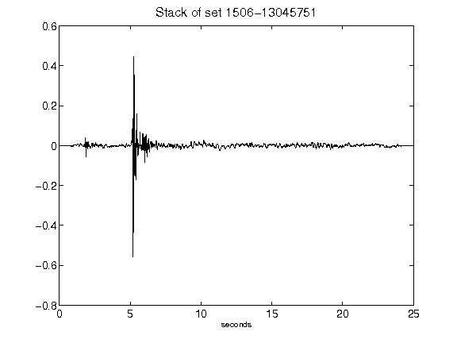](figures/1506-13045751_Stack.png)[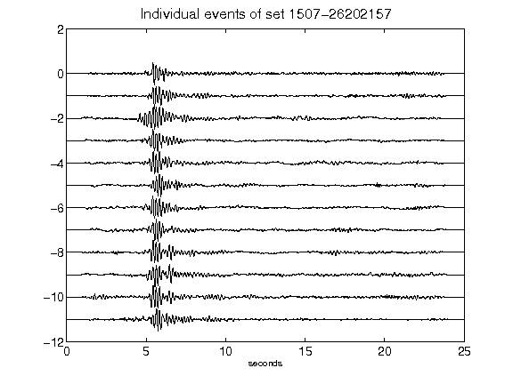](figures/1507-26202157_AllEv.png)[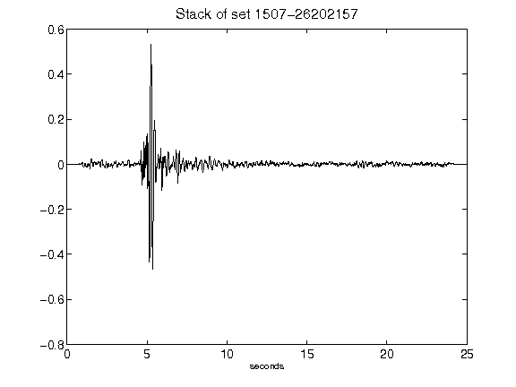](figures/1507-26202157_Stack.png)[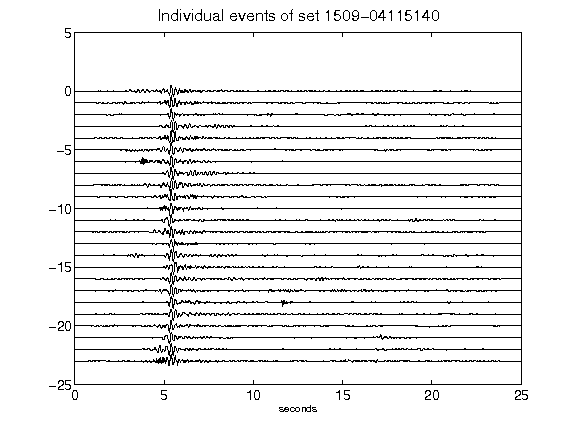](figures/1509-04115140_AllEv.png)[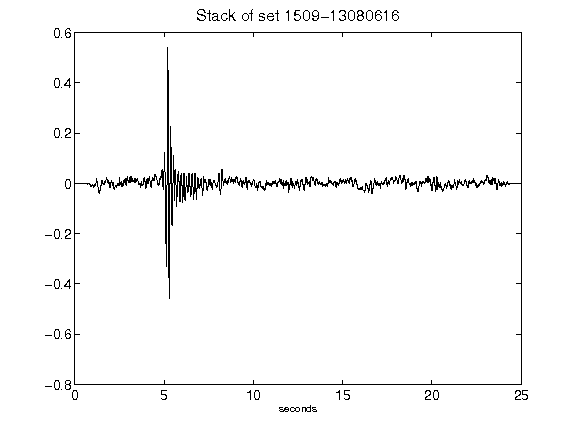](figures/1509-13080616_Stack.png)[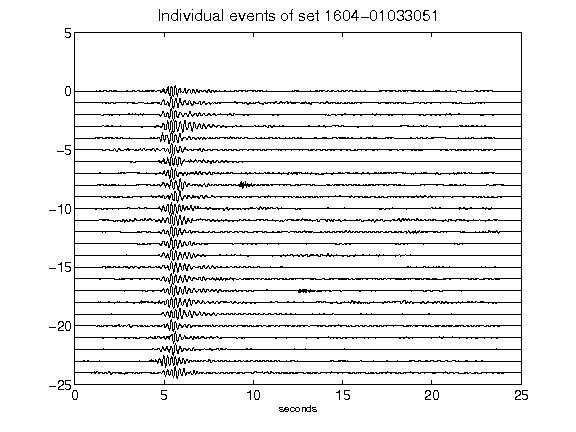](figures/1604-01033051_AllEv.png)[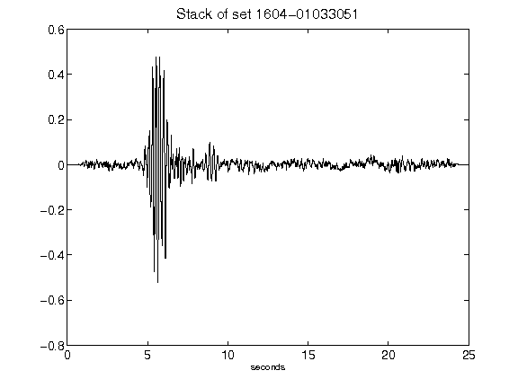](figures/1604-01033051_Stack.png)[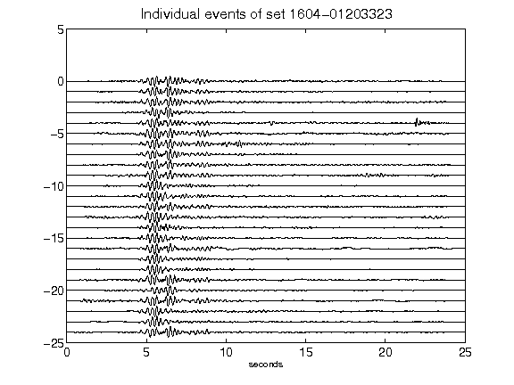](figures/1604-01203323_AllEv.png)[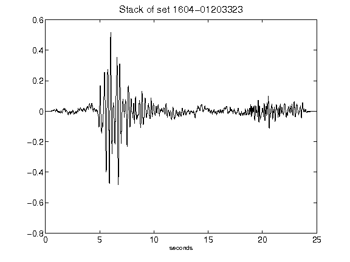](figures/1604-01203323_Stack.png)[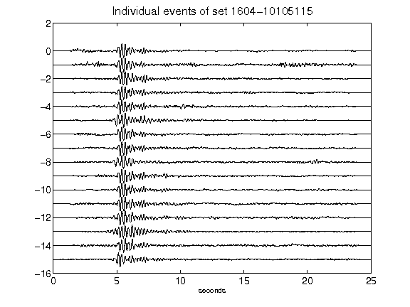](figures/1604-10105115_AllEv.png)[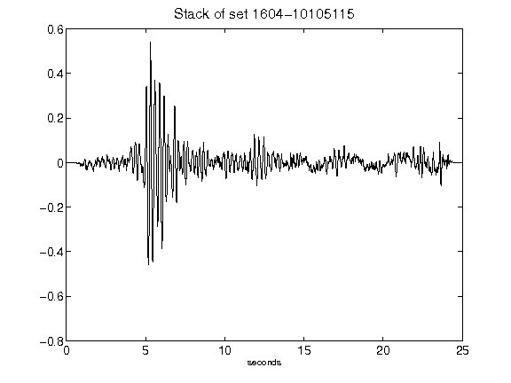](figures/1604-10105115_Stack.png)[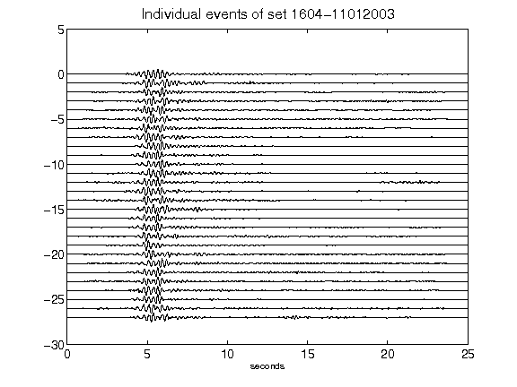](figures/1604-11012003_AllEv.png)[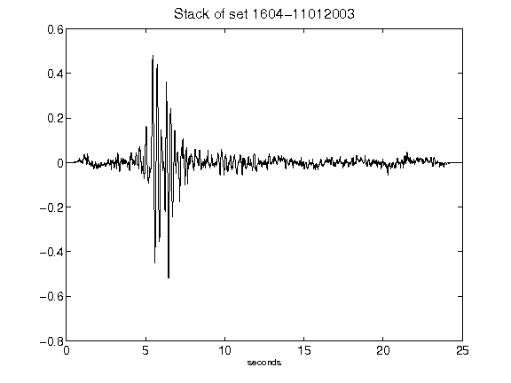](figures/1604-11012003_Stack.png)[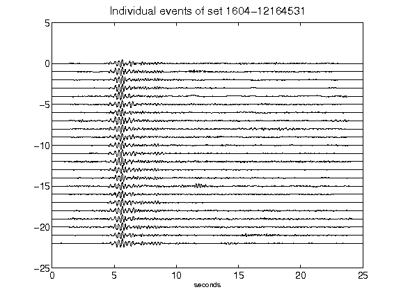](figures/1604-12164531_AllEv.png)[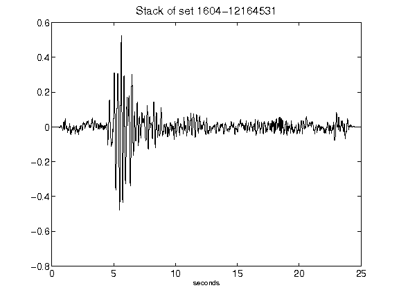](figures/1604-12164531_Stack.png)[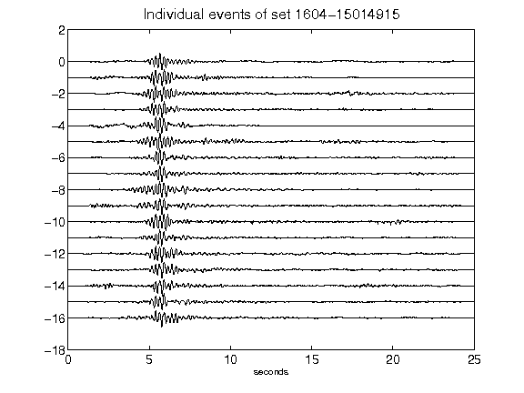](figures/1604-15014915_AllEv.png)[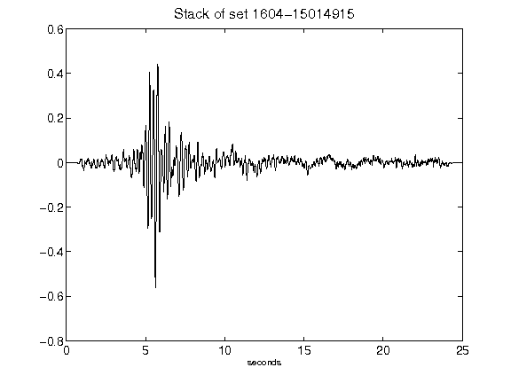](figures/1604-15014915_Stack.png)[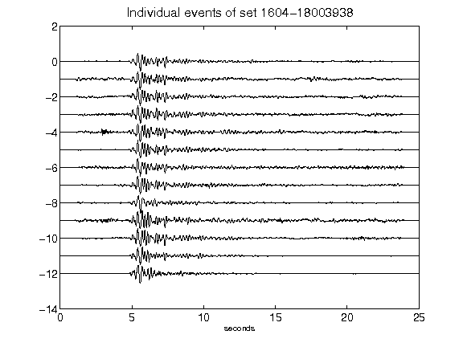](figures/1604-18003938_AllEv.png)[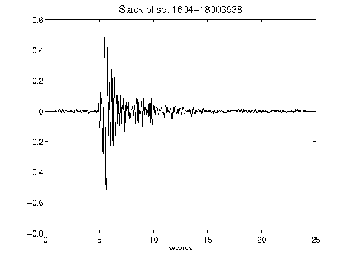](figures/1604-18003938_Stack.png)[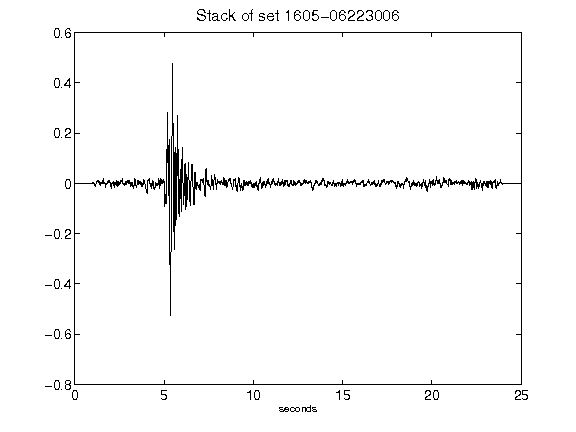](figures/1605-06223006_Stack.png)