# Repeating Earthquake Activity at RCM

## Waveforms
[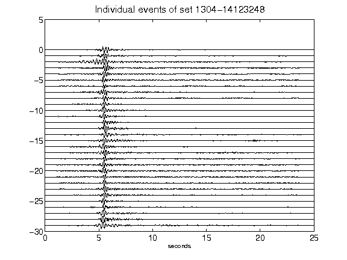](figures/1304-14123248_AllEv.png)[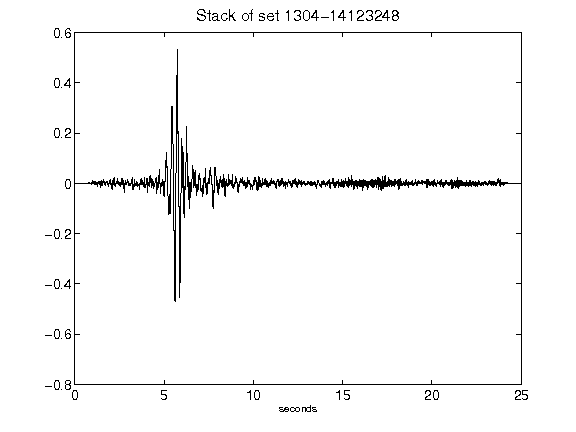](figures/1304-14123248_Stack.png)[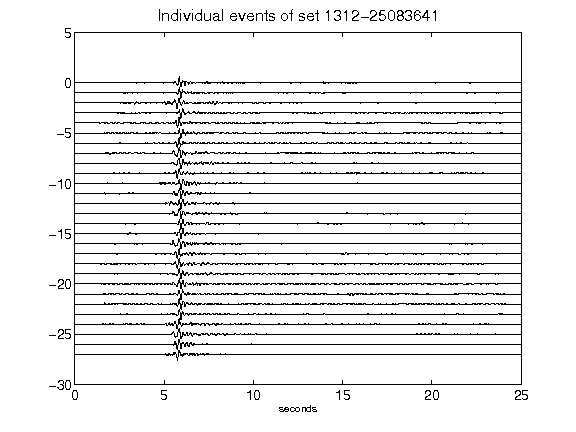](figures/1312-25083641_AllEv.png)[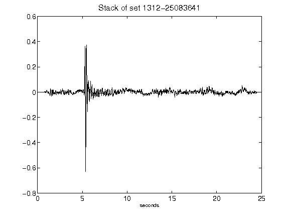](figures/1312-25083641_Stack.png)[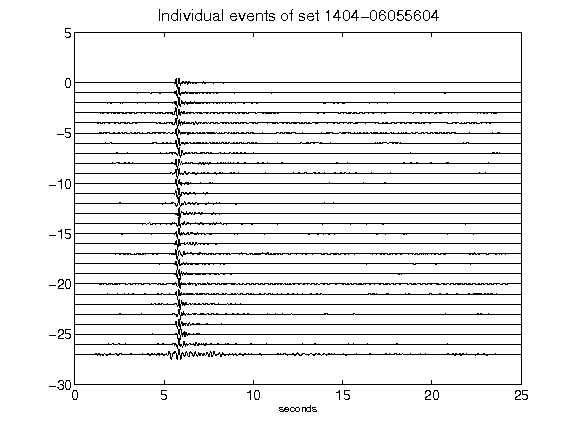](figures/1404-06055604_AllEv.png)[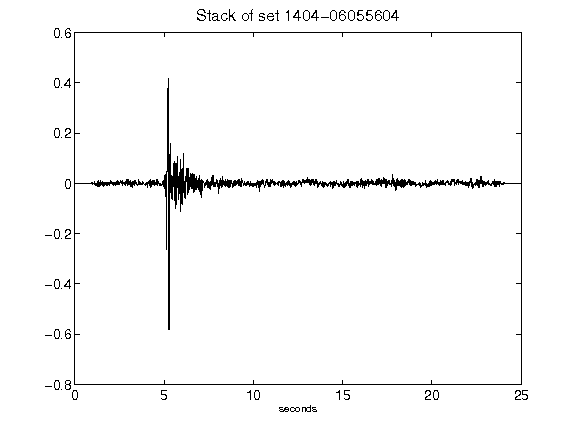](figures/1404-06055604_Stack.png)[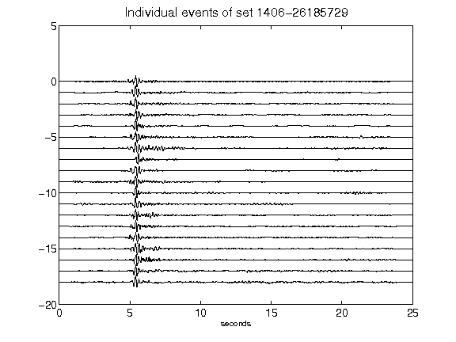](figures/1406-26185729_AllEv.png)[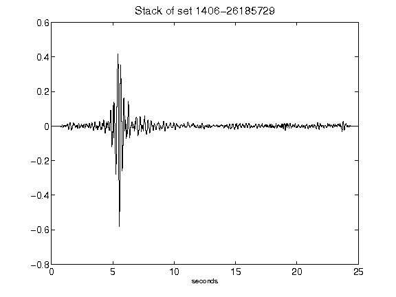](figures/1406-26185729_Stack.png)[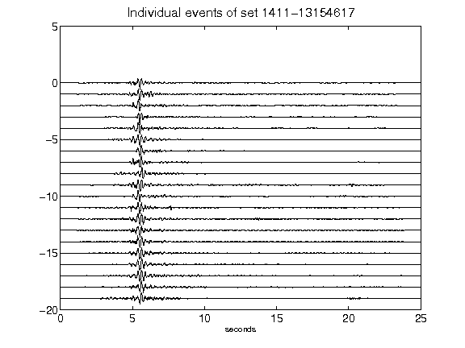](figures/1411-13154617_AllEv.png)[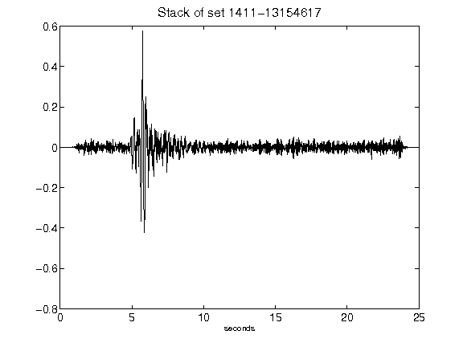](figures/1411-13154617_Stack.png)[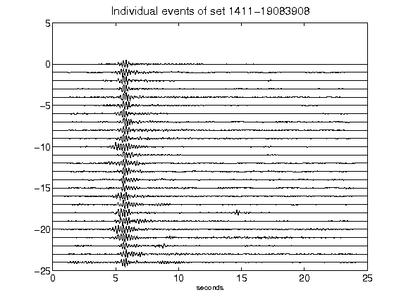](figures/1411-19083908_AllEv.png)[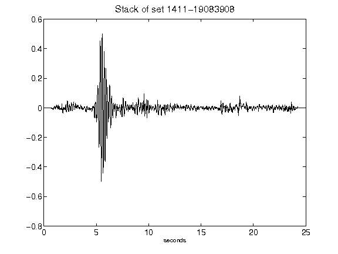](figures/1411-19083908_Stack.png)[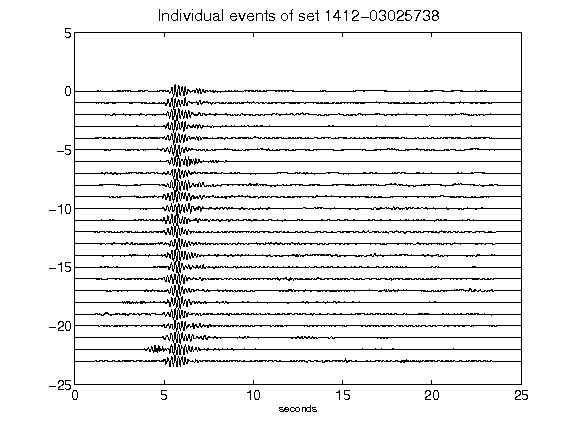](figures/1412-03025738_AllEv.png)[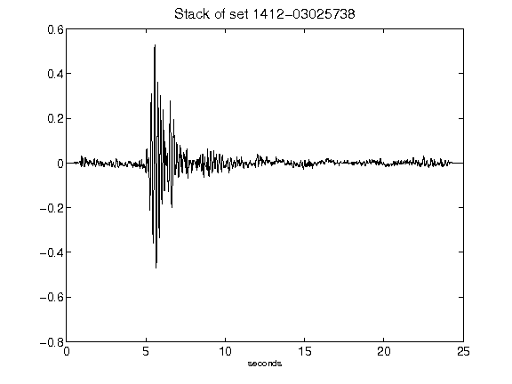](figures/1412-03025738_Stack.png)[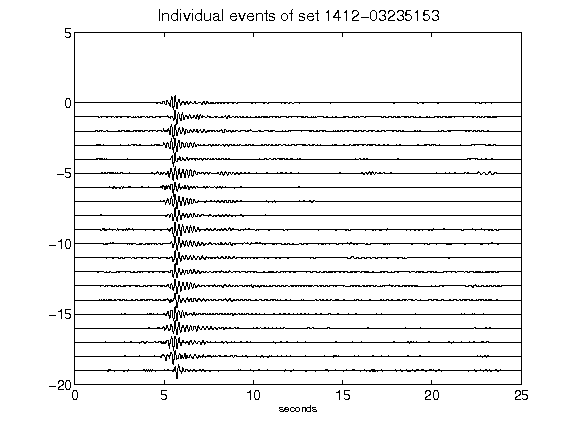](figures/1412-03235153_AllEv.png)[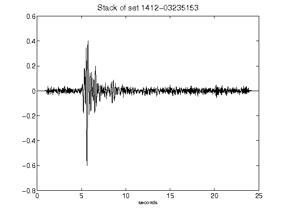](figures/1412-03235153_Stack.png)[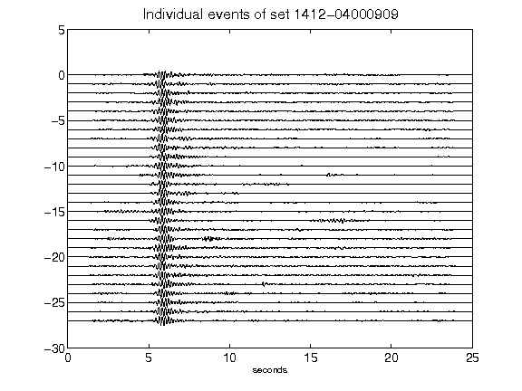](figures/1412-04000909_AllEv.png)[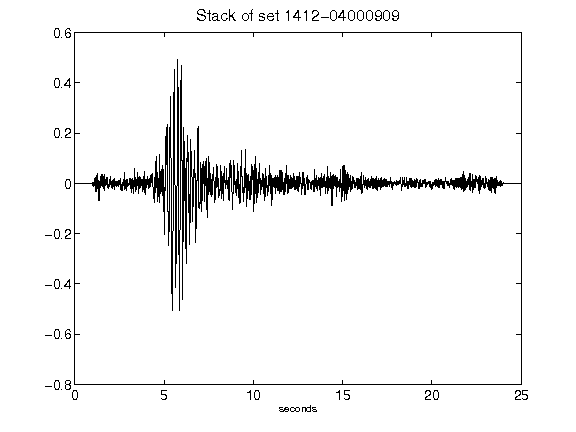](figures/1412-04000909_Stack.png)[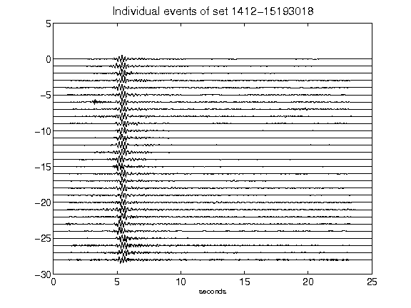](figures/1412-15193018_AllEv.png)[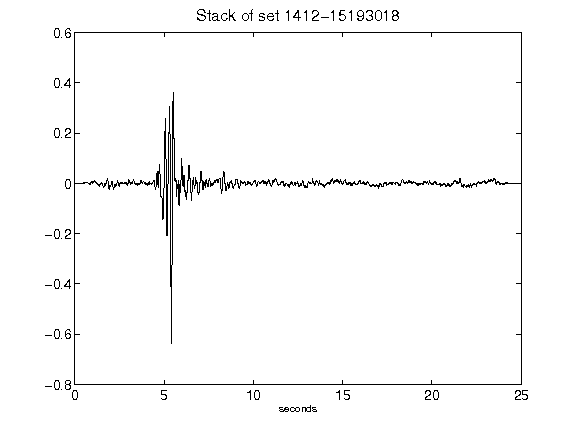](figures/1412-15193018_Stack.png)[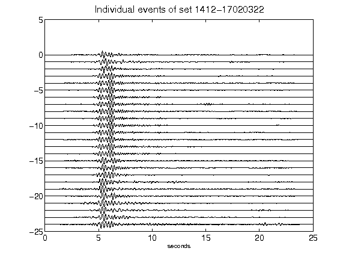](figures/1412-17020322_AllEv.png)[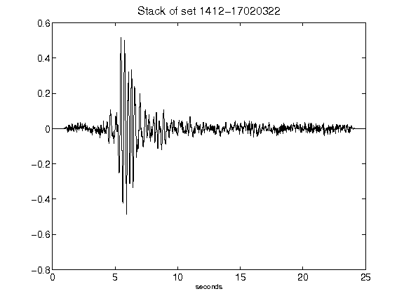](figures/1412-17020322_Stack.png)[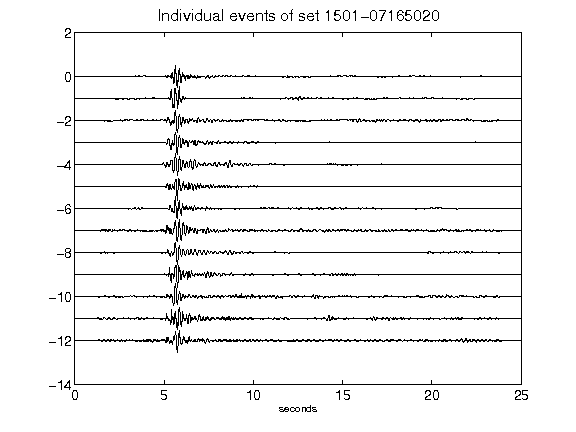](figures/1501-07165020_AllEv.png)[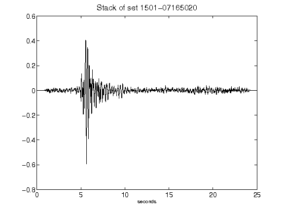](figures/1501-07165020_Stack.png)[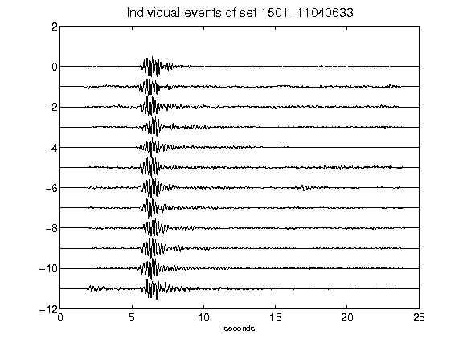](figures/1501-11040633_AllEv.png)[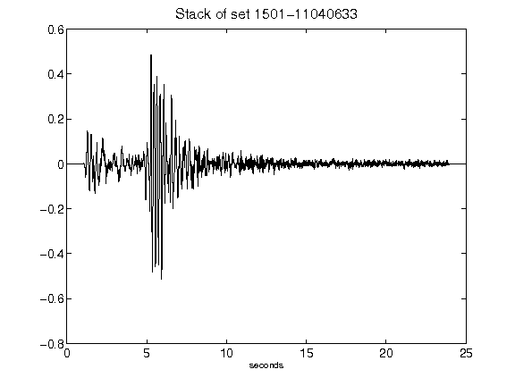](figures/1501-11040633_Stack.png)[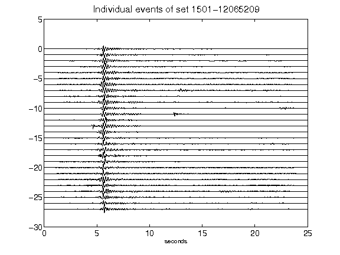](figures/1501-12065209_AllEv.png)[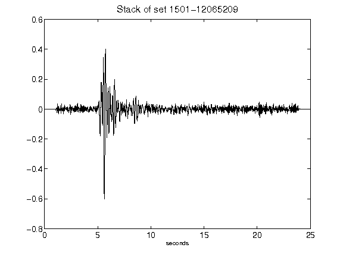](figures/1501-12065209_Stack.png)[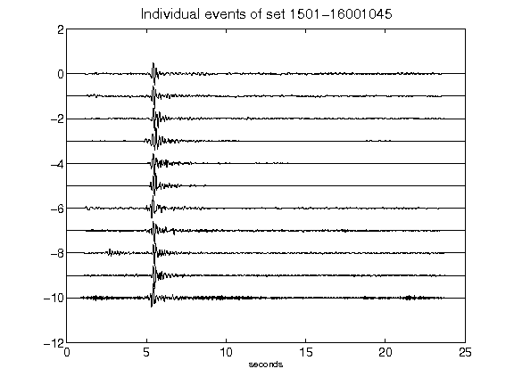](figures/1501-16001045_AllEv.png)[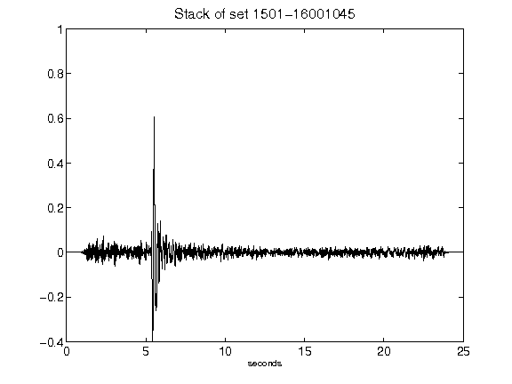](figures/1501-16001045_Stack.png)[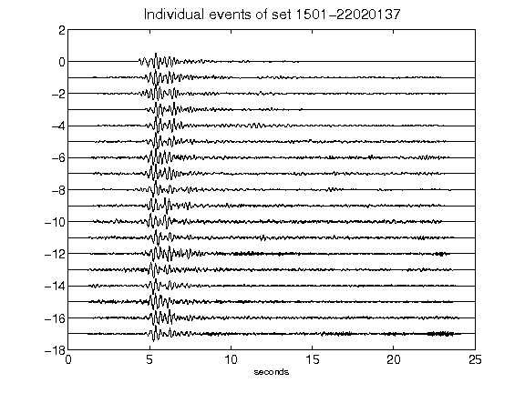](figures/1501-22020137_AllEv.png)[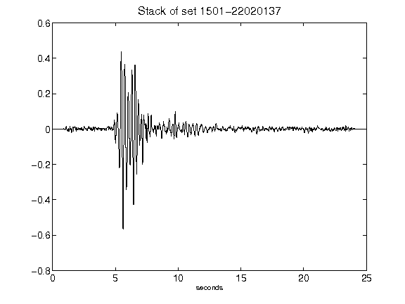](figures/1501-22020137_Stack.png)[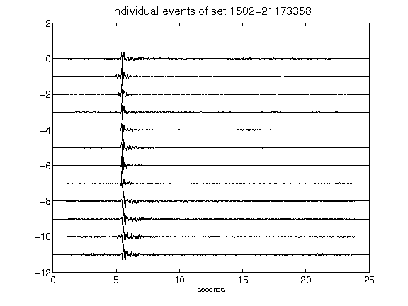](figures/1502-21173358_AllEv.png)[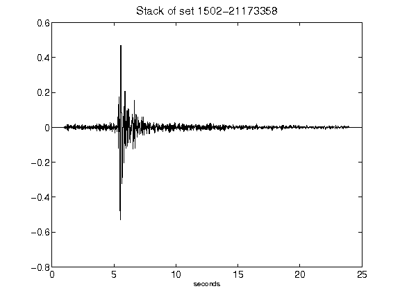](figures/1502-21173358_Stack.png)[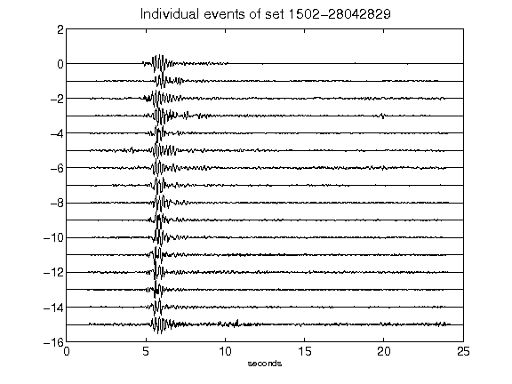](figures/1502-28042829_AllEv.png)[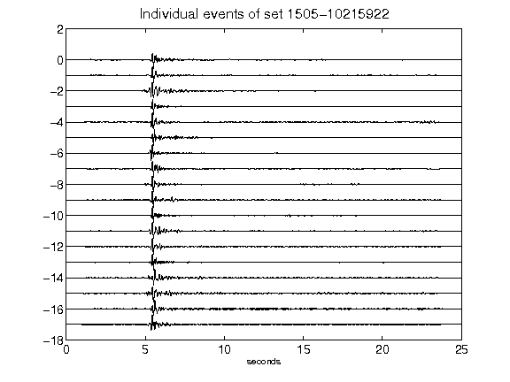](figures/1505-10215922_AllEv.png)[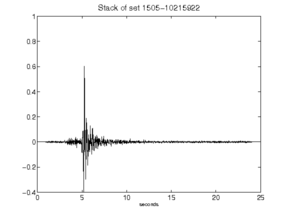](figures/1505-10215922_Stack.png)[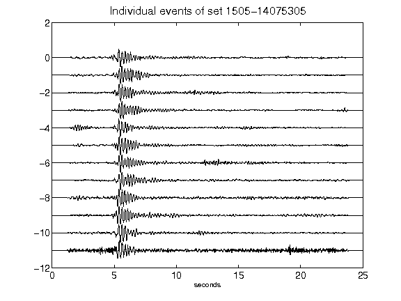](figures/1505-14075305_AllEv.png)[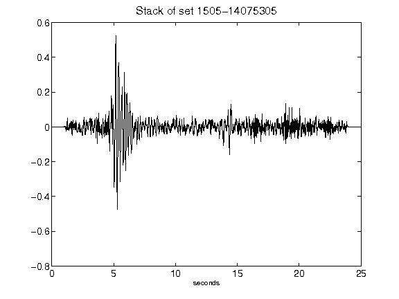](figures/1505-14075305_Stack.png)[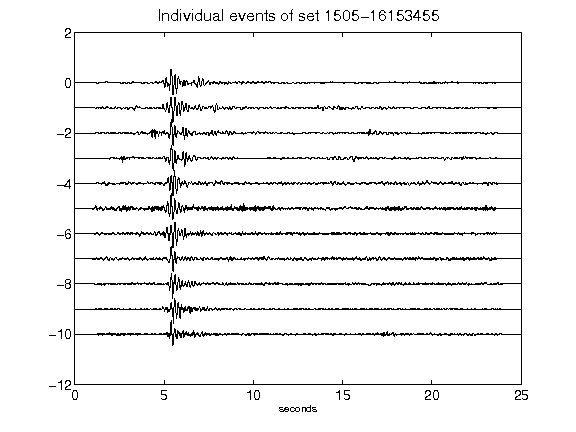](figures/1505-16153455_AllEv.png)[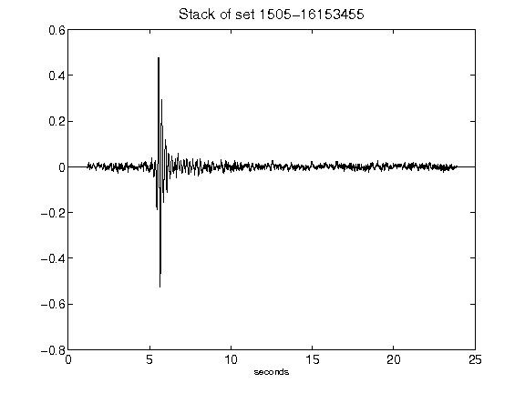](figures/1505-16153455_Stack.png)