# Repeating Earthquake Activity at RCM

## Waveforms
[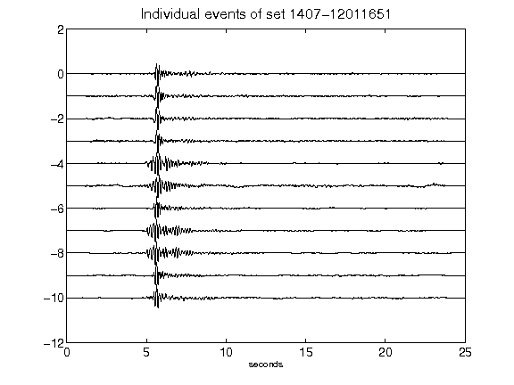](figures/1407-12011651_AllEv.png)[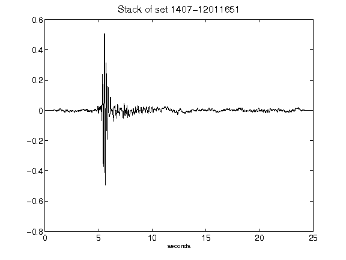](figures/1407-12011651_Stack.png)[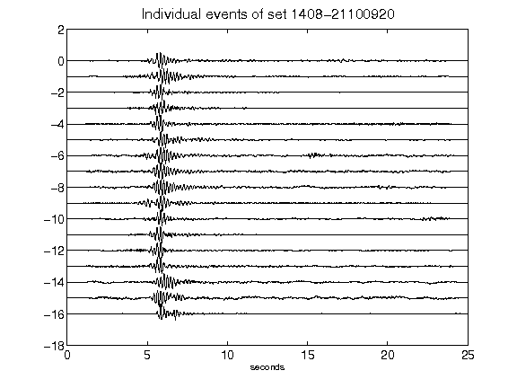](figures/1408-21100920_AllEv.png)[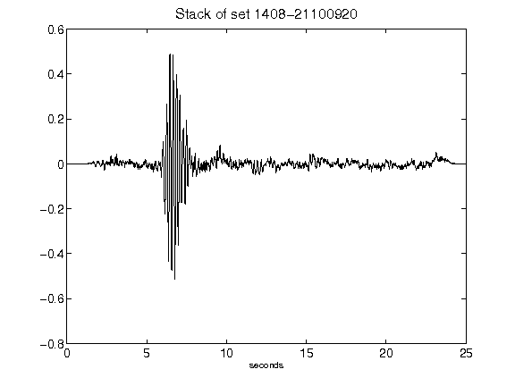](figures/1408-21100920_Stack.png)[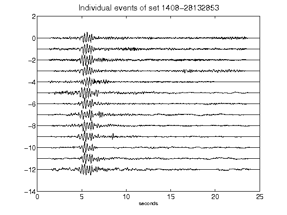](figures/1408-28132853_AllEv.png)[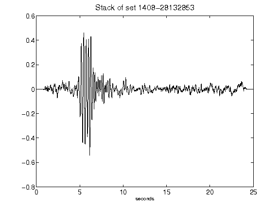](figures/1408-28132853_Stack.png)[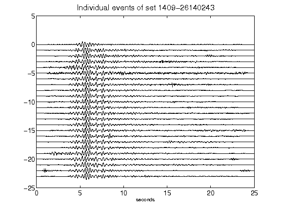](figures/1409-26140243_AllEv.png)[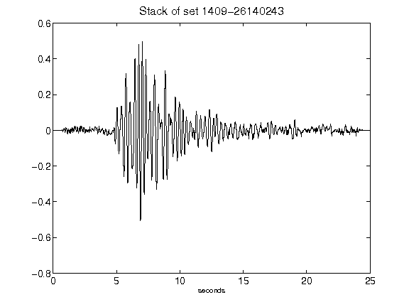](figures/1409-26140243_Stack.png)[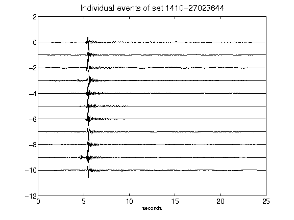](figures/1410-27023644_AllEv.png)[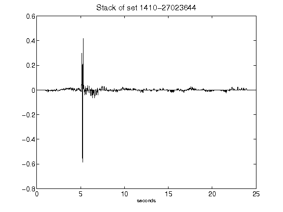](figures/1410-27023644_Stack.png)[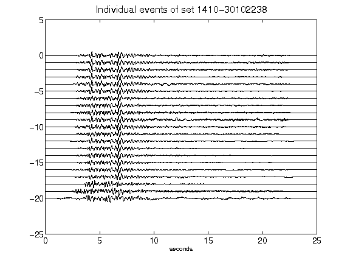](figures/1410-30102238_AllEv.png)[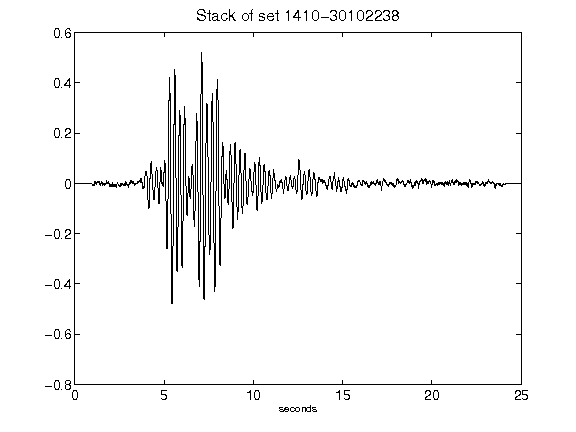](figures/1410-30102238_Stack.png)[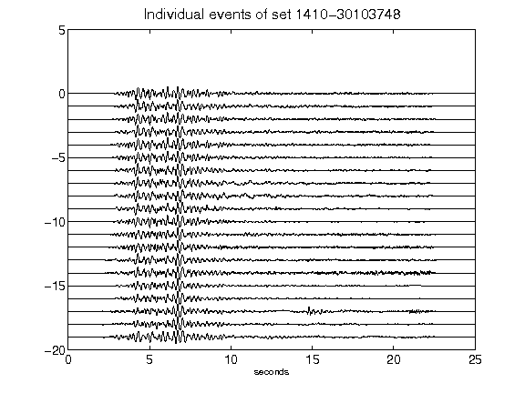](figures/1410-30103748_AllEv.png)[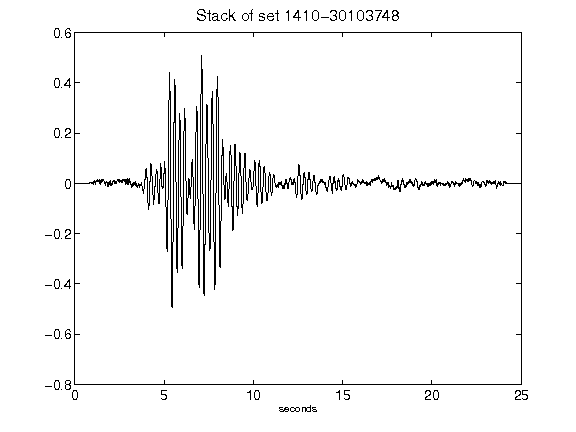](figures/1410-30103748_Stack.png)[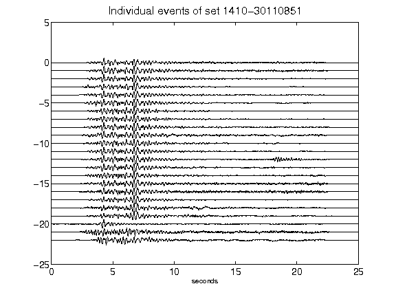](figures/1410-30110851_AllEv.png)[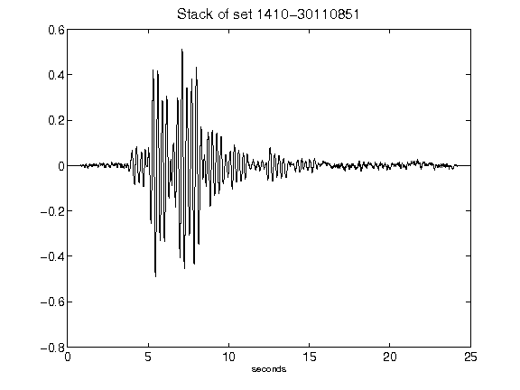](figures/1410-30110851_Stack.png)[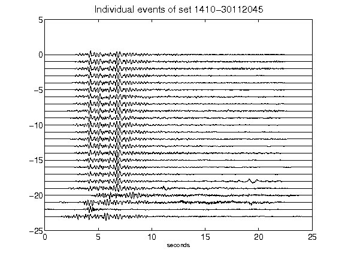](figures/1410-30112045_AllEv.png)[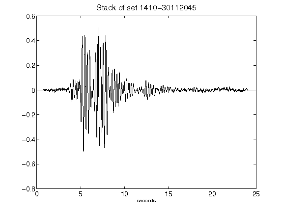](figures/1410-30112045_Stack.png)[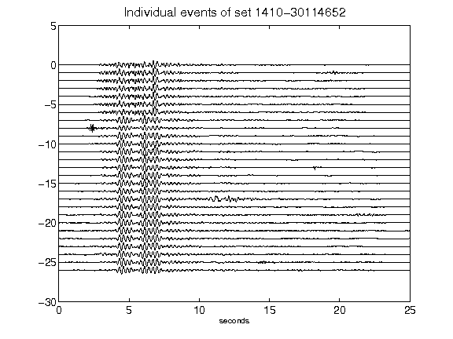](figures/1410-30114652_AllEv.png)[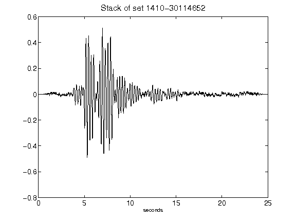](figures/1410-30114652_Stack.png)[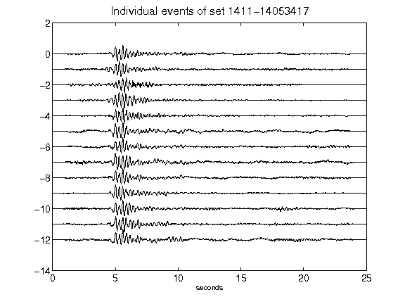](figures/1411-14053417_AllEv.png)[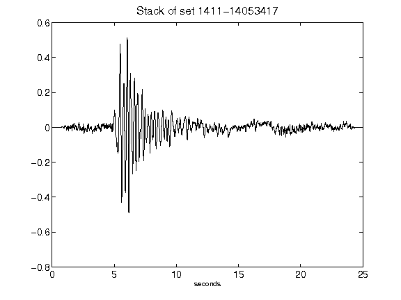](figures/1411-14053417_Stack.png)[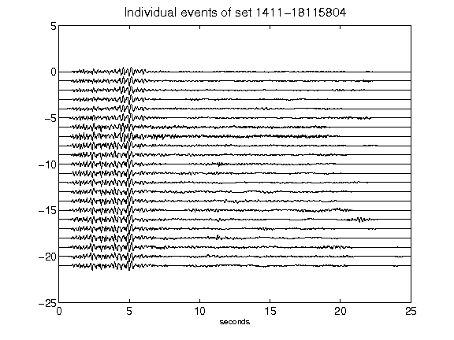](figures/1411-18115804_AllEv.png)[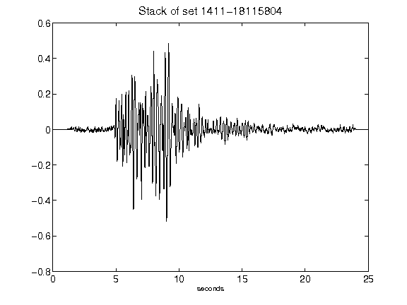](figures/1411-18115804_Stack.png)