# Repeating Earthquake Activity at RCM

## Waveforms
[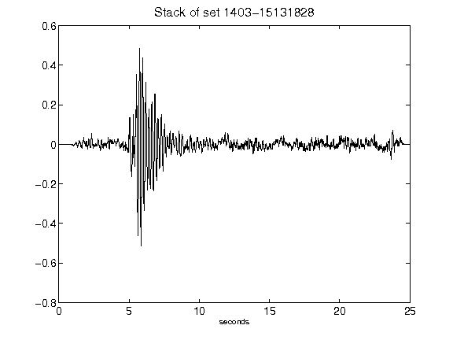](figures/1403-15131828_Stack.png)[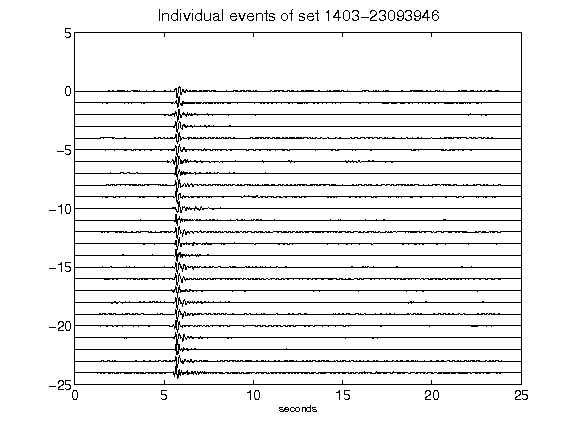](figures/1403-23093946_AllEv.png)[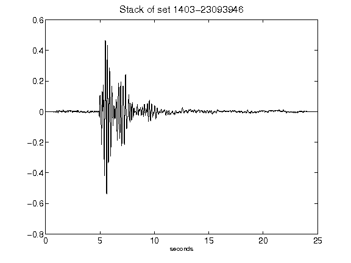](figures/1403-23093946_Stack.png)[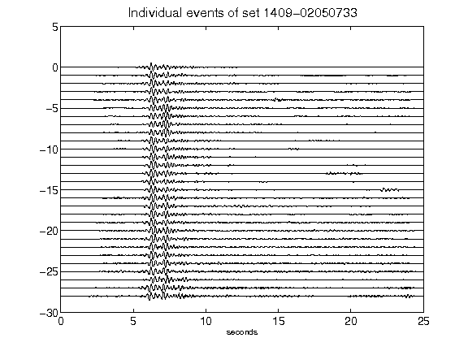](figures/1409-02050733_AllEv.png)[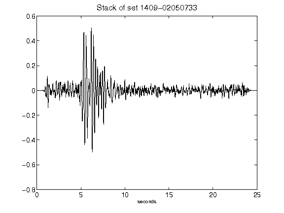](figures/1409-02050733_Stack.png)[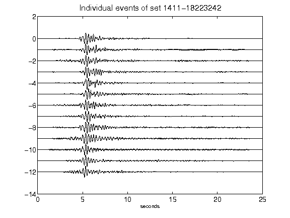](figures/1411-18223242_AllEv.png)[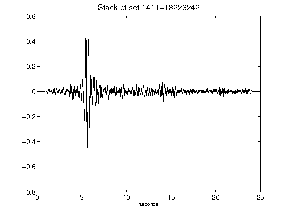](figures/1411-18223242_Stack.png)[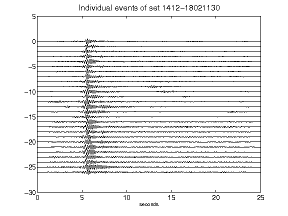](figures/1412-18021130_AllEv.png)[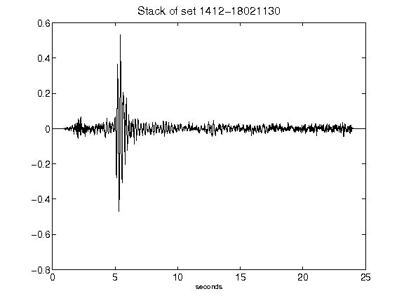](figures/1412-18021130_Stack.png)[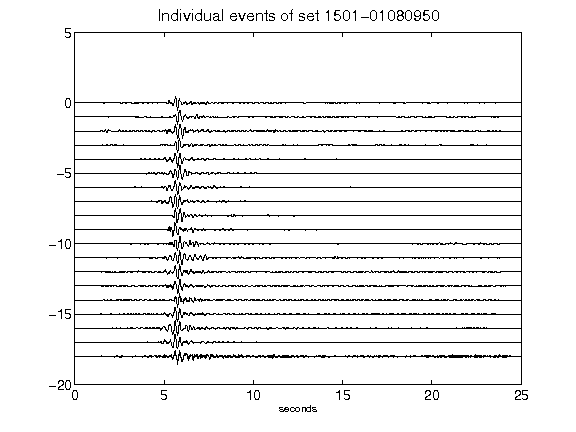](figures/1501-01080950_AllEv.png)[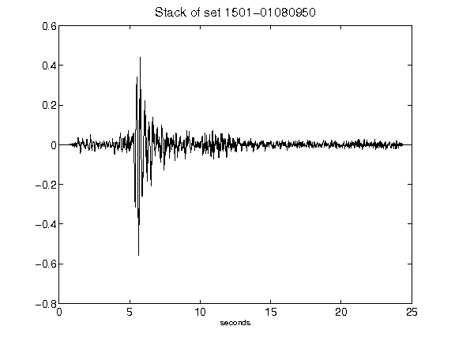](figures/1501-01080950_Stack.png)[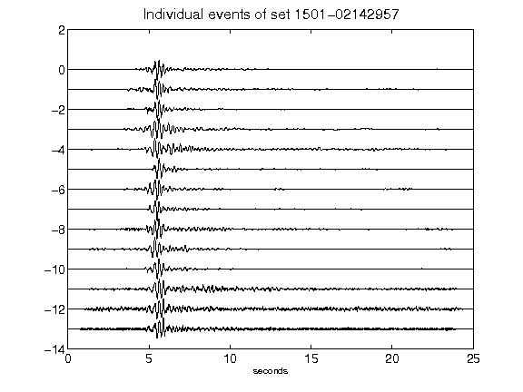](figures/1501-02142957_AllEv.png)[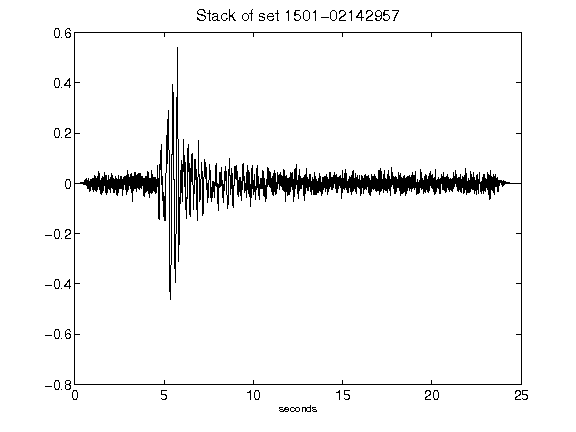](figures/1501-02142957_Stack.png)[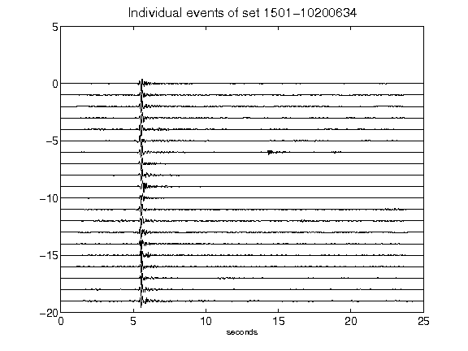](figures/1501-10200634_AllEv.png)[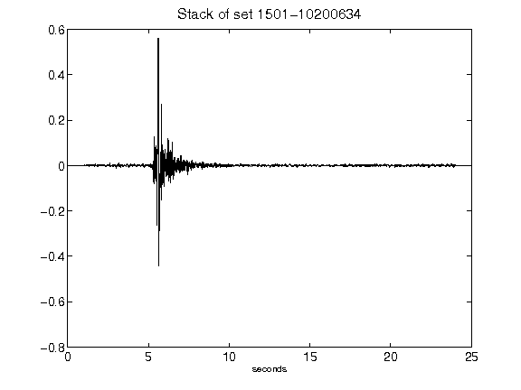](figures/1501-10200634_Stack.png)[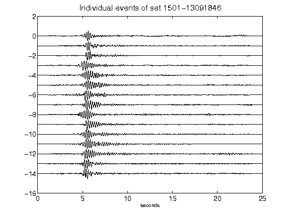](figures/1501-13091846_AllEv.png)[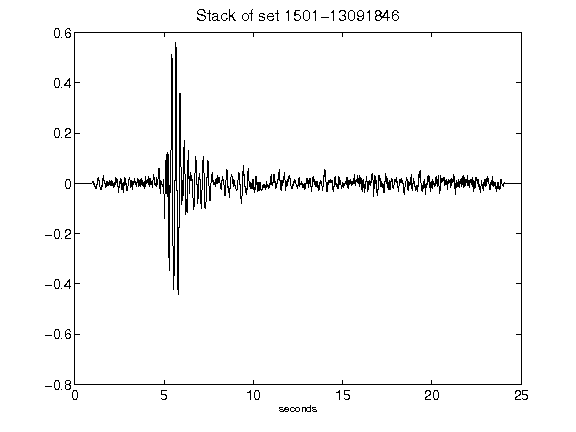](figures/1501-13091846_Stack.png)[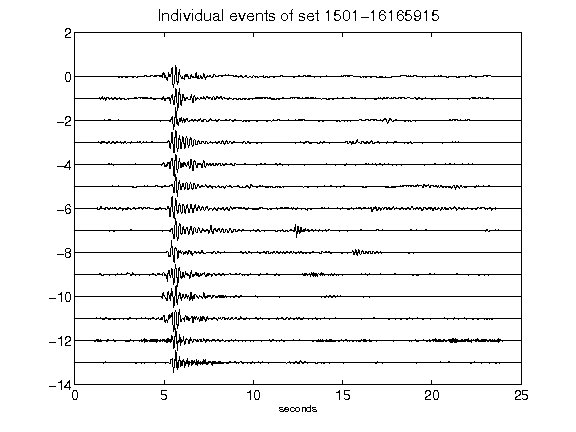](figures/1501-16165915_AllEv.png)[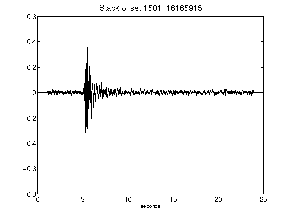](figures/1501-16165915_Stack.png)[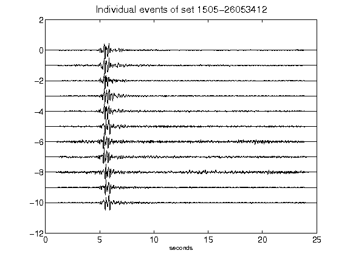](figures/1505-26053412_AllEv.png)[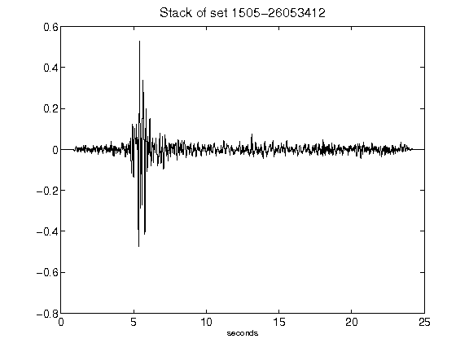](figures/1505-26053412_Stack.png)