# Repeating Earthquake Activity at RCM

## Waveforms
[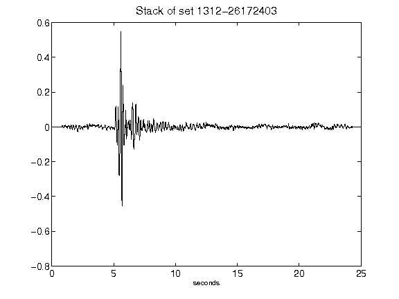](figures/1312-26172403_Stack.png)[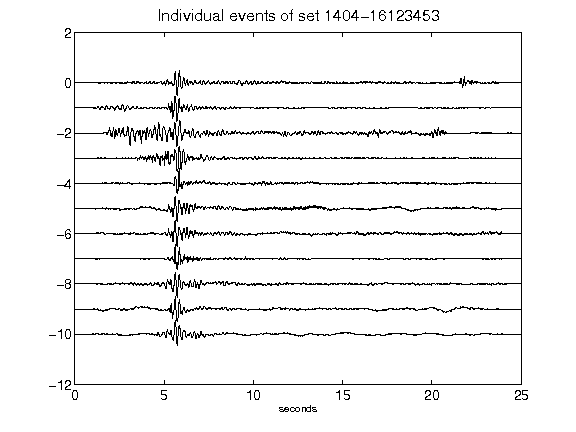](figures/1404-16123453_AllEv.png)[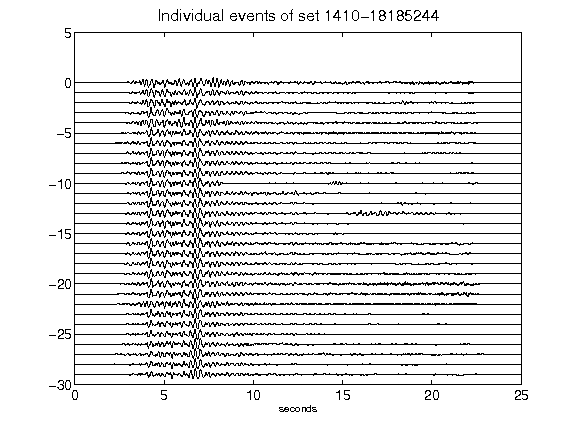](figures/1410-18185244_AllEv.png)[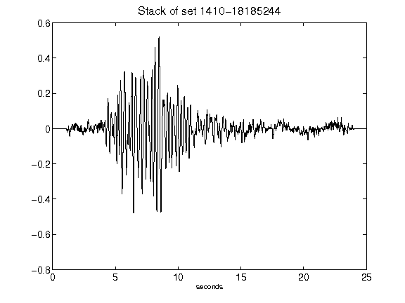](figures/1410-18185244_Stack.png)[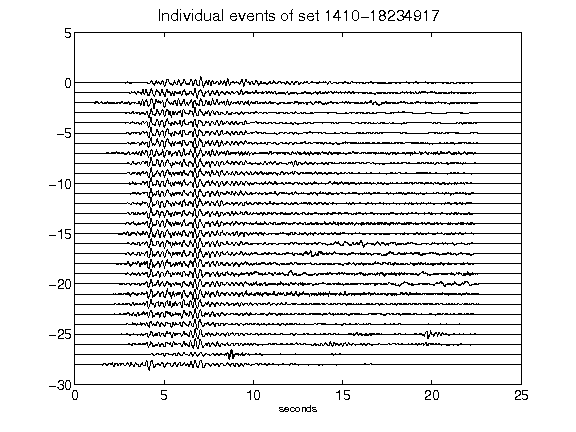](figures/1410-18234917_AllEv.png)[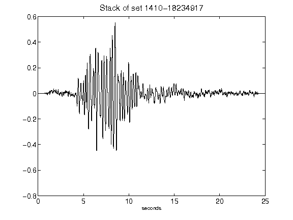](figures/1410-18234917_Stack.png)[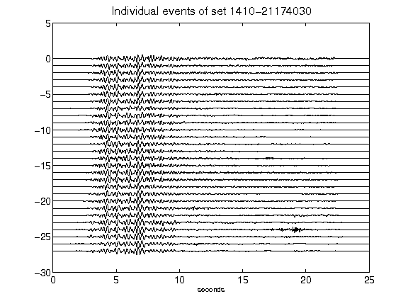](figures/1410-21174030_AllEv.png)[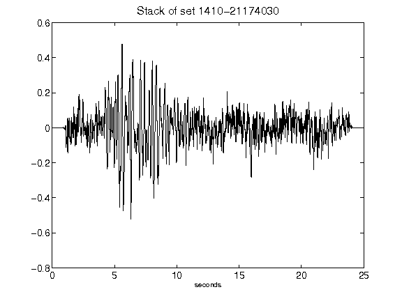](figures/1410-21174030_Stack.png)[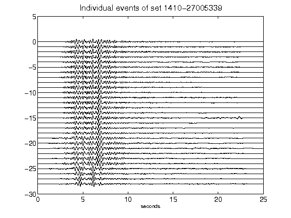](figures/1410-27005339_AllEv.png)[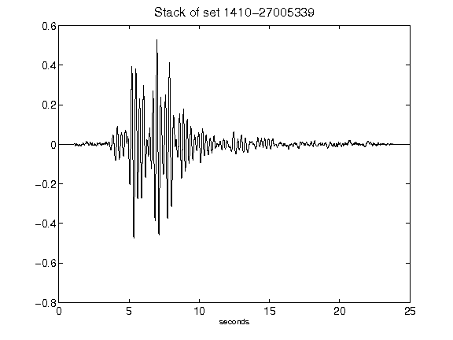](figures/1410-27005339_Stack.png)[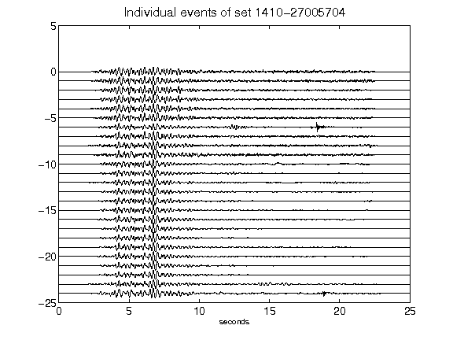](figures/1410-27005704_AllEv.png)[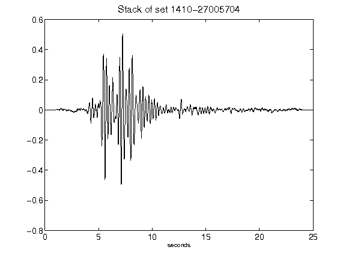](figures/1410-27005704_Stack.png)[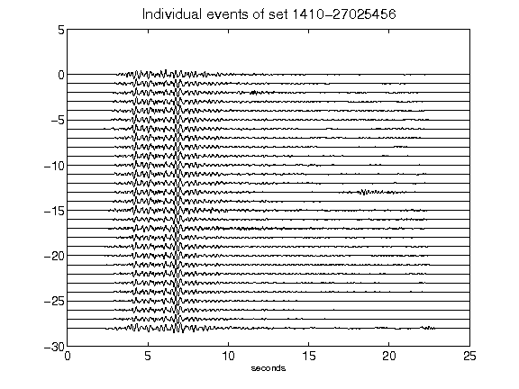](figures/1410-27025456_AllEv.png)[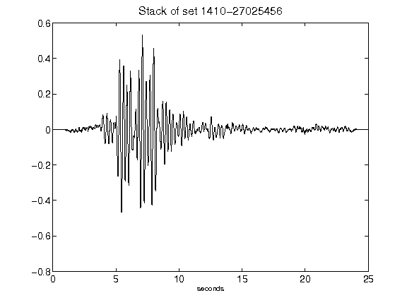](figures/1410-27025456_Stack.png)[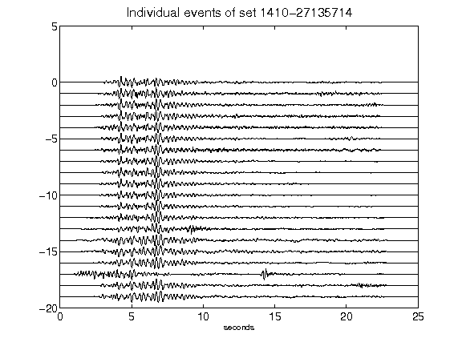](figures/1410-27135714_AllEv.png)[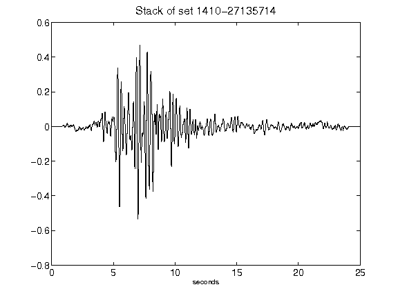](figures/1410-27135714_Stack.png)[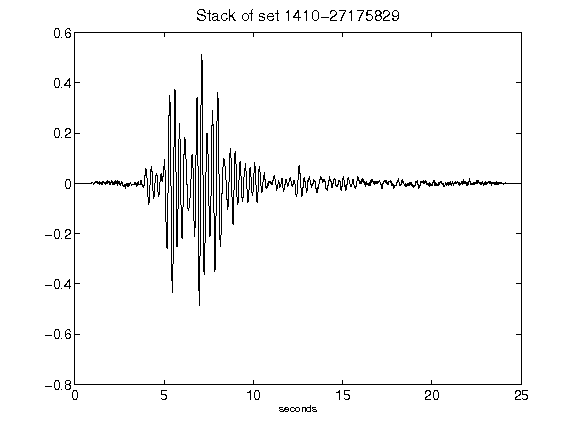](figures/1410-27175829_Stack.png)[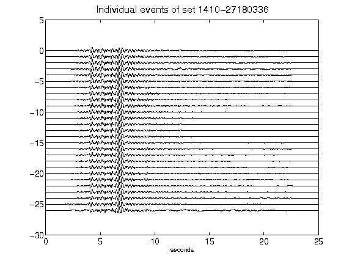](figures/1410-27180336_AllEv.png)[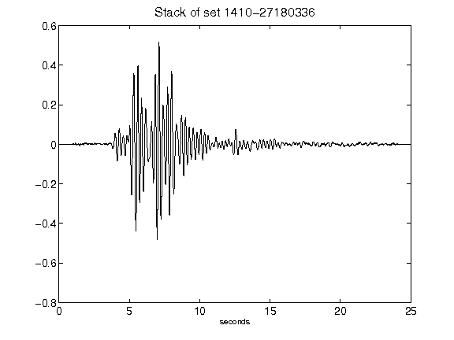](figures/1410-27180336_Stack.png)[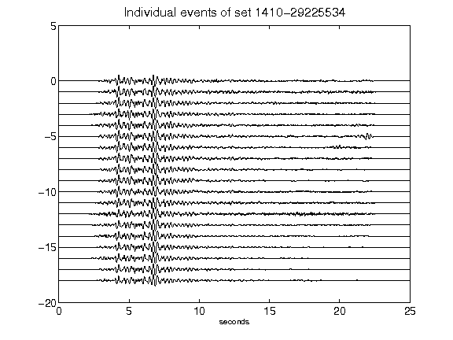](figures/1410-29225534_AllEv.png)[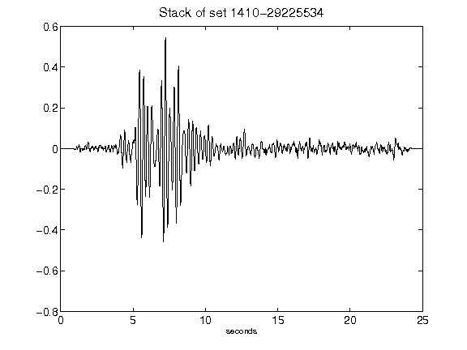](figures/1410-29225534_Stack.png)[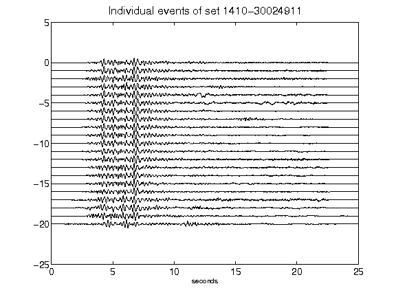](figures/1410-30024911_AllEv.png)[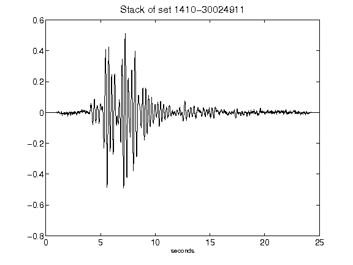](figures/1410-30024911_Stack.png)[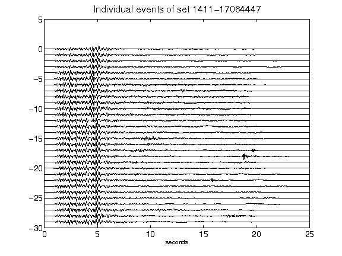](figures/1411-17064447_AllEv.png)[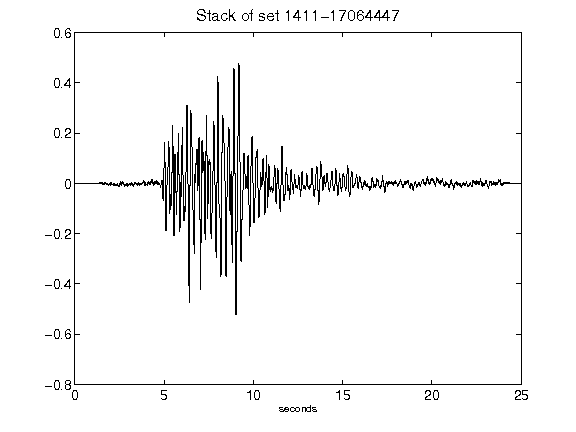](figures/1411-17064447_Stack.png)[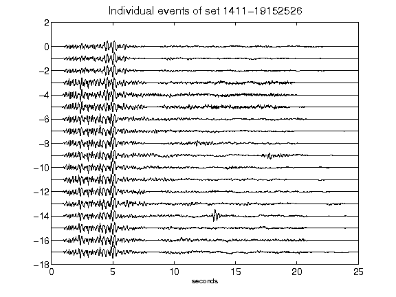](figures/1411-19152526_AllEv.png)[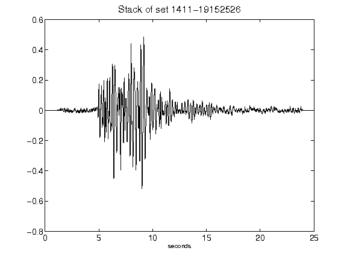](figures/1411-19152526_Stack.png)[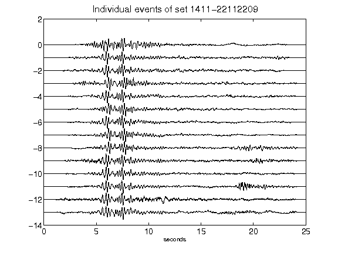](figures/1411-22112209_AllEv.png)[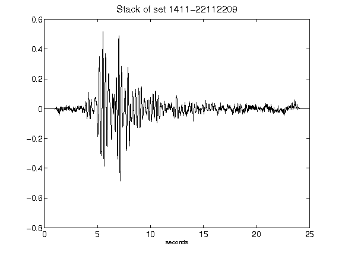](figures/1411-22112209_Stack.png)[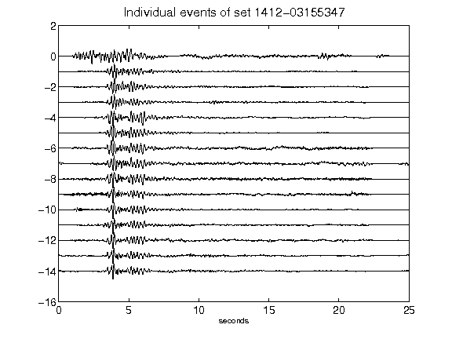](figures/1412-03155347_AllEv.png)[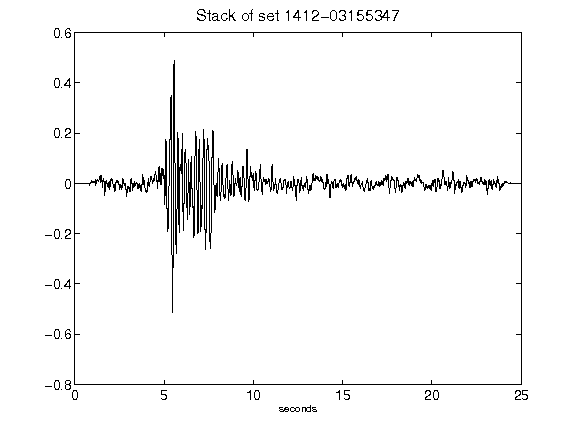](figures/1412-03155347_Stack.png)[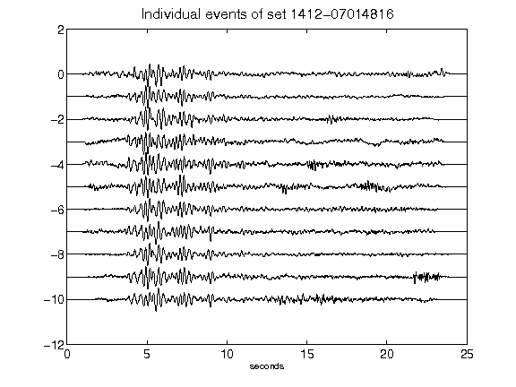](figures/1412-07014816_AllEv.png)[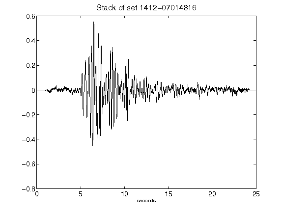](figures/1412-07014816_Stack.png)