# Repeating Earthquake Activity at RCM

## Waveforms
[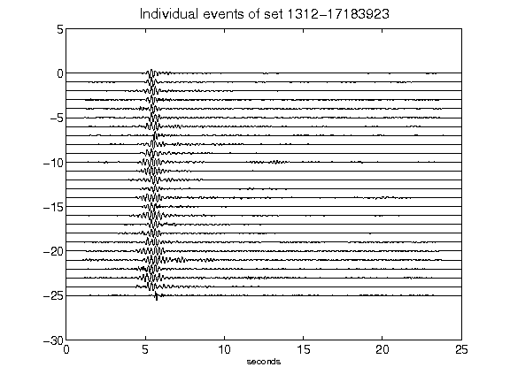](figures/1312-17183923_AllEv.png)[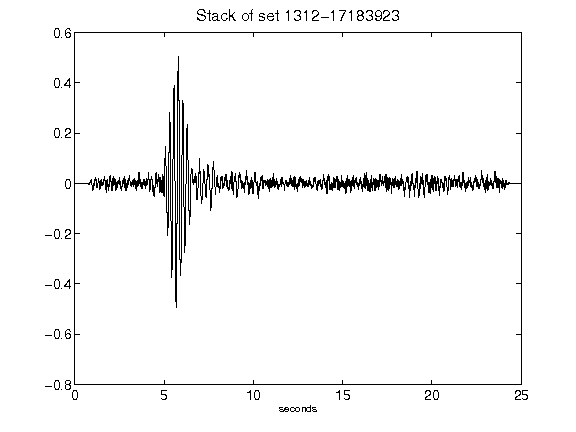](figures/1312-17183923_Stack.png)[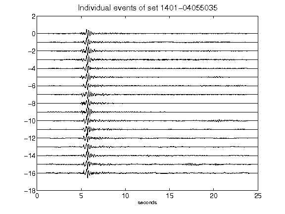](figures/1401-04055035_AllEv.png)[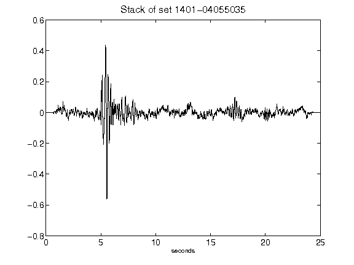](figures/1401-04055035_Stack.png)[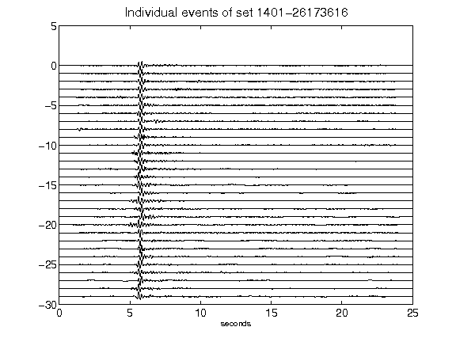](figures/1401-26173616_AllEv.png)[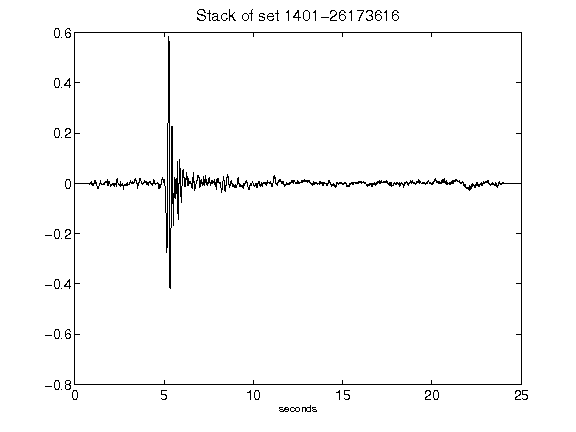](figures/1401-26173616_Stack.png)[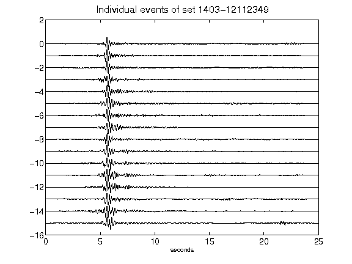](figures/1403-12112349_AllEv.png)[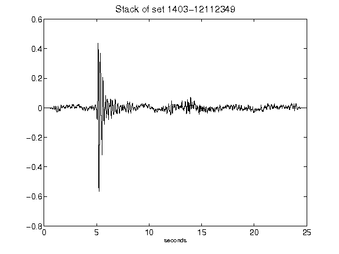](figures/1403-12112349_Stack.png)[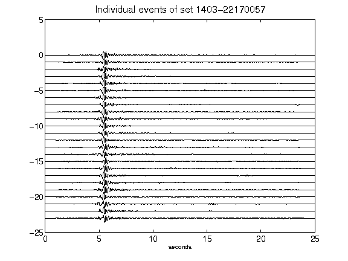](figures/1403-22170057_AllEv.png)[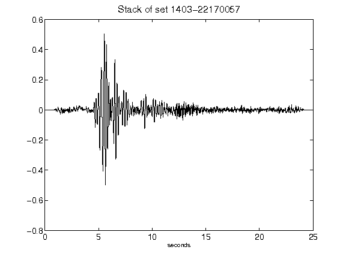](figures/1403-22170057_Stack.png)[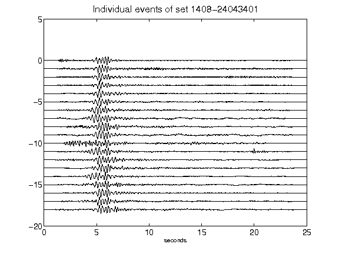](figures/1408-24043401_AllEv.png)[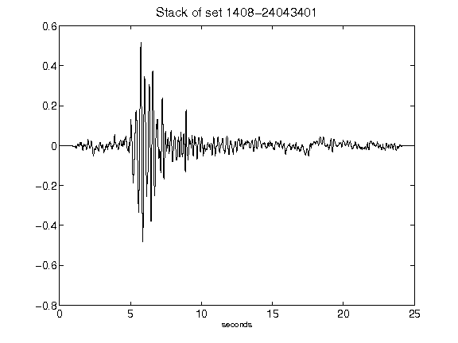](figures/1408-24043401_Stack.png)[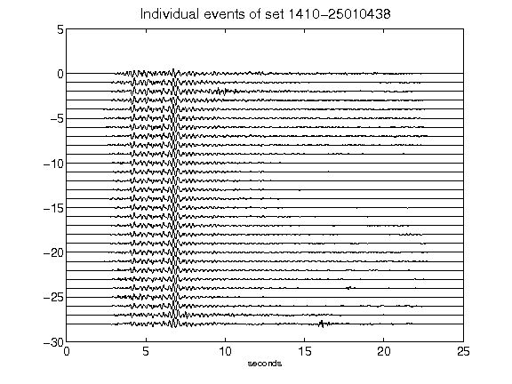](figures/1410-25010438_AllEv.png)[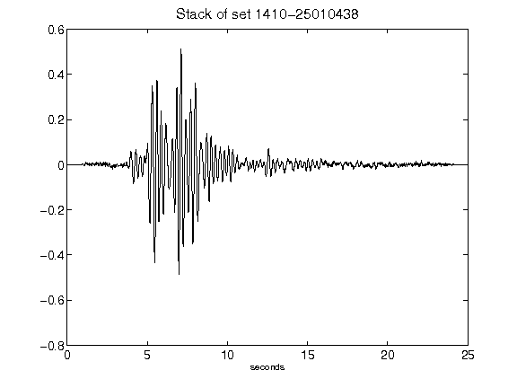](figures/1410-25010438_Stack.png)[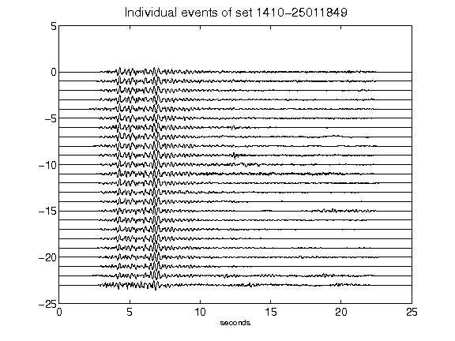](figures/1410-25011849_AllEv.png)[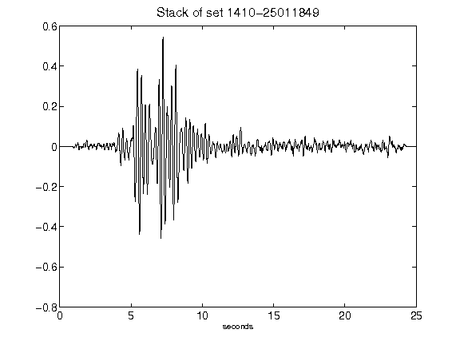](figures/1410-25011849_Stack.png)[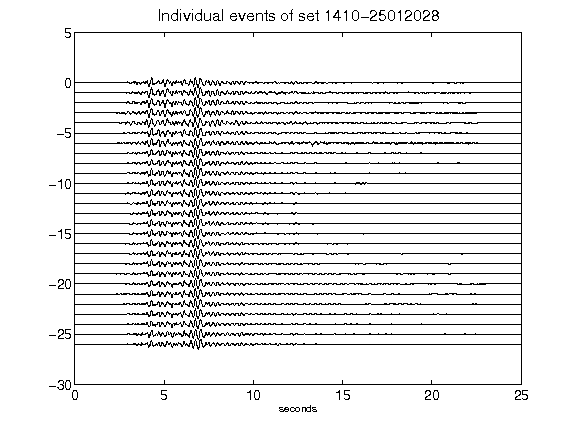](figures/1410-25012028_AllEv.png)[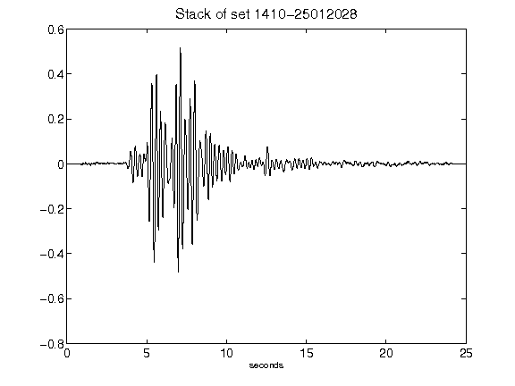](figures/1410-25012028_Stack.png)[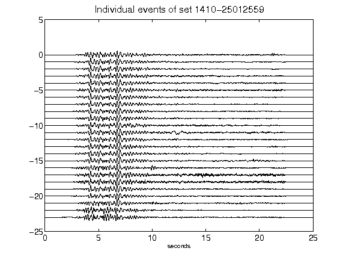](figures/1410-25012559_AllEv.png)[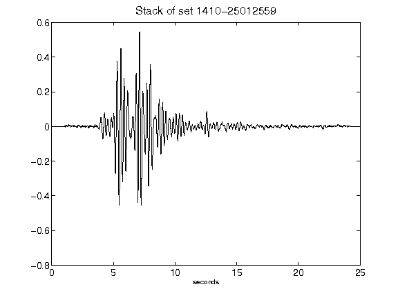](figures/1410-25012559_Stack.png)[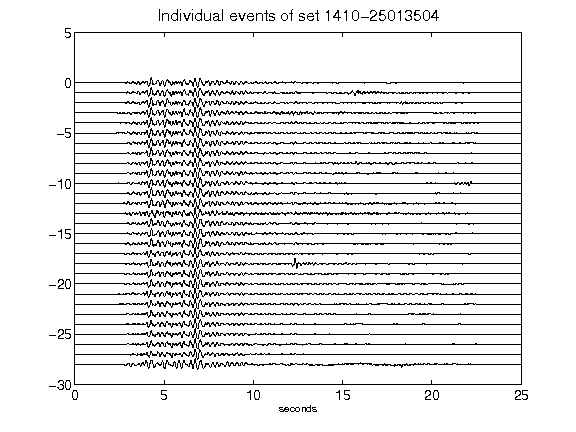](figures/1410-25013504_AllEv.png)[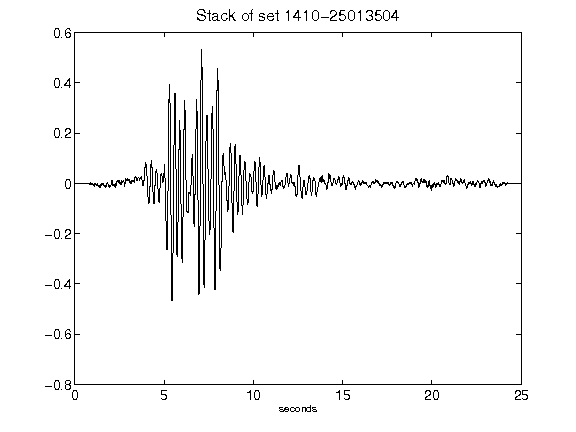](figures/1410-25013504_Stack.png)[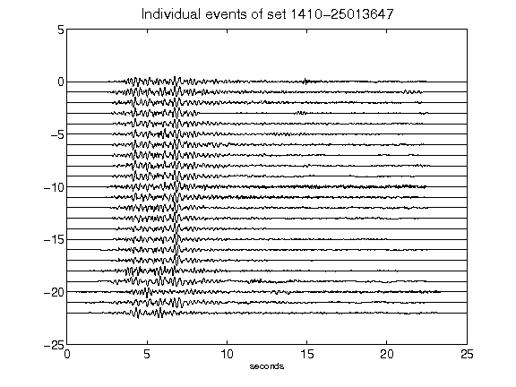](figures/1410-25013647_AllEv.png)[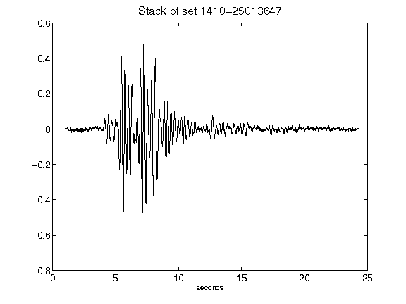](figures/1410-25013647_Stack.png)[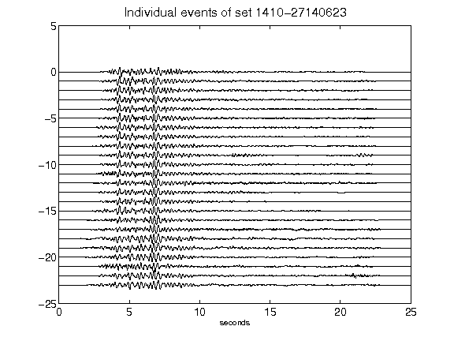](figures/1410-27140623_AllEv.png)[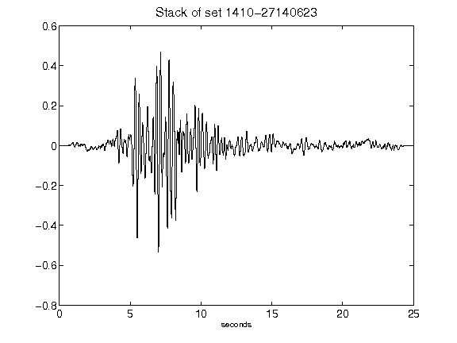](figures/1410-27140623_Stack.png)[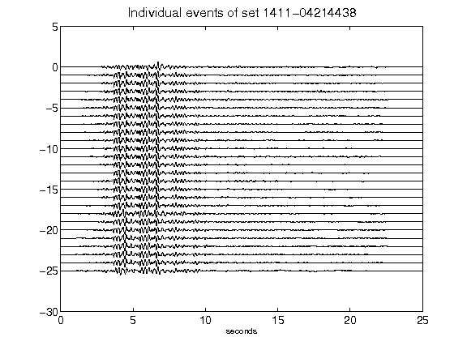](figures/1411-04214438_AllEv.png)[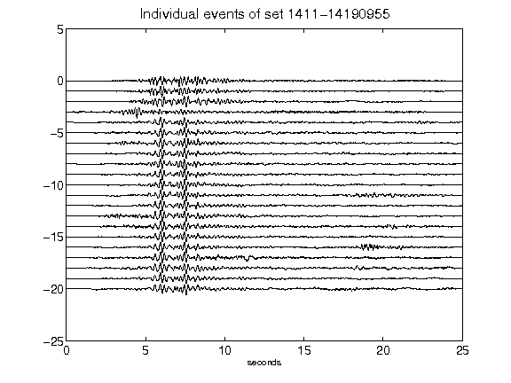](figures/1411-14190955_AllEv.png)[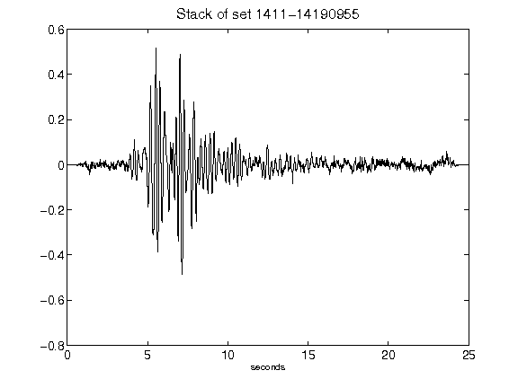](figures/1411-14190955_Stack.png)[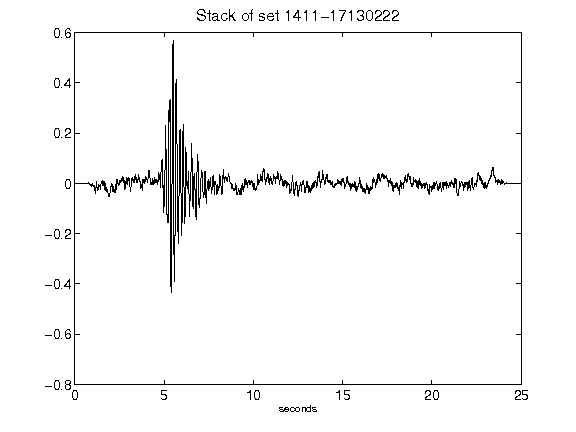](figures/1411-17130222_Stack.png)[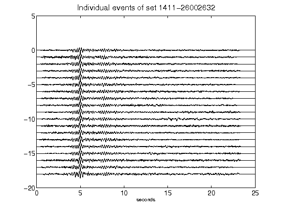](figures/1411-26002632_AllEv.png)[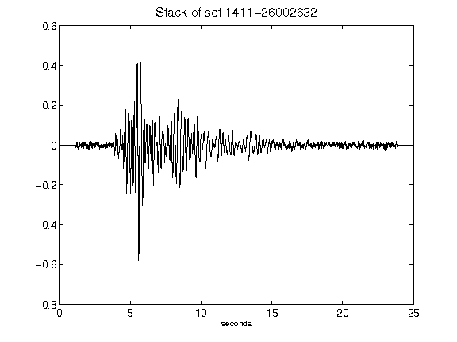](figures/1411-26002632_Stack.png)