# Repeating Earthquake Activity at RCM

## Waveforms
[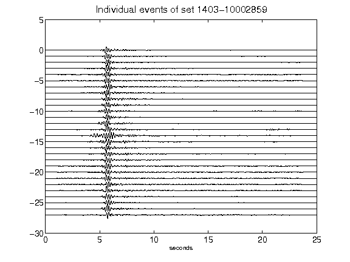](figures/1403-10002859_AllEv.png)[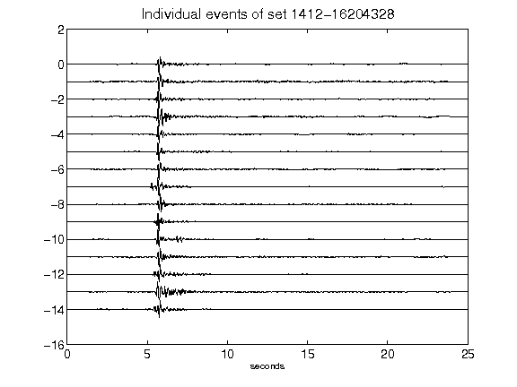](figures/1412-16204328_AllEv.png)[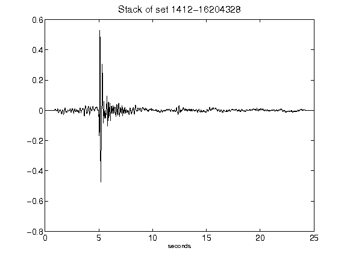](figures/1412-16204328_Stack.png)[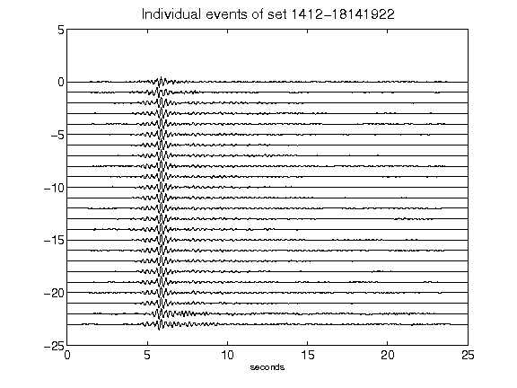](figures/1412-18141922_AllEv.png)[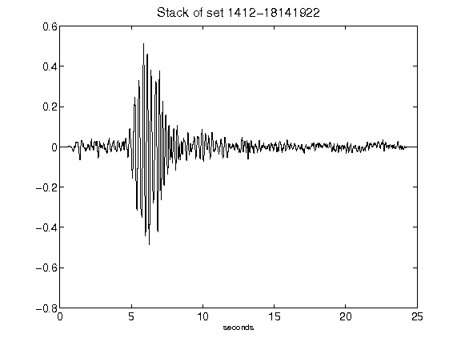](figures/1412-18141922_Stack.png)[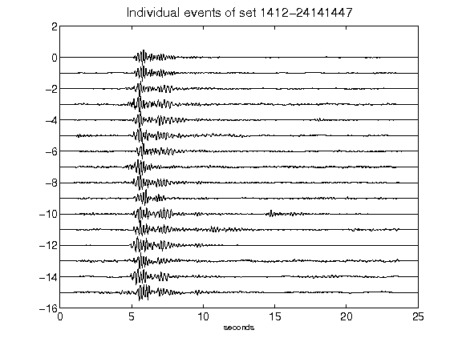](figures/1412-24141447_AllEv.png)[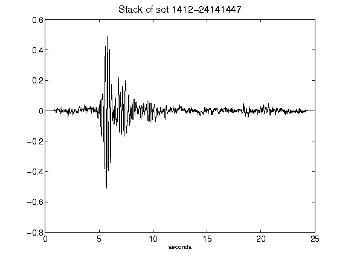](figures/1412-24141447_Stack.png)[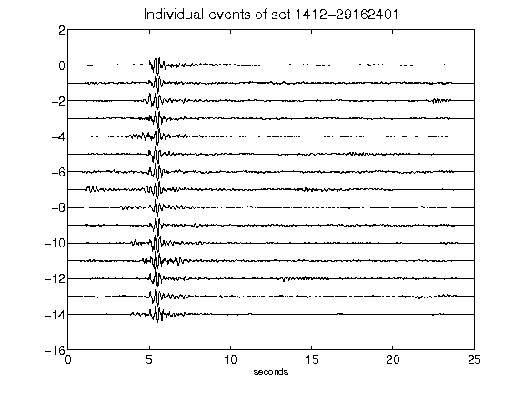](figures/1412-29162401_AllEv.png)[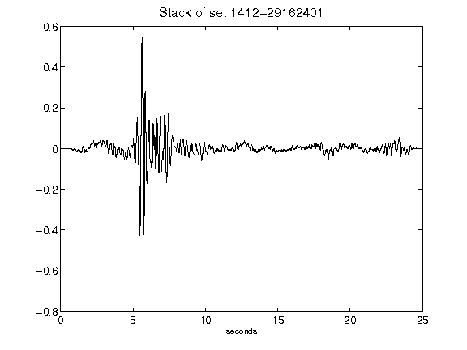](figures/1412-29162401_Stack.png)[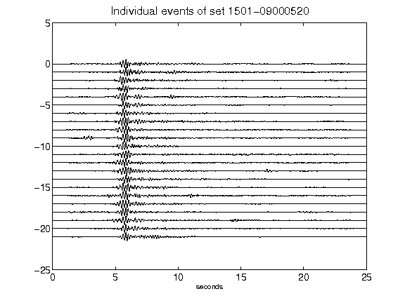](figures/1501-09000520_AllEv.png)[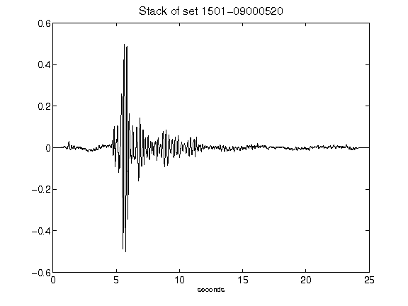](figures/1501-09000520_Stack.png)[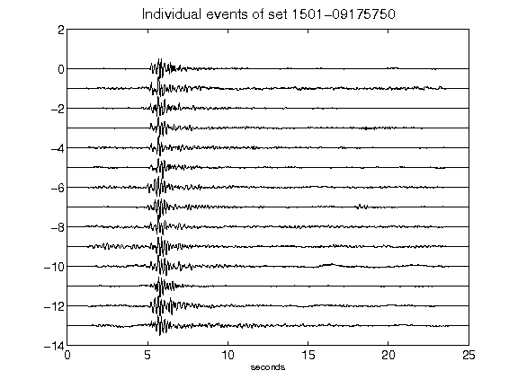](figures/1501-09175750_AllEv.png)[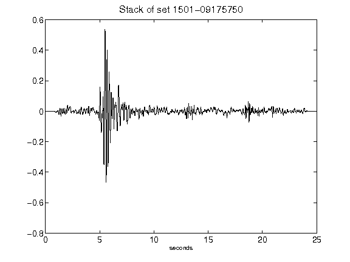](figures/1501-09175750_Stack.png)[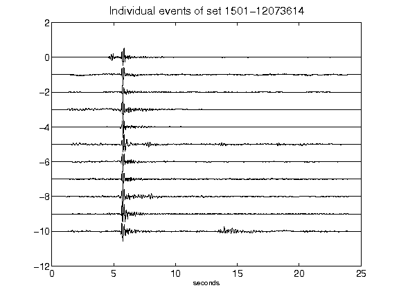](figures/1501-12073614_AllEv.png)[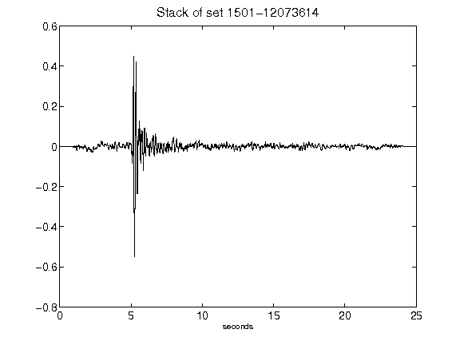](figures/1501-12073614_Stack.png)[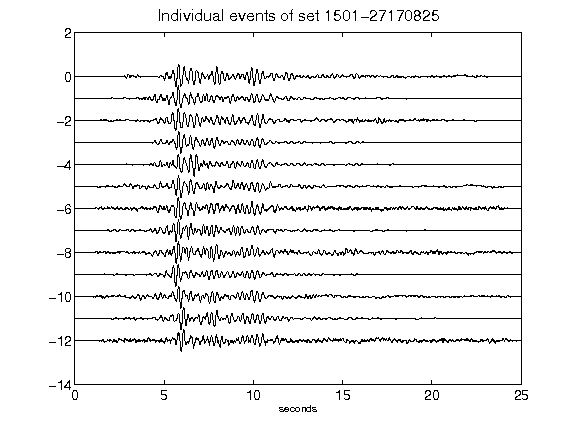](figures/1501-27170825_AllEv.png)[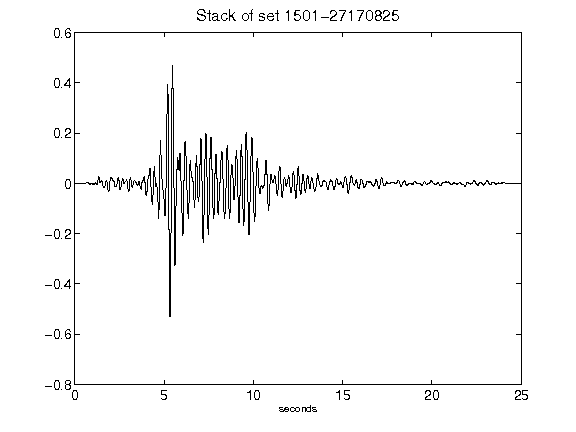](figures/1501-27170825_Stack.png)[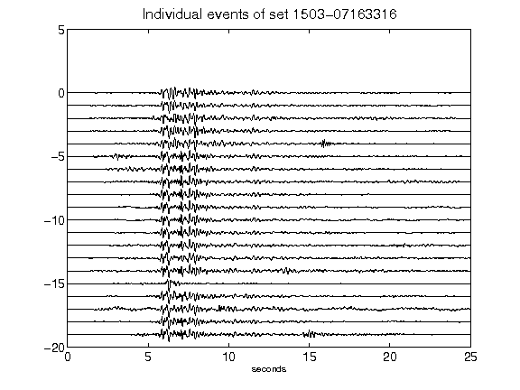](figures/1503-07163316_AllEv.png)[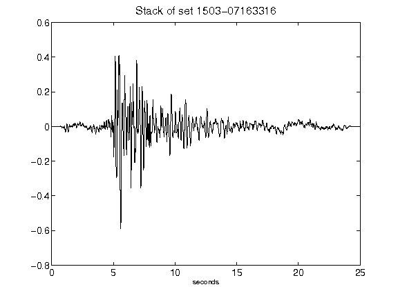](figures/1503-07163316_Stack.png)[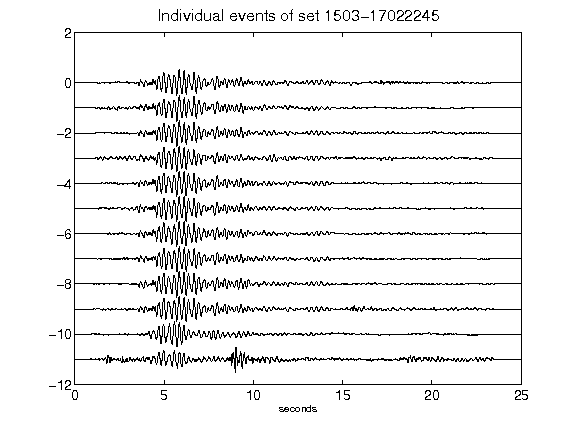](figures/1503-17022245_AllEv.png)[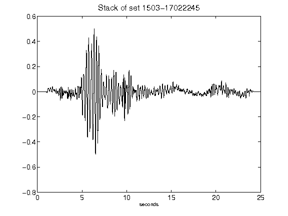](figures/1503-17022245_Stack.png)[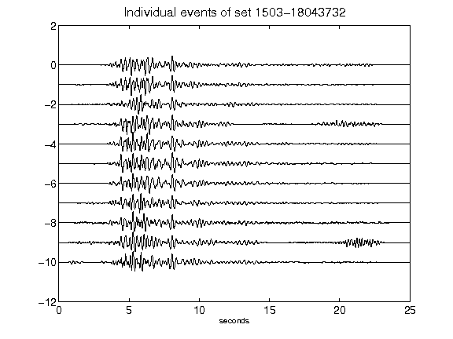](figures/1503-18043732_AllEv.png)[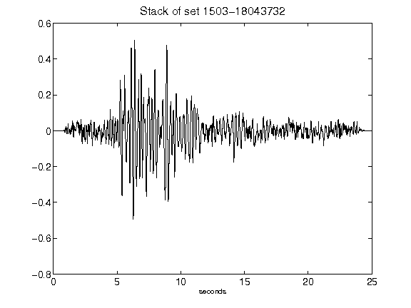](figures/1503-18043732_Stack.png)