# Repeating Earthquake Activity at RCM

## Waveforms
[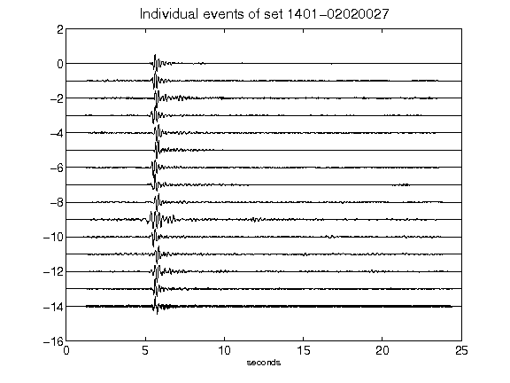](figures/1401-02020027_AllEv.png)[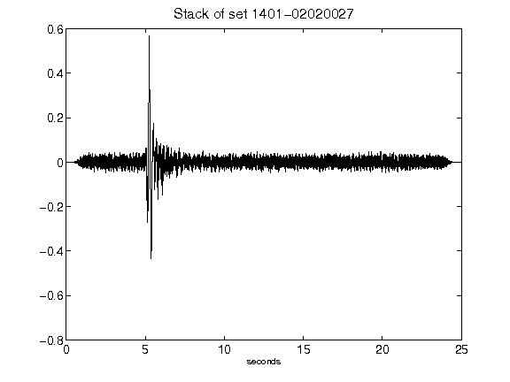](figures/1401-02020027_Stack.png)[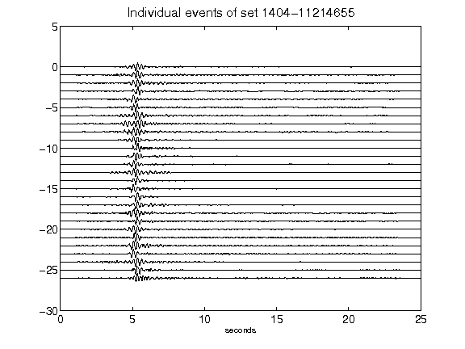](figures/1404-11214655_AllEv.png)[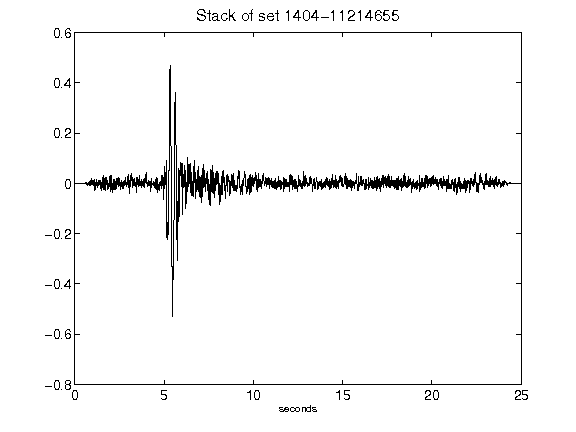](figures/1404-11214655_Stack.png)[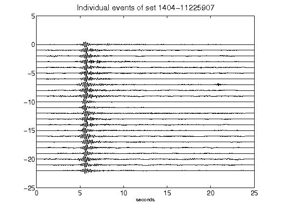](figures/1404-11225907_AllEv.png)[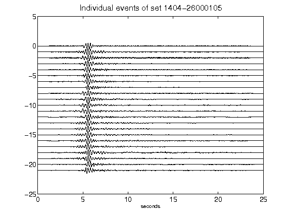](figures/1404-26000105_AllEv.png)[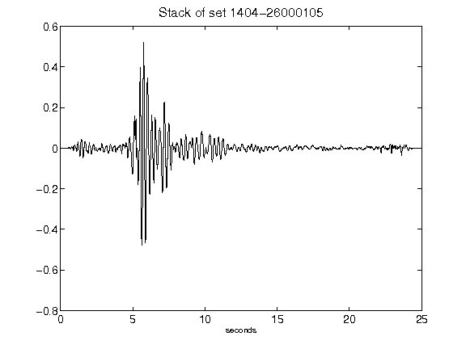](figures/1404-26000105_Stack.png)[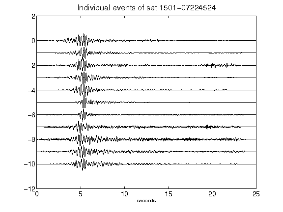](figures/1501-07224524_AllEv.png)[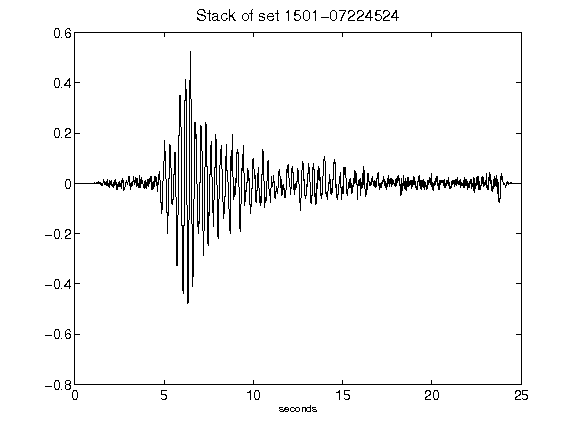](figures/1501-07224524_Stack.png)[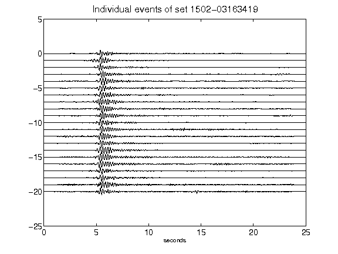](figures/1502-03163419_AllEv.png)[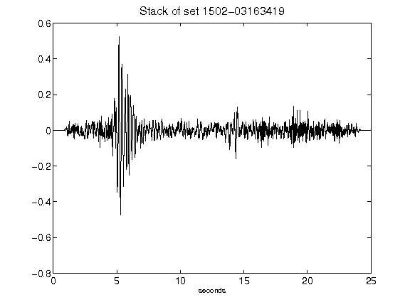](figures/1502-03163419_Stack.png)