# Repeating Earthquake Activity at RCM

## Waveforms
[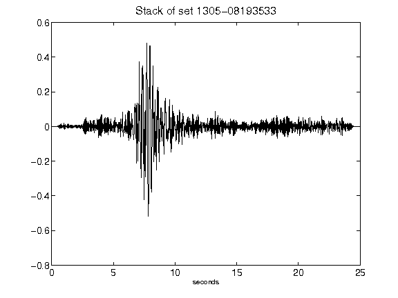](figures/1305-08193533_Stack.png)[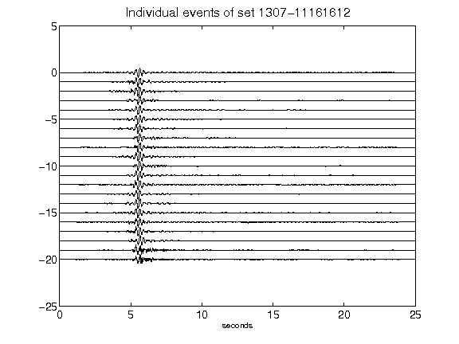](figures/1307-11161612_AllEv.png)[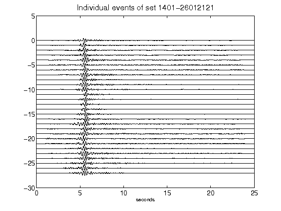](figures/1401-26012121_AllEv.png)[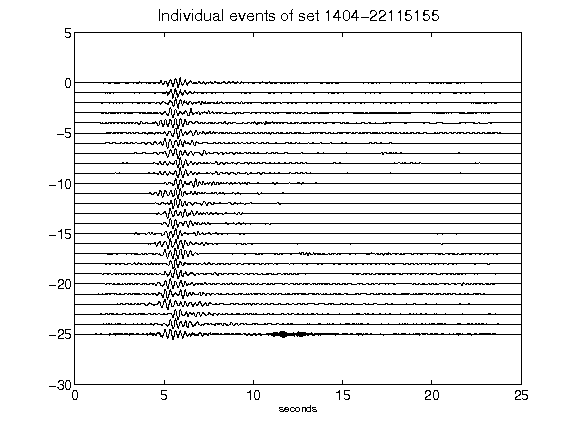](figures/1404-22115155_AllEv.png)[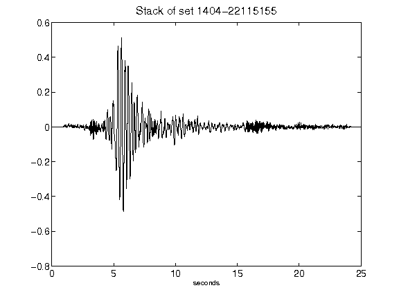](figures/1404-22115155_Stack.png)[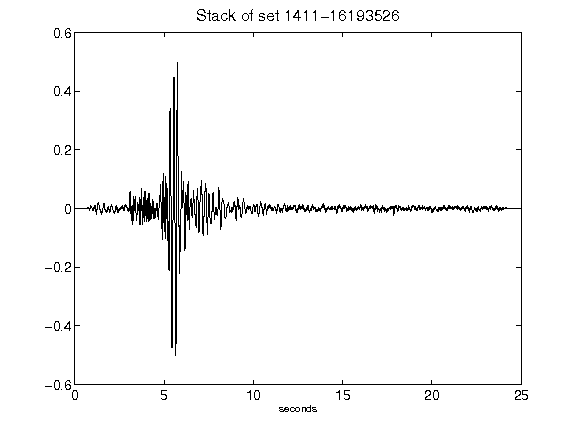](figures/1411-16193526_Stack.png)[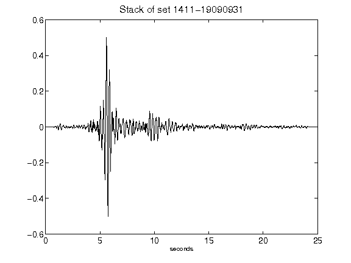](figures/1411-19090931_Stack.png)[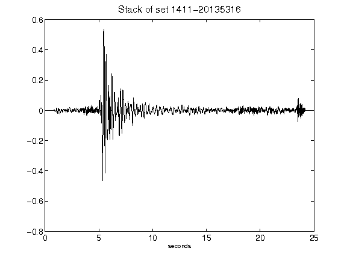](figures/1411-20135316_Stack.png)[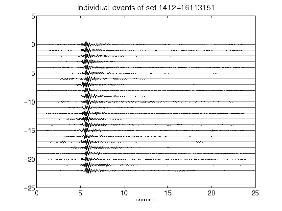](figures/1412-16113151_AllEv.png)[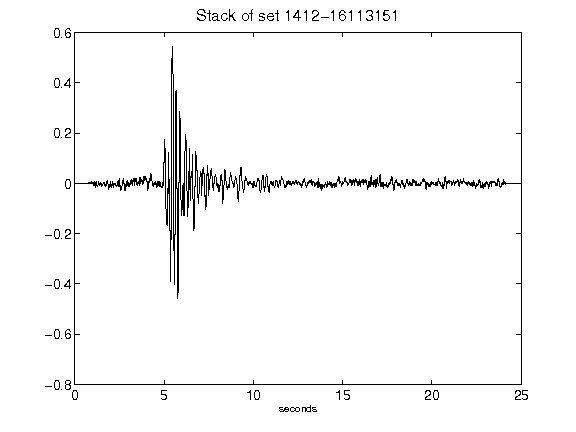](figures/1412-16113151_Stack.png)[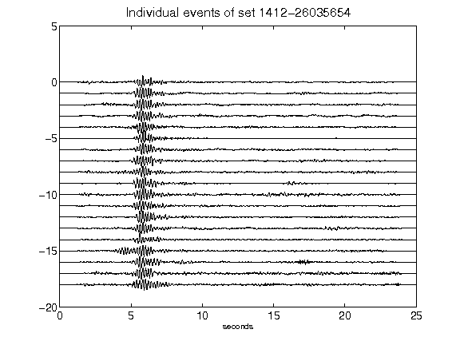](figures/1412-26035654_AllEv.png)[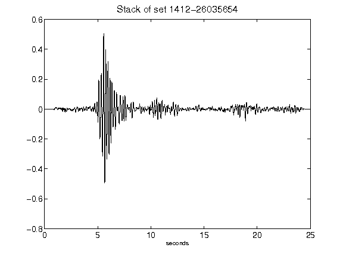](figures/1412-26035654_Stack.png)[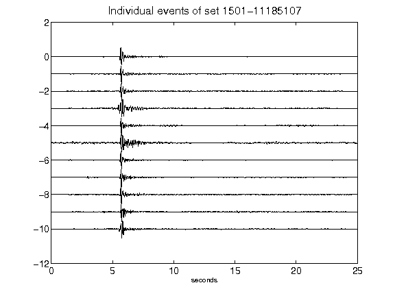](figures/1501-11185107_AllEv.png)[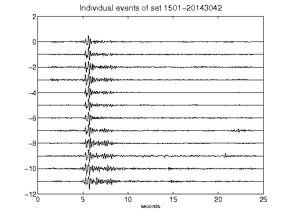](figures/1501-20143042_AllEv.png)[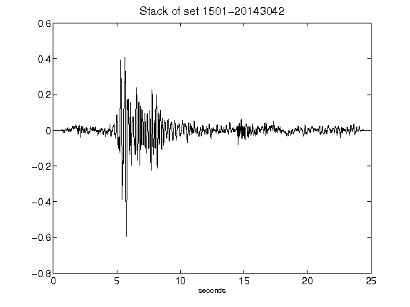](figures/1501-20143042_Stack.png)[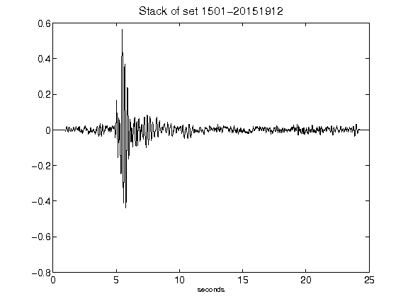](figures/1501-20151912_Stack.png)[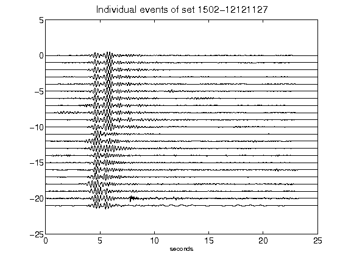](figures/1502-12121127_AllEv.png)[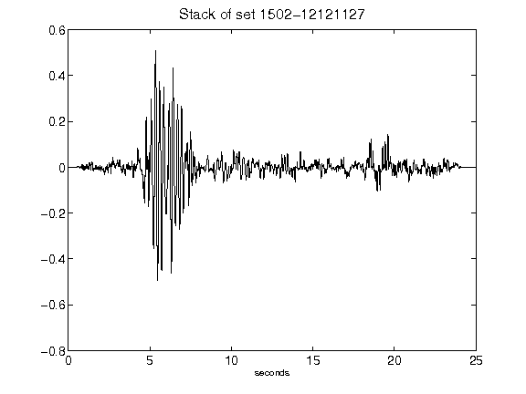](figures/1502-12121127_Stack.png)[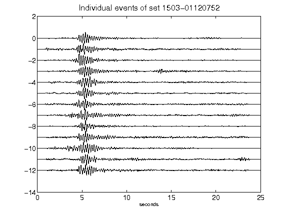](figures/1503-01120752_AllEv.png)[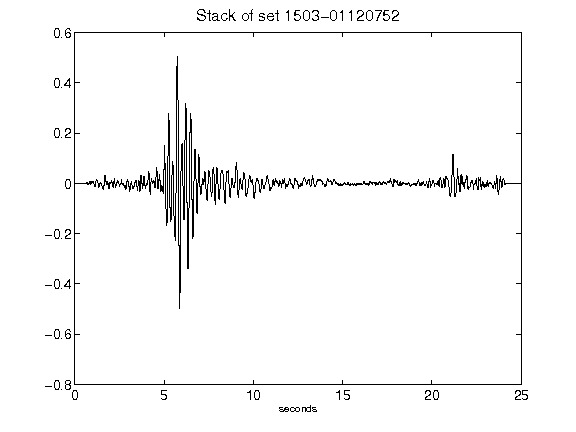](figures/1503-01120752_Stack.png)[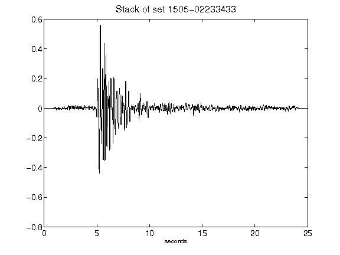](figures/1505-02233433_Stack.png)