# Repeating Earthquake Activity at RCM

## Waveforms
[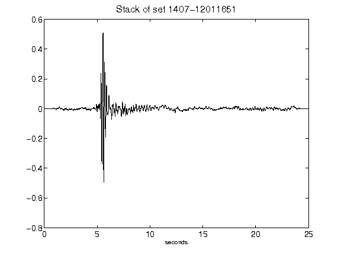](figures/1407-12011651_Stack.png)[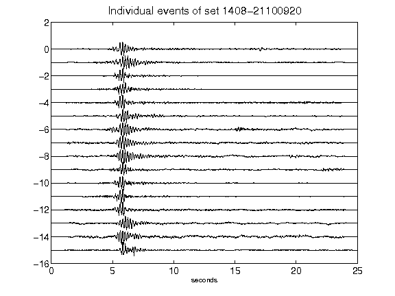](figures/1408-21100920_AllEv.png)[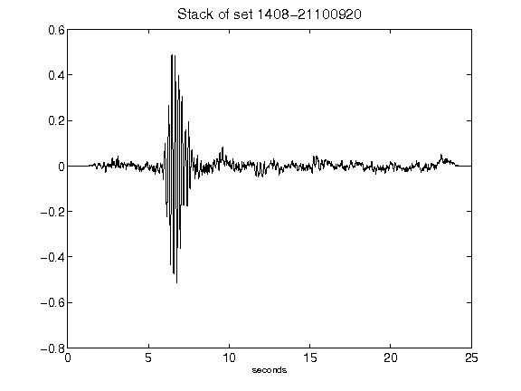](figures/1408-21100920_Stack.png)[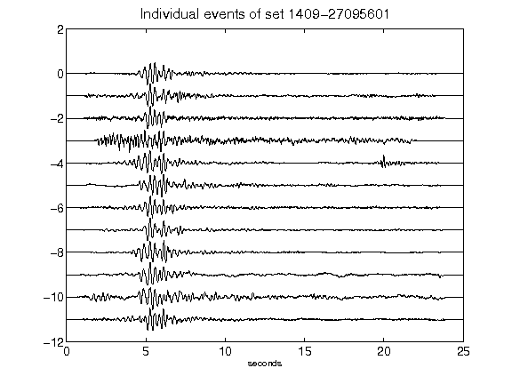](figures/1409-27095601_AllEv.png)[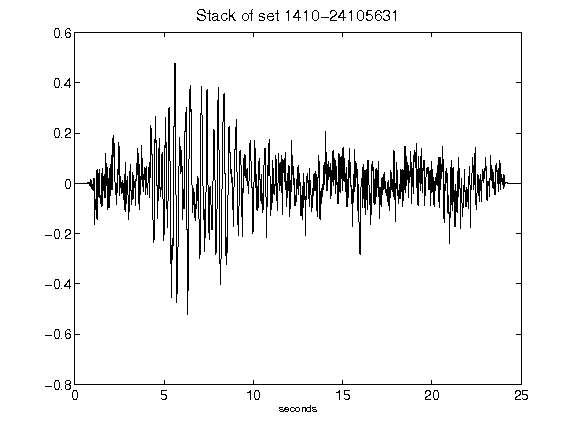](figures/1410-24105631_Stack.png)[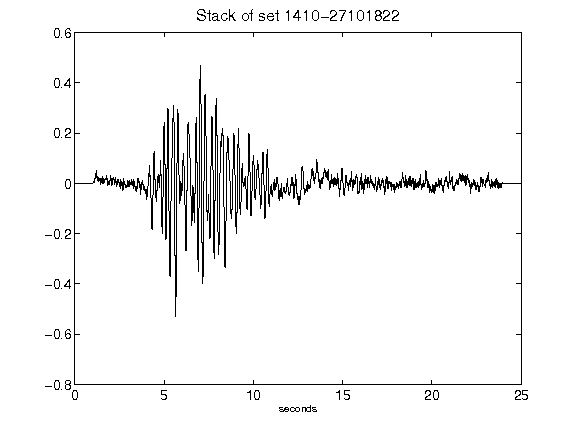](figures/1410-27101822_Stack.png)[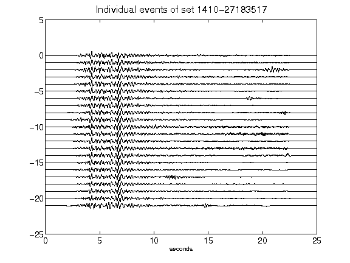](figures/1410-27183517_AllEv.png)[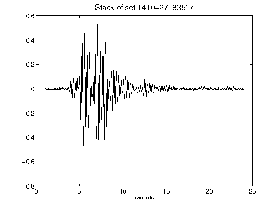](figures/1410-27183517_Stack.png)[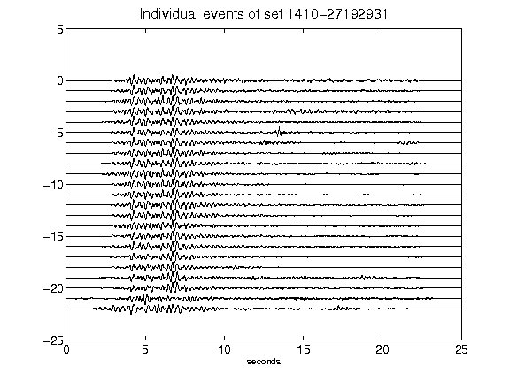](figures/1410-27192931_AllEv.png)[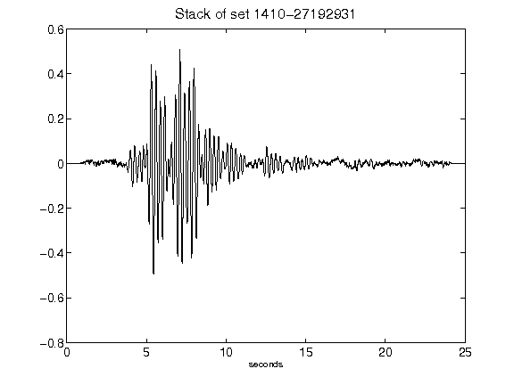](figures/1410-27192931_Stack.png)[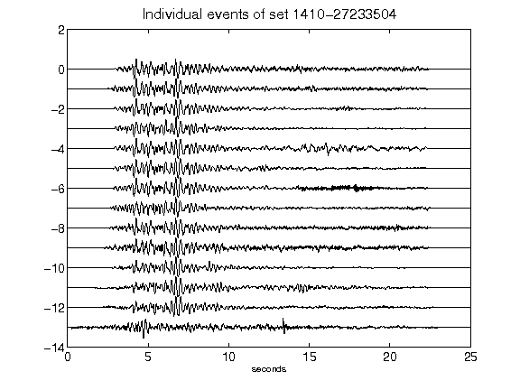](figures/1410-27233504_AllEv.png)[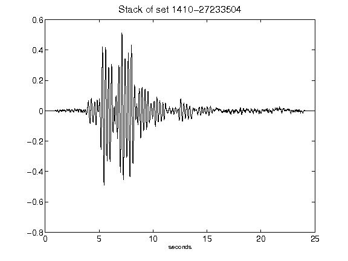](figures/1410-27233504_Stack.png)[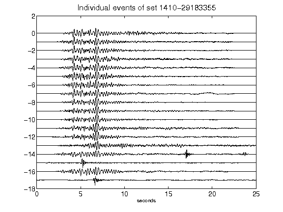](figures/1410-29183355_AllEv.png)[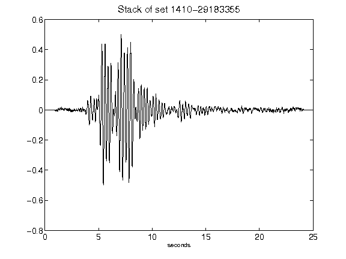](figures/1410-29183355_Stack.png)[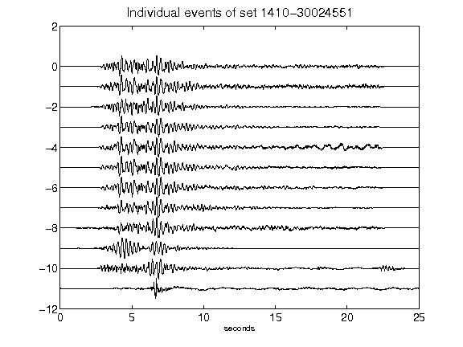](figures/1410-30024551_AllEv.png)[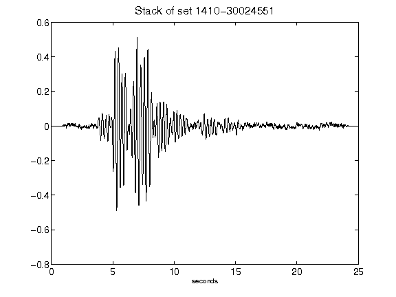](figures/1410-30024551_Stack.png)[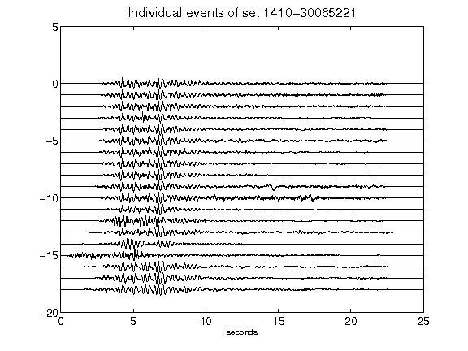](figures/1410-30065221_AllEv.png)[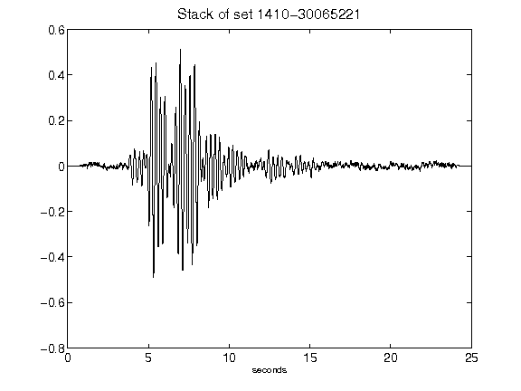](figures/1410-30065221_Stack.png)[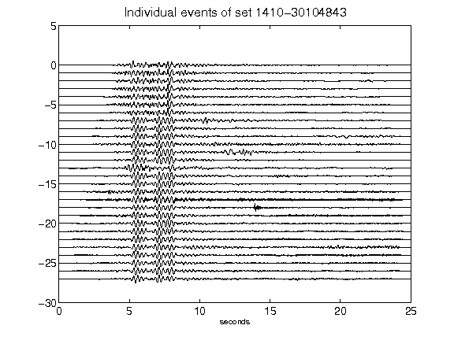](figures/1410-30104843_AllEv.png)[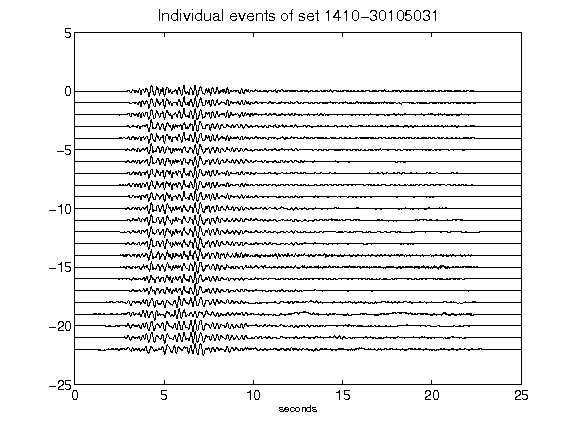](figures/1410-30105031_AllEv.png)[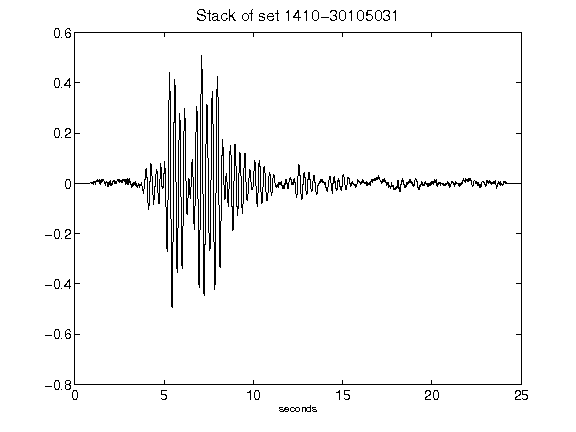](figures/1410-30105031_Stack.png)[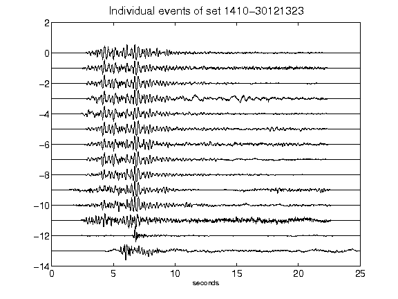](figures/1410-30121323_AllEv.png)[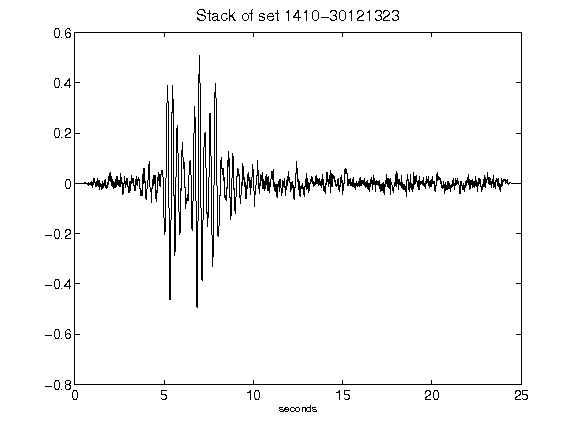](figures/1410-30121323_Stack.png)[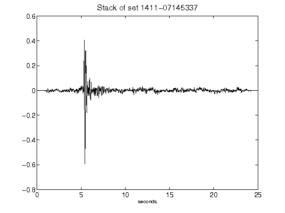](figures/1411-07145337_Stack.png)[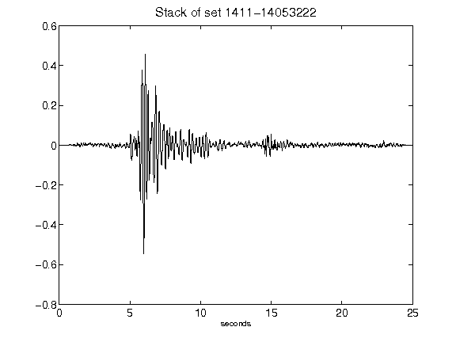](figures/1411-14053222_Stack.png)[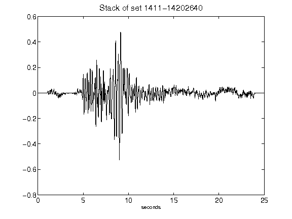](figures/1411-14202640_Stack.png)[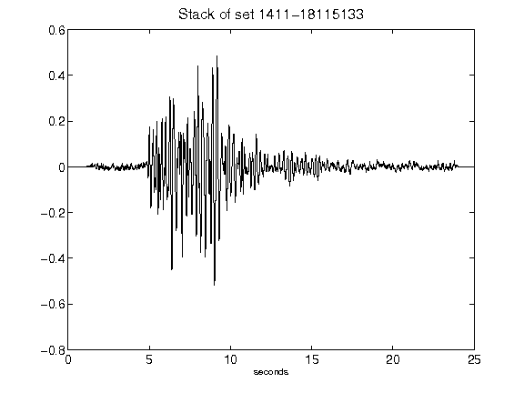](figures/1411-18115133_Stack.png)[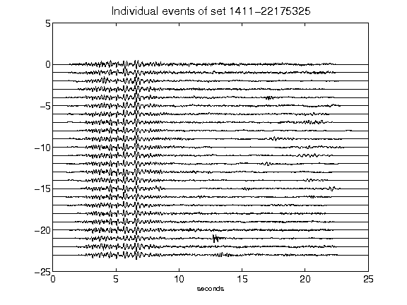](figures/1411-22175325_AllEv.png)