# Repeating Earthquake Activity at RCM

## Waveforms
[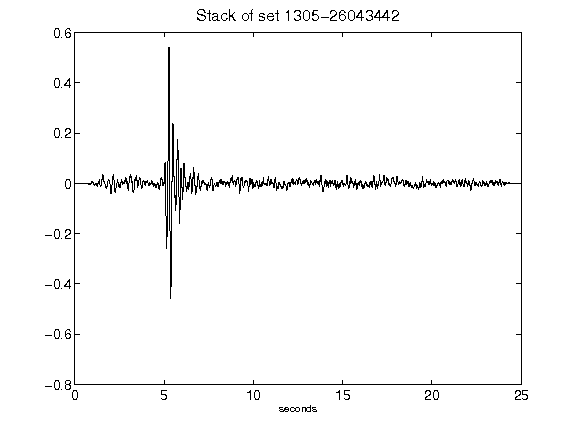](figures/1305-26043442_Stack.png)[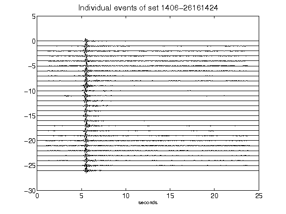](figures/1406-26161424_AllEv.png)[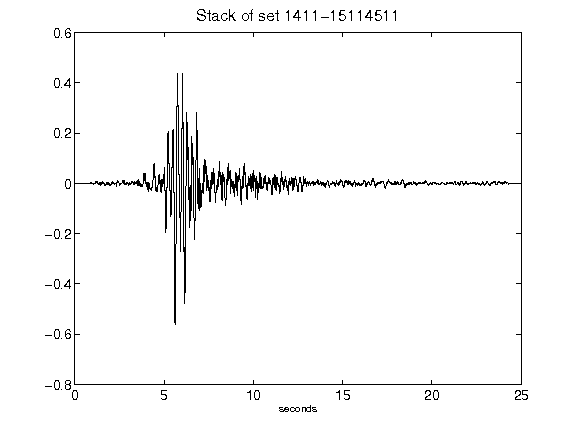](figures/1411-15114511_Stack.png)[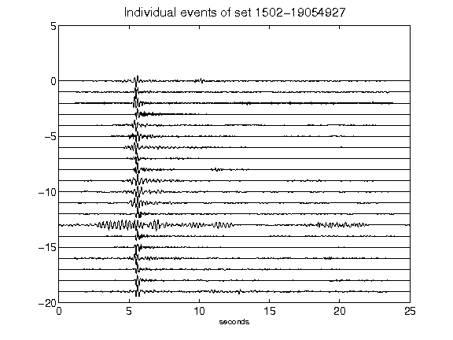](figures/1502-19054927_AllEv.png)[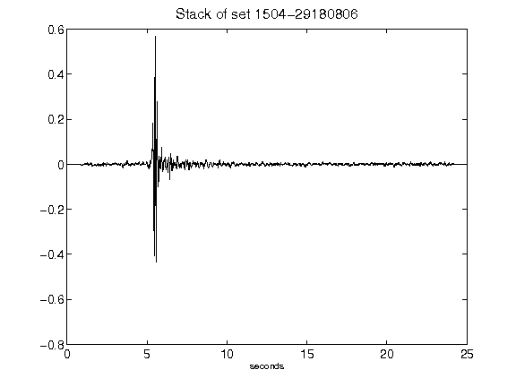](figures/1504-29180806_Stack.png)[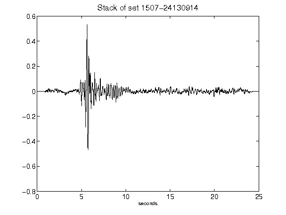](figures/1507-24130914_Stack.png)[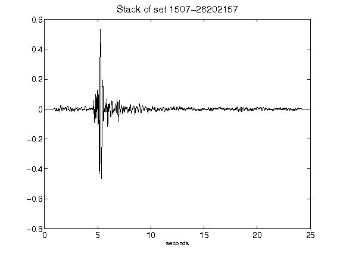](figures/1507-26202157_Stack.png)[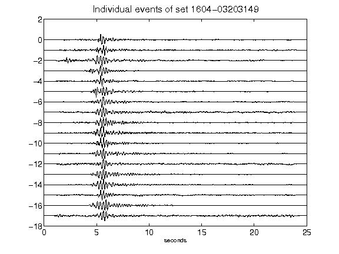](figures/1604-03203149_AllEv.png)[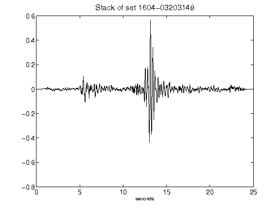](figures/1604-03203149_Stack.png)[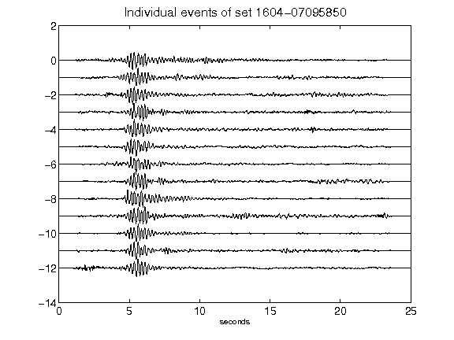](figures/1604-07095850_AllEv.png)[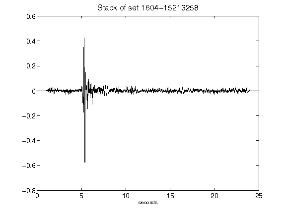](figures/1604-15213258_Stack.png)