# Repeating Earthquake Activity at RCM

## Waveforms
[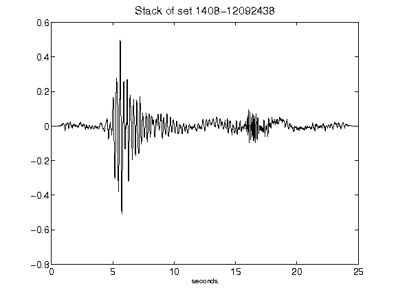](figures/1408-12092438_Stack.png)[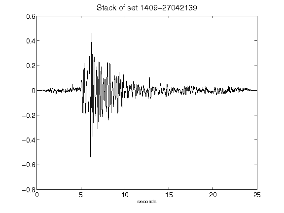](figures/1409-27042139_Stack.png)[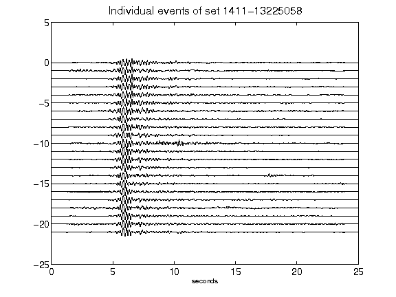](figures/1411-13225058_AllEv.png)[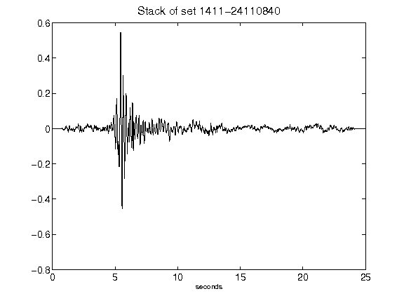](figures/1411-24110840_Stack.png)[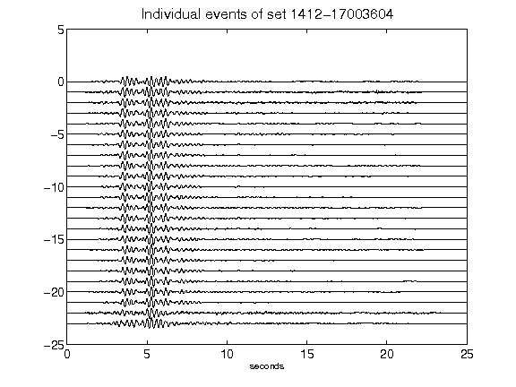](figures/1412-17003604_AllEv.png)[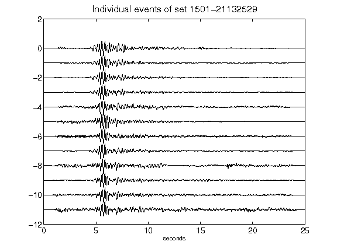](figures/1501-21132529_AllEv.png)[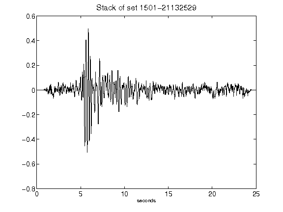](figures/1501-21132529_Stack.png)[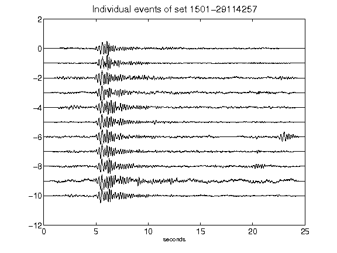](figures/1501-29114257_AllEv.png)[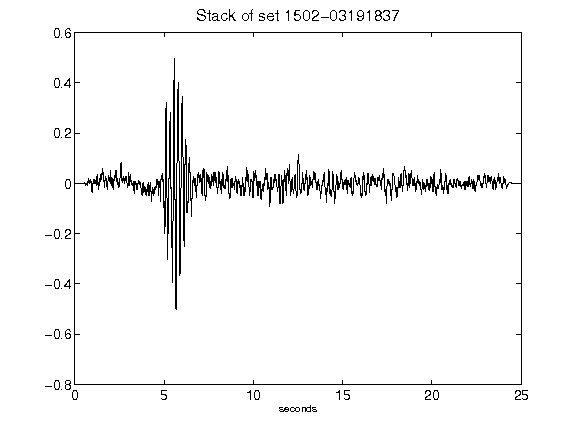](figures/1502-03191837_Stack.png)[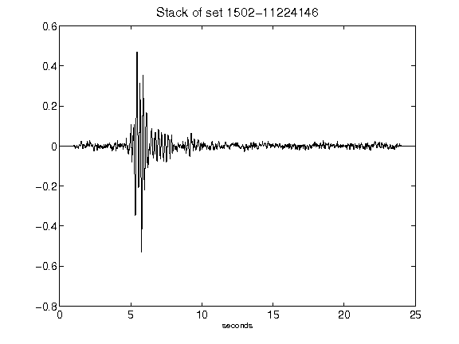](figures/1502-11224146_Stack.png)[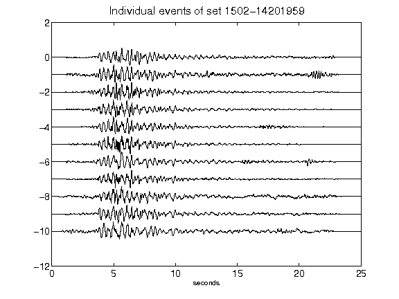](figures/1502-14201959_AllEv.png)[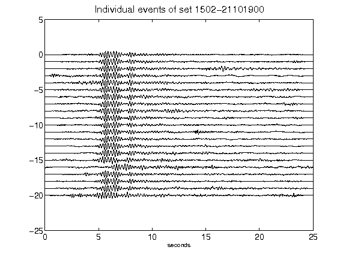](figures/1502-21101900_AllEv.png)[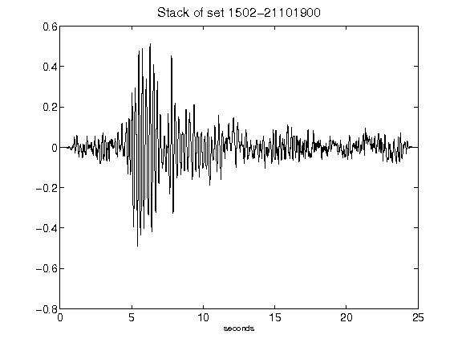](figures/1502-21101900_Stack.png)[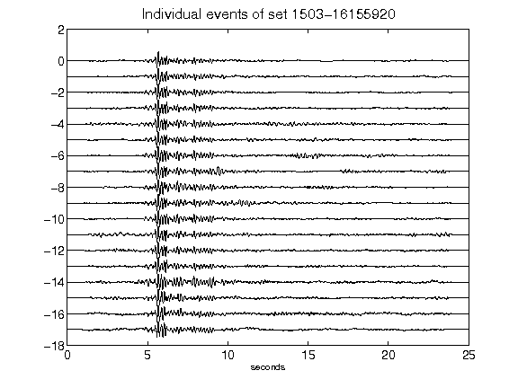](figures/1503-16155920_AllEv.png)[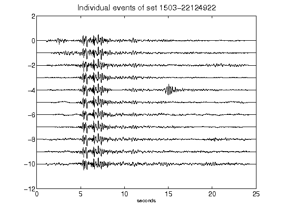](figures/1503-22124922_AllEv.png)[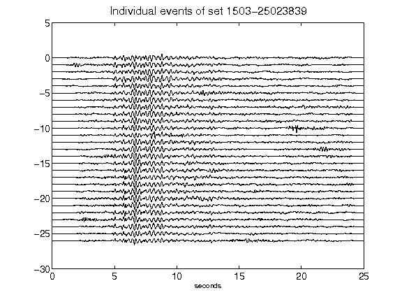](figures/1503-25023839_AllEv.png)