# Repeating Earthquake Activity at RCM

## Waveforms
[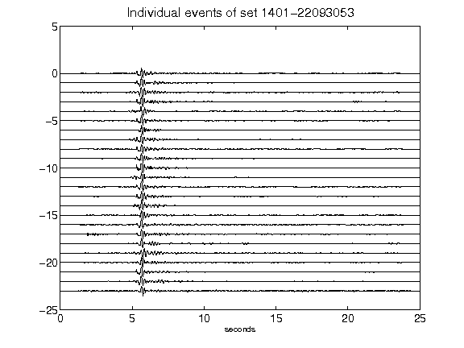](figures/1401-22093053_AllEv.png)[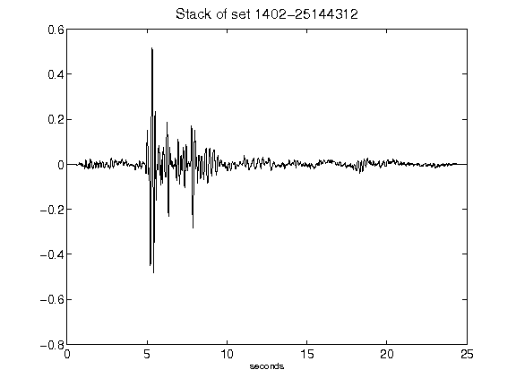](figures/1402-25144312_Stack.png)[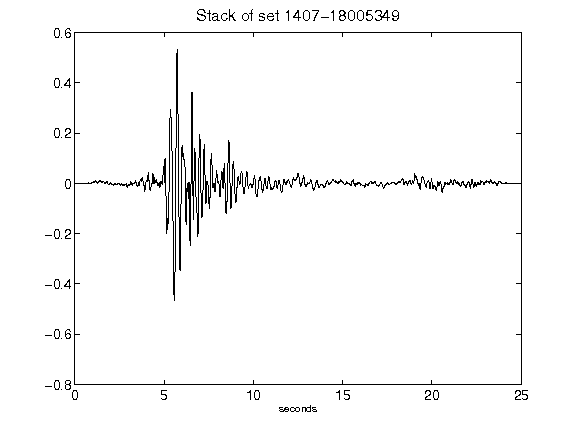](figures/1407-18005349_Stack.png)[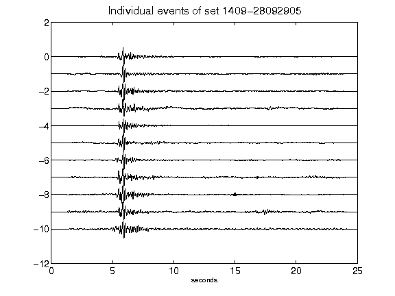](figures/1409-28092905_AllEv.png)[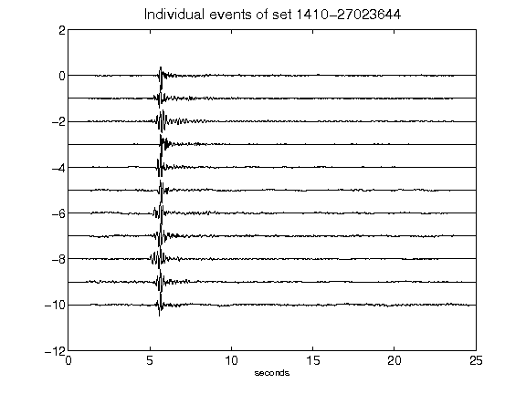](figures/1410-27023644_AllEv.png)[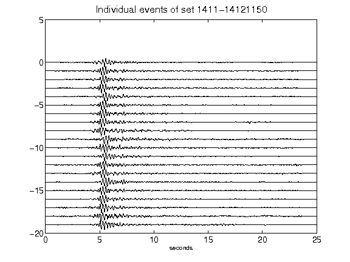](figures/1411-14121150_AllEv.png)[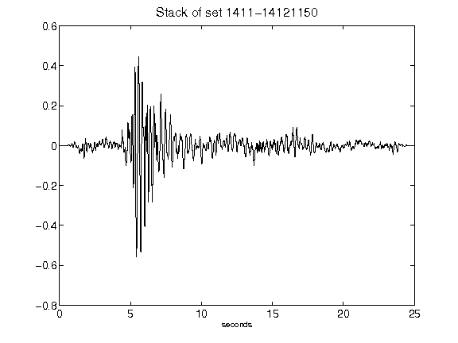](figures/1411-14121150_Stack.png)[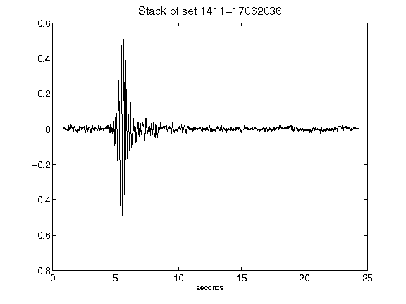](figures/1411-17062036_Stack.png)[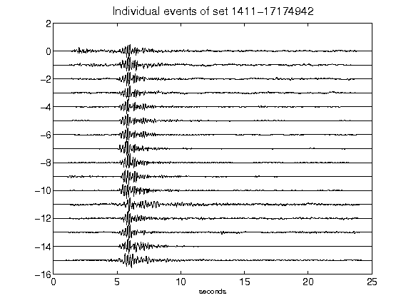](figures/1411-17174942_AllEv.png)[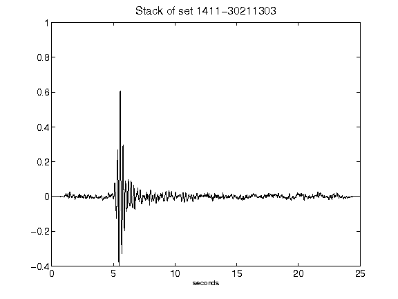](figures/1411-30211303_Stack.png)[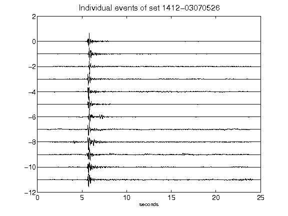](figures/1412-03070526_AllEv.png)[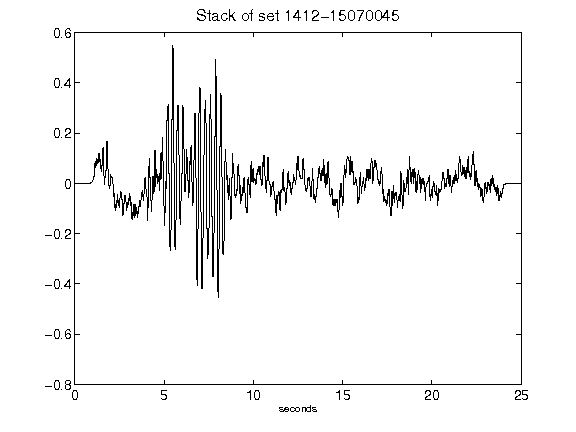](figures/1412-15070045_Stack.png)[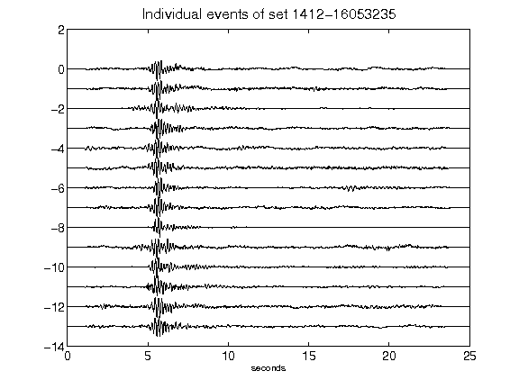](figures/1412-16053235_AllEv.png)[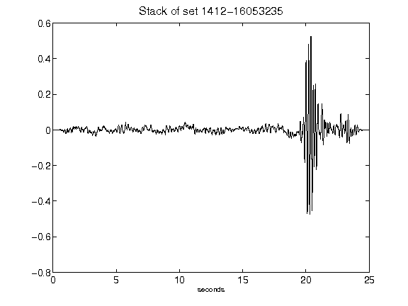](figures/1412-16053235_Stack.png)[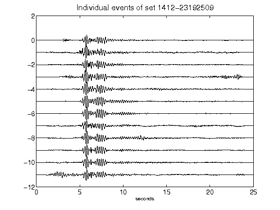](figures/1412-23192509_AllEv.png)[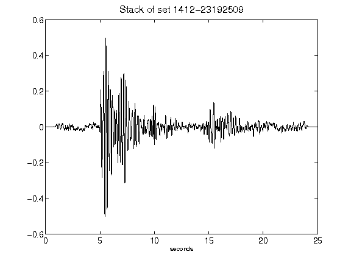](figures/1412-23192509_Stack.png)[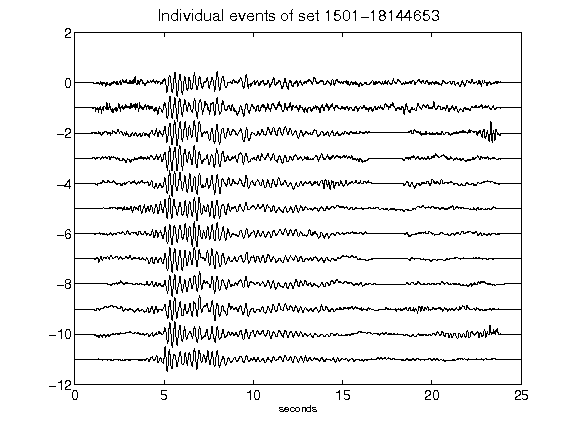](figures/1501-18144653_AllEv.png)[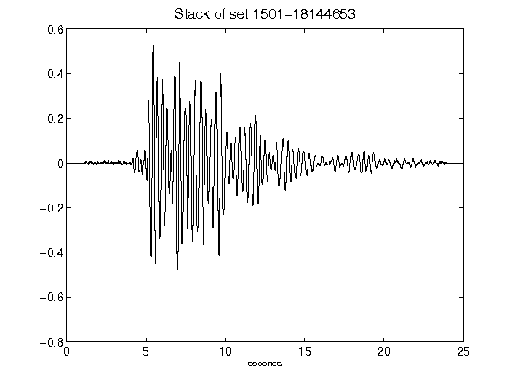](figures/1501-18144653_Stack.png)[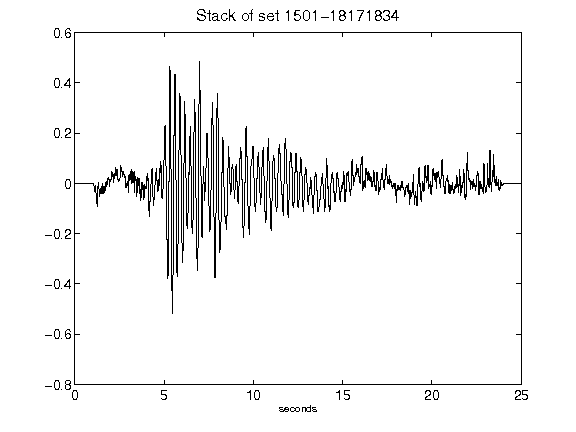](figures/1501-18171834_Stack.png)[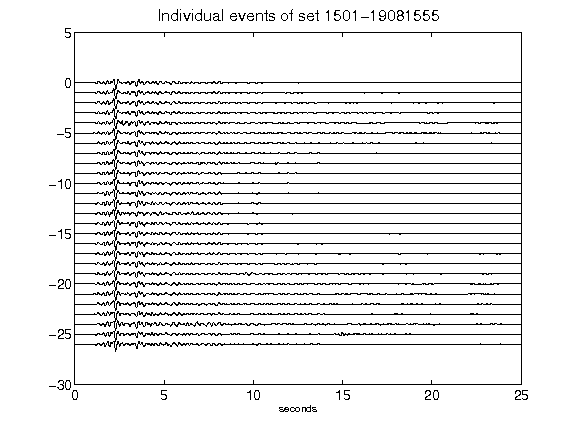](figures/1501-19081555_AllEv.png)[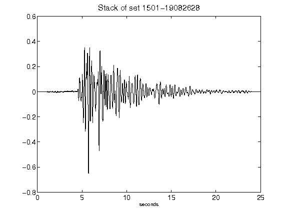](figures/1501-19082628_Stack.png)[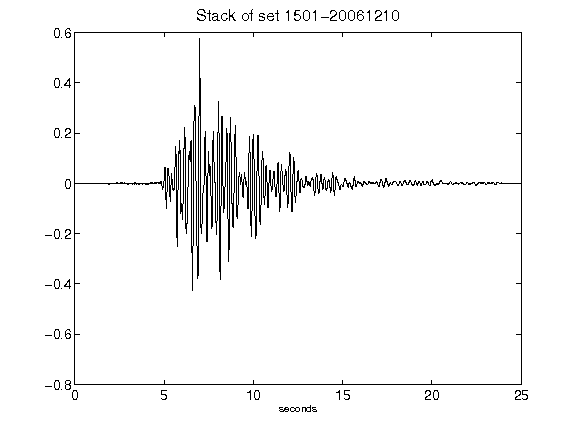](figures/1501-20061210_Stack.png)