# Repeating Earthquake Activity at RCM

## Waveforms
[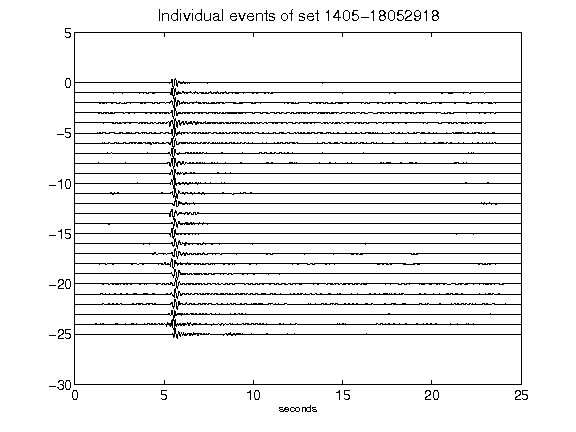](figures/1405-18052918_AllEv.png)[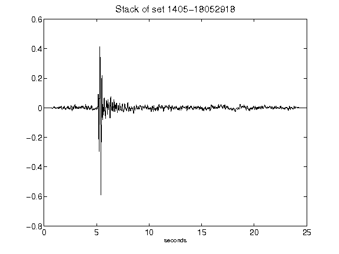](figures/1405-18052918_Stack.png)[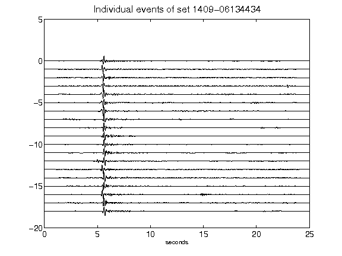](figures/1409-06134434_AllEv.png)[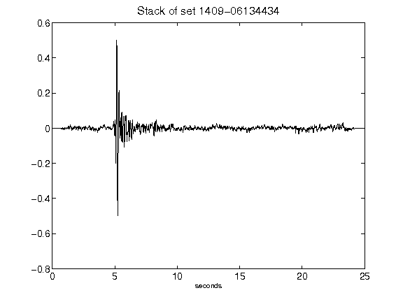](figures/1409-06134434_Stack.png)[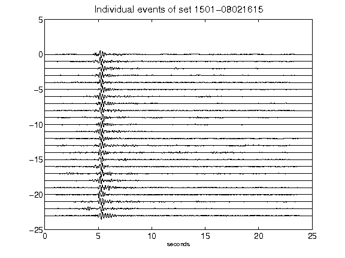](figures/1501-08021615_AllEv.png)[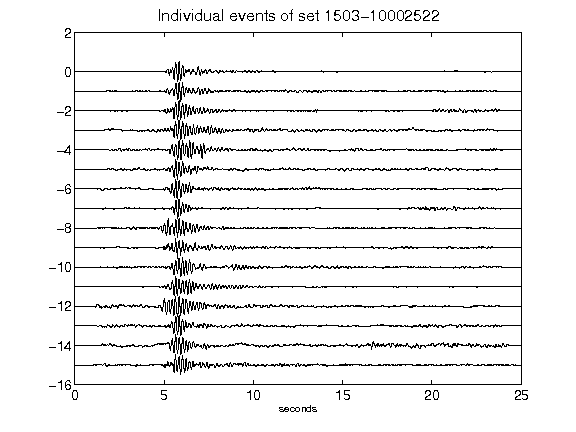](figures/1503-10002522_AllEv.png)[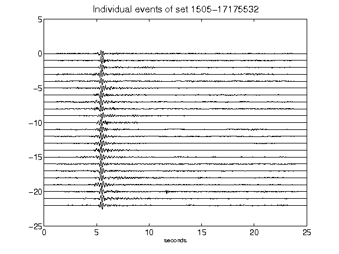](figures/1505-17175532_AllEv.png)[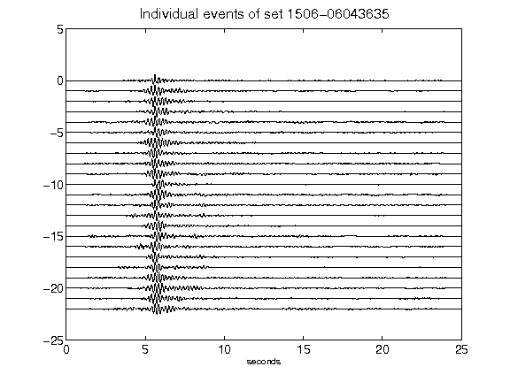](figures/1506-06043635_AllEv.png)[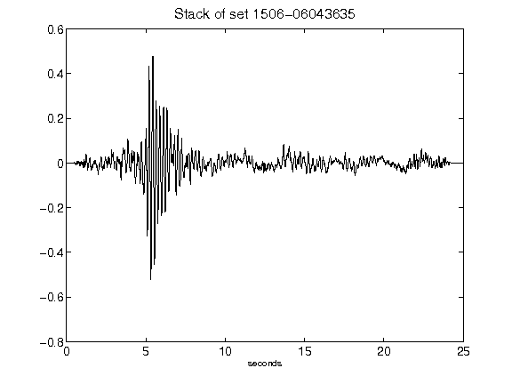](figures/1506-06043635_Stack.png)[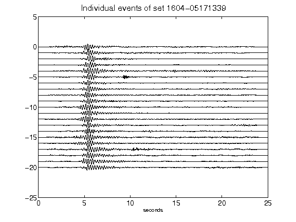](figures/1604-05171339_AllEv.png)[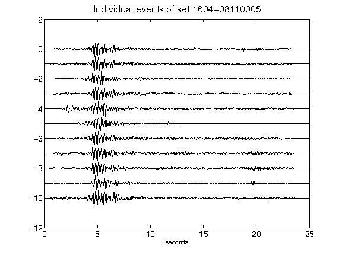](figures/1604-08110005_AllEv.png)[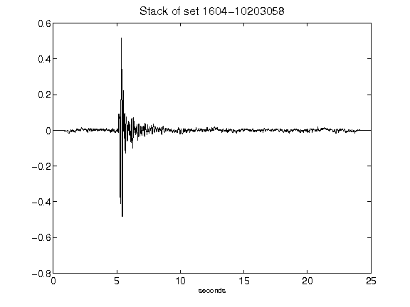](figures/1604-10203058_Stack.png)