# Repeating Earthquake Activity at RCM

## Waveforms
[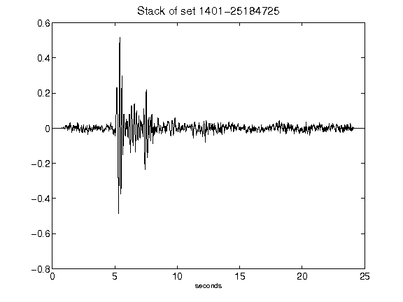](figures/1401-25184725_Stack.png)[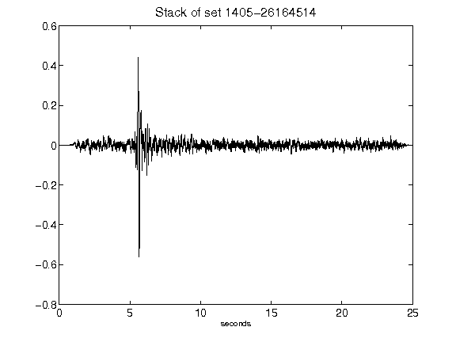](figures/1405-26164514_Stack.png)[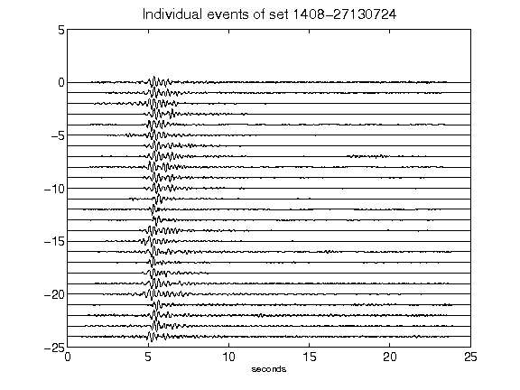](figures/1408-27130724_AllEv.png)[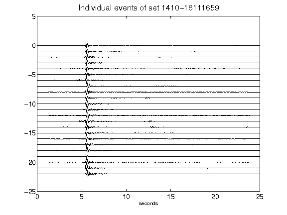](figures/1410-16111659_AllEv.png)[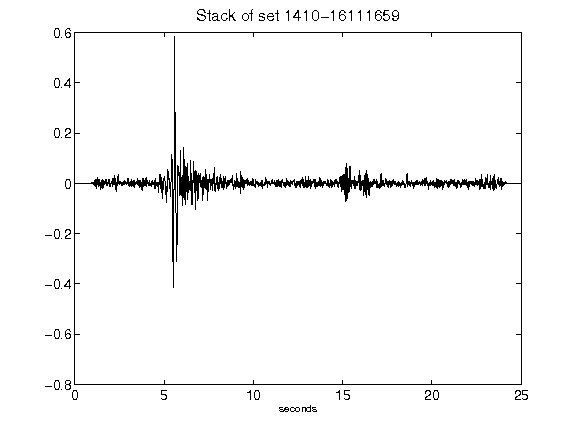](figures/1410-16111659_Stack.png)[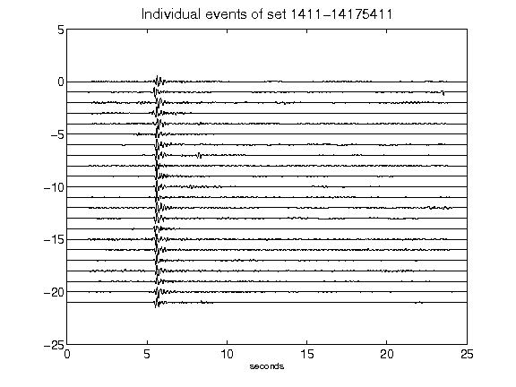](figures/1411-14175411_AllEv.png)[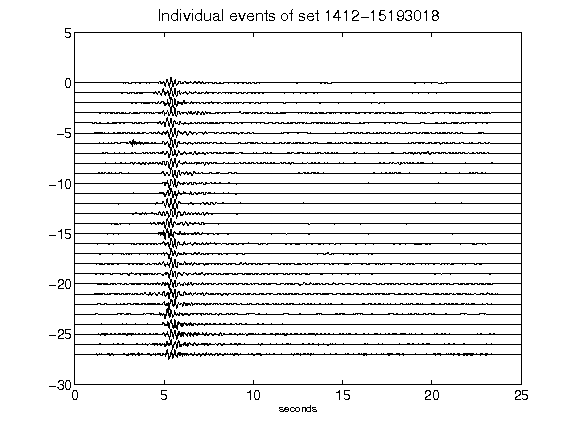](figures/1412-15193018_AllEv.png)[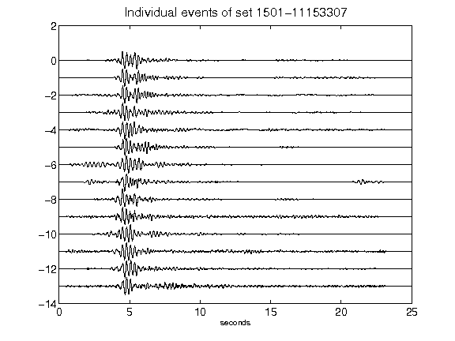](figures/1501-11153307_AllEv.png)[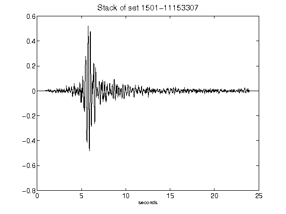](figures/1501-11153307_Stack.png)[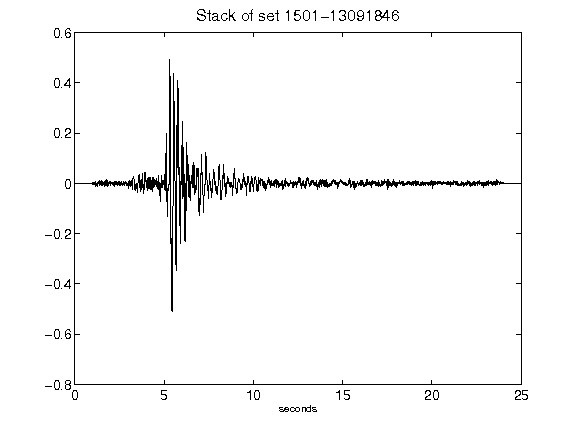](figures/1501-13091846_Stack.png)[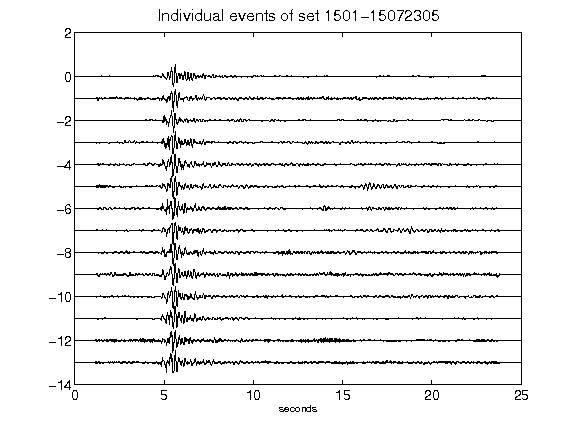](figures/1501-15072305_AllEv.png)[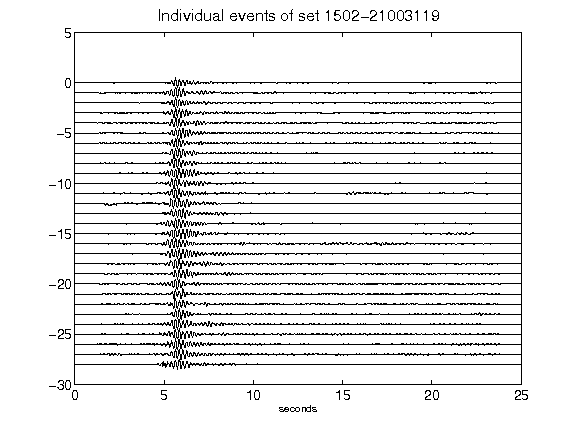](figures/1502-21003119_AllEv.png)[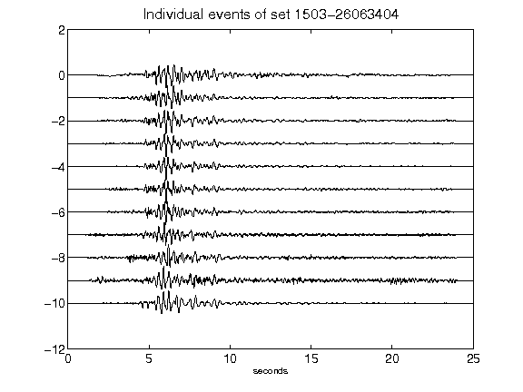](figures/1503-26063404_AllEv.png)[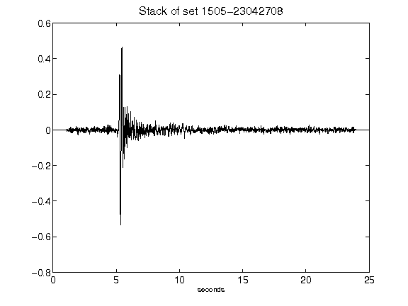](figures/1505-23042708_Stack.png)[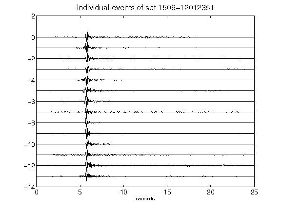](figures/1506-12012351_AllEv.png)[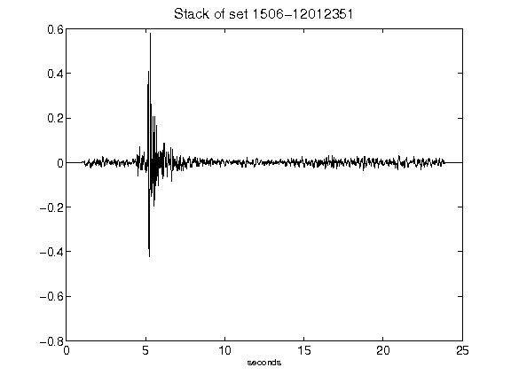](figures/1506-12012351_Stack.png)