# Repeating Earthquake Activity at RCM

## Waveforms
[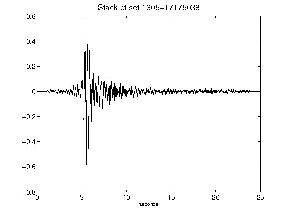](figures/1305-17175038_Stack.png)[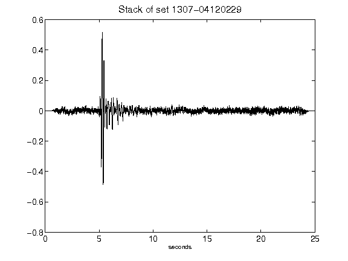](figures/1307-04120229_Stack.png)[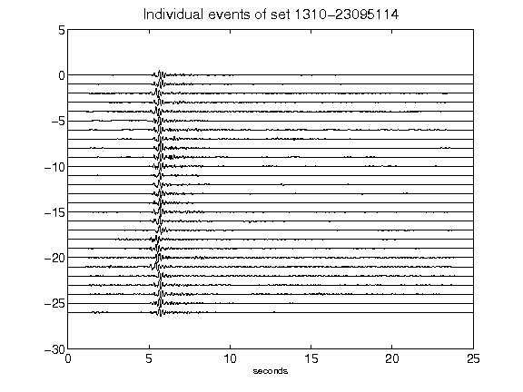](figures/1310-23095114_AllEv.png)[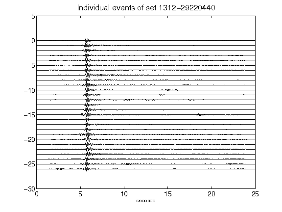](figures/1312-29220440_AllEv.png)[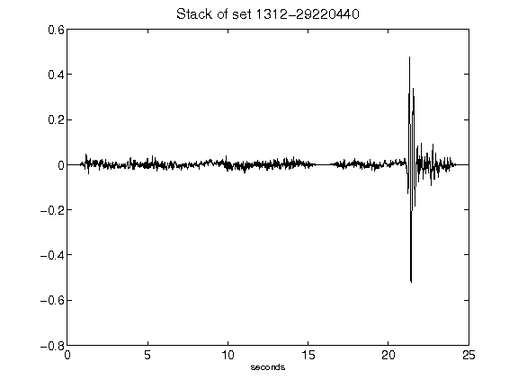](figures/1312-29220440_Stack.png)[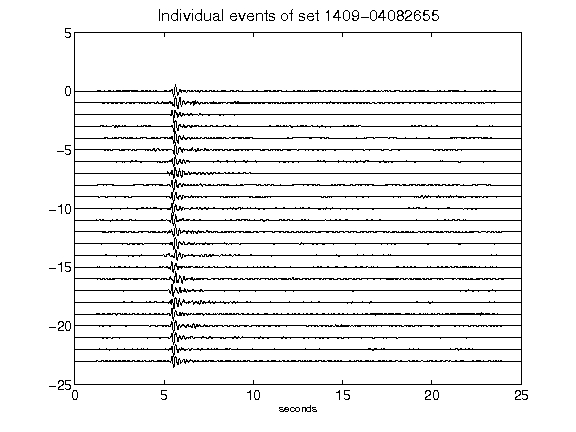](figures/1409-04082655_AllEv.png)[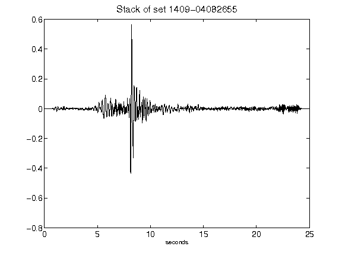](figures/1409-04082655_Stack.png)[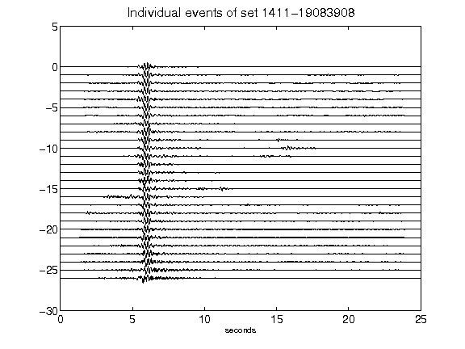](figures/1411-19083908_AllEv.png)[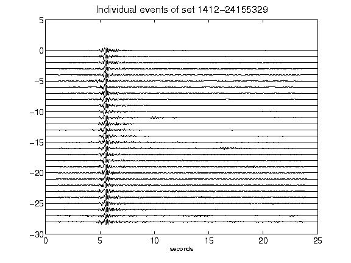](figures/1412-24155329_AllEv.png)[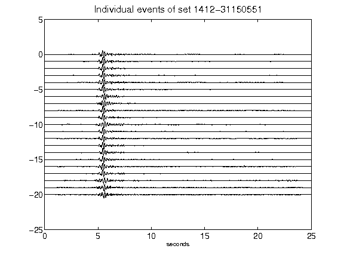](figures/1412-31150551_AllEv.png)[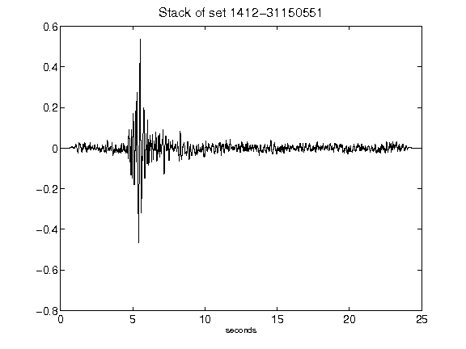](figures/1412-31150551_Stack.png)[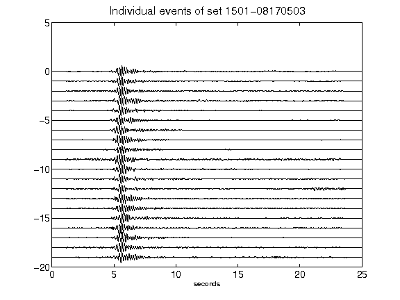](figures/1501-08170503_AllEv.png)[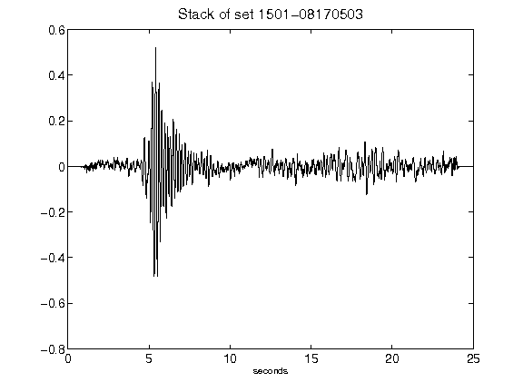](figures/1501-08170503_Stack.png)[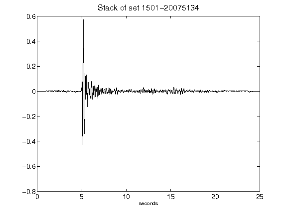](figures/1501-20075134_Stack.png)[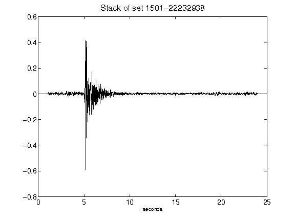](figures/1501-22232938_Stack.png)[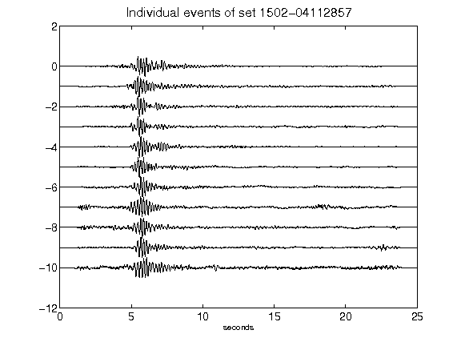](figures/1502-04112857_AllEv.png)[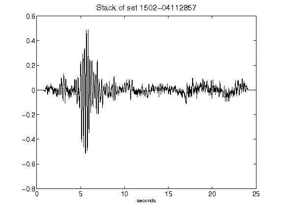](figures/1502-04112857_Stack.png)[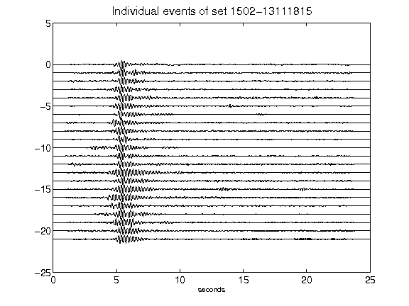](figures/1502-13111815_AllEv.png)[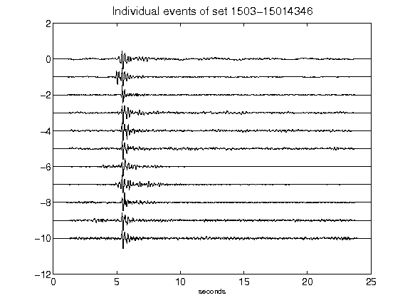](figures/1503-15014346_AllEv.png)[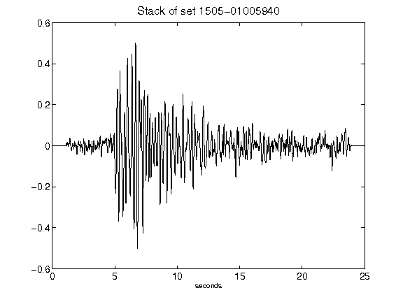](figures/1505-01005940_Stack.png)[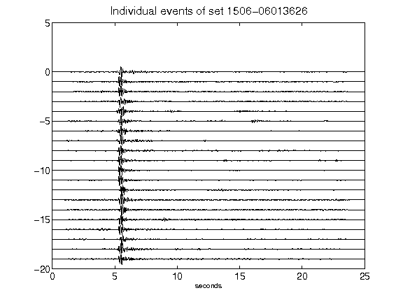](figures/1506-06013626_AllEv.png)[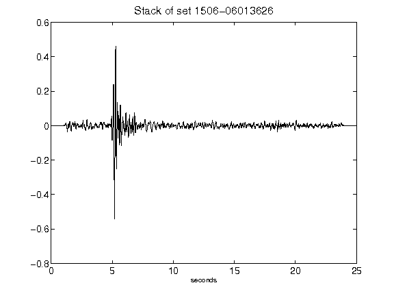](figures/1506-06013626_Stack.png)[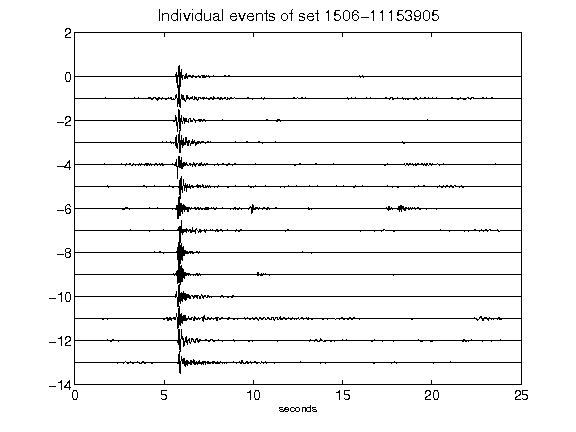](figures/1506-11153905_AllEv.png)