# Repeating Earthquake Activity at RCM

## Waveforms
[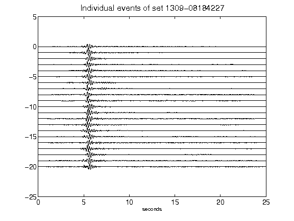](figures/1309-08184227_AllEv.png)[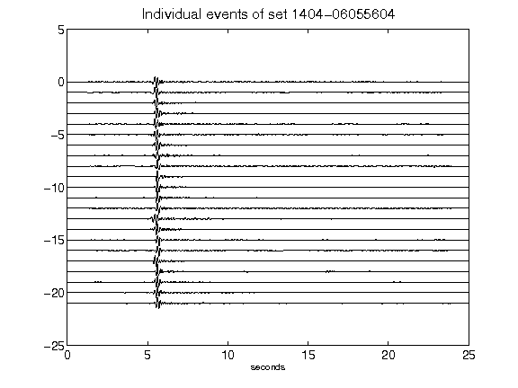](figures/1404-06055604_AllEv.png)[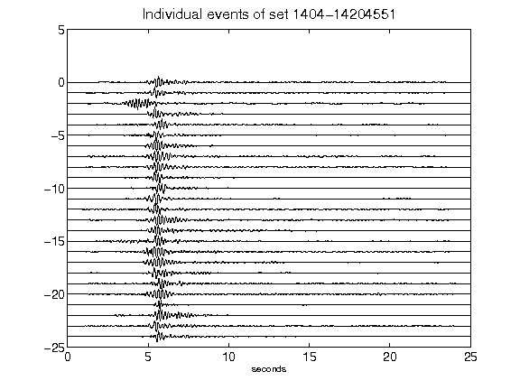](figures/1404-14204551_AllEv.png)[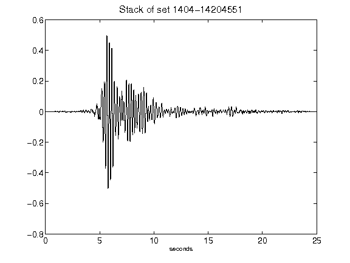](figures/1404-14204551_Stack.png)[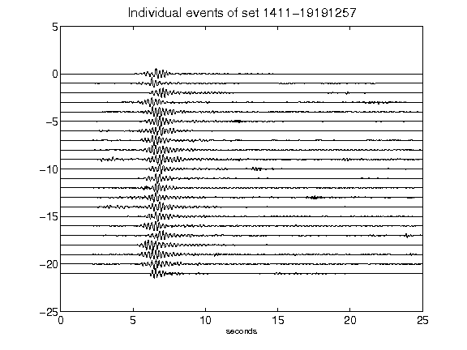](figures/1411-19191257_AllEv.png)[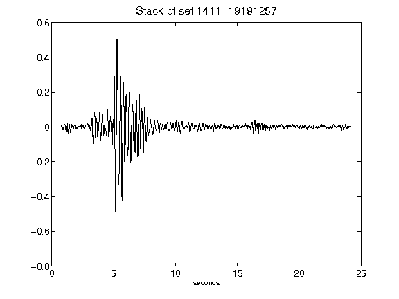](figures/1411-19191257_Stack.png)[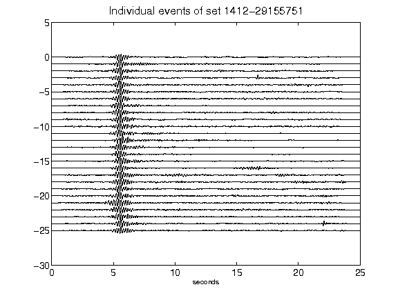](figures/1412-29155751_AllEv.png)[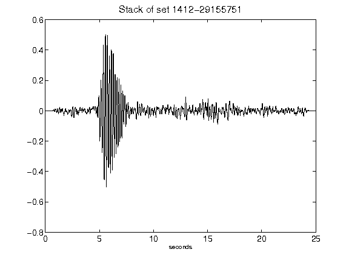](figures/1412-29155751_Stack.png)[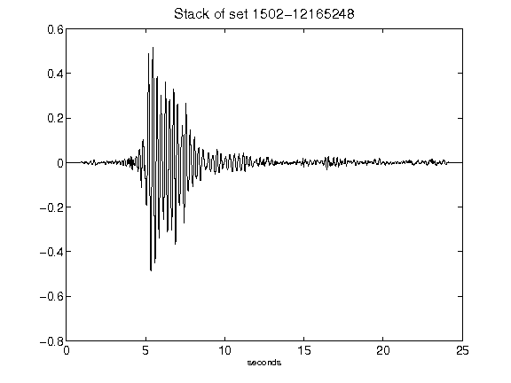](figures/1502-12165248_Stack.png)[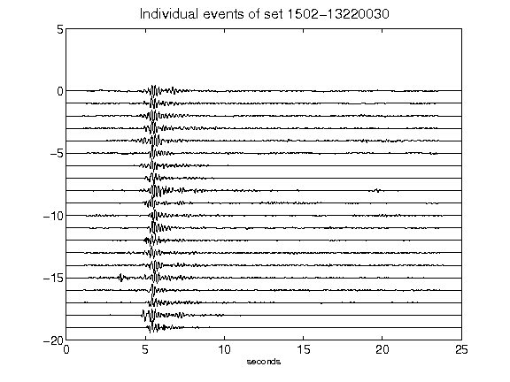](figures/1502-13220030_AllEv.png)[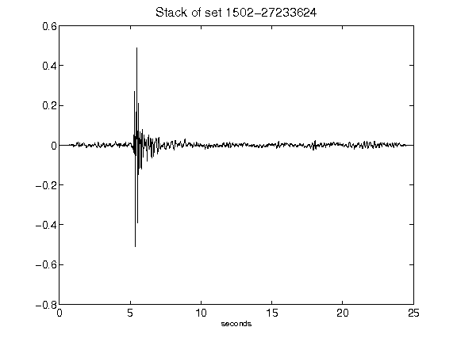](figures/1502-27233624_Stack.png)[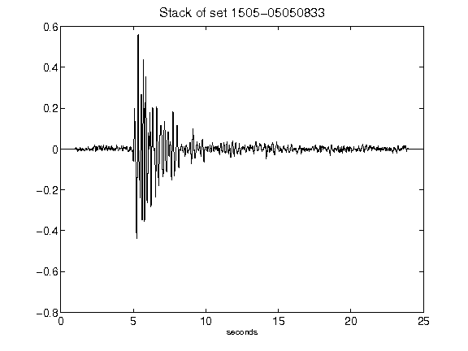](figures/1505-05050833_Stack.png)[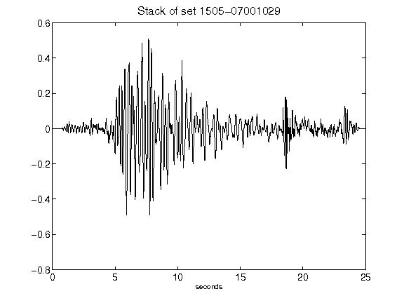](figures/1505-07001029_Stack.png)[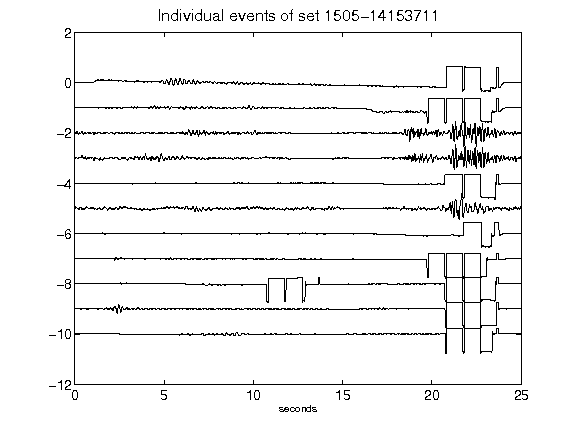](figures/1505-14153711_AllEv.png)[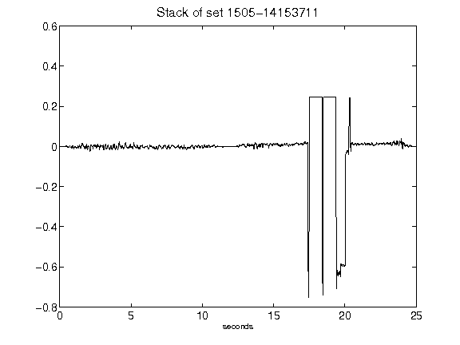](figures/1505-14153711_Stack.png)