# Repeating Earthquake Activity at RCM

## Waveforms
[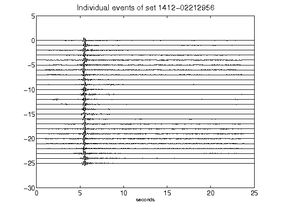](figures/1412-02212956_AllEv.png)[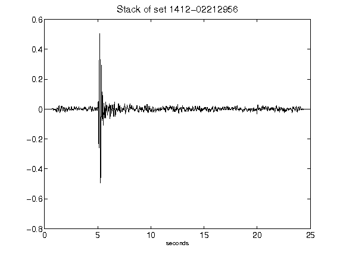](figures/1412-02212956_Stack.png)[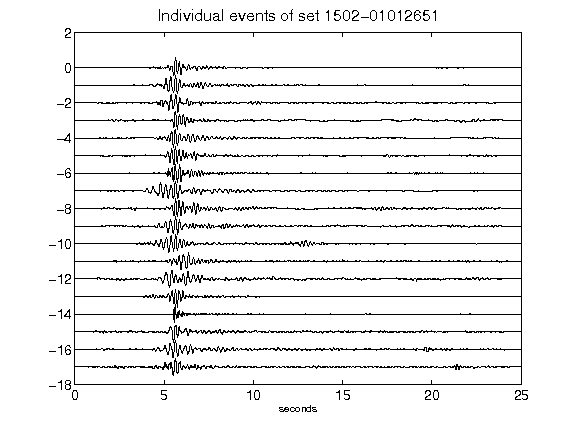](figures/1502-01012651_AllEv.png)[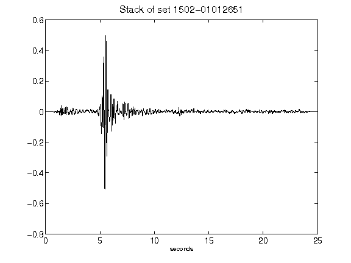](figures/1502-01012651_Stack.png)[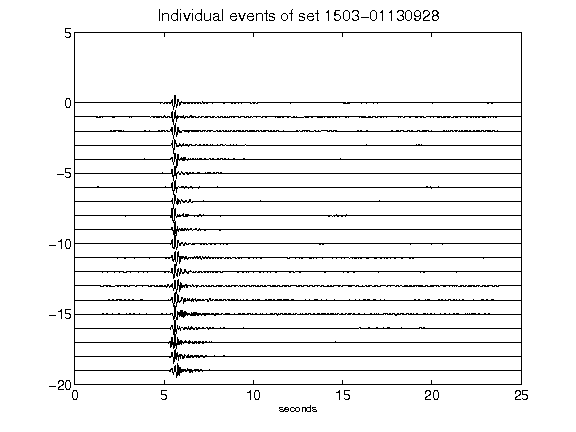](figures/1503-01130928_AllEv.png)[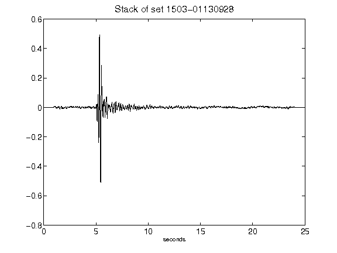](figures/1503-01130928_Stack.png)[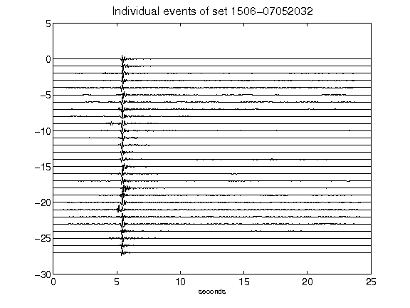](figures/1506-07052032_AllEv.png)[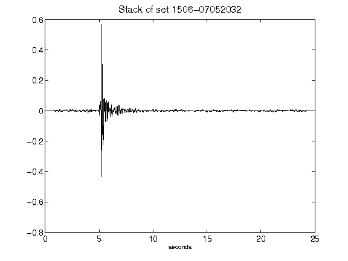](figures/1506-07052032_Stack.png)[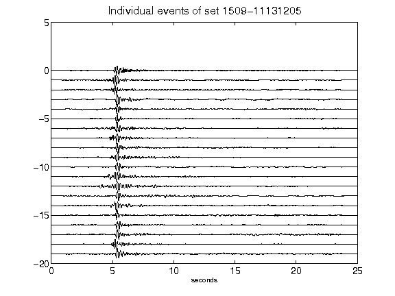](figures/1509-11131205_AllEv.png)[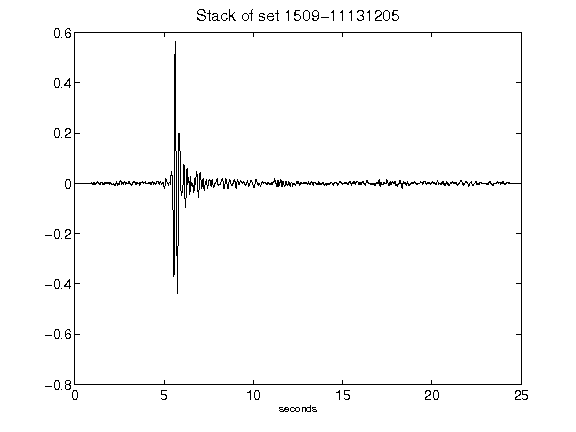](figures/1509-11131205_Stack.png)[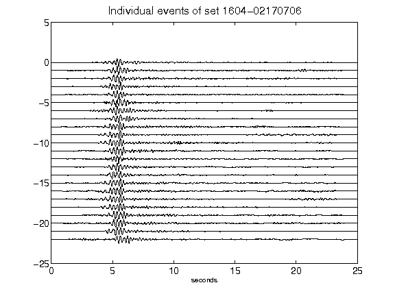](figures/1604-02170706_AllEv.png)[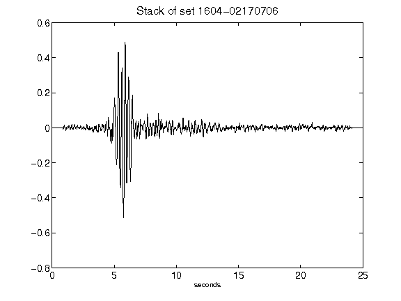](figures/1604-02170706_Stack.png)[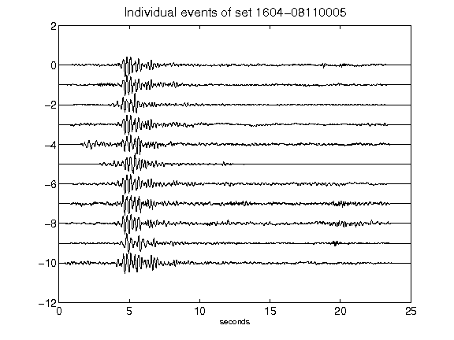](figures/1604-08110005_AllEv.png)[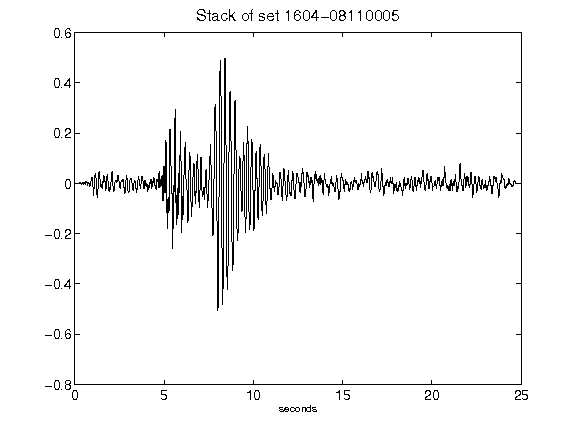](figures/1604-08110005_Stack.png)