# Repeating Earthquake Activity at RCM

## Waveforms
[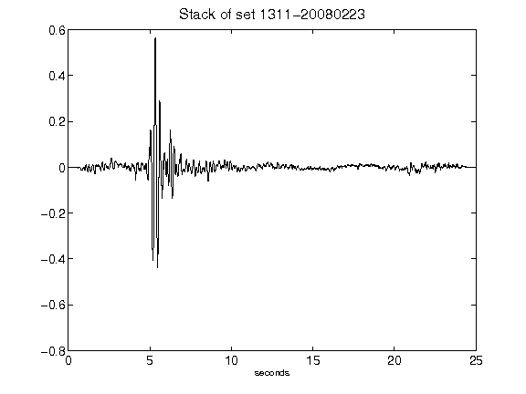](figures/1311-20080223_Stack.png)[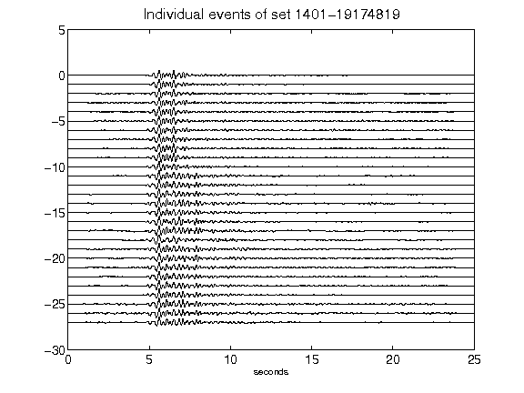](figures/1401-19174819_AllEv.png)[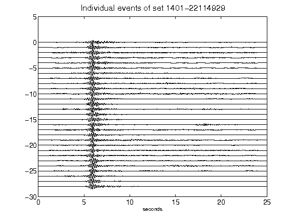](figures/1401-22114929_AllEv.png)[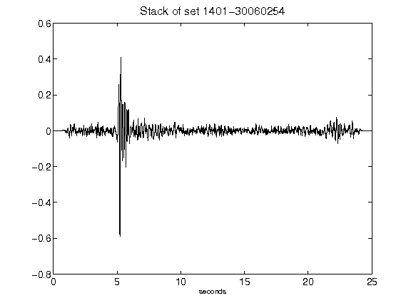](figures/1401-30060254_Stack.png)[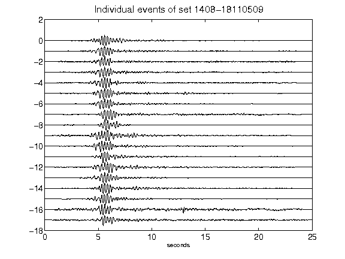](figures/1408-18110509_AllEv.png)[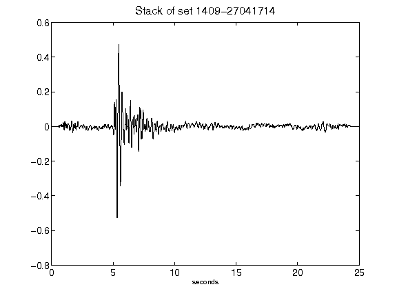](figures/1409-27041714_Stack.png)[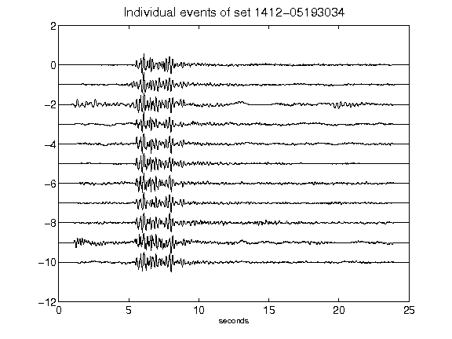](figures/1412-05193034_AllEv.png)[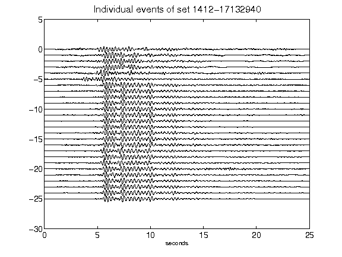](figures/1412-17132940_AllEv.png)[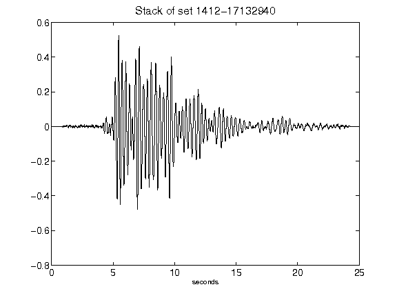](figures/1412-17132940_Stack.png)[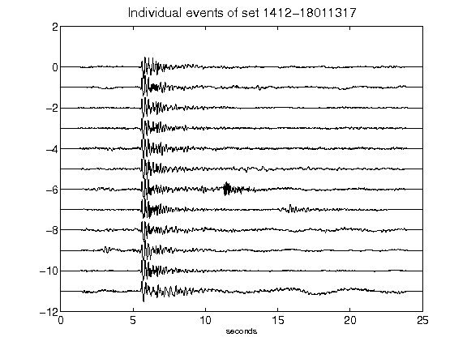](figures/1412-18011317_AllEv.png)[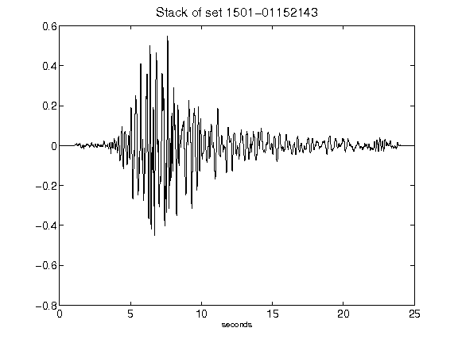](figures/1501-01152143_Stack.png)[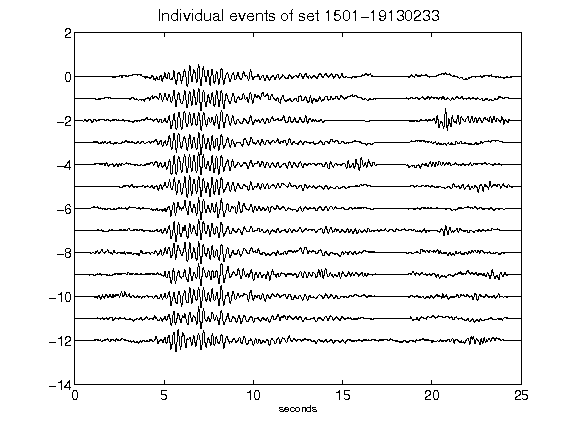](figures/1501-19130233_AllEv.png)[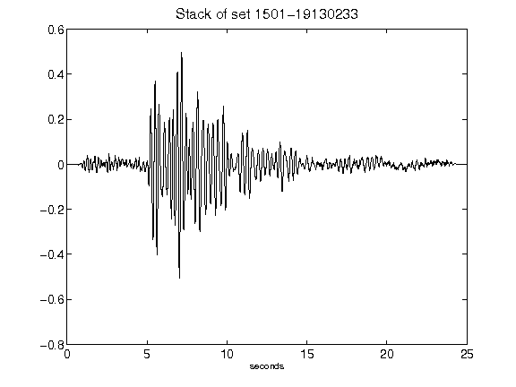](figures/1501-19130233_Stack.png)[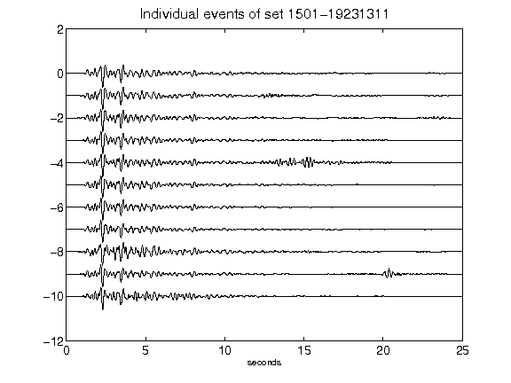](figures/1501-19231311_AllEv.png)[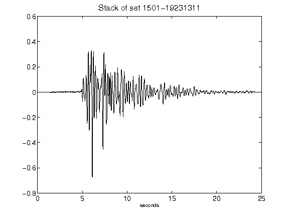](figures/1501-19231311_Stack.png)[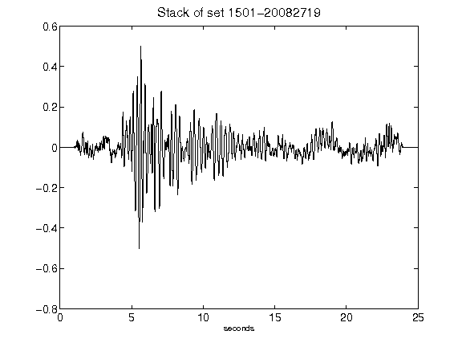](figures/1501-20082719_Stack.png)