# Repeating Earthquake Activity at RCM

## Waveforms
[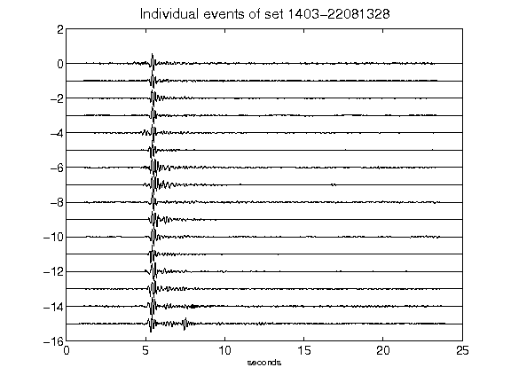](figures/1403-22081328_AllEv.png)[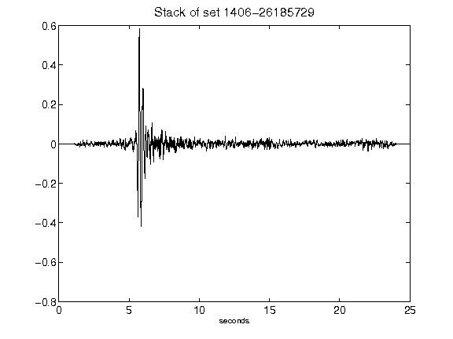](figures/1406-26185729_Stack.png)[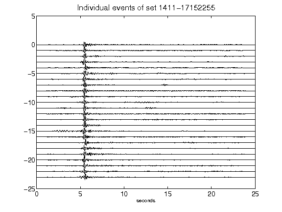](figures/1411-17152255_AllEv.png)[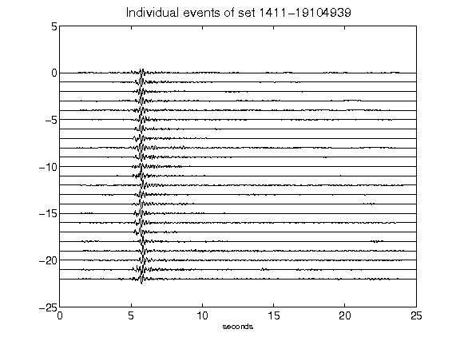](figures/1411-19104939_AllEv.png)[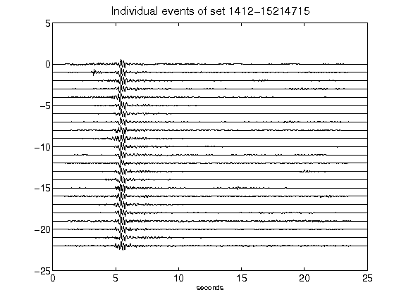](figures/1412-15214715_AllEv.png)[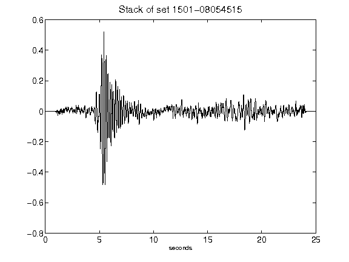](figures/1501-08054515_Stack.png)[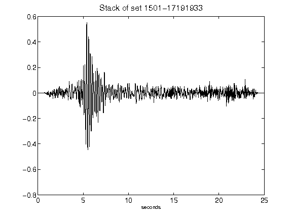](figures/1501-17191933_Stack.png)[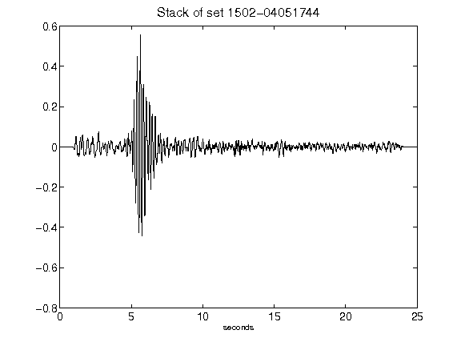](figures/1502-04051744_Stack.png)[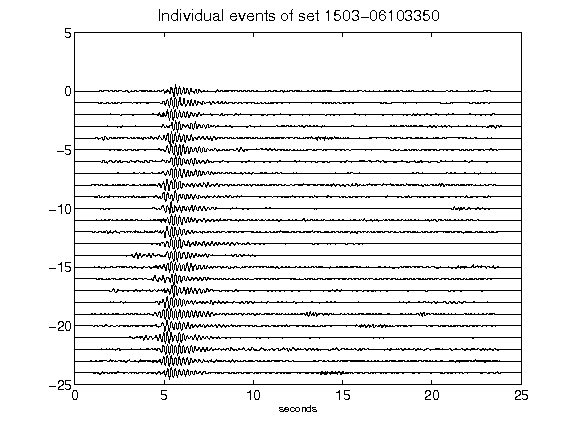](figures/1503-06103350_AllEv.png)[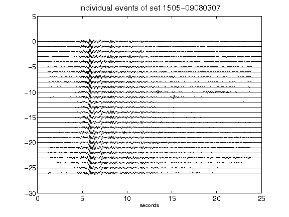](figures/1505-09080307_AllEv.png)[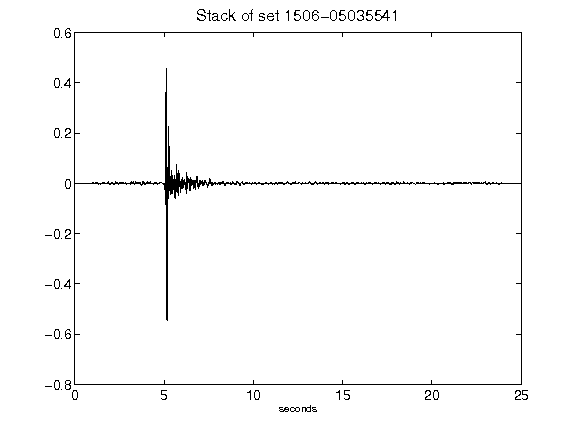](figures/1506-05035541_Stack.png)