# Repeating Earthquake Activity at RCM

## Waveforms
[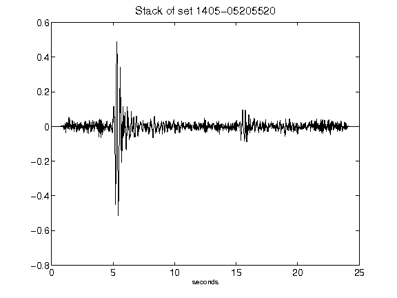](figures/1405-05205520_Stack.png)[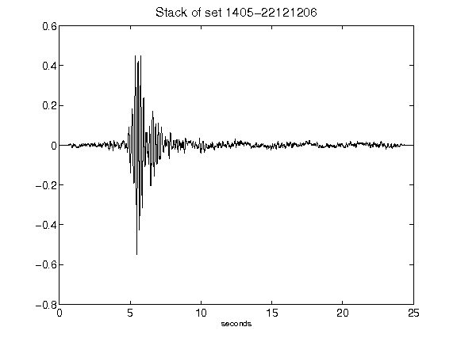](figures/1405-22121206_Stack.png)[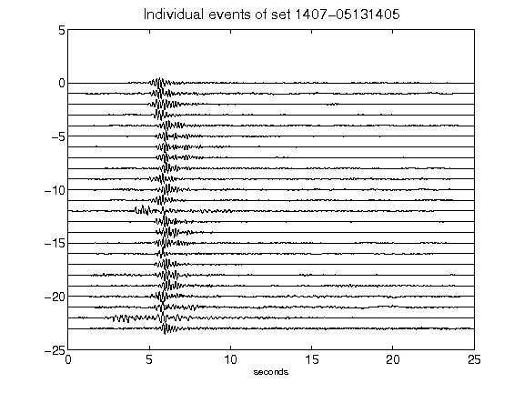](figures/1407-05131405_AllEv.png)[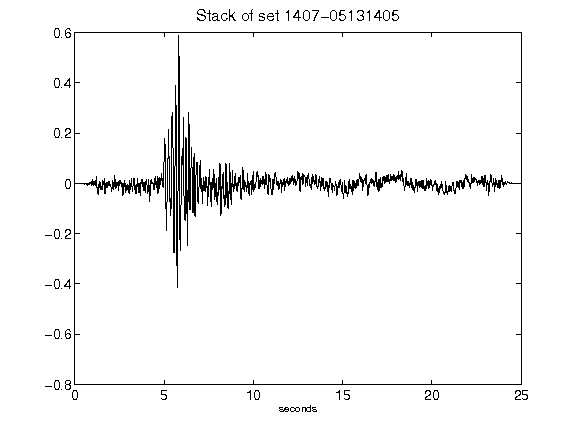](figures/1407-05131405_Stack.png)[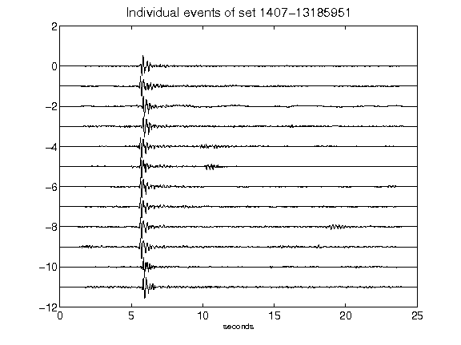](figures/1407-13185951_AllEv.png)[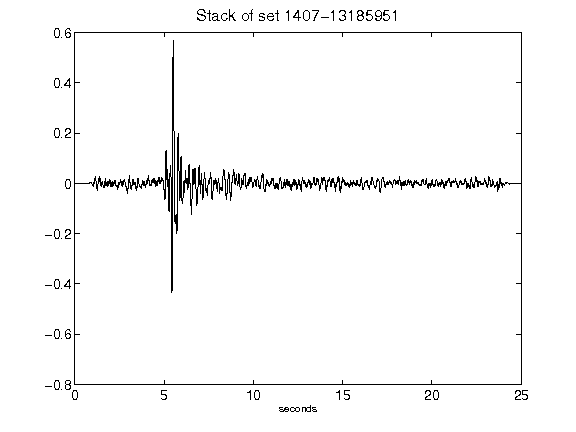](figures/1407-13185951_Stack.png)[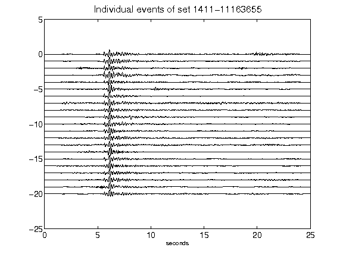](figures/1411-11163655_AllEv.png)[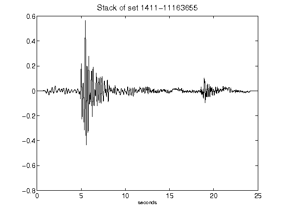](figures/1411-11163655_Stack.png)[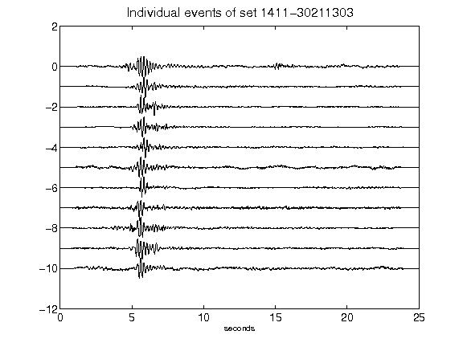](figures/1411-30211303_AllEv.png)[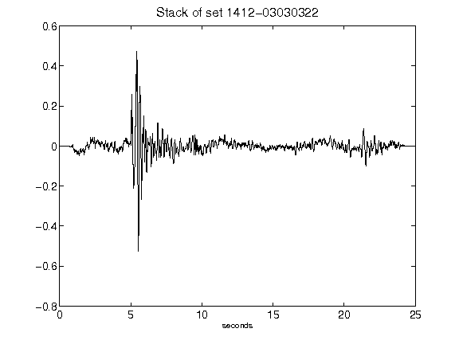](figures/1412-03030322_Stack.png)[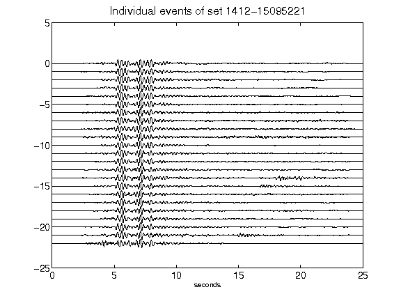](figures/1412-15095221_AllEv.png)[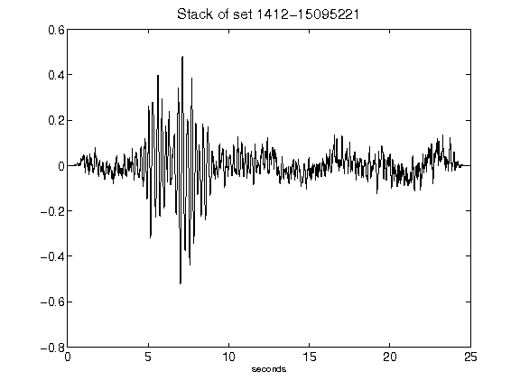](figures/1412-15095221_Stack.png)[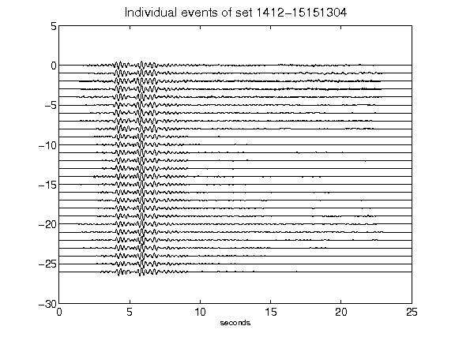](figures/1412-15151304_AllEv.png)[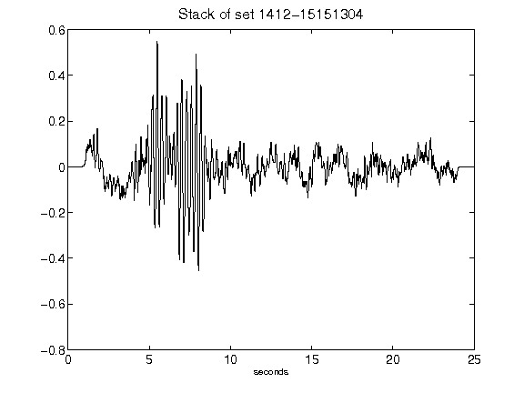](figures/1412-15151304_Stack.png)[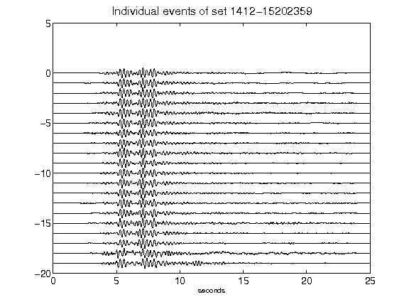](figures/1412-15202359_AllEv.png)[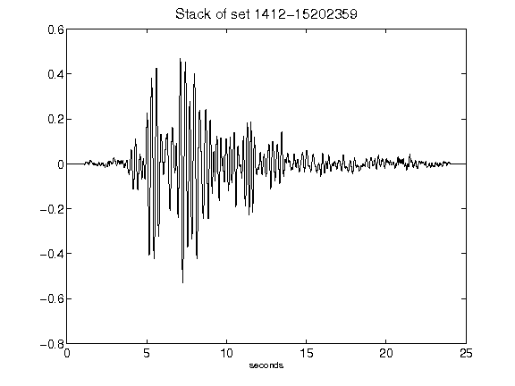](figures/1412-15202359_Stack.png)[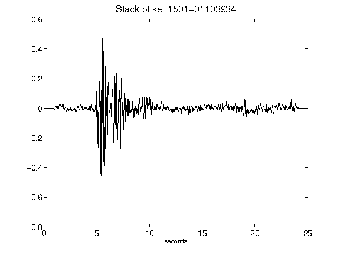](figures/1501-01103934_Stack.png)[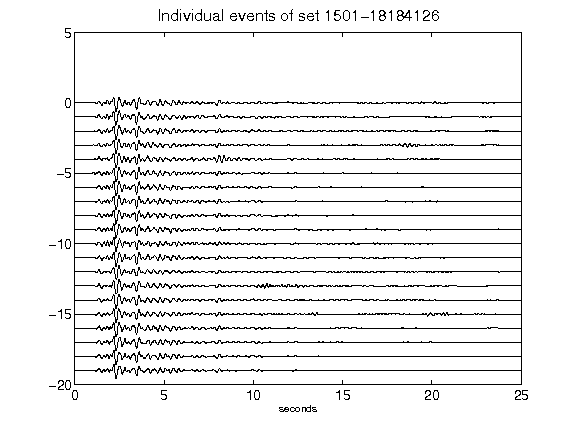](figures/1501-18184126_AllEv.png)[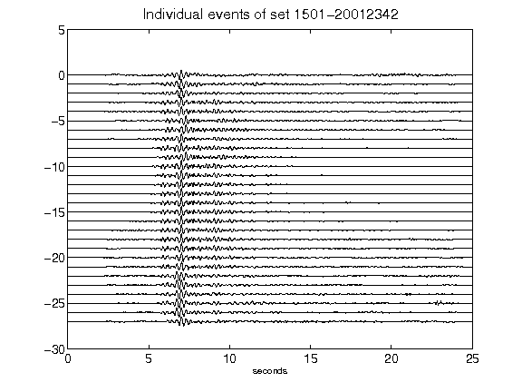](figures/1501-20012342_AllEv.png)[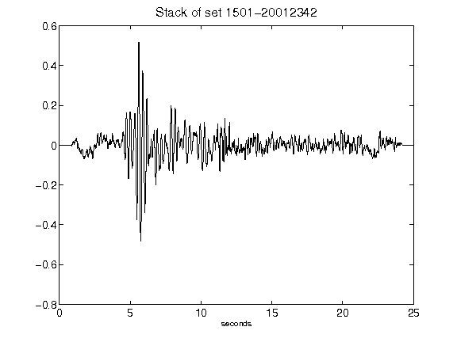](figures/1501-20012342_Stack.png)[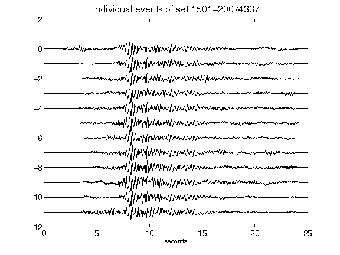](figures/1501-20074337_AllEv.png)[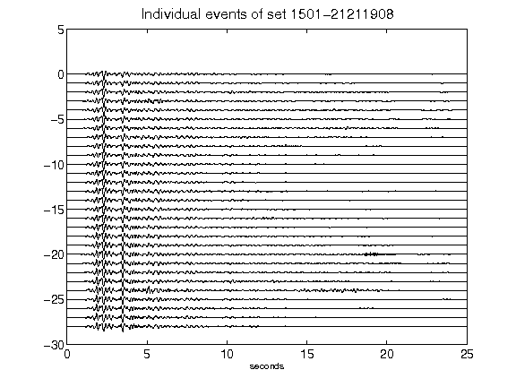](figures/1501-21211908_AllEv.png)