# Repeating Earthquake Activity at RCM

## Waveforms
[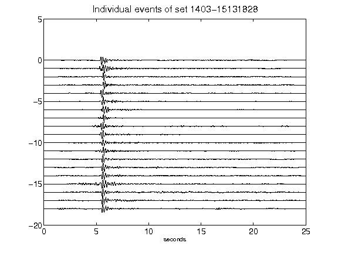](figures/1403-15131828_AllEv.png)[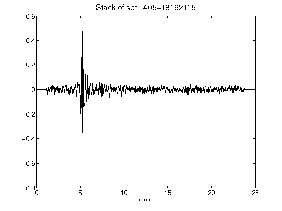](figures/1405-18192115_Stack.png)[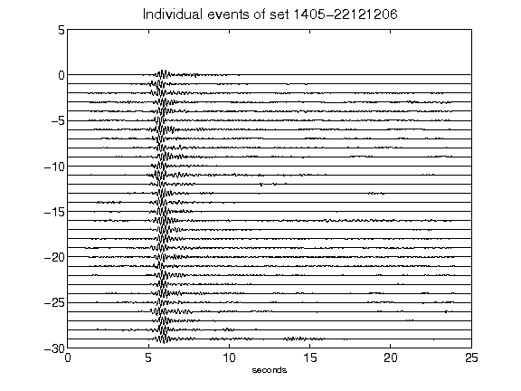](figures/1405-22121206_AllEv.png)[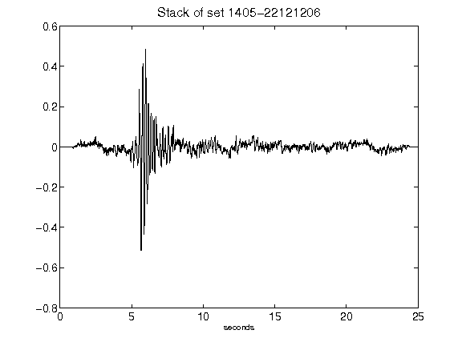](figures/1405-22121206_Stack.png)[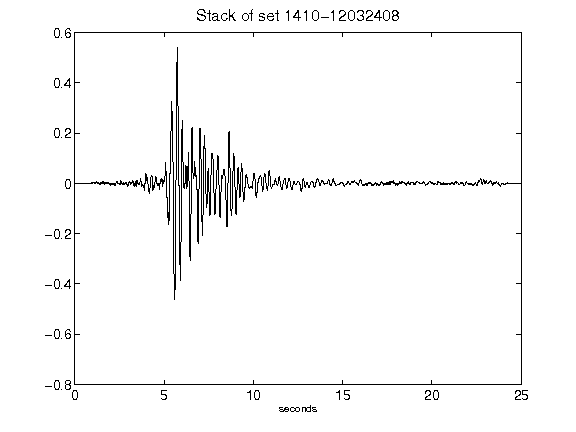](figures/1410-12032408_Stack.png)[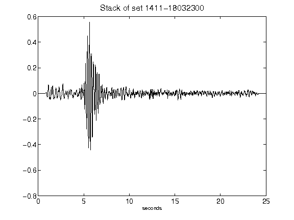](figures/1411-18032300_Stack.png)[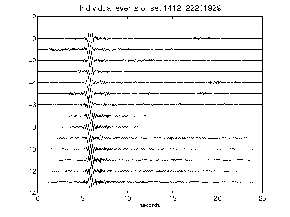](figures/1412-22201929_AllEv.png)[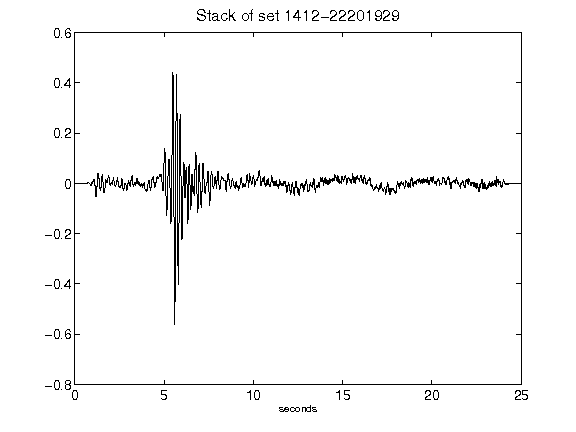](figures/1412-22201929_Stack.png)[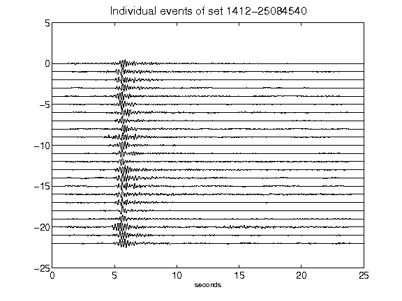](figures/1412-25084540_AllEv.png)[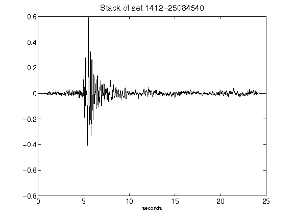](figures/1412-25084540_Stack.png)[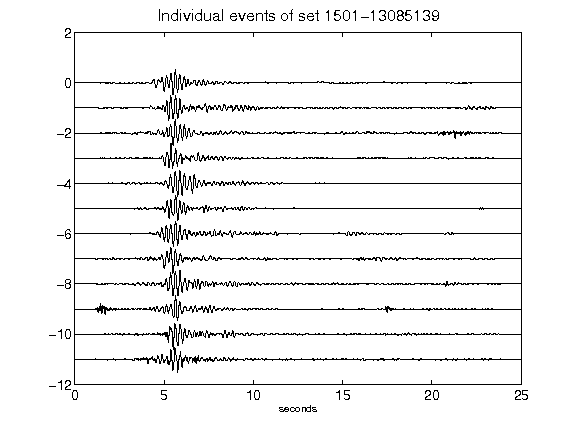](figures/1501-13085139_AllEv.png)[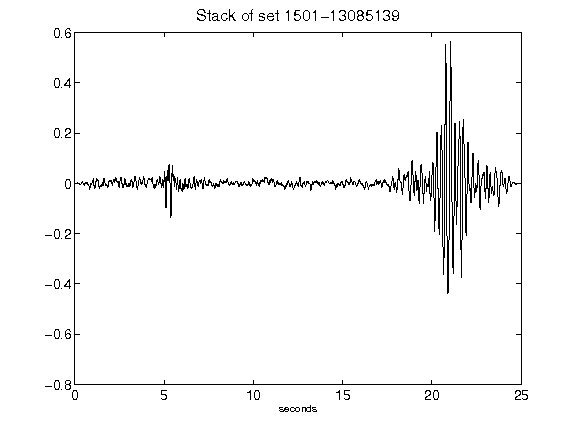](figures/1501-13085139_Stack.png)[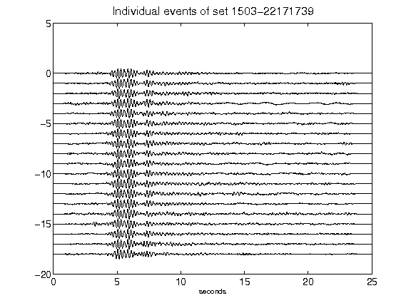](figures/1503-22171739_AllEv.png)[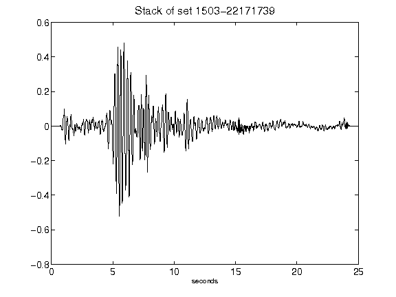](figures/1503-22171739_Stack.png)