# Repeating Earthquake Activity at RCM

## Waveforms
[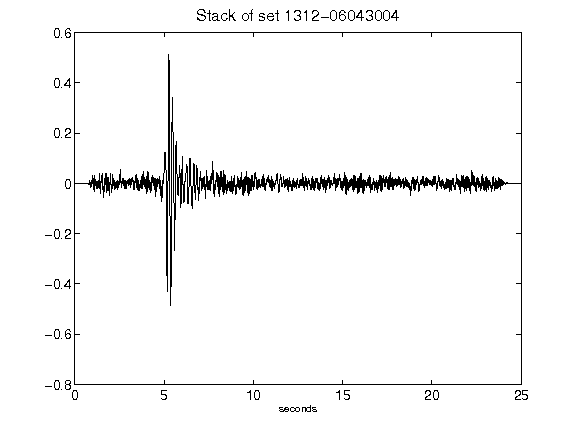](figures/1312-06043004_Stack.png)[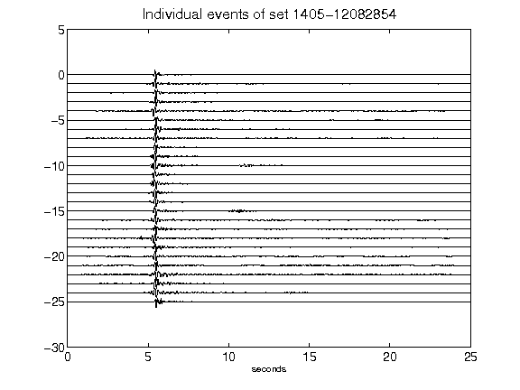](figures/1405-12082854_AllEv.png)[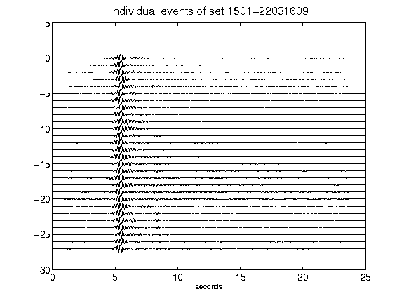](figures/1501-22031609_AllEv.png)[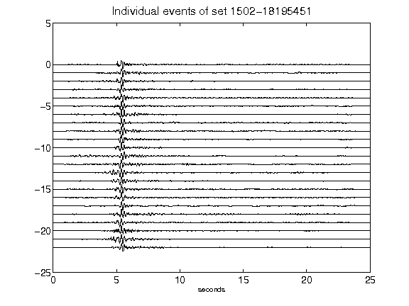](figures/1502-18195451_AllEv.png)[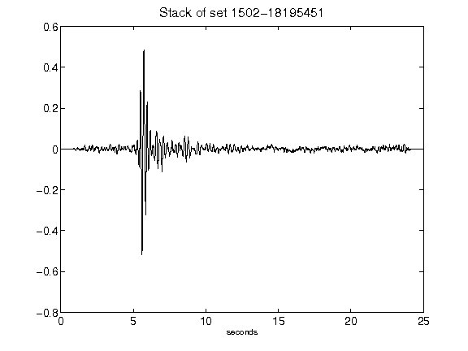](figures/1502-18195451_Stack.png)[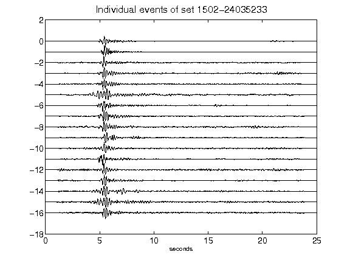](figures/1502-24035233_AllEv.png)[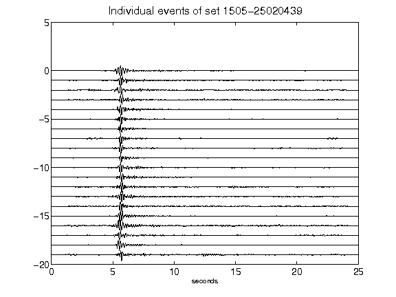](figures/1505-25020439_AllEv.png)[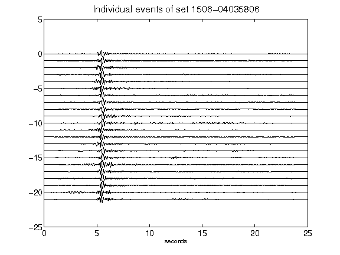](figures/1506-04035806_AllEv.png)[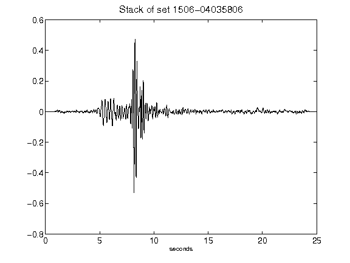](figures/1506-04035806_Stack.png)[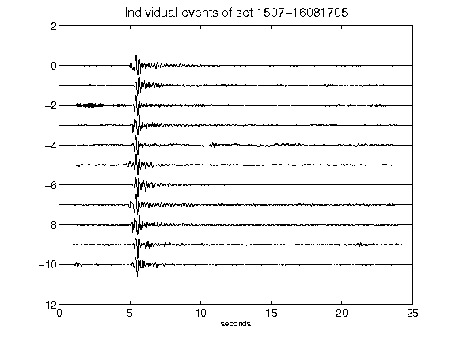](figures/1507-16081705_AllEv.png)[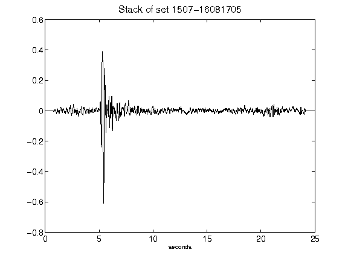](figures/1507-16081705_Stack.png)[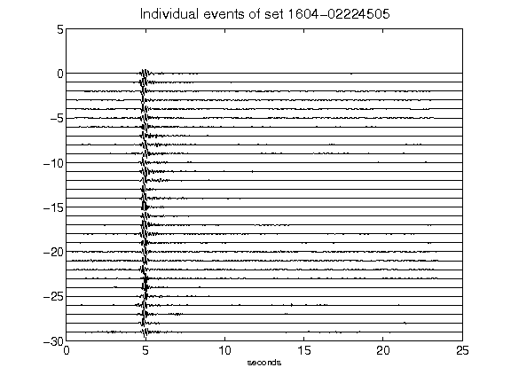](figures/1604-02224505_AllEv.png)[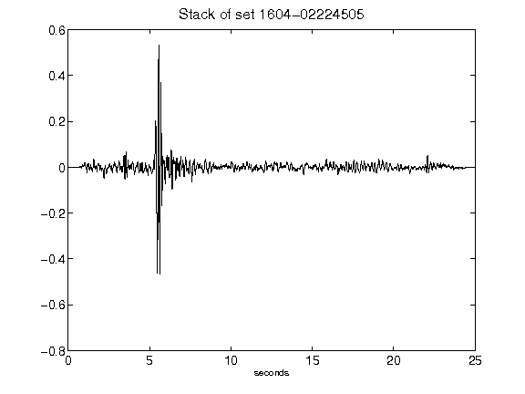](figures/1604-02224505_Stack.png)[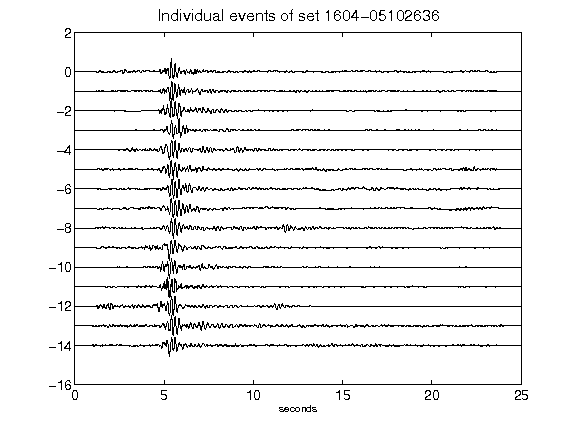](figures/1604-05102636_AllEv.png)[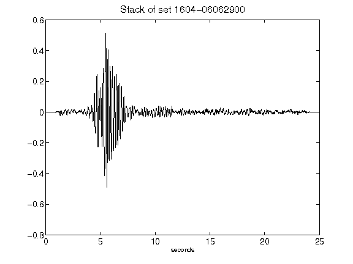](figures/1604-06062900_Stack.png)[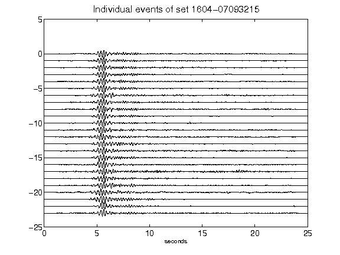](figures/1604-07093215_AllEv.png)[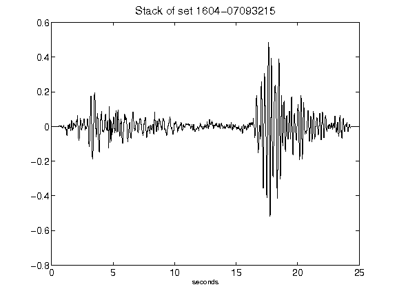](figures/1604-07093215_Stack.png)[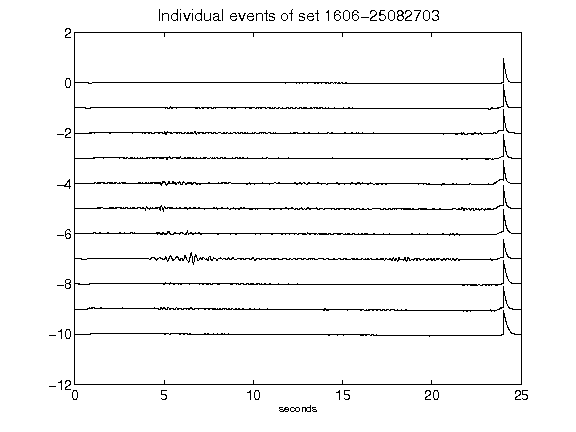](figures/1606-25082703_AllEv.png)[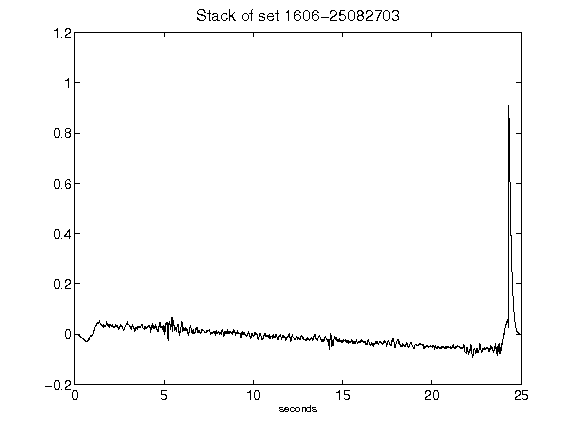](figures/1606-25082703_Stack.png)