# Repeating Earthquake Activity at RCM

## Waveforms
[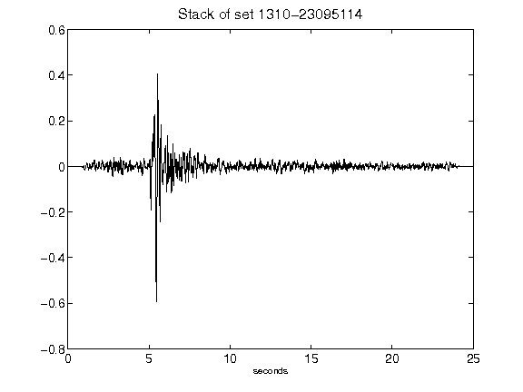](figures/1310-23095114_Stack.png)[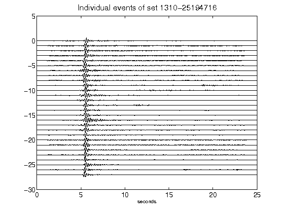](figures/1310-25194716_AllEv.png)[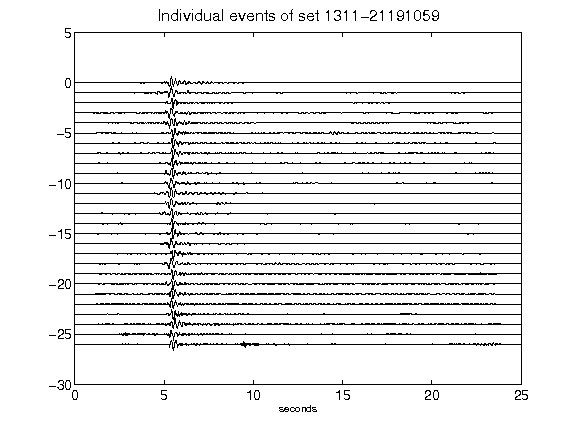](figures/1311-21191059_AllEv.png)[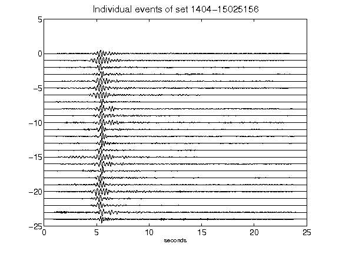](figures/1404-15025156_AllEv.png)[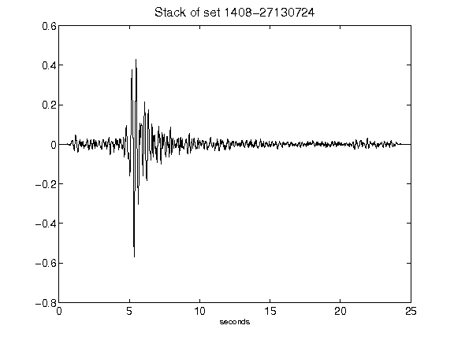](figures/1408-27130724_Stack.png)[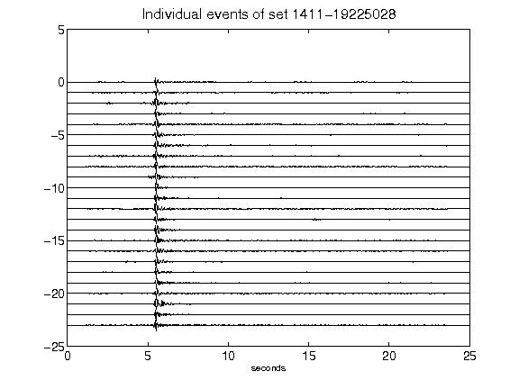](figures/1411-19225028_AllEv.png)[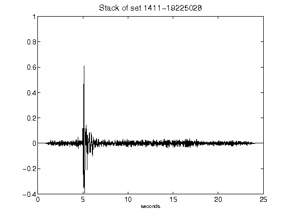](figures/1411-19225028_Stack.png)[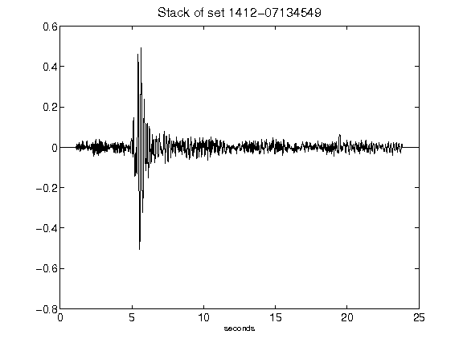](figures/1412-07134549_Stack.png)[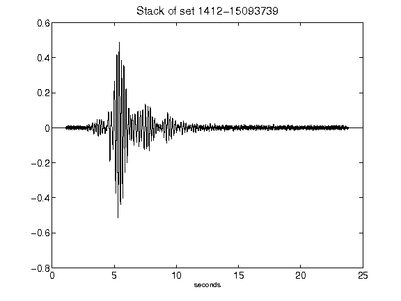](figures/1412-15093739_Stack.png)[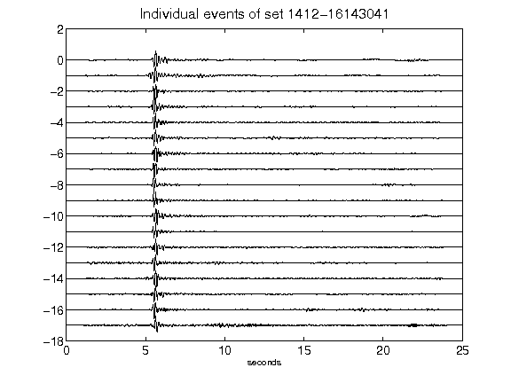](figures/1412-16143041_AllEv.png)[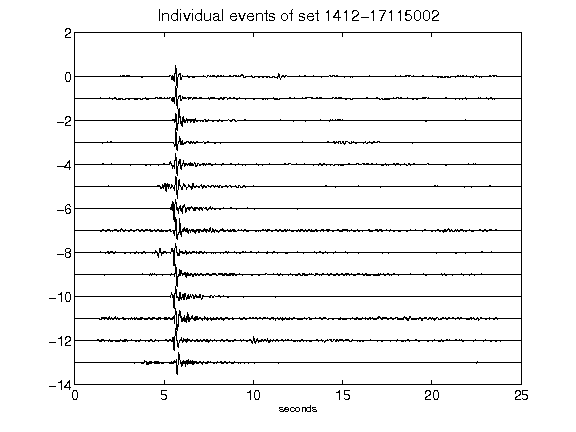](figures/1412-17115002_AllEv.png)[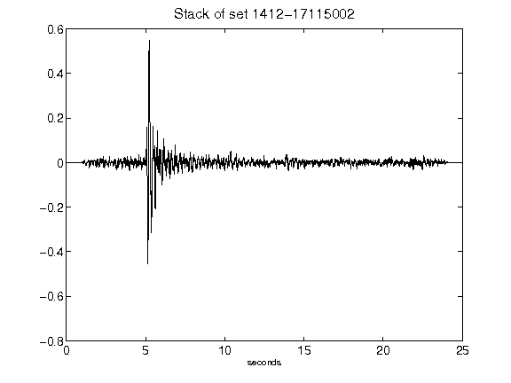](figures/1412-17115002_Stack.png)[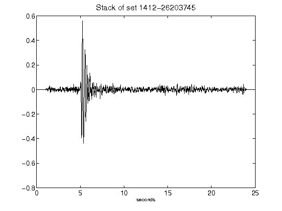](figures/1412-26203745_Stack.png)[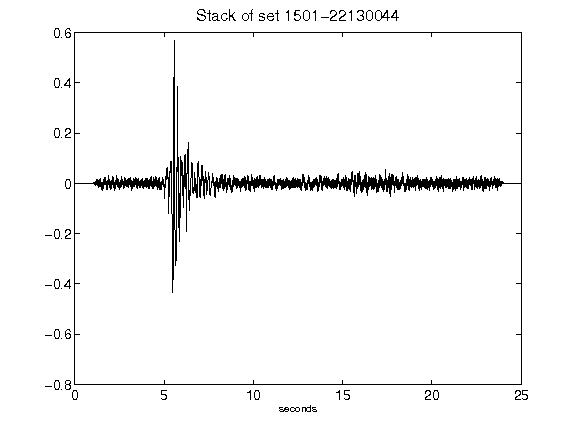](figures/1501-22130044_Stack.png)[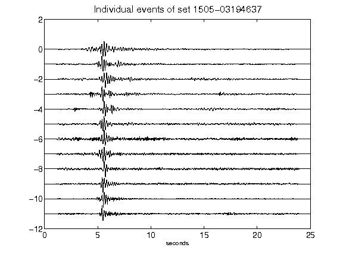](figures/1505-03194637_AllEv.png)[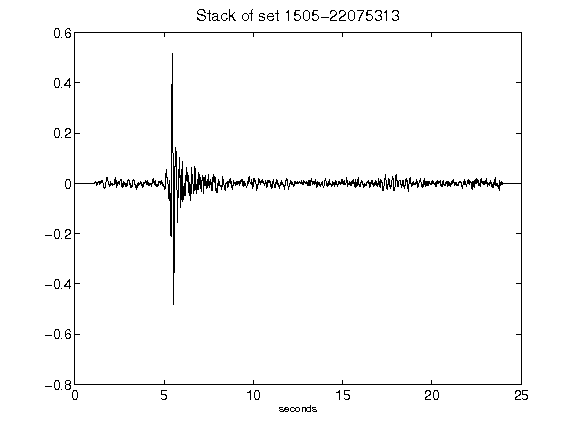](figures/1505-22075313_Stack.png)