# Repeating Earthquake Activity at RCM

## Waveforms
[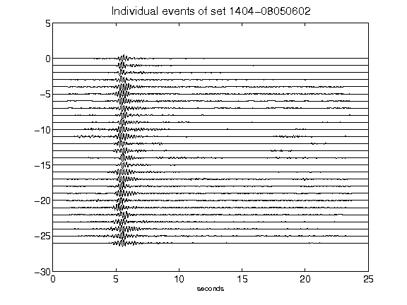](figures/1404-08050602_AllEv.png)[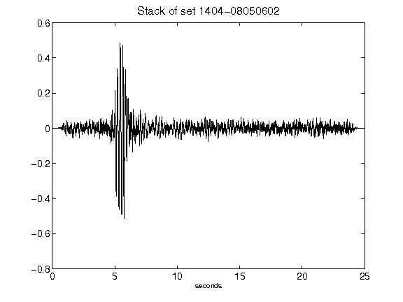](figures/1404-08050602_Stack.png)[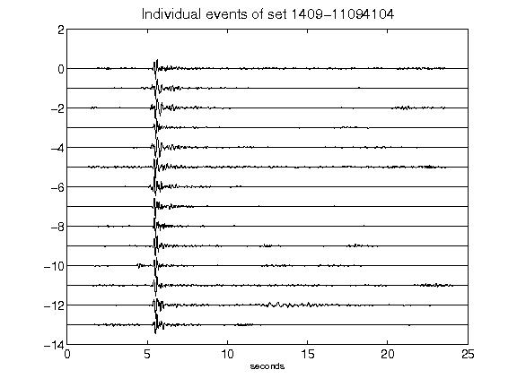](figures/1409-11094104_AllEv.png)[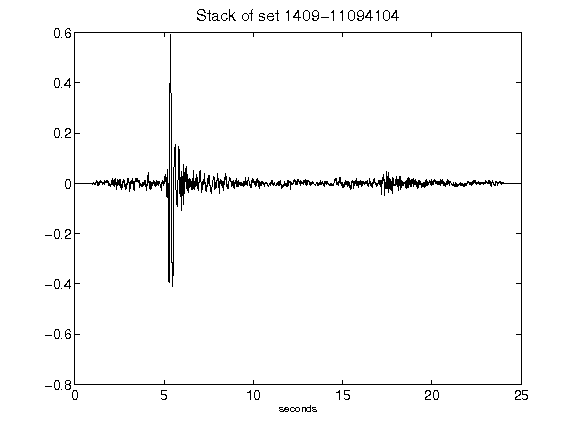](figures/1409-11094104_Stack.png)[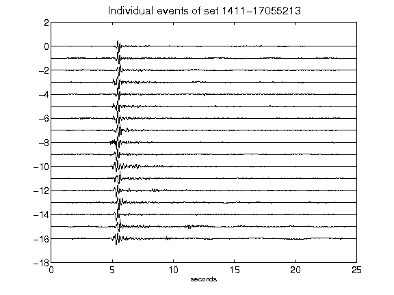](figures/1411-17055213_AllEv.png)[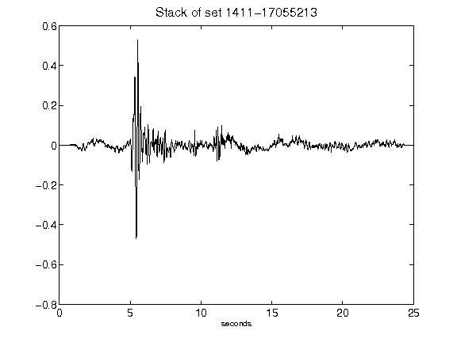](figures/1411-17055213_Stack.png)[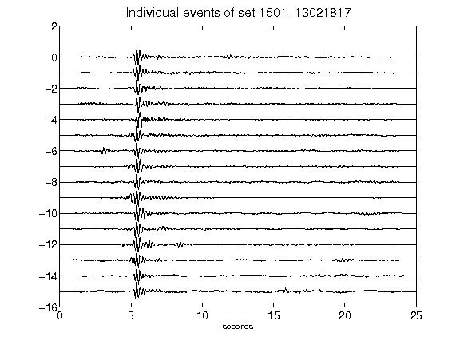](figures/1501-13021817_AllEv.png)[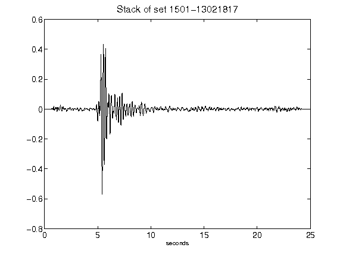](figures/1501-13021817_Stack.png)[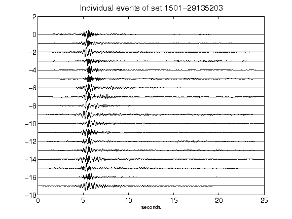](figures/1501-29135203_AllEv.png)[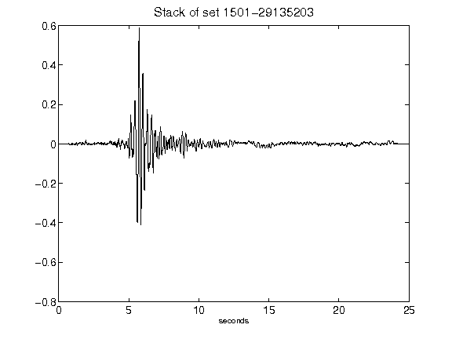](figures/1501-29135203_Stack.png)[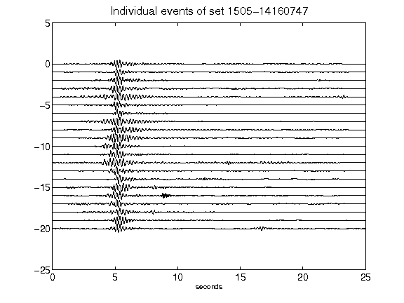](figures/1505-14160747_AllEv.png)[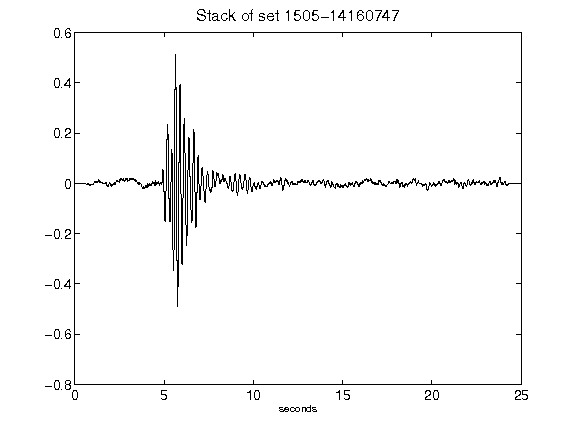](figures/1505-14160747_Stack.png)[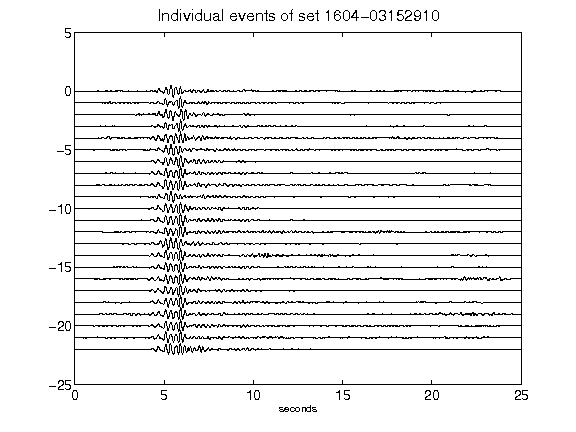](figures/1604-03152910_AllEv.png)[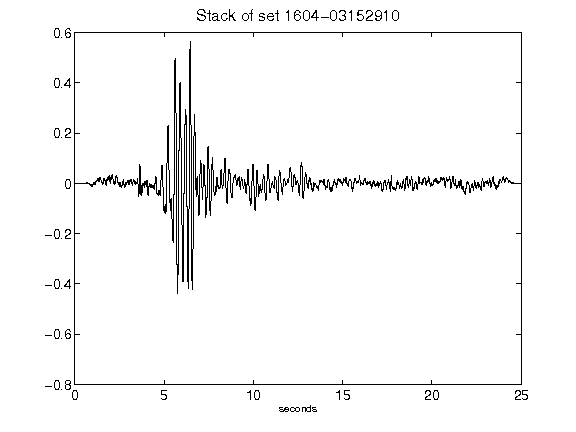](figures/1604-03152910_Stack.png)[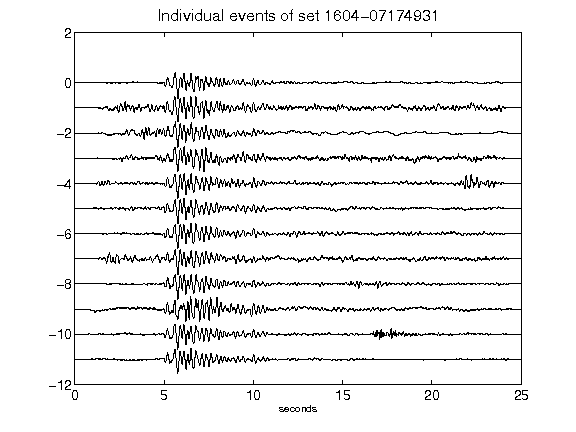](figures/1604-07174931_AllEv.png)[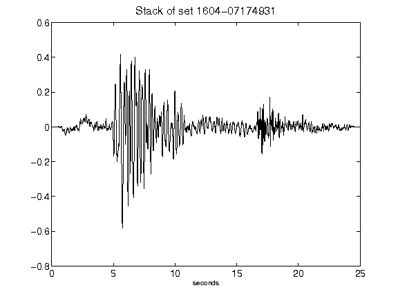](figures/1604-07174931_Stack.png)