# Repeating Earthquake Activity at RCM

## Waveforms
[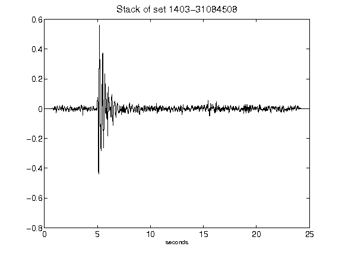](figures/1403-31084508_Stack.png)[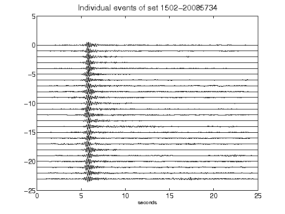](figures/1502-20085734_AllEv.png)[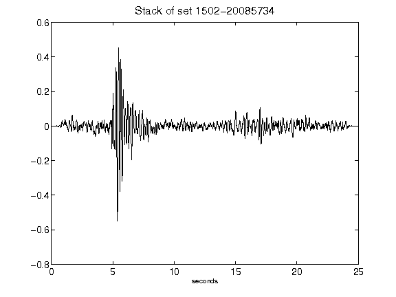](figures/1502-20085734_Stack.png)[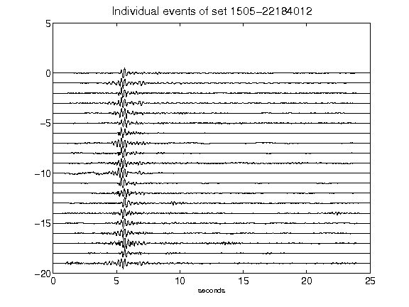](figures/1505-22184012_AllEv.png)[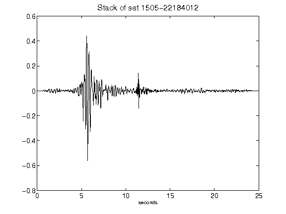](figures/1505-22184012_Stack.png)[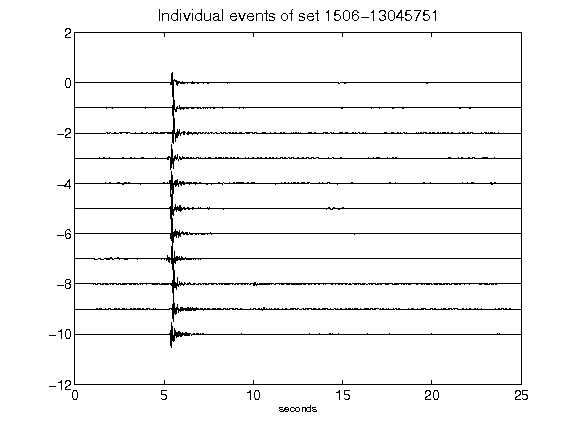](figures/1506-13045751_AllEv.png)[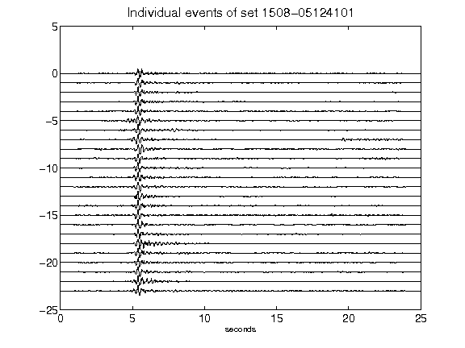](figures/1508-05124101_AllEv.png)[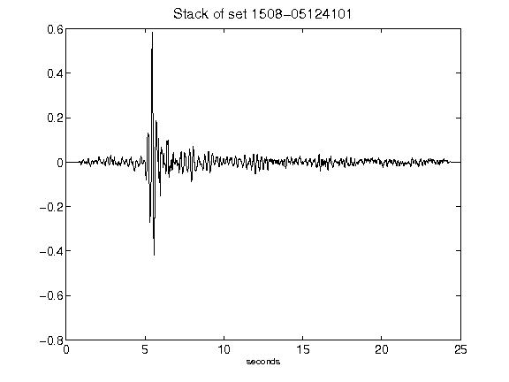](figures/1508-05124101_Stack.png)[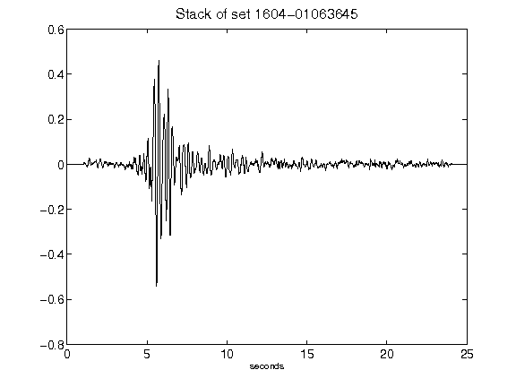](figures/1604-01063645_Stack.png)[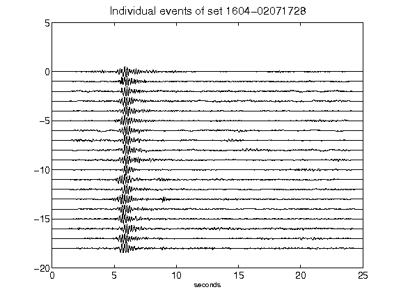](figures/1604-02071728_AllEv.png)[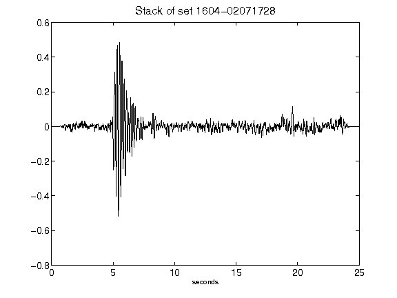](figures/1604-02071728_Stack.png)[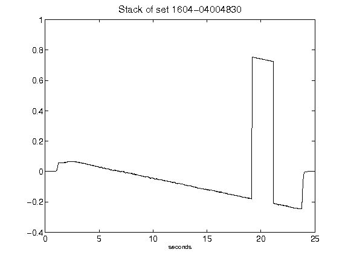](figures/1604-04004830_Stack.png)[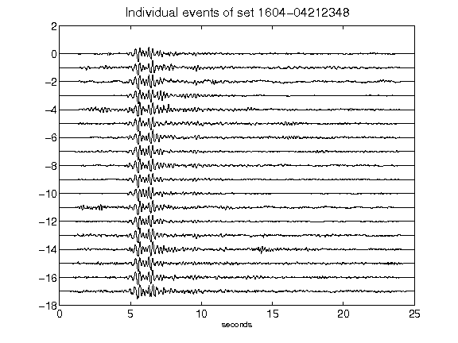](figures/1604-04212348_AllEv.png)[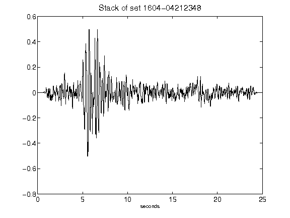](figures/1604-04212348_Stack.png)[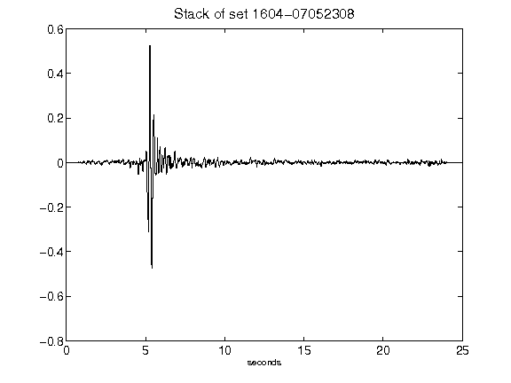](figures/1604-07052308_Stack.png)[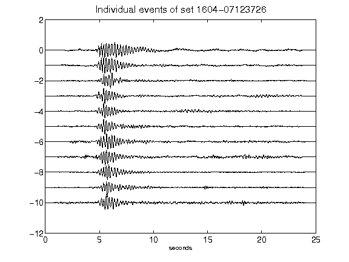](figures/1604-07123726_AllEv.png)[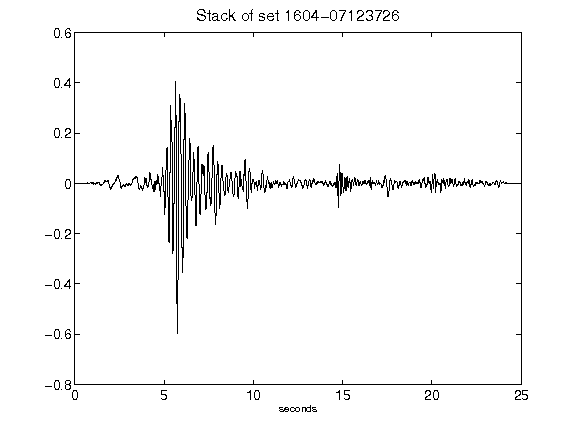](figures/1604-07123726_Stack.png)[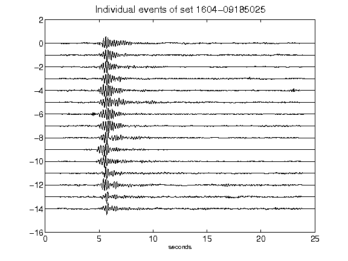](figures/1604-09185025_AllEv.png)[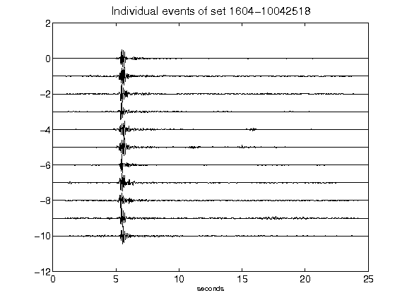](figures/1604-10042518_AllEv.png)[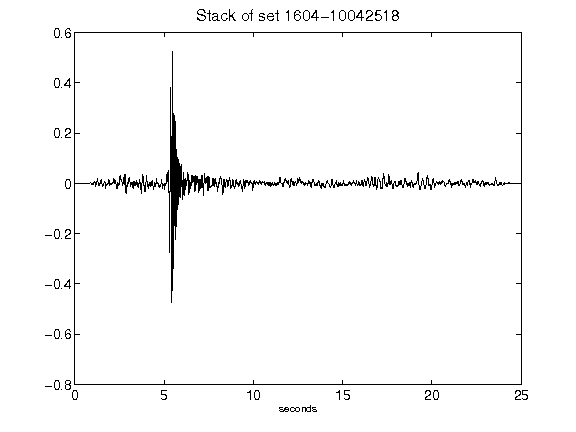](figures/1604-10042518_Stack.png)