# Repeating Earthquake Activity at RCM

## Waveforms
[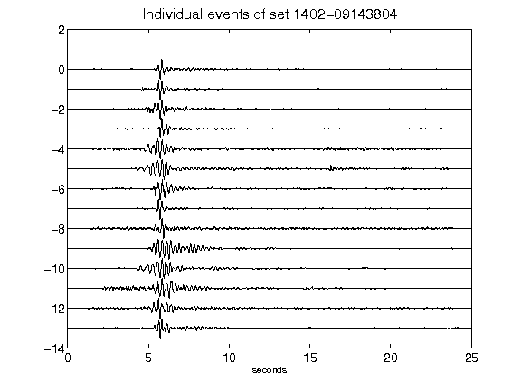](figures/1402-09143804_AllEv.png)[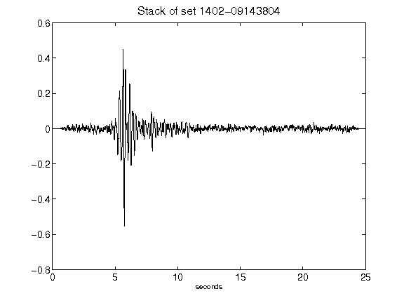](figures/1402-09143804_Stack.png)[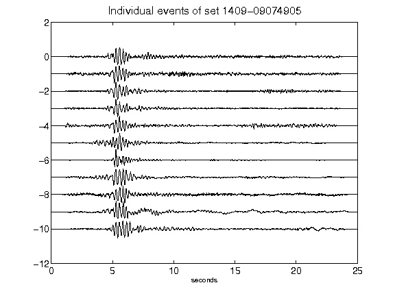](figures/1409-09074905_AllEv.png)[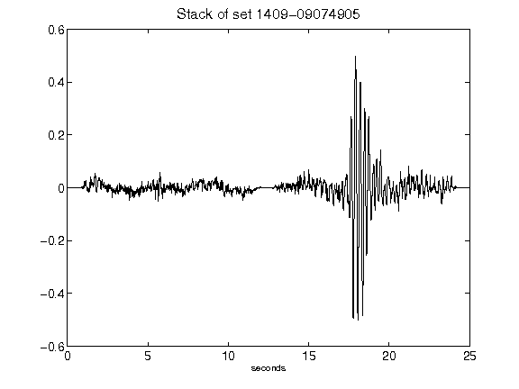](figures/1409-09074905_Stack.png)[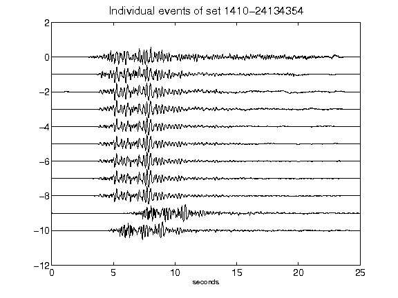](figures/1410-24134354_AllEv.png)[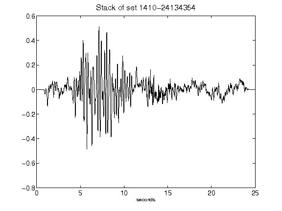](figures/1410-24134354_Stack.png)[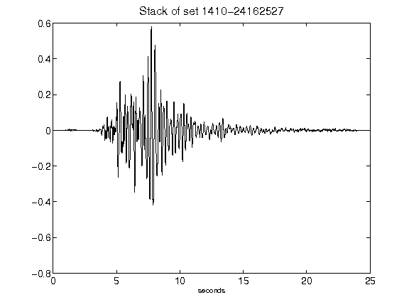](figures/1410-24162527_Stack.png)[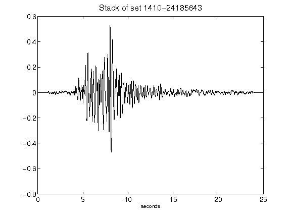](figures/1410-24185643_Stack.png)[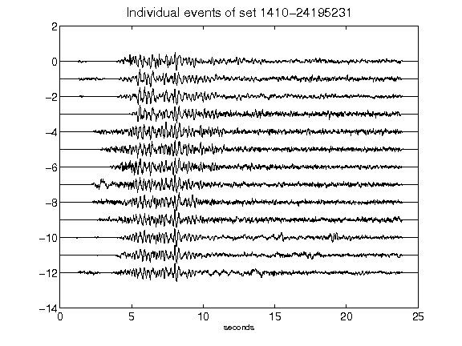](figures/1410-24195231_AllEv.png)[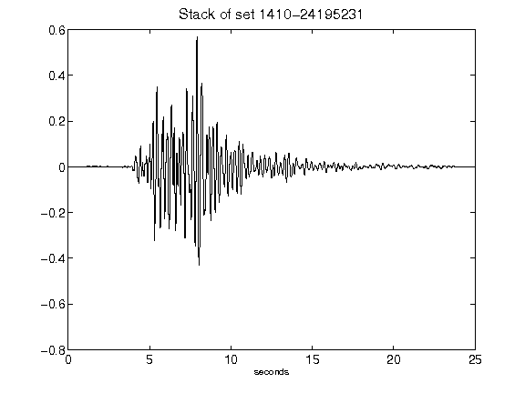](figures/1410-24195231_Stack.png)[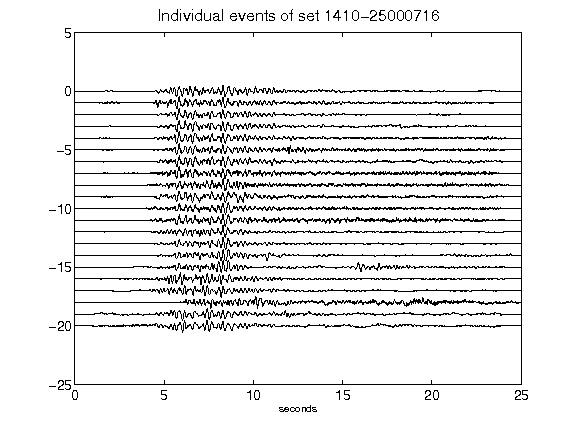](figures/1410-25000716_AllEv.png)[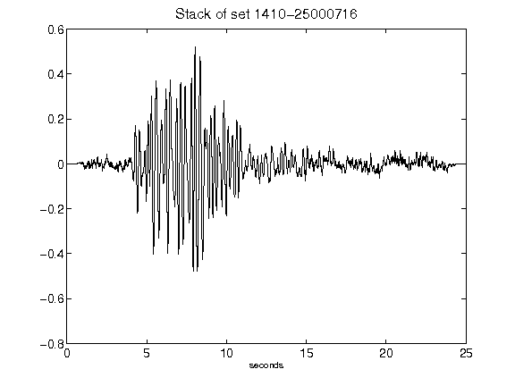](figures/1410-25000716_Stack.png)[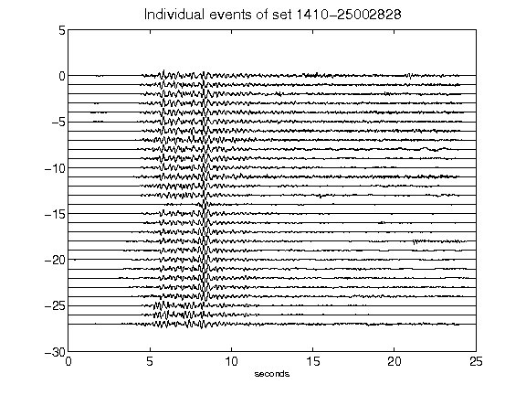](figures/1410-25002828_AllEv.png)[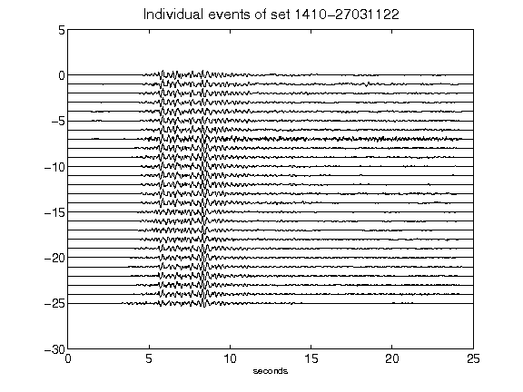](figures/1410-27031122_AllEv.png)[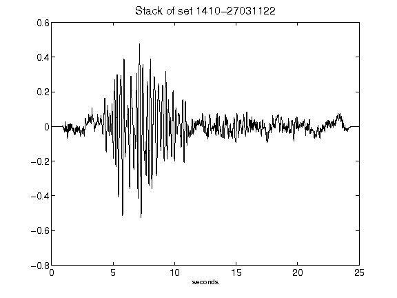](figures/1410-27031122_Stack.png)[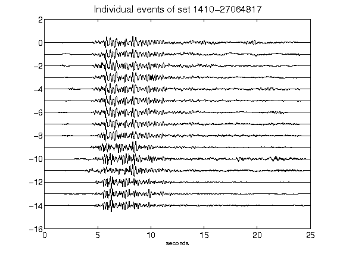](figures/1410-27064817_AllEv.png)[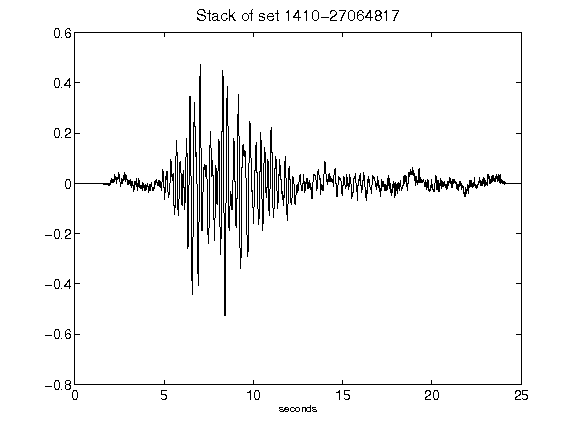](figures/1410-27064817_Stack.png)[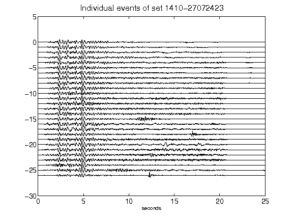](figures/1410-27072423_AllEv.png)[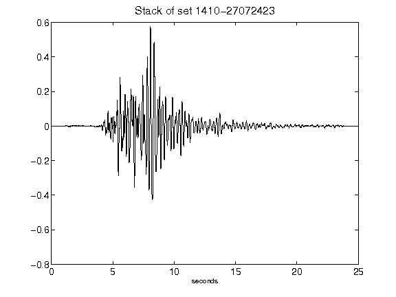](figures/1410-27072423_Stack.png)[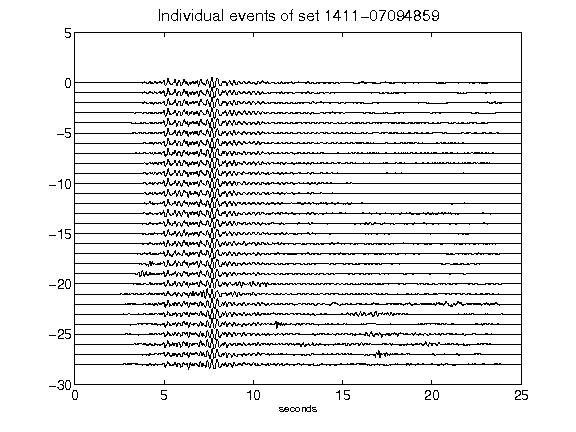](figures/1411-07094859_AllEv.png)[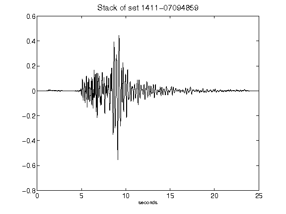](figures/1411-07094859_Stack.png)[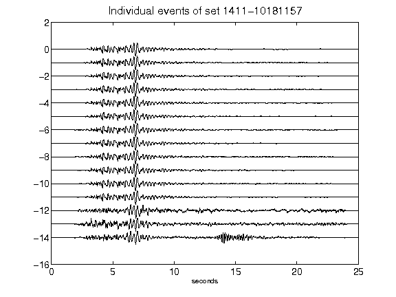](figures/1411-10181157_AllEv.png)[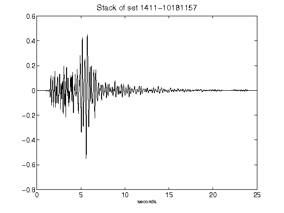](figures/1411-10181157_Stack.png)[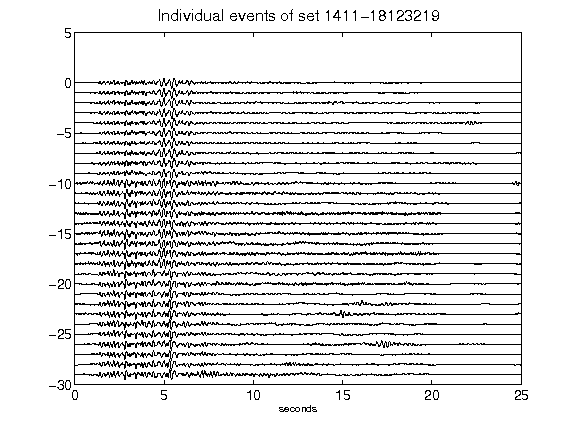](figures/1411-18123219_AllEv.png)[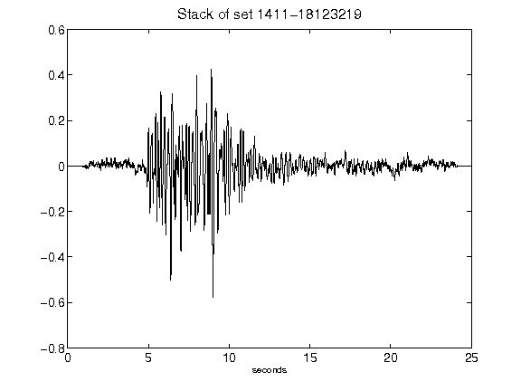](figures/1411-18123219_Stack.png)[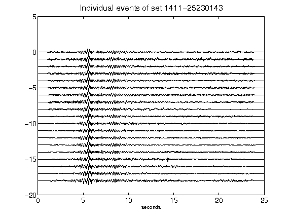](figures/1411-25230143_AllEv.png)