# Repeating Earthquake Activity at RCM

## Waveforms
[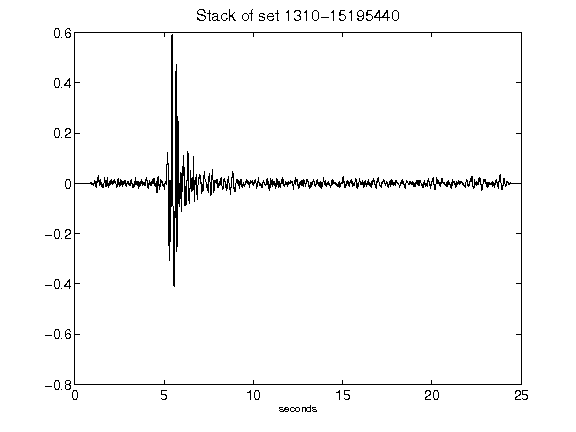](figures/1310-15195440_Stack.png)[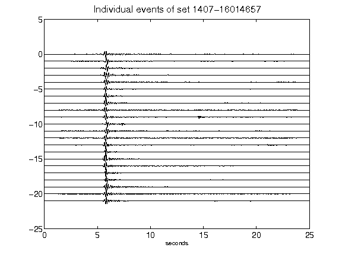](figures/1407-16014657_AllEv.png)[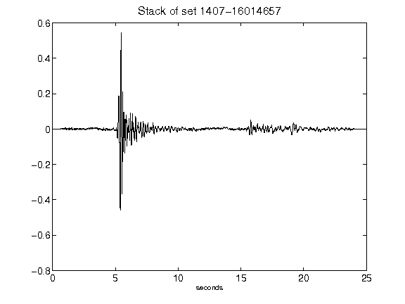](figures/1407-16014657_Stack.png)[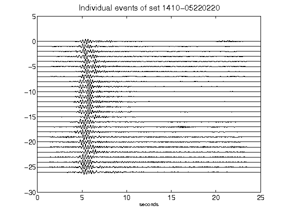](figures/1410-05220220_AllEv.png)[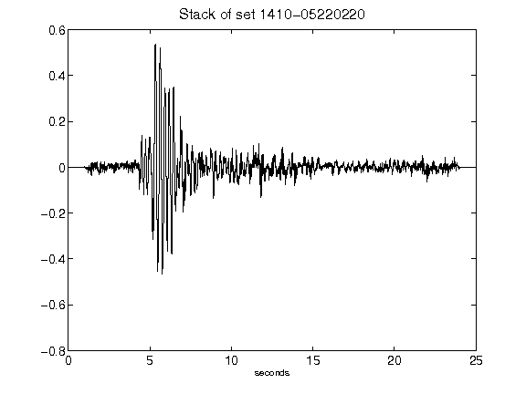](figures/1410-05220220_Stack.png)[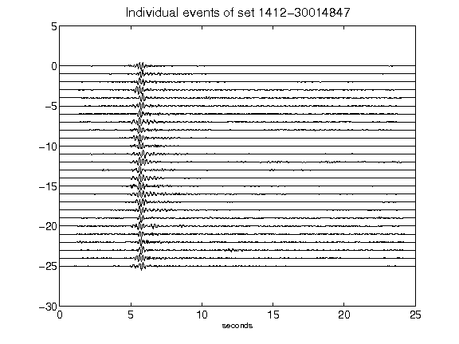](figures/1412-30014847_AllEv.png)[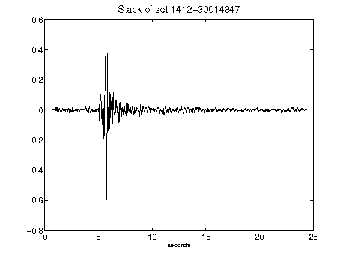](figures/1412-30014847_Stack.png)[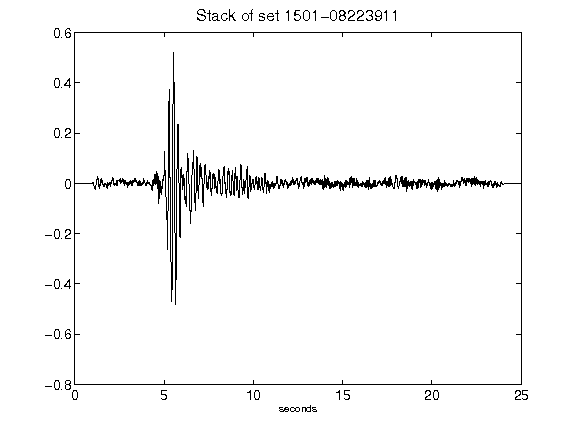](figures/1501-08223911_Stack.png)[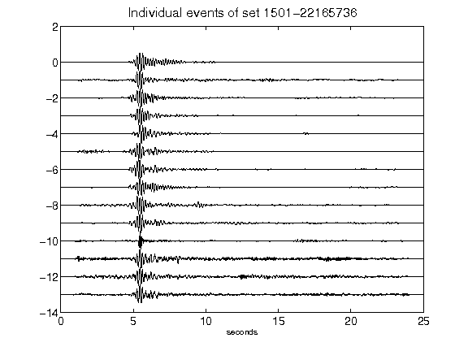](figures/1501-22165736_AllEv.png)[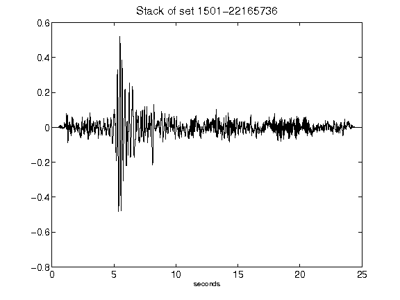](figures/1501-22165736_Stack.png)[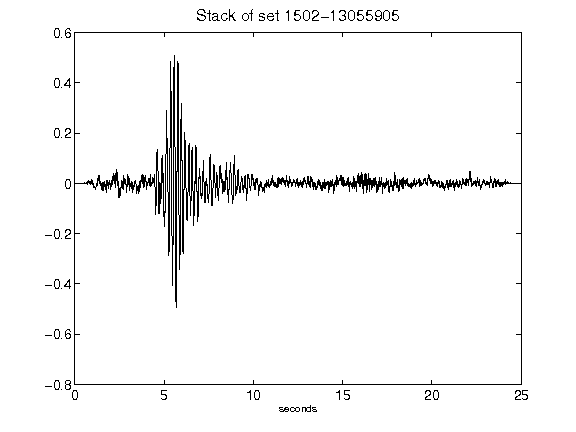](figures/1502-13055905_Stack.png)[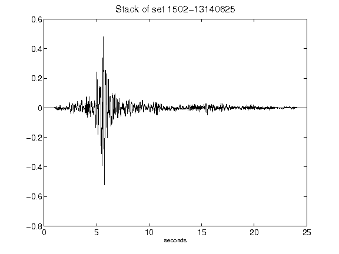](figures/1502-13140625_Stack.png)[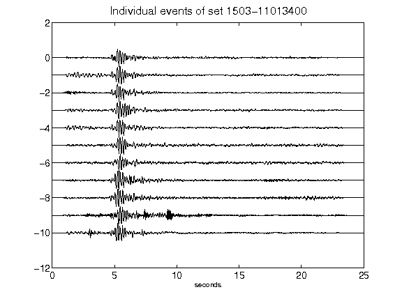](figures/1503-11013400_AllEv.png)[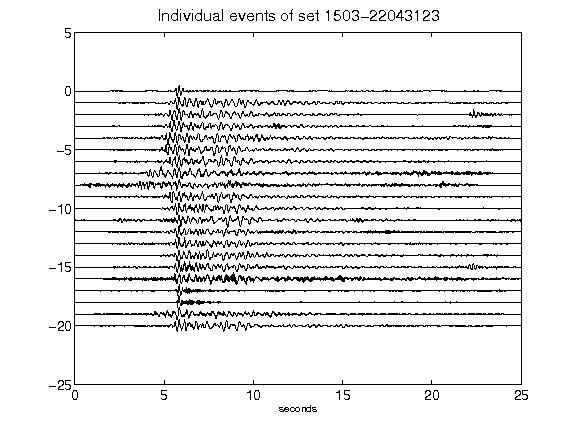](figures/1503-22043123_AllEv.png)[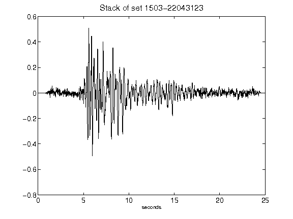](figures/1503-22043123_Stack.png)[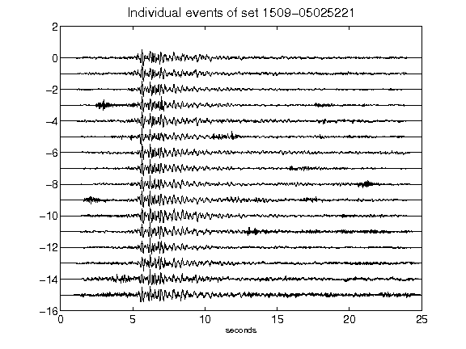](figures/1509-05025221_AllEv.png)[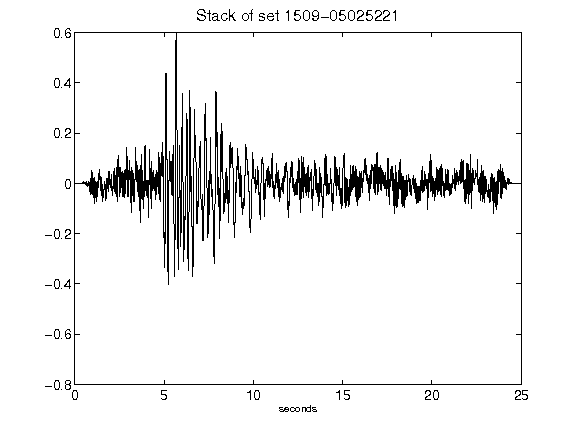](figures/1509-05025221_Stack.png)