# Repeating Earthquake Activity at RCM

## Waveforms
[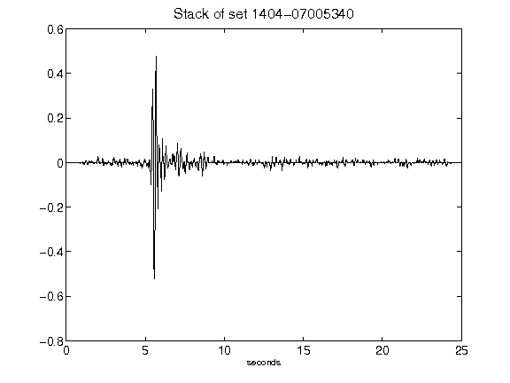](figures/1404-07005340_Stack.png)[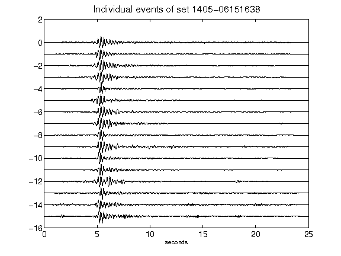](figures/1405-06151638_AllEv.png)[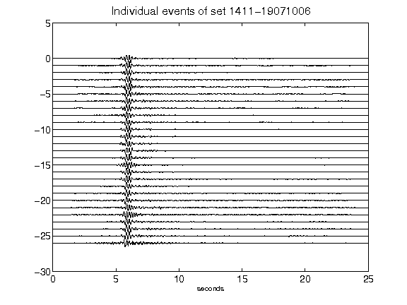](figures/1411-19071006_AllEv.png)[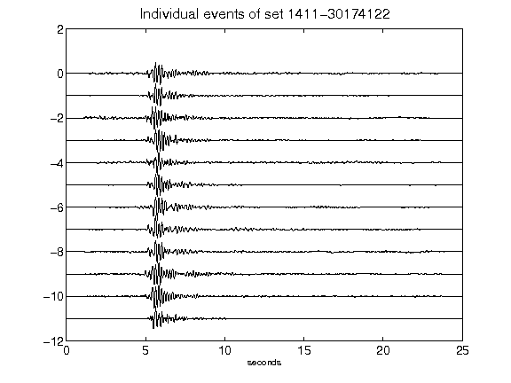](figures/1411-30174122_AllEv.png)[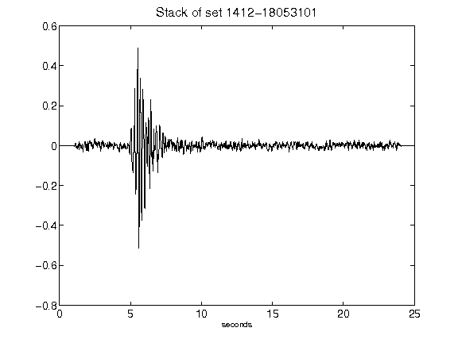](figures/1412-18053101_Stack.png)[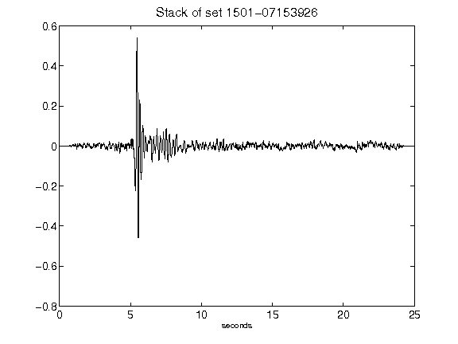](figures/1501-07153926_Stack.png)[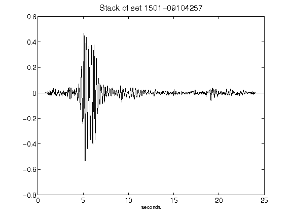](figures/1501-09104257_Stack.png)[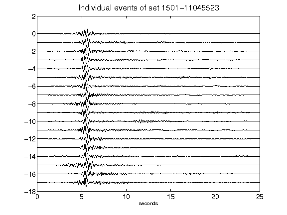](figures/1501-11045523_AllEv.png)[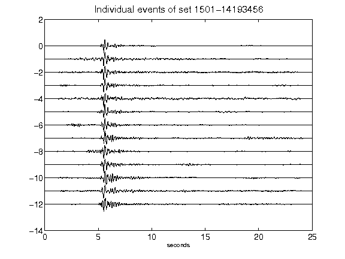](figures/1501-14193456_AllEv.png)[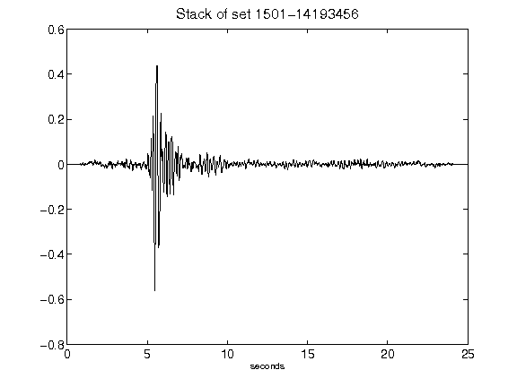](figures/1501-14193456_Stack.png)[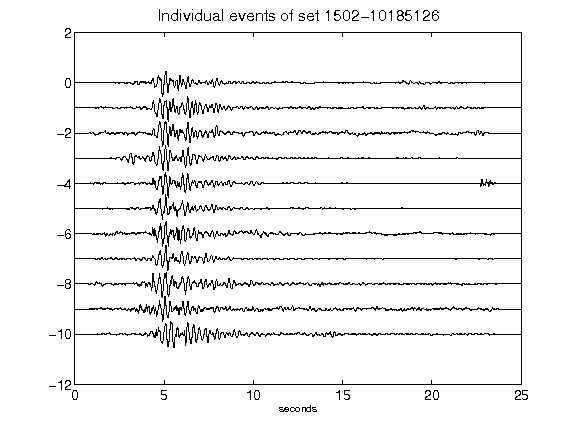](figures/1502-10185126_AllEv.png)[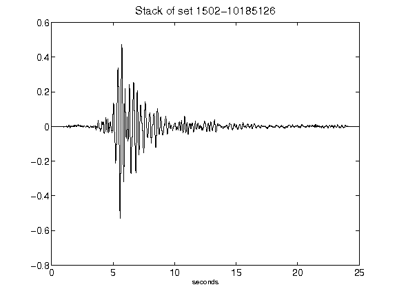](figures/1502-10185126_Stack.png)[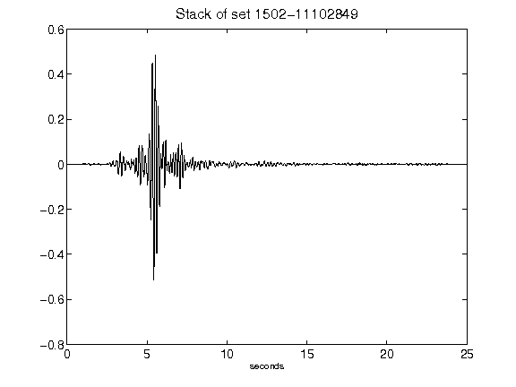](figures/1502-11102849_Stack.png)[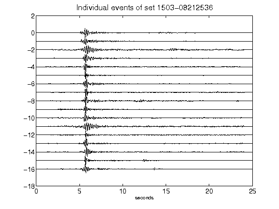](figures/1503-08212536_AllEv.png)[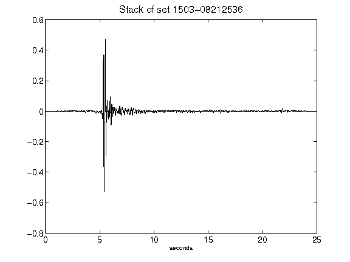](figures/1503-08212536_Stack.png)[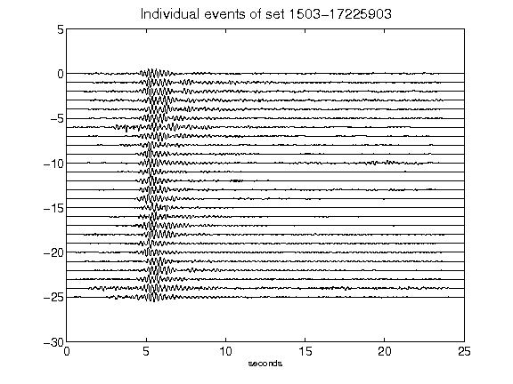](figures/1503-17225903_AllEv.png)[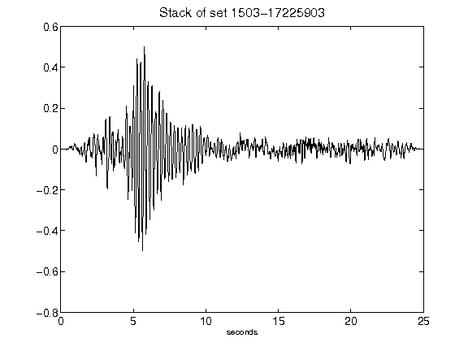](figures/1503-17225903_Stack.png)[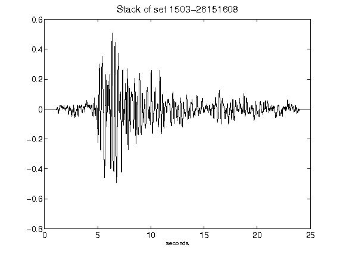](figures/1503-26151608_Stack.png)[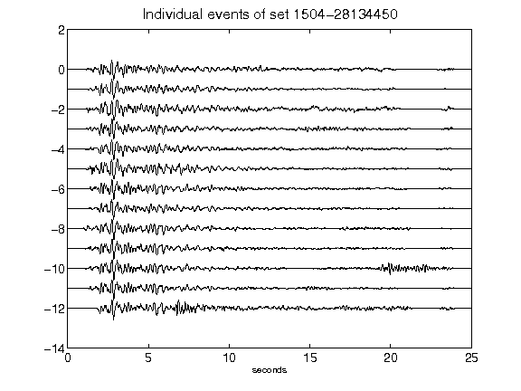](figures/1504-28134450_AllEv.png)