# Repeating Earthquake Activity at RCM

## Waveforms
[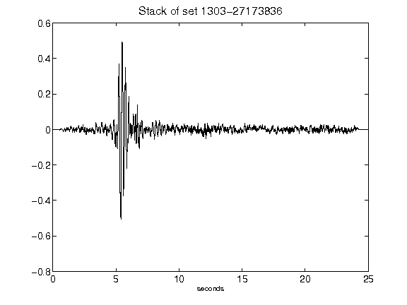](figures/1303-27173836_Stack.png)[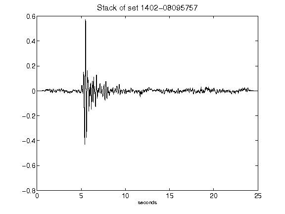](figures/1402-08095757_Stack.png)[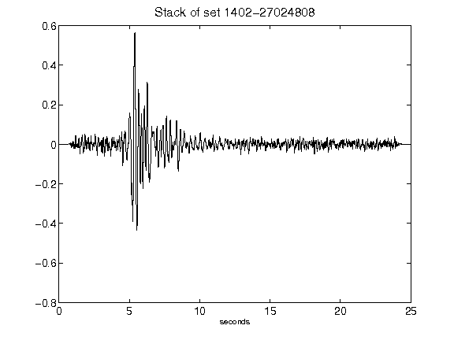](figures/1402-27024808_Stack.png)[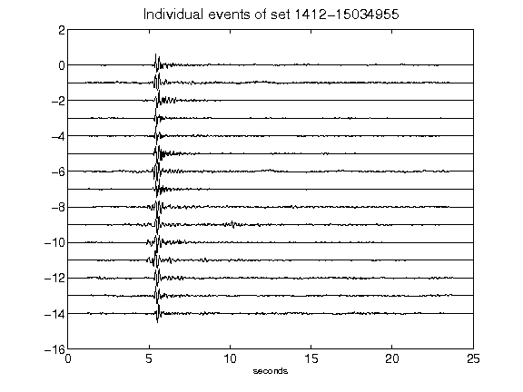](figures/1412-15034955_AllEv.png)[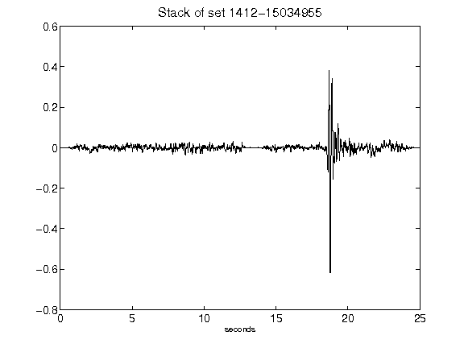](figures/1412-15034955_Stack.png)[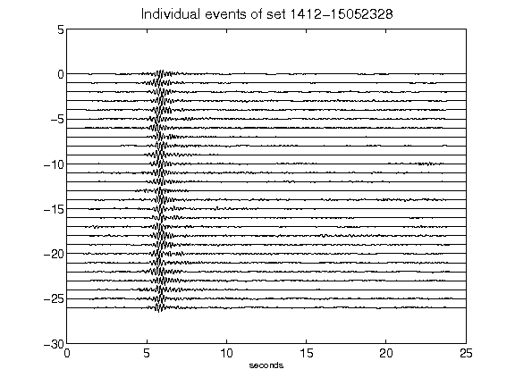](figures/1412-15052328_AllEv.png)[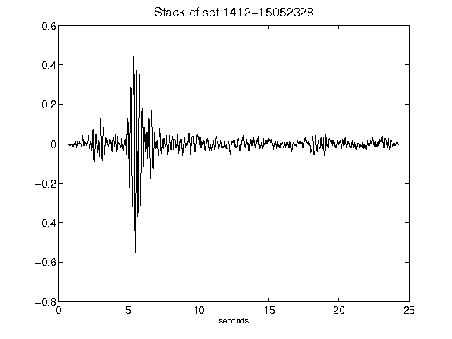](figures/1412-15052328_Stack.png)[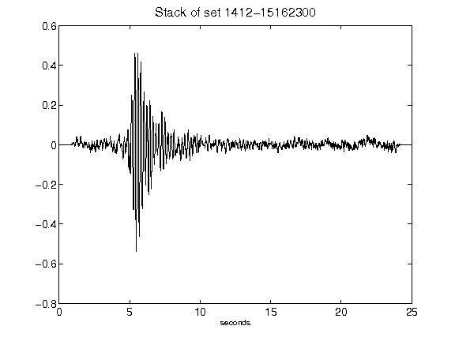](figures/1412-15162300_Stack.png)[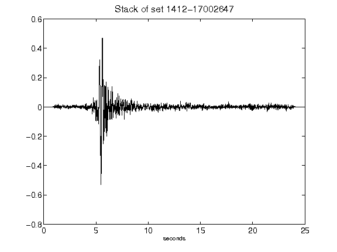](figures/1412-17002647_Stack.png)[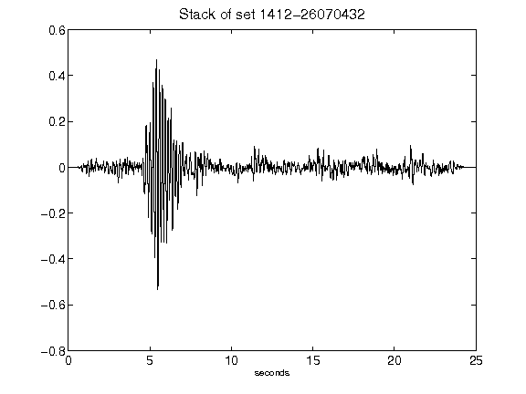](figures/1412-26070432_Stack.png)[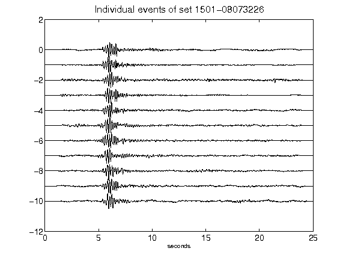](figures/1501-08073226_AllEv.png)[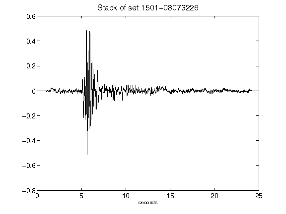](figures/1501-08073226_Stack.png)[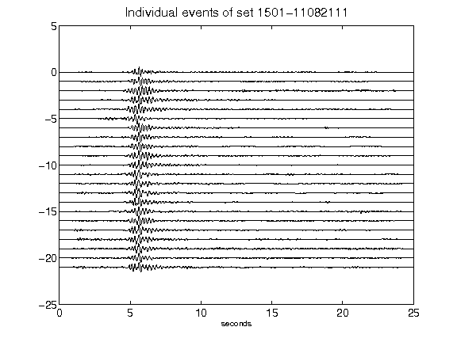](figures/1501-11082111_AllEv.png)[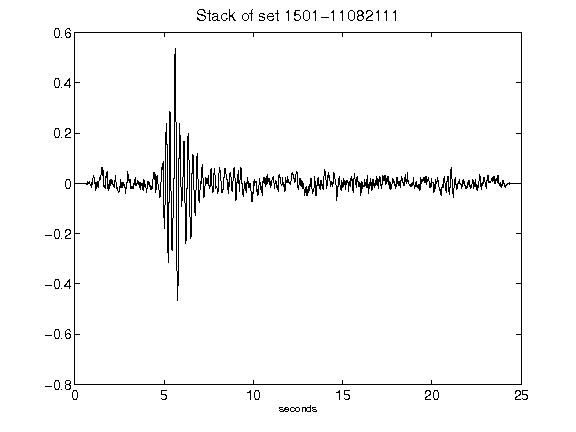](figures/1501-11082111_Stack.png)[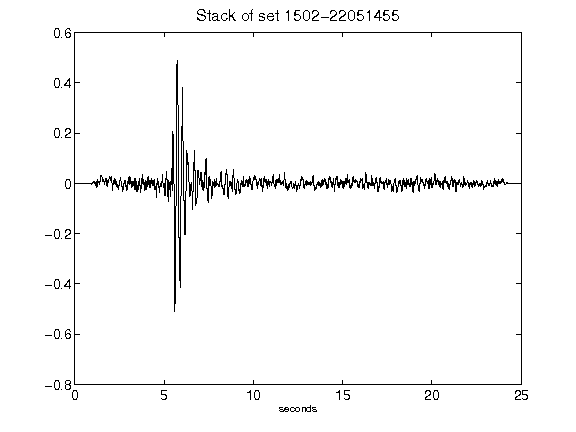](figures/1502-22051455_Stack.png)