# Repeating Earthquake Activity at RCM

## Waveforms
[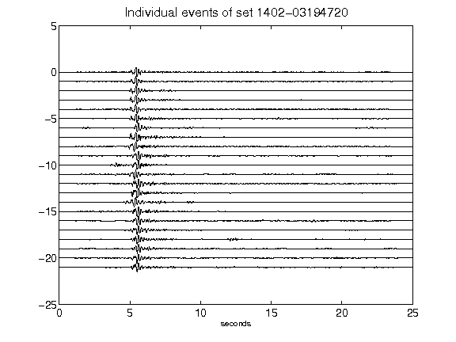](figures/1402-03194720_AllEv.png)[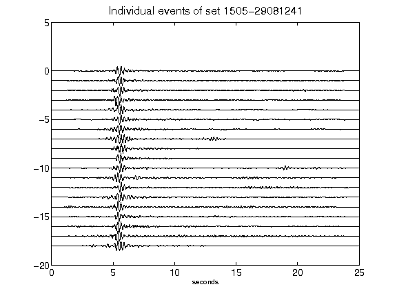](figures/1505-29081241_AllEv.png)[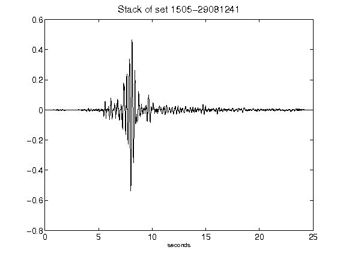](figures/1505-29081241_Stack.png)[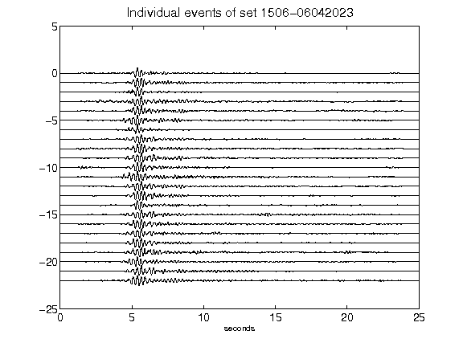](figures/1506-06042023_AllEv.png)[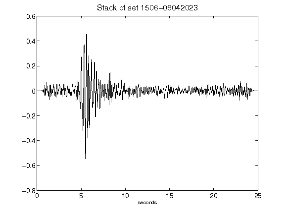](figures/1506-06042023_Stack.png)[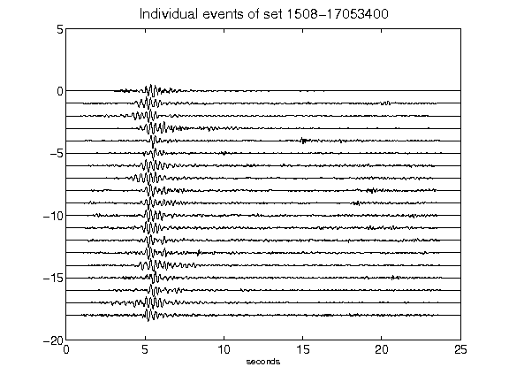](figures/1508-17053400_AllEv.png)[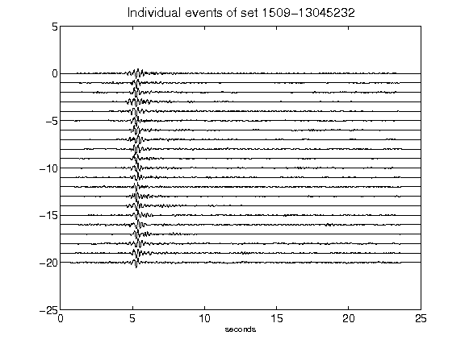](figures/1509-13045232_AllEv.png)[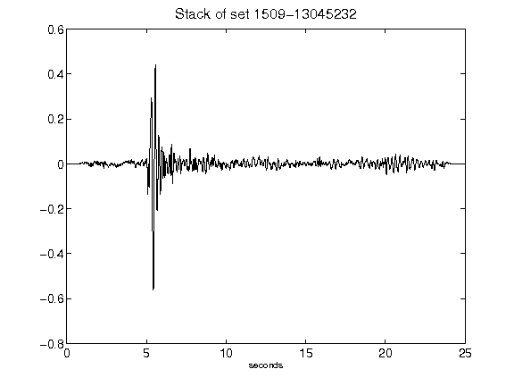](figures/1509-13045232_Stack.png)[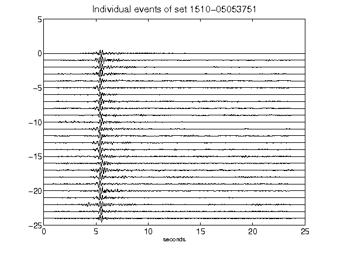](figures/1510-05053751_AllEv.png)[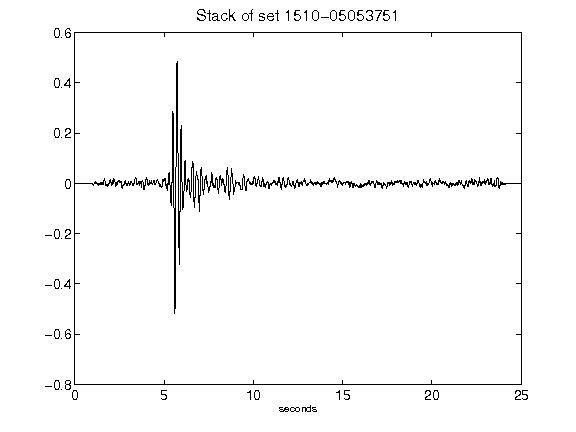](figures/1510-05053751_Stack.png)[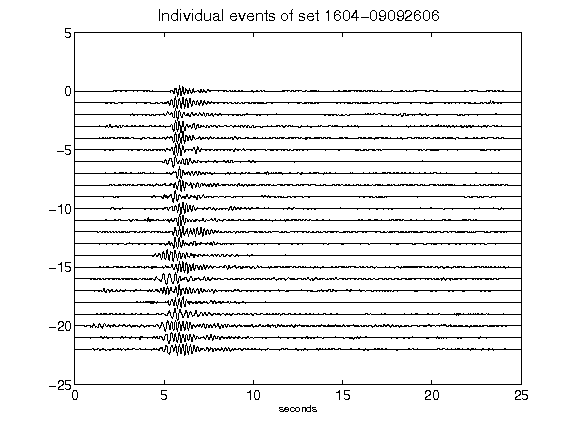](figures/1604-09092606_AllEv.png)[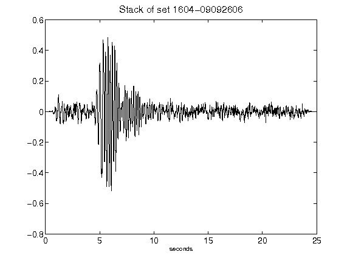](figures/1604-09092606_Stack.png)[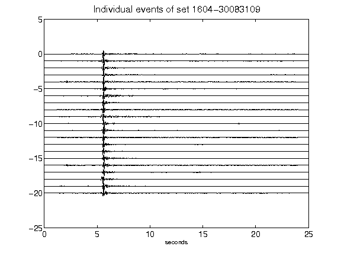](figures/1604-30083109_AllEv.png)[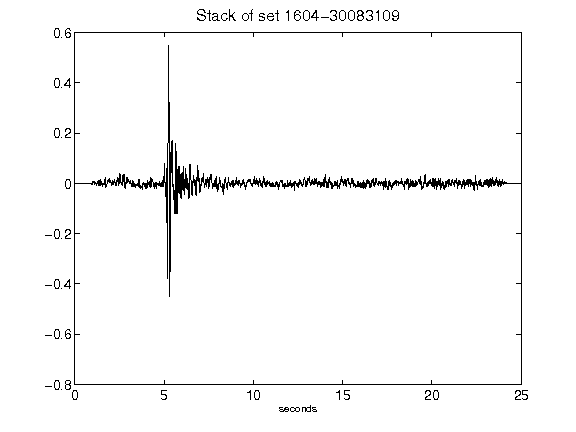](figures/1604-30083109_Stack.png)[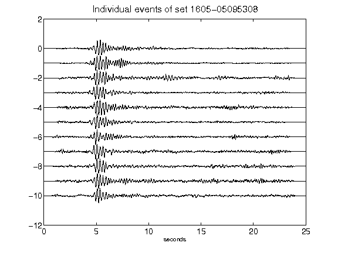](figures/1605-05095308_AllEv.png)[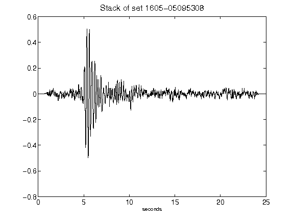](figures/1605-05095308_Stack.png)[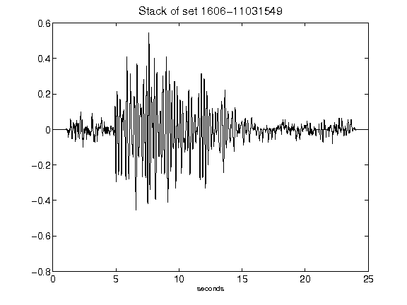](figures/1606-11031549_Stack.png)