# Repeating Earthquake Activity at RCM

## Waveforms
[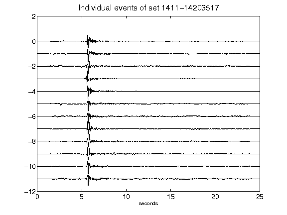](figures/1411-14203517_AllEv.png)[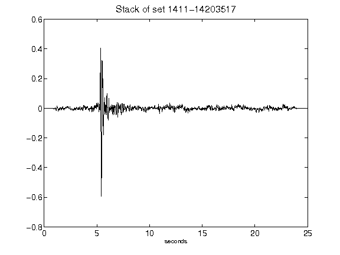](figures/1411-14203517_Stack.png)[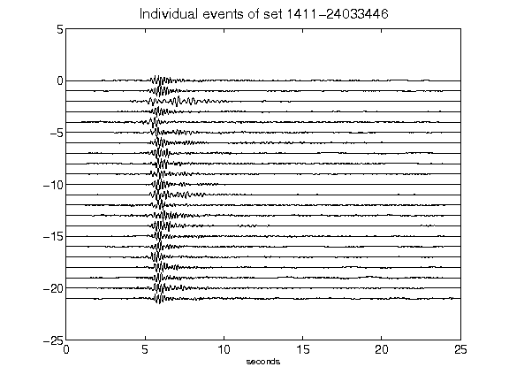](figures/1411-24033446_AllEv.png)[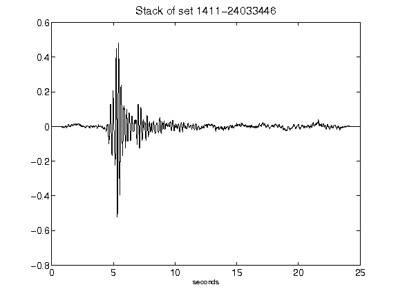](figures/1411-24033446_Stack.png)[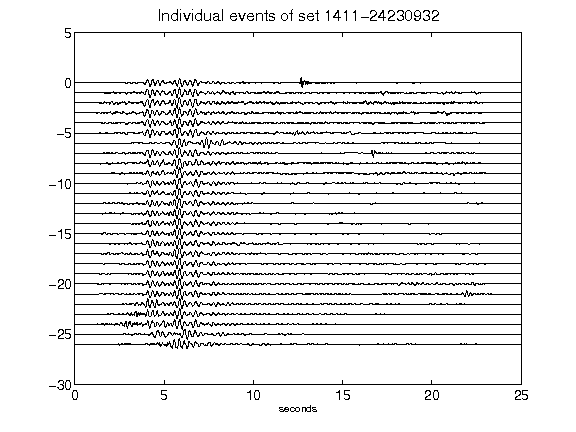](figures/1411-24230932_AllEv.png)[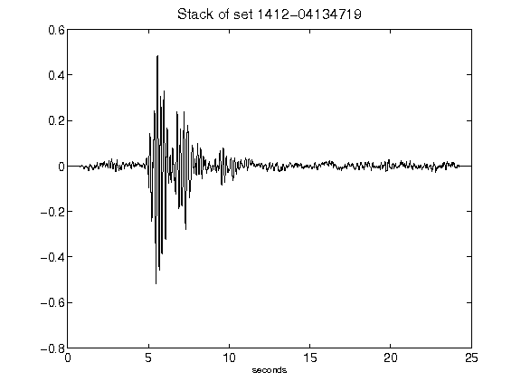](figures/1412-04134719_Stack.png)[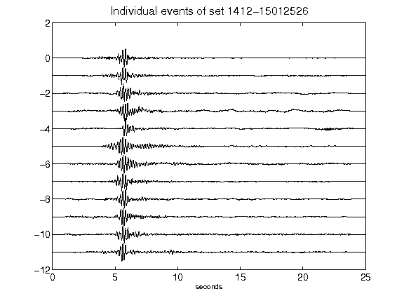](figures/1412-15012526_AllEv.png)[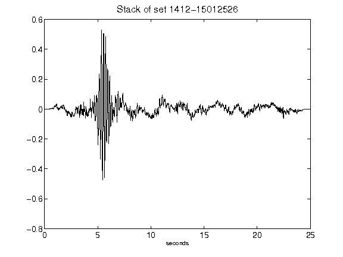](figures/1412-15012526_Stack.png)[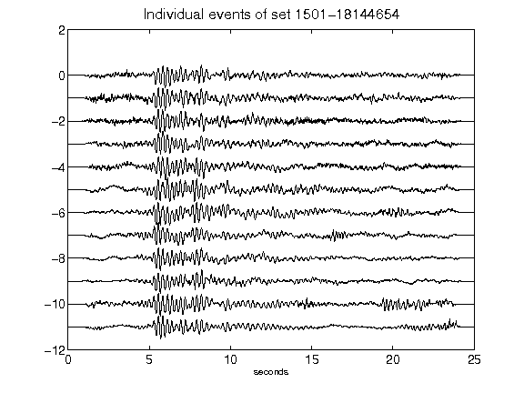](figures/1501-18144654_AllEv.png)[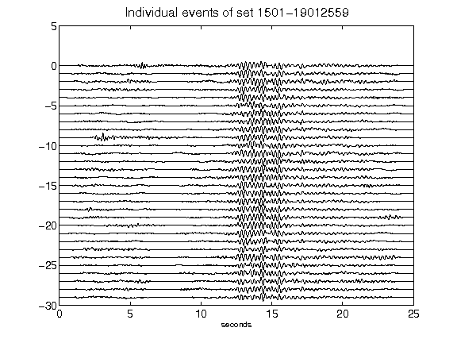](figures/1501-19012559_AllEv.png)[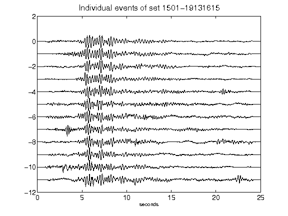](figures/1501-19131615_AllEv.png)