# Repeating Earthquake Activity at RCM

## Waveforms
[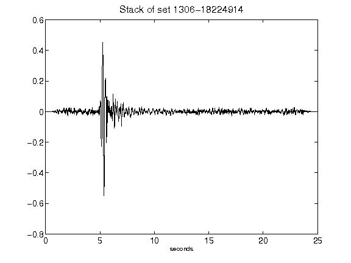](figures/1306-18224914_Stack.png)[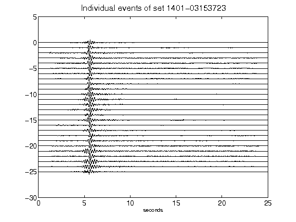](figures/1401-03153723_AllEv.png)[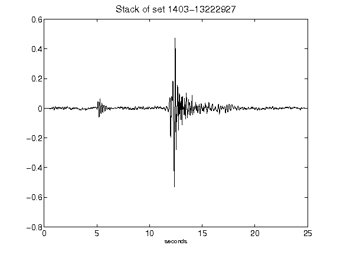](figures/1403-13222927_Stack.png)[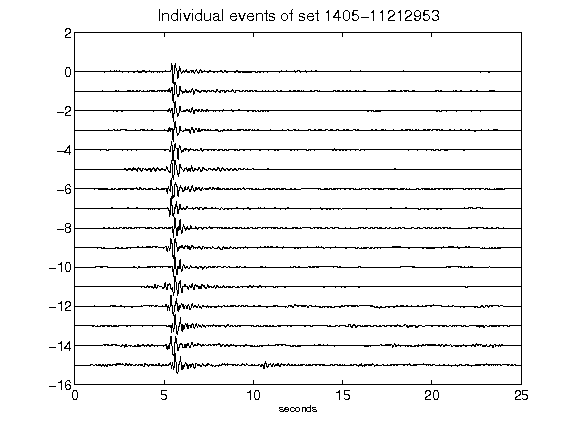](figures/1405-11212953_AllEv.png)[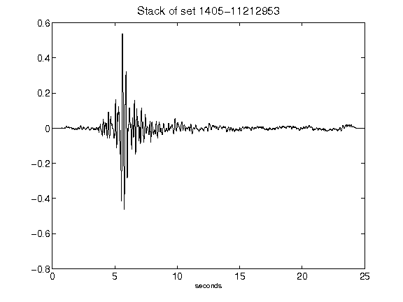](figures/1405-11212953_Stack.png)[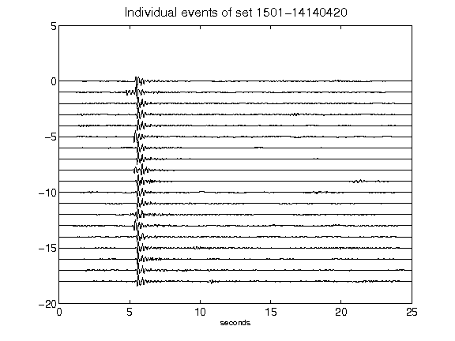](figures/1501-14140420_AllEv.png)[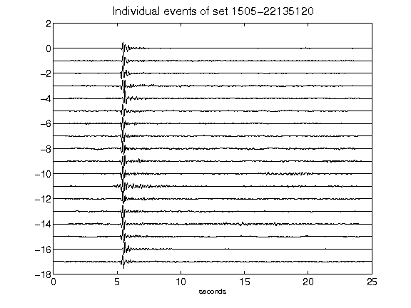](figures/1505-22135120_AllEv.png)[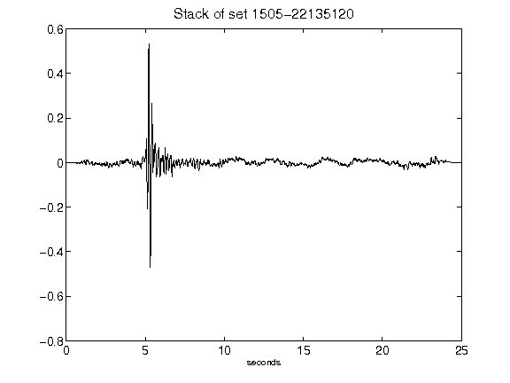](figures/1505-22135120_Stack.png)[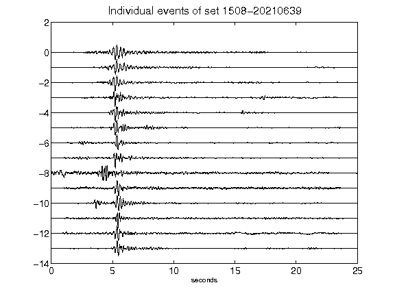](figures/1508-20210639_AllEv.png)[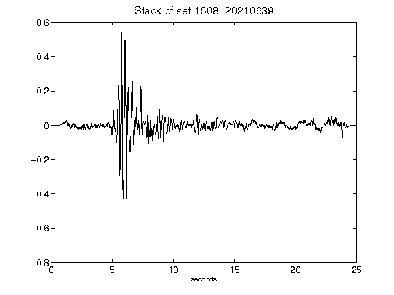](figures/1508-20210639_Stack.png)[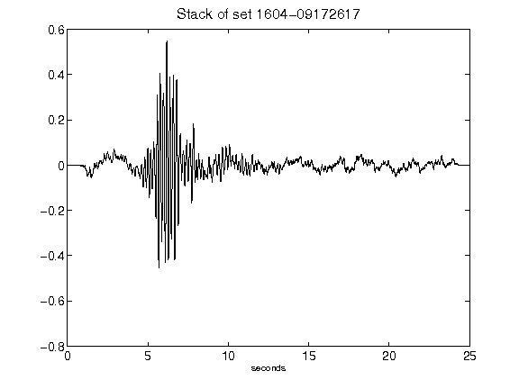](figures/1604-09172617_Stack.png)