# Repeating Earthquake Activity at RCM

## Waveforms
[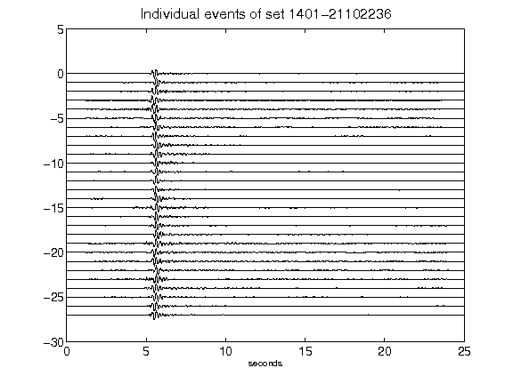](figures/1401-21102236_AllEv.png)[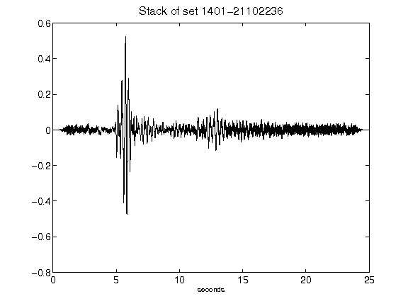](figures/1401-21102236_Stack.png)[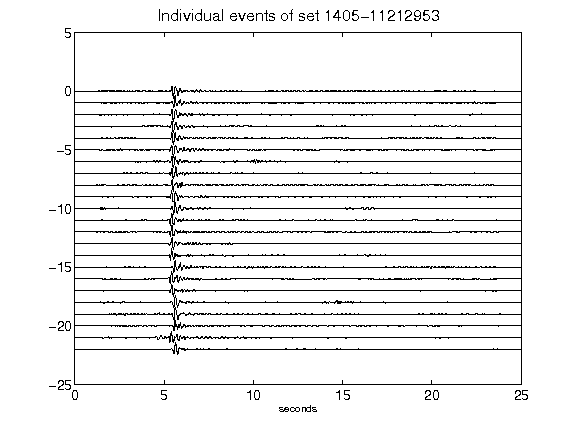](figures/1405-11212953_AllEv.png)[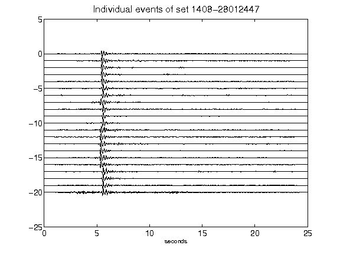](figures/1408-28012447_AllEv.png)[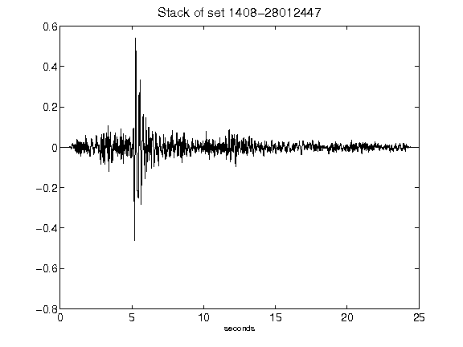](figures/1408-28012447_Stack.png)[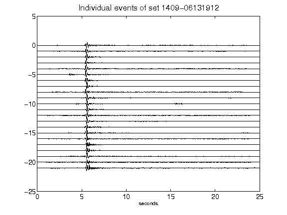](figures/1409-06131912_AllEv.png)[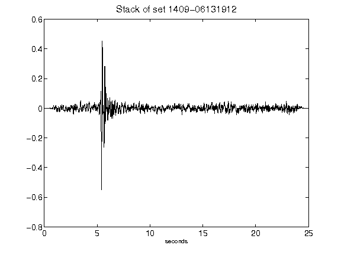](figures/1409-06131912_Stack.png)[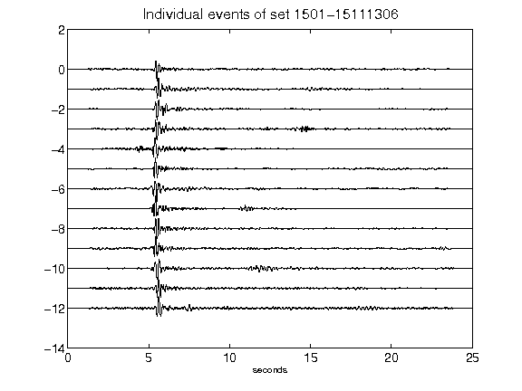](figures/1501-15111306_AllEv.png)[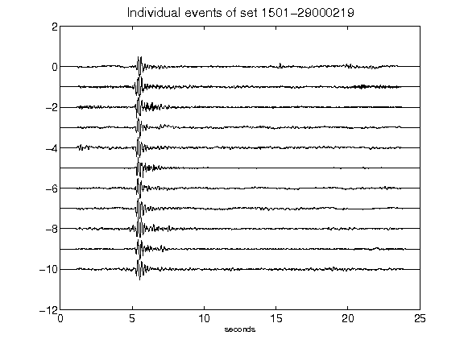](figures/1501-29000219_AllEv.png)[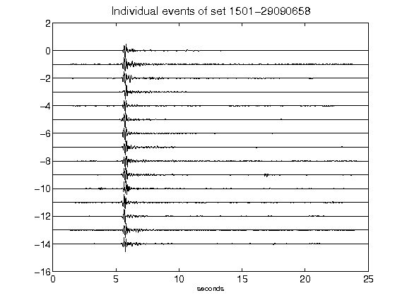](figures/1501-29090658_AllEv.png)[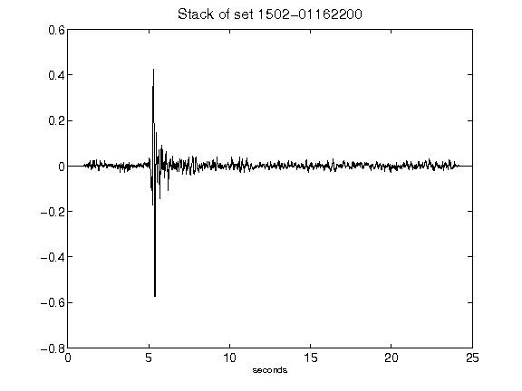](figures/1502-01162200_Stack.png)[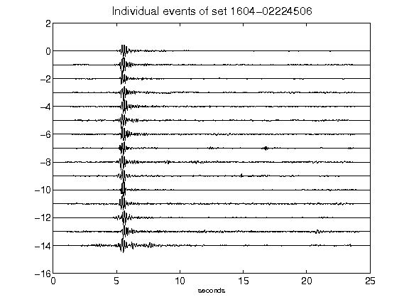](figures/1604-02224506_AllEv.png)[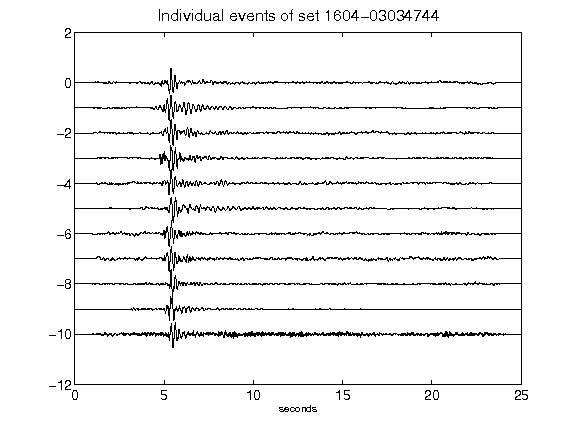](figures/1604-03034744_AllEv.png)[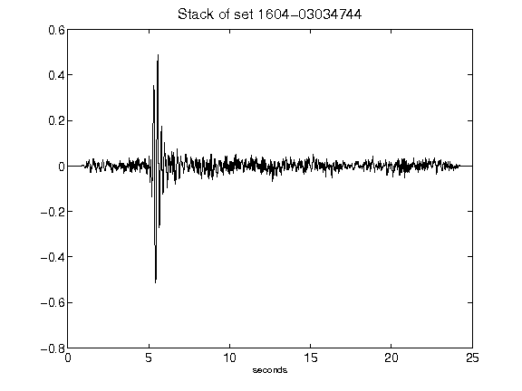](figures/1604-03034744_Stack.png)[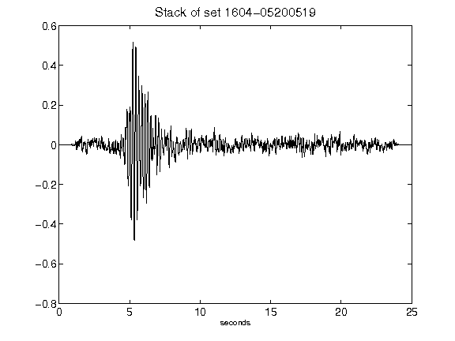](figures/1604-05200519_Stack.png)[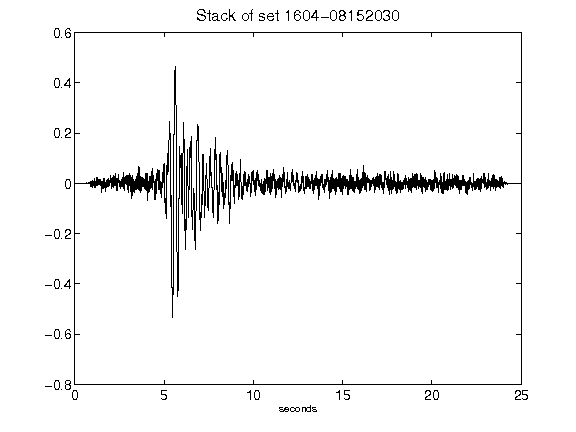](figures/1604-08152030_Stack.png)[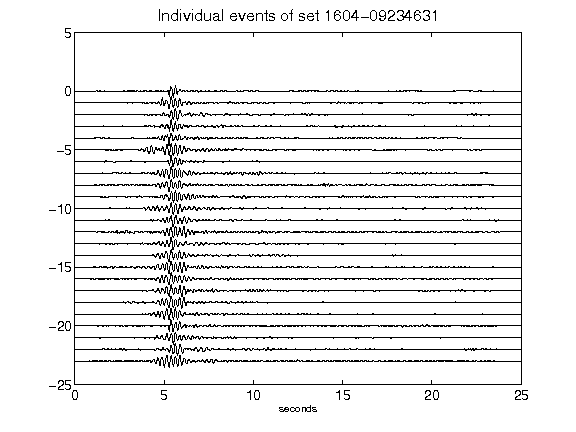](figures/1604-09234631_AllEv.png)[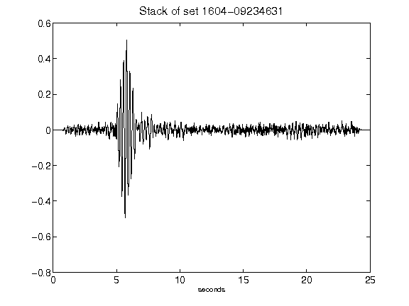](figures/1604-09234631_Stack.png)[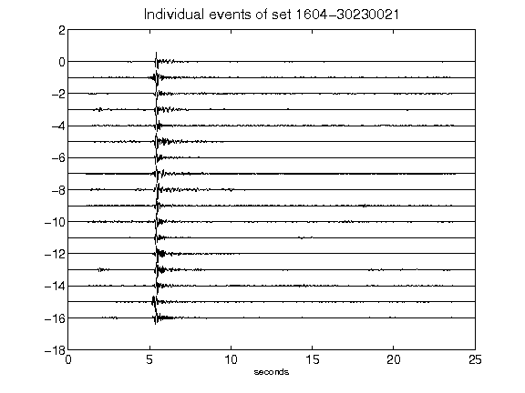](figures/1604-30230021_AllEv.png)[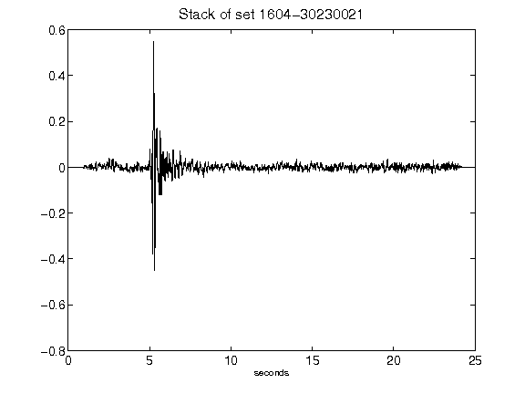](figures/1604-30230021_Stack.png)[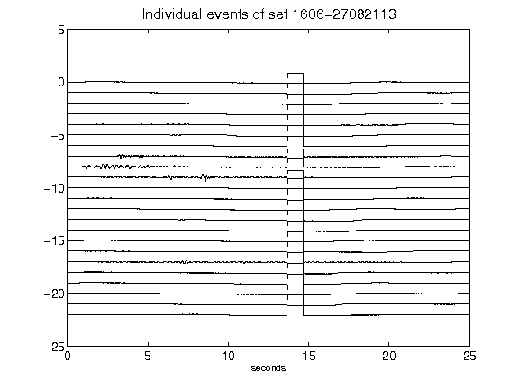](figures/1606-27082113_AllEv.png)