# Repeating Earthquake Activity at RCM

## Waveforms
[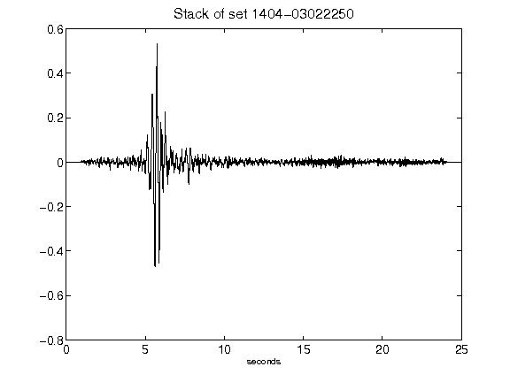](figures/1404-03022250_Stack.png)[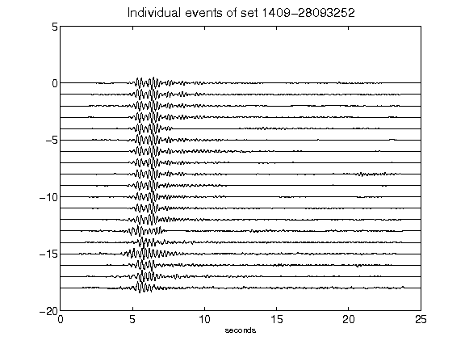](figures/1409-28093252_AllEv.png)[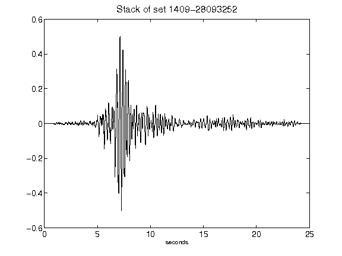](figures/1409-28093252_Stack.png)[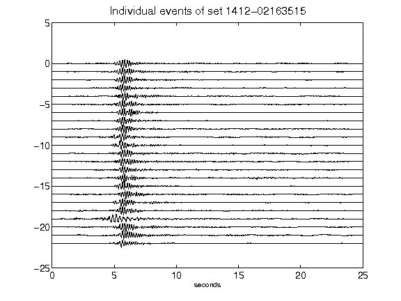](figures/1412-02163515_AllEv.png)[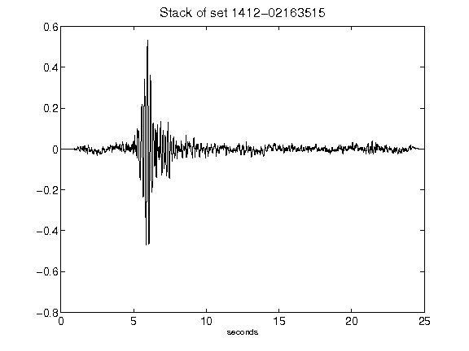](figures/1412-02163515_Stack.png)[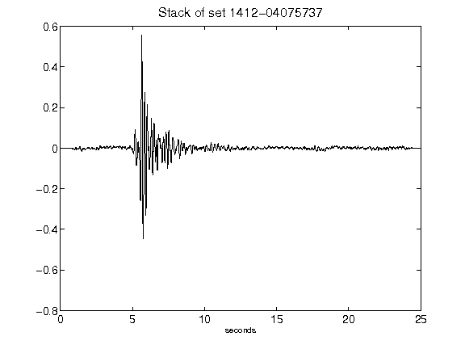](figures/1412-04075737_Stack.png)[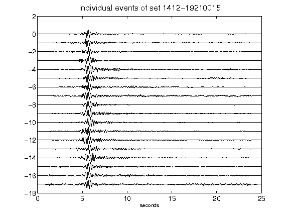](figures/1412-19210015_AllEv.png)[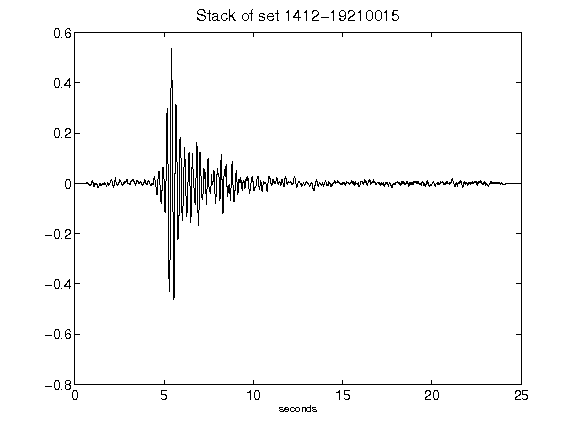](figures/1412-19210015_Stack.png)[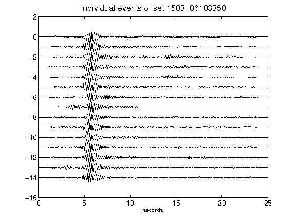](figures/1503-06103350_AllEv.png)[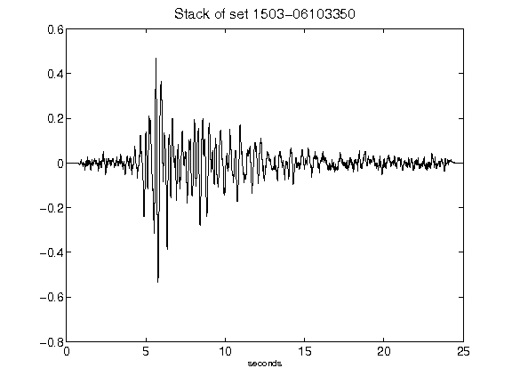](figures/1503-06103350_Stack.png)[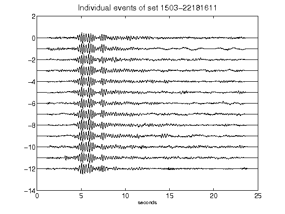](figures/1503-22181611_AllEv.png)[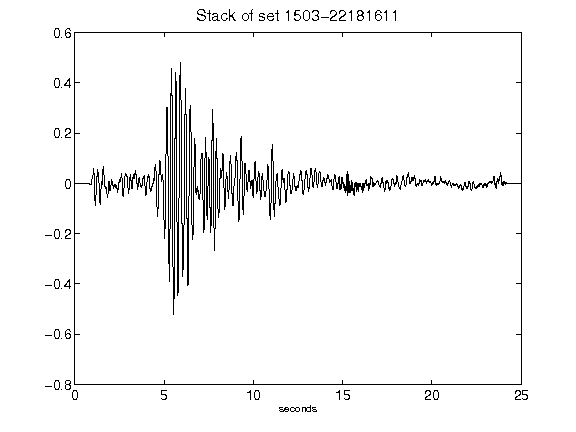](figures/1503-22181611_Stack.png)[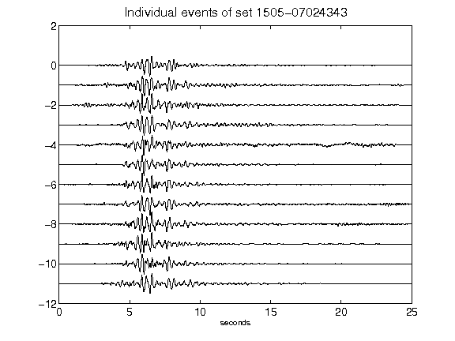](figures/1505-07024343_AllEv.png)[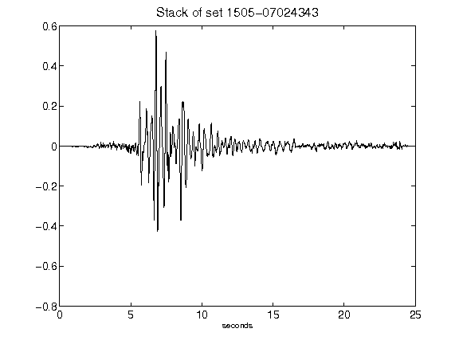](figures/1505-07024343_Stack.png)