# Repeating Earthquake Activity at RCM

## Waveforms
[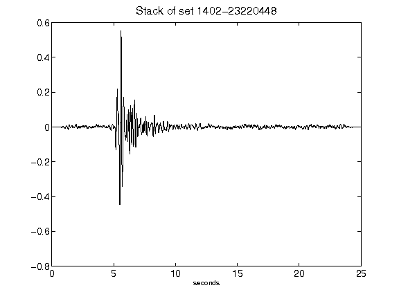](figures/1402-23220448_Stack.png)[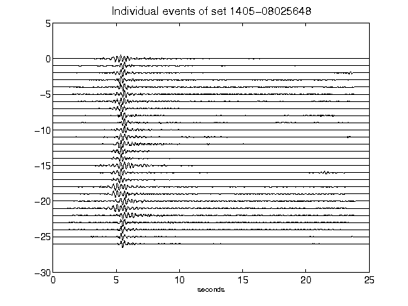](figures/1405-08025648_AllEv.png)[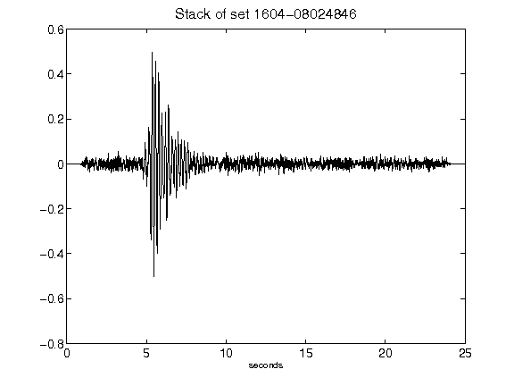](figures/1604-08024846_Stack.png)[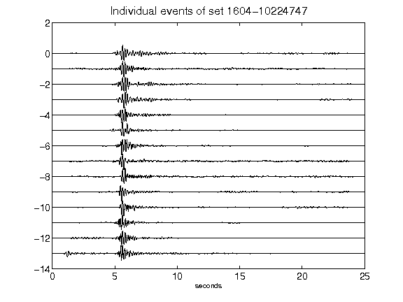](figures/1604-10224747_AllEv.png)[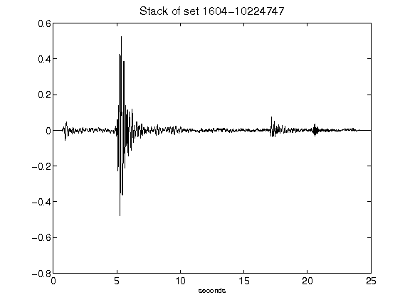](figures/1604-10224747_Stack.png)[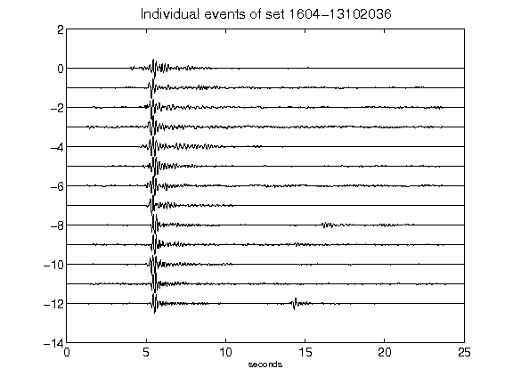](figures/1604-13102036_AllEv.png)[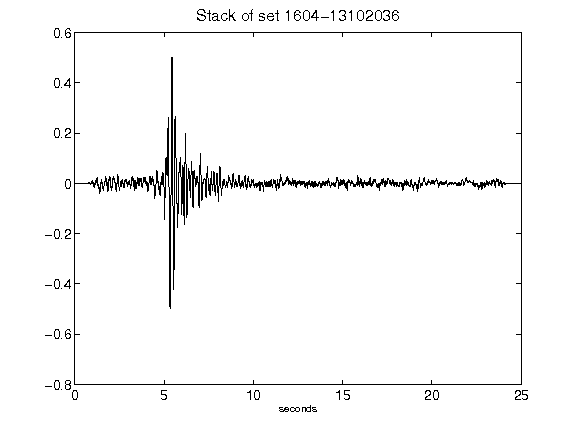](figures/1604-13102036_Stack.png)[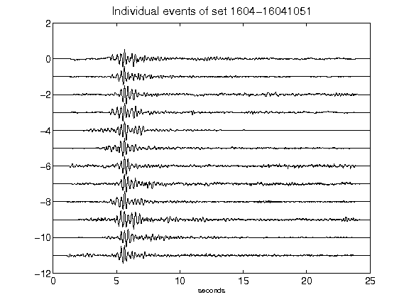](figures/1604-16041051_AllEv.png)[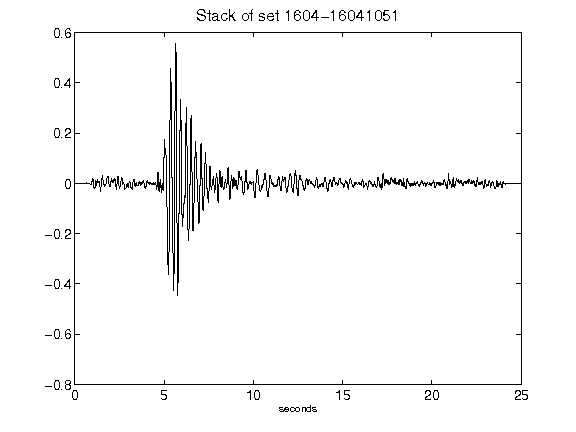](figures/1604-16041051_Stack.png)[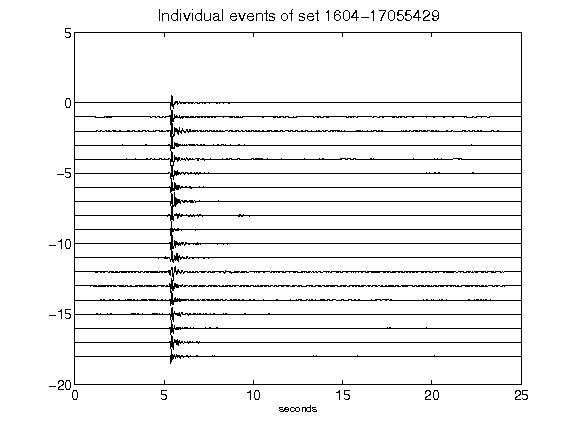](figures/1604-17055429_AllEv.png)[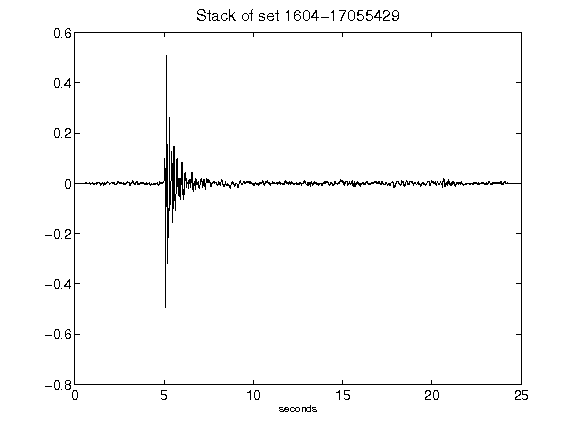](figures/1604-17055429_Stack.png)[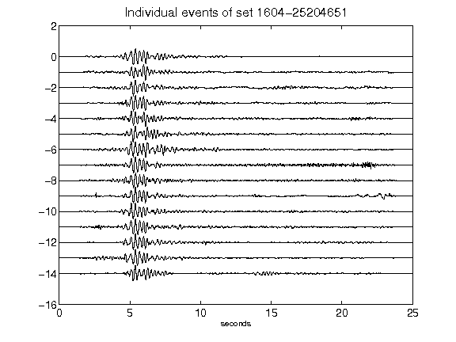](figures/1604-25204651_AllEv.png)[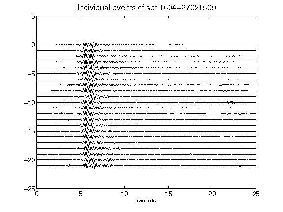](figures/1604-27021509_AllEv.png)[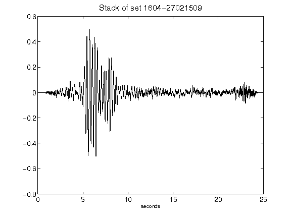](figures/1604-27021509_Stack.png)[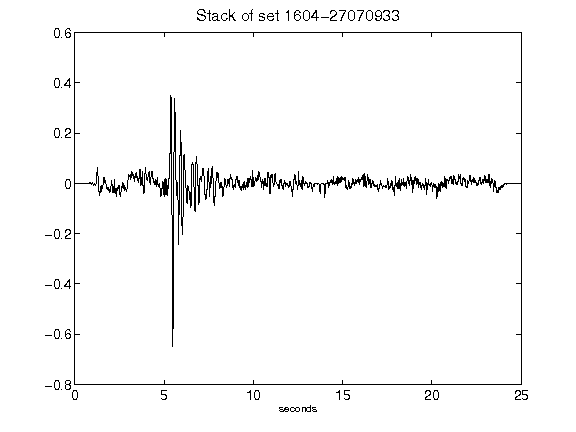](figures/1604-27070933_Stack.png)[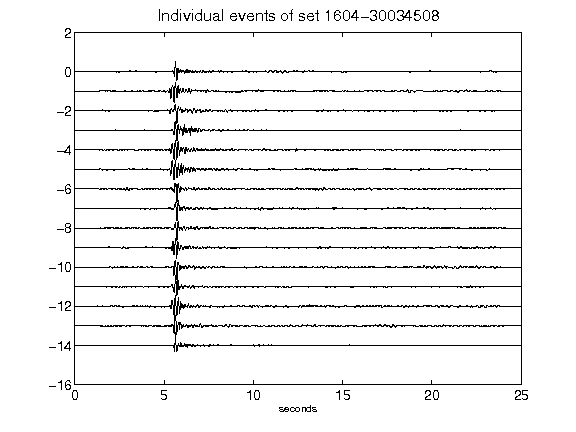](figures/1604-30034508_AllEv.png)