# Repeating Earthquake Activity at RCM

## Waveforms
[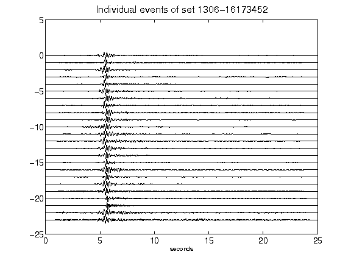](figures/1306-16173452_AllEv.png)[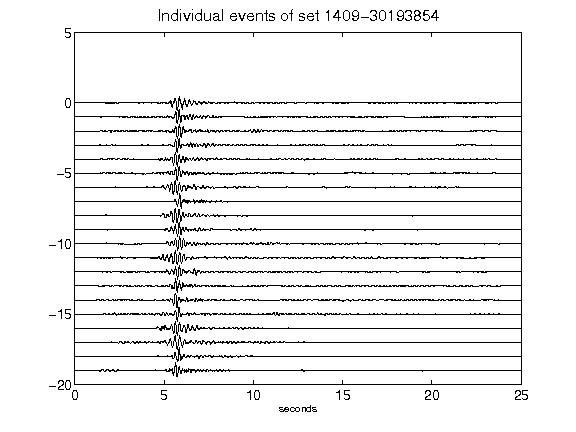](figures/1409-30193854_AllEv.png)[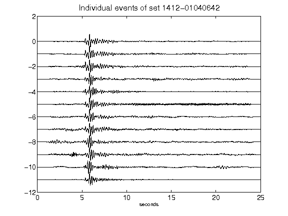](figures/1412-01040642_AllEv.png)[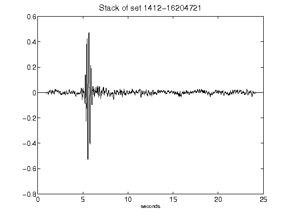](figures/1412-16204721_Stack.png)[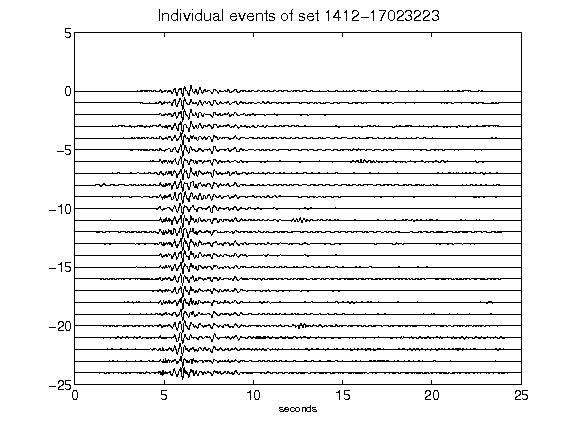](figures/1412-17023223_AllEv.png)[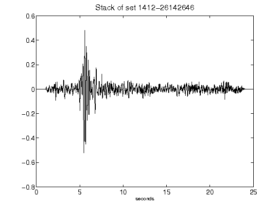](figures/1412-26142646_Stack.png)[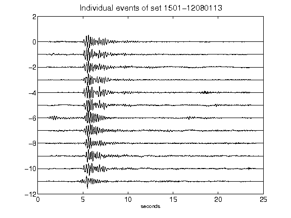](figures/1501-12080113_AllEv.png)[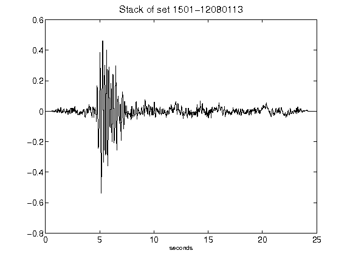](figures/1501-12080113_Stack.png)[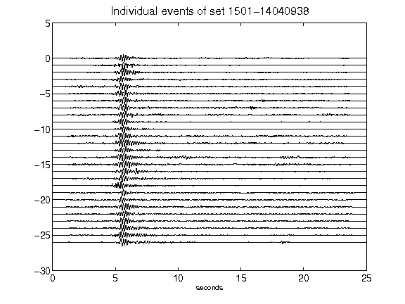](figures/1501-14040938_AllEv.png)[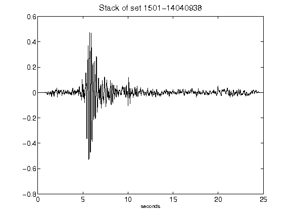](figures/1501-14040938_Stack.png)[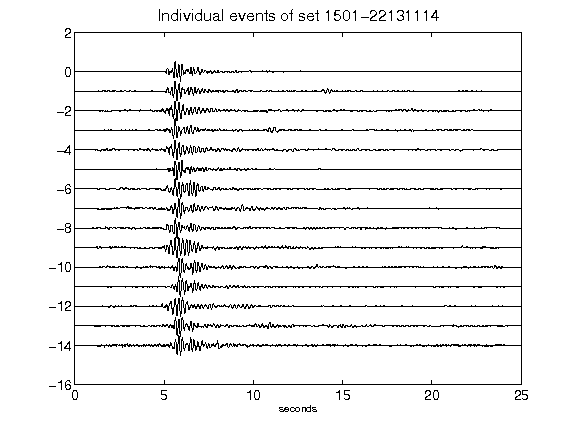](figures/1501-22131114_AllEv.png)[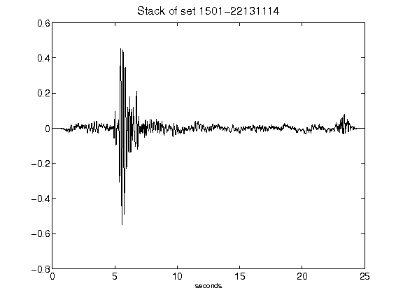](figures/1501-22131114_Stack.png)