# Repeating Earthquake Activity at RCM

## Waveforms
[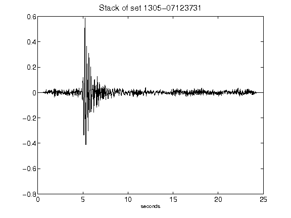](figures/1305-07123731_Stack.png)[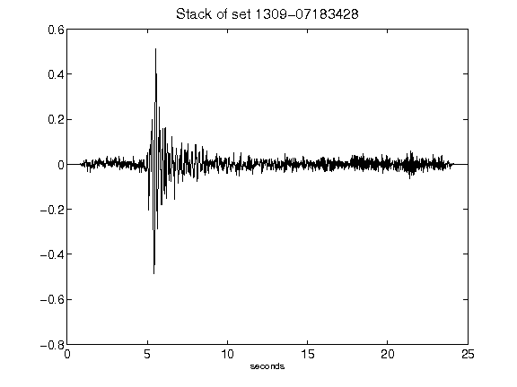](figures/1309-07183428_Stack.png)[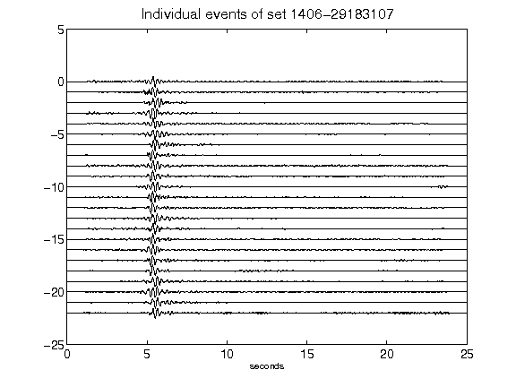](figures/1406-29183107_AllEv.png)[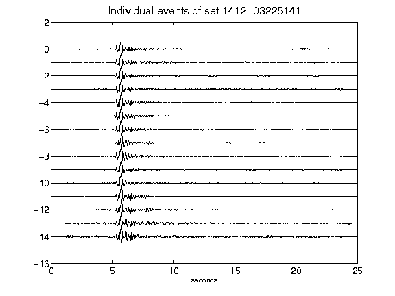](figures/1412-03225141_AllEv.png)[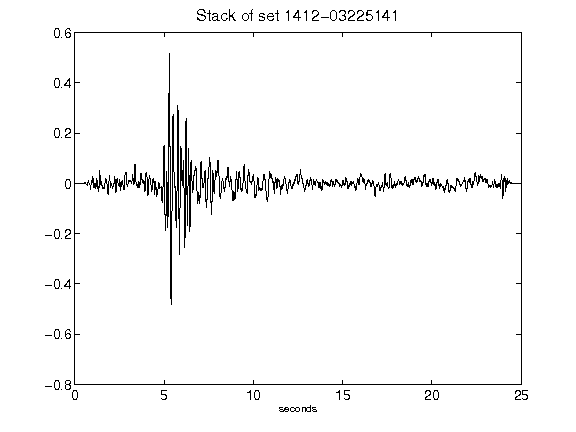](figures/1412-03225141_Stack.png)[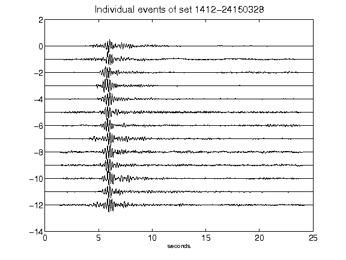](figures/1412-24150328_AllEv.png)[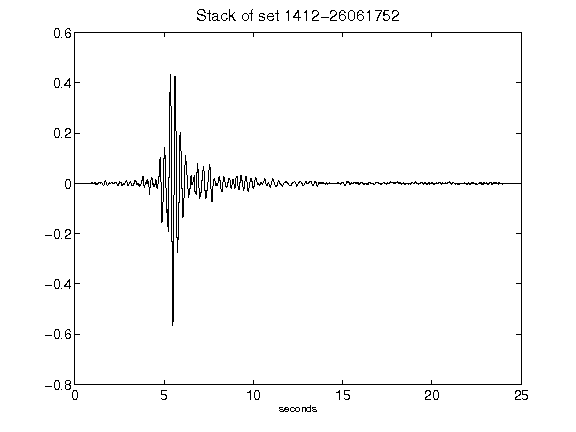](figures/1412-26061752_Stack.png)[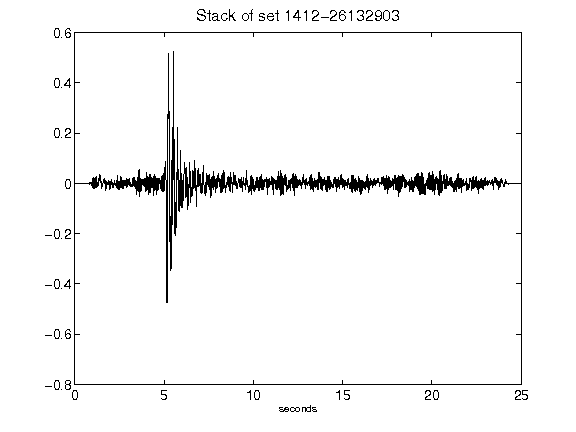](figures/1412-26132903_Stack.png)[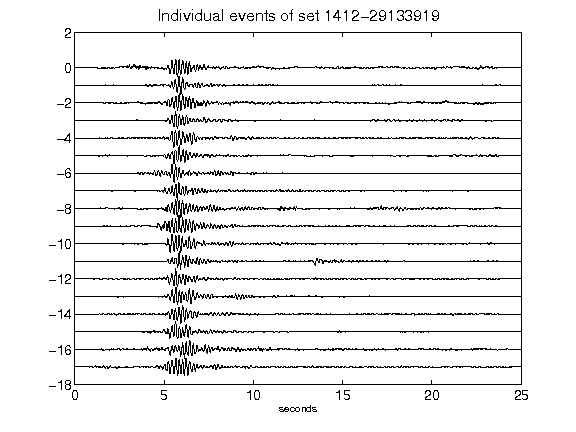](figures/1412-29133919_AllEv.png)[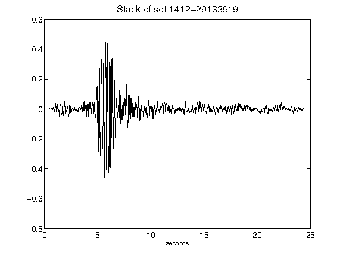](figures/1412-29133919_Stack.png)[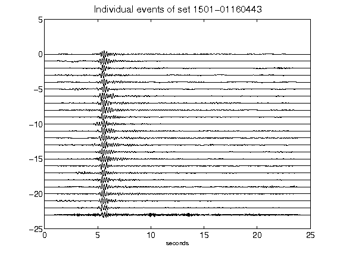](figures/1501-01160443_AllEv.png)[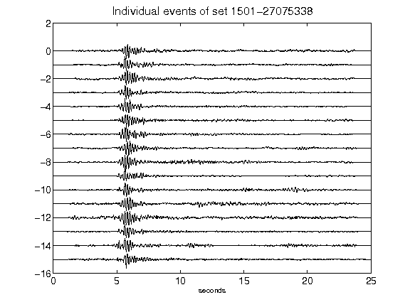](figures/1501-27075338_AllEv.png)[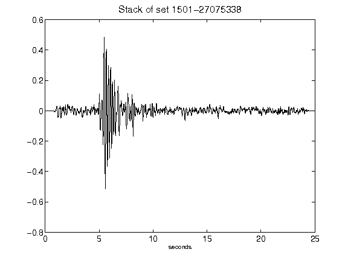](figures/1501-27075338_Stack.png)[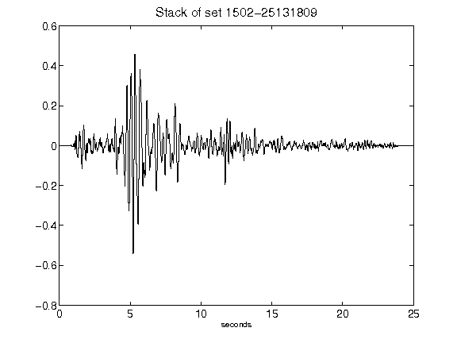](figures/1502-25131809_Stack.png)[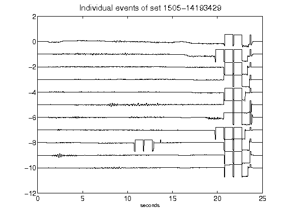](figures/1505-14193429_AllEv.png)