# Repeating Earthquake Activity at RCM

## Waveforms
[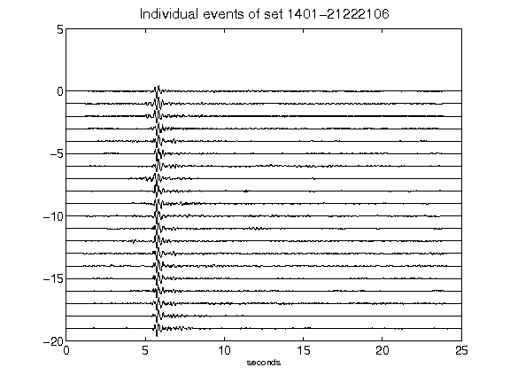](figures/1401-21222106_AllEv.png)[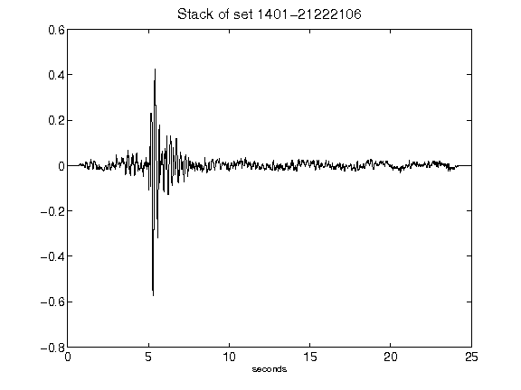](figures/1401-21222106_Stack.png)[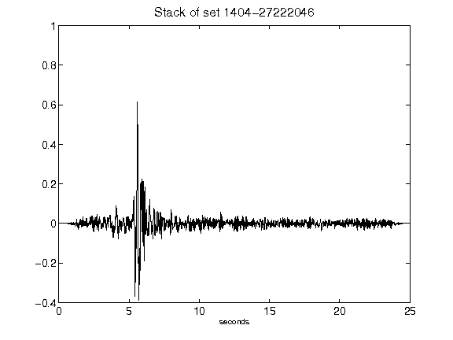](figures/1404-27222046_Stack.png)[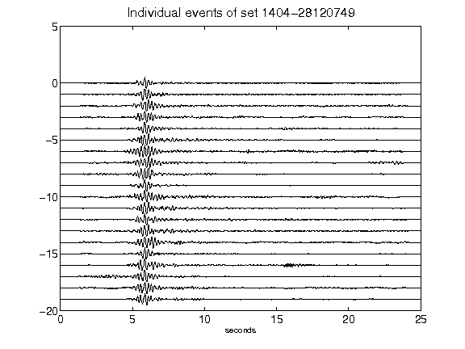](figures/1404-28120749_AllEv.png)[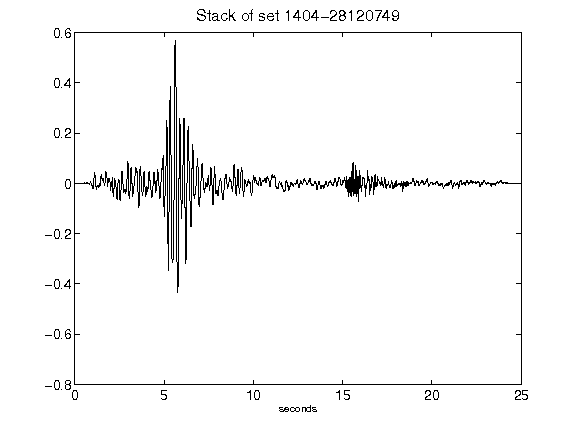](figures/1404-28120749_Stack.png)[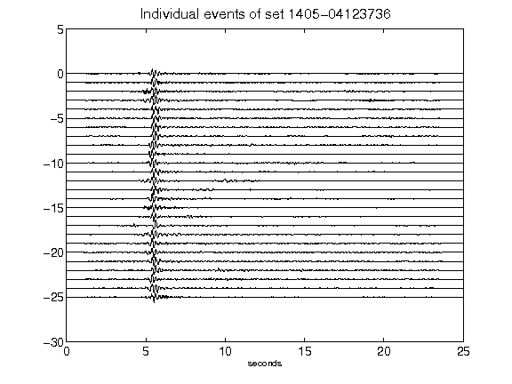](figures/1405-04123736_AllEv.png)[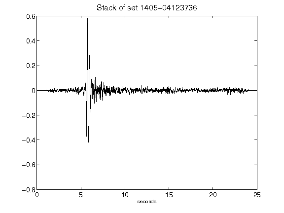](figures/1405-04123736_Stack.png)[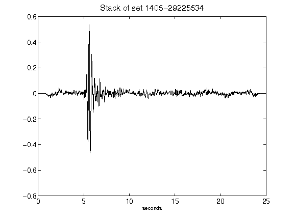](figures/1405-29225534_Stack.png)[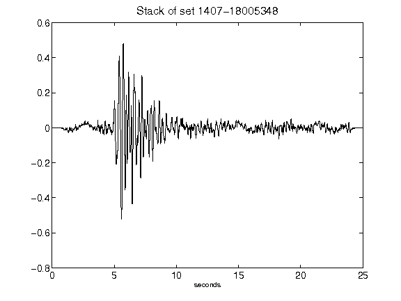](figures/1407-18005348_Stack.png)[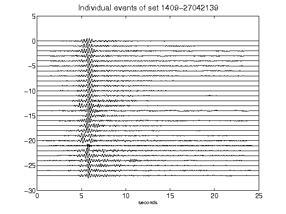](figures/1409-27042139_AllEv.png)[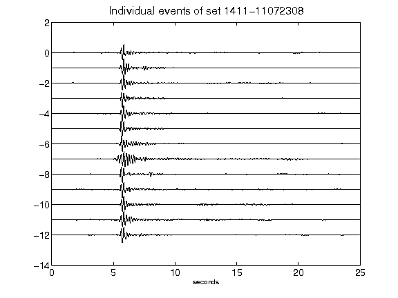](figures/1411-11072308_AllEv.png)[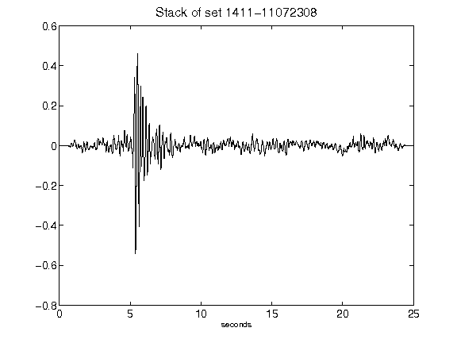](figures/1411-11072308_Stack.png)[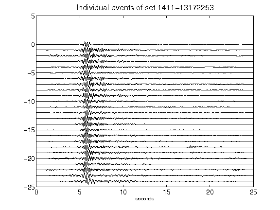](figures/1411-13172253_AllEv.png)[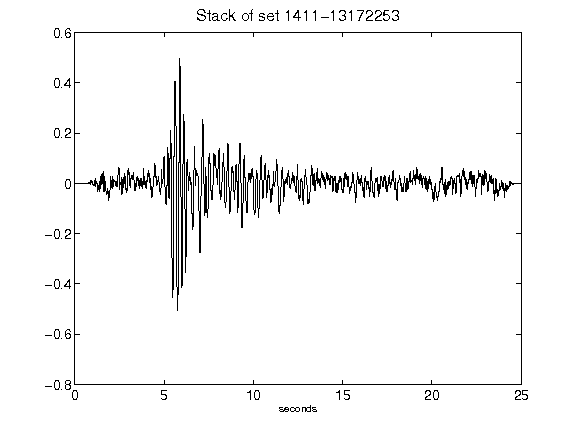](figures/1411-13172253_Stack.png)[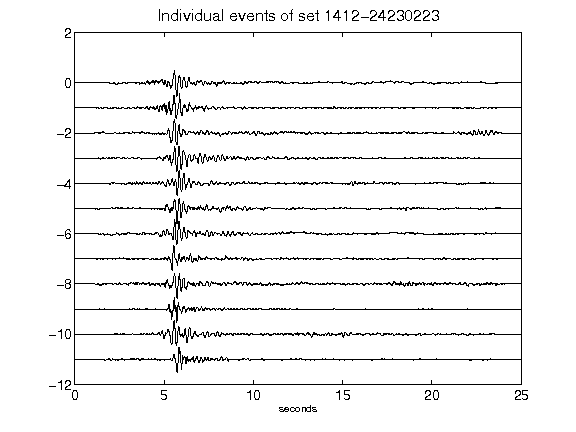](figures/1412-24230223_AllEv.png)[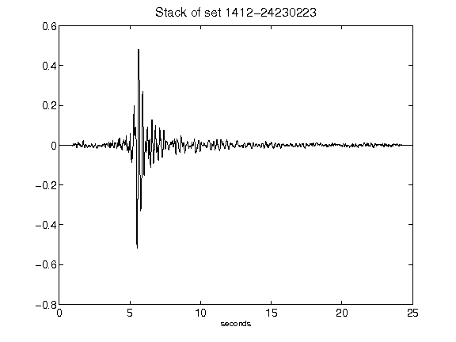](figures/1412-24230223_Stack.png)[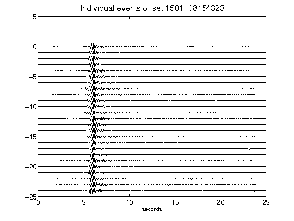](figures/1501-08154323_AllEv.png)[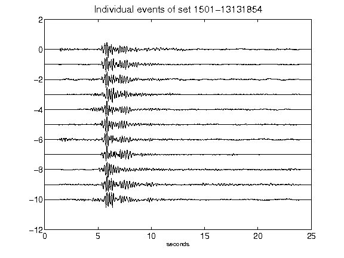](figures/1501-13131854_AllEv.png)[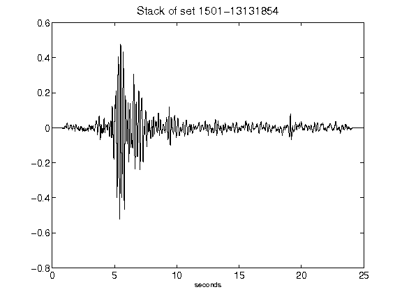](figures/1501-13131854_Stack.png)[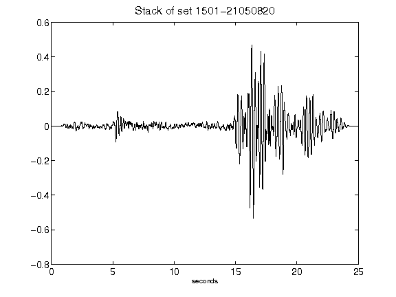](figures/1501-21050820_Stack.png)[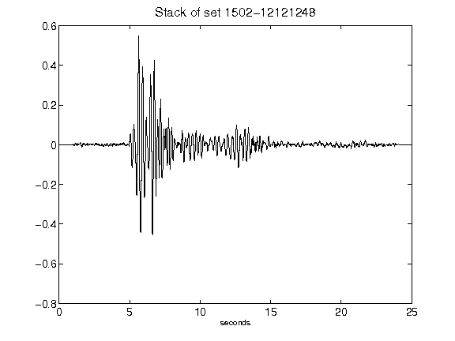](figures/1502-12121248_Stack.png)[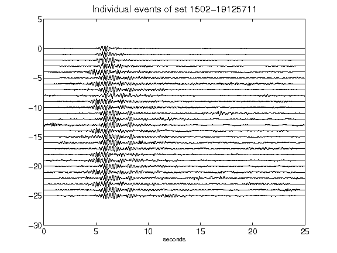](figures/1502-19125711_AllEv.png)[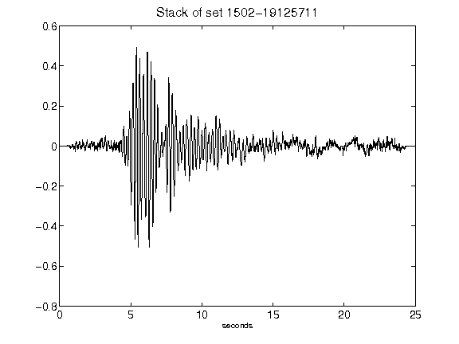](figures/1502-19125711_Stack.png)[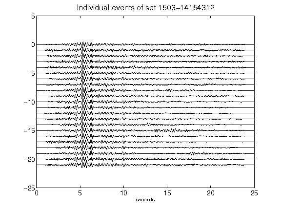](figures/1503-14154312_AllEv.png)[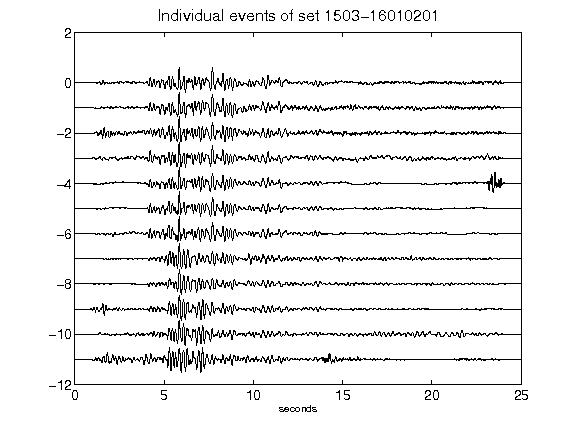](figures/1503-16010201_AllEv.png)