# Repeating Earthquake Activity at RCM

## Waveforms
[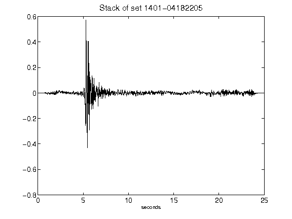](figures/1401-04182205_Stack.png)[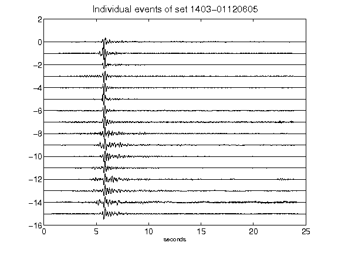](figures/1403-01120605_AllEv.png)[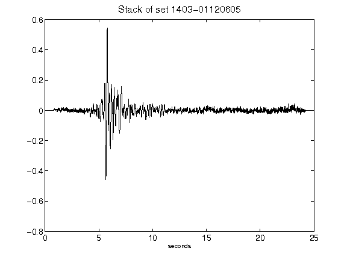](figures/1403-01120605_Stack.png)[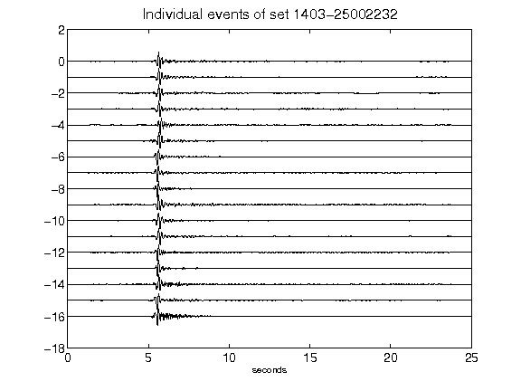](figures/1403-25002232_AllEv.png)[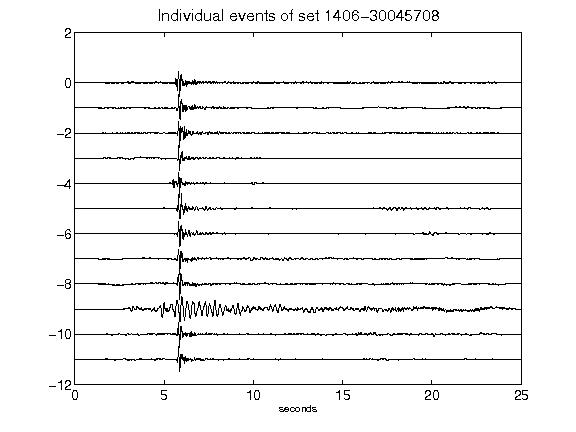](figures/1406-30045708_AllEv.png)[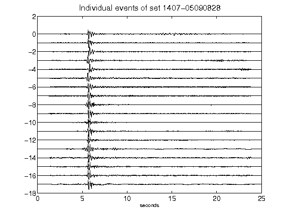](figures/1407-05090828_AllEv.png)[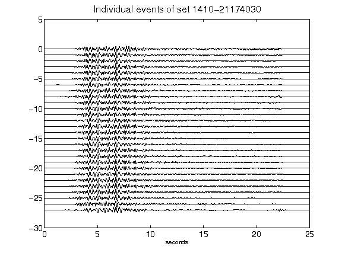](figures/1410-21174030_AllEv.png)[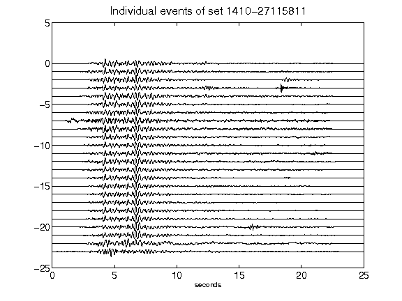](figures/1410-27115811_AllEv.png)[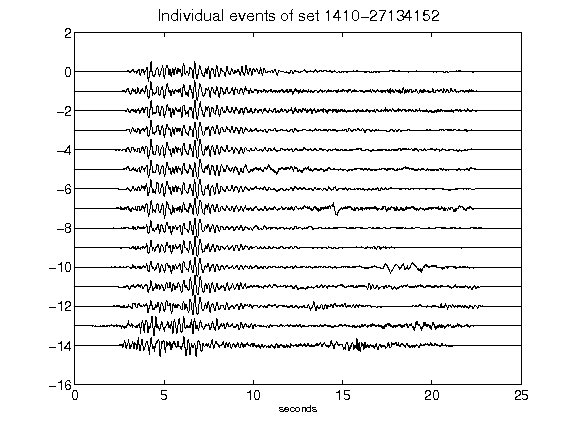](figures/1410-27134152_AllEv.png)[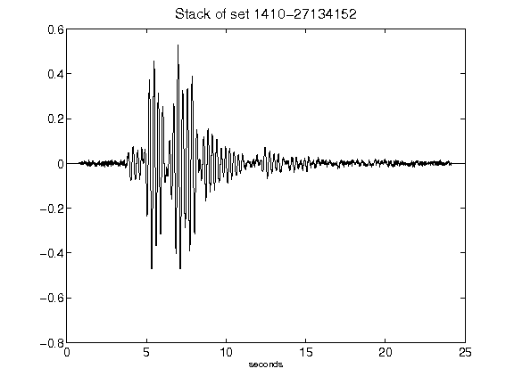](figures/1410-27134152_Stack.png)[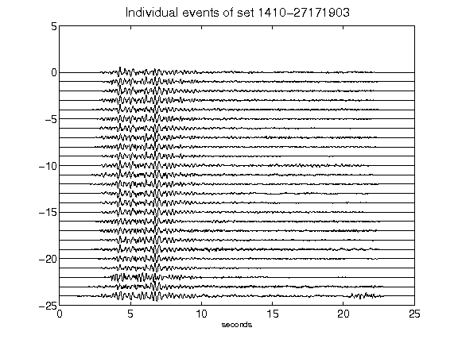](figures/1410-27171903_AllEv.png)[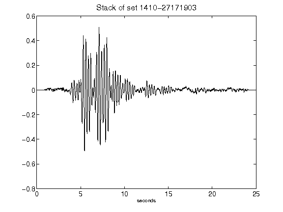](figures/1410-27171903_Stack.png)[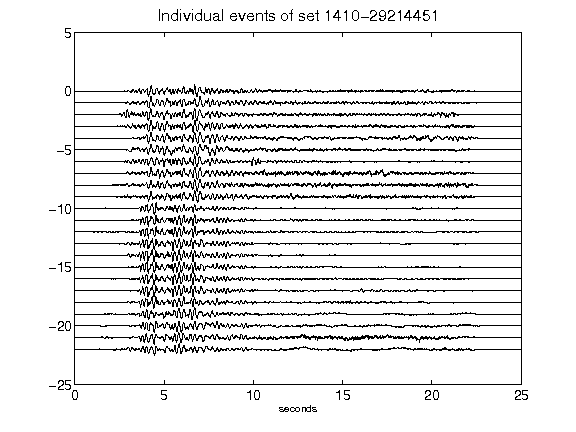](figures/1410-29214451_AllEv.png)[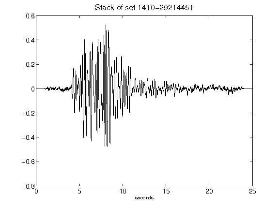](figures/1410-29214451_Stack.png)[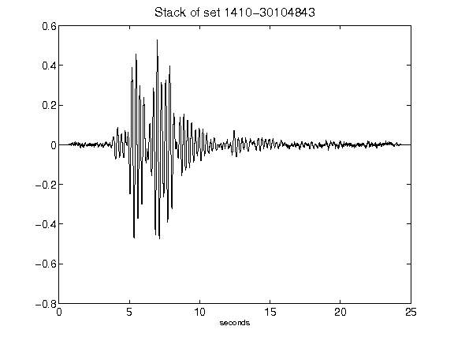](figures/1410-30104843_Stack.png)[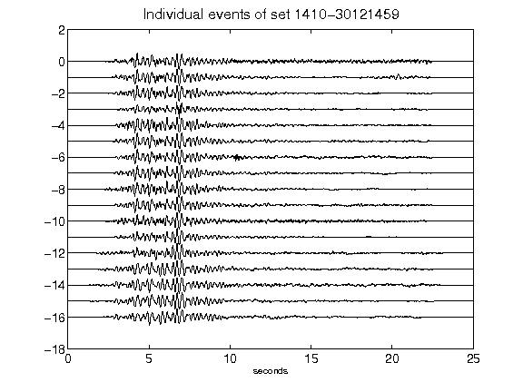](figures/1410-30121459_AllEv.png)[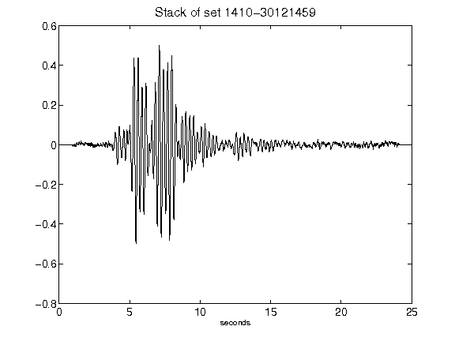](figures/1410-30121459_Stack.png)[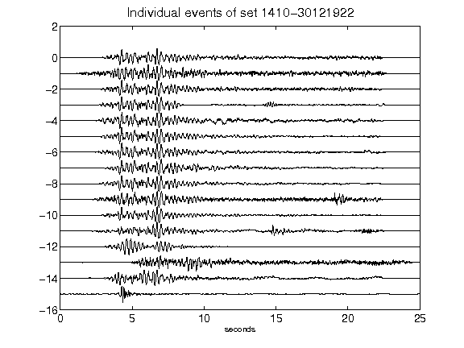](figures/1410-30121922_AllEv.png)[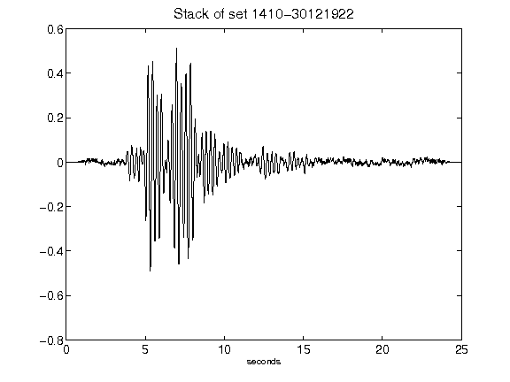](figures/1410-30121922_Stack.png)[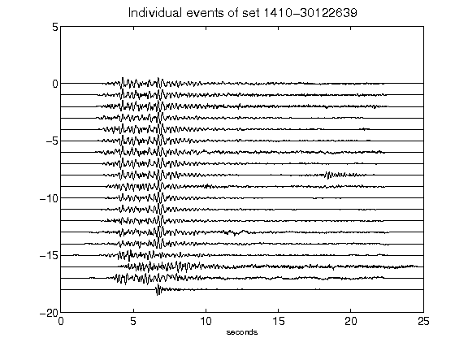](figures/1410-30122639_AllEv.png)[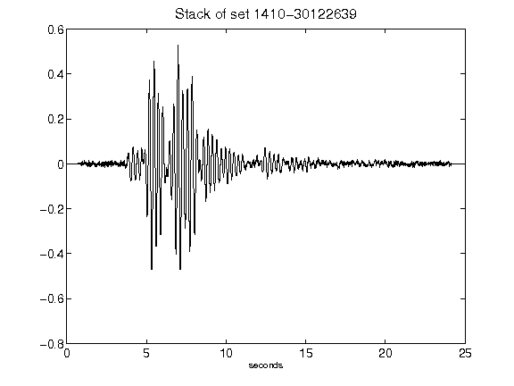](figures/1410-30122639_Stack.png)[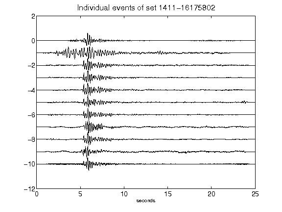](figures/1411-16175802_AllEv.png)[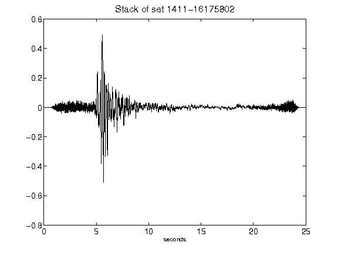](figures/1411-16175802_Stack.png)[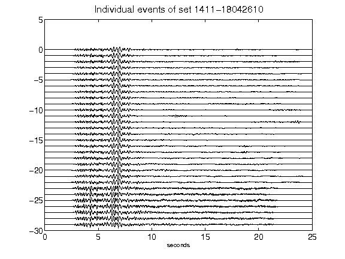](figures/1411-18042610_AllEv.png)