# Repeating Earthquake Activity at RCM

## Waveforms
[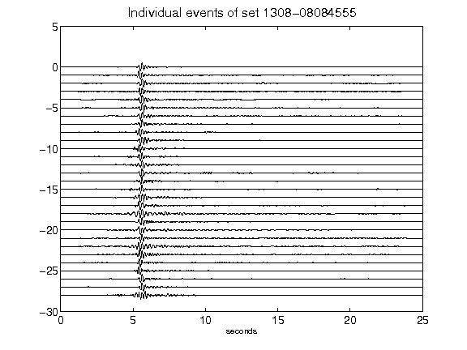](figures/1308-08084555_AllEv.png)[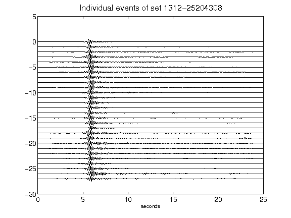](figures/1312-25204308_AllEv.png)[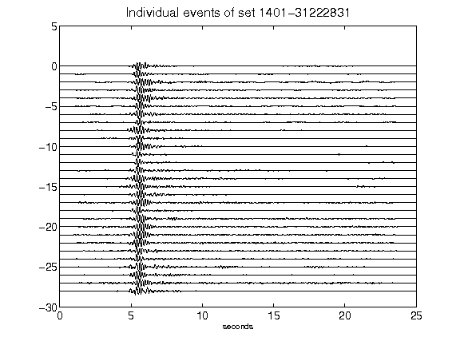](figures/1401-31222831_AllEv.png)[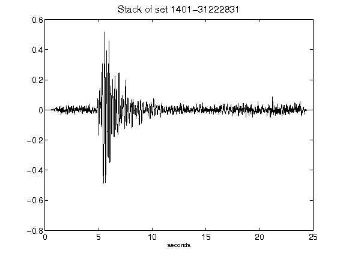](figures/1401-31222831_Stack.png)[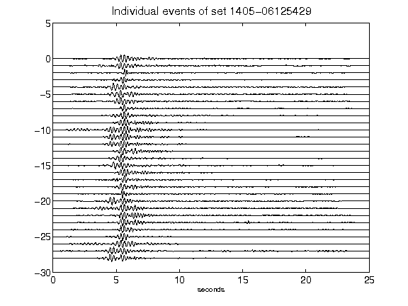](figures/1405-06125429_AllEv.png)[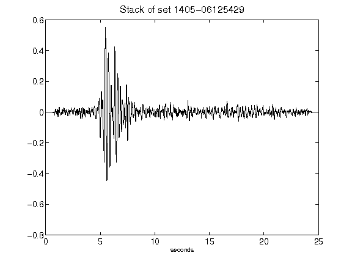](figures/1405-06125429_Stack.png)[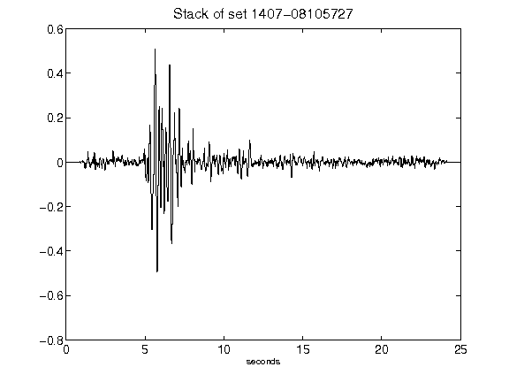](figures/1407-08105727_Stack.png)[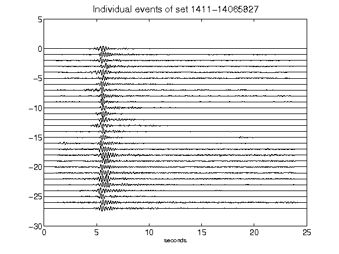](figures/1411-14065827_AllEv.png)[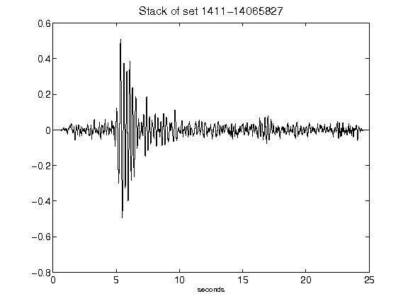](figures/1411-14065827_Stack.png)[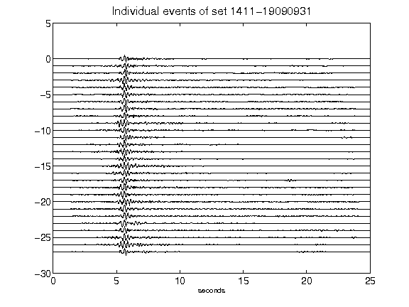](figures/1411-19090931_AllEv.png)[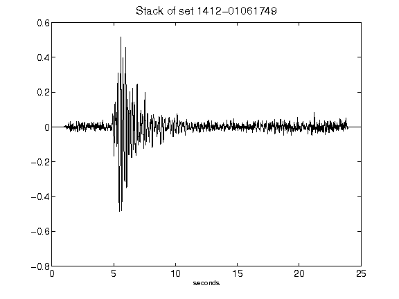](figures/1412-01061749_Stack.png)[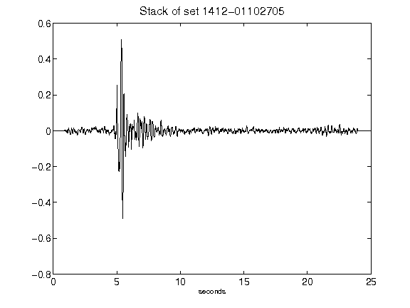](figures/1412-01102705_Stack.png)[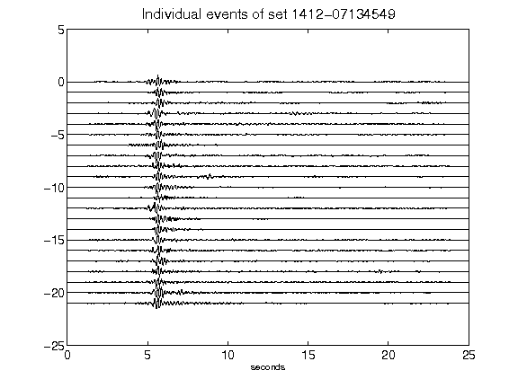](figures/1412-07134549_AllEv.png)[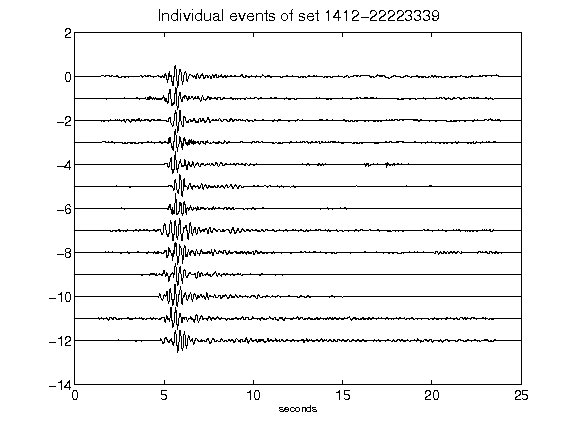](figures/1412-22223339_AllEv.png)[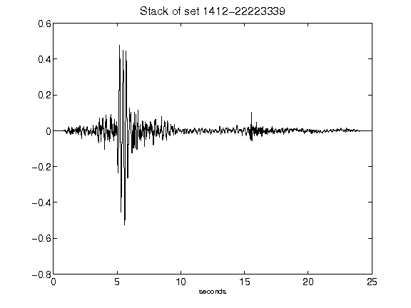](figures/1412-22223339_Stack.png)[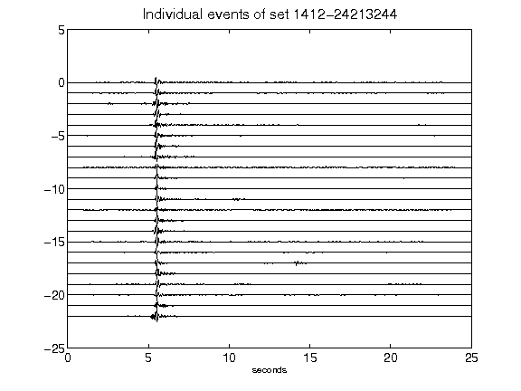](figures/1412-24213244_AllEv.png)[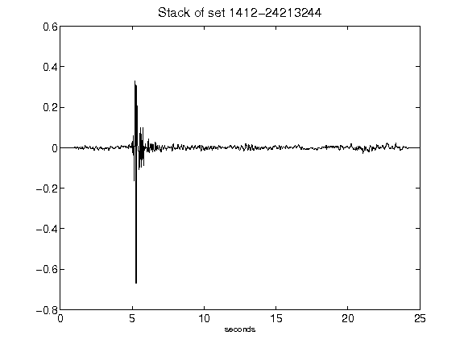](figures/1412-24213244_Stack.png)[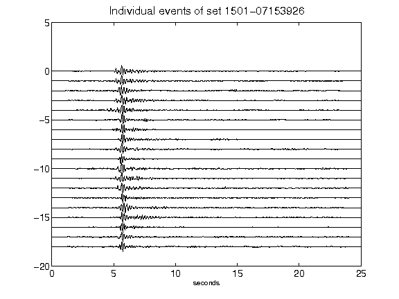](figures/1501-07153926_AllEv.png)[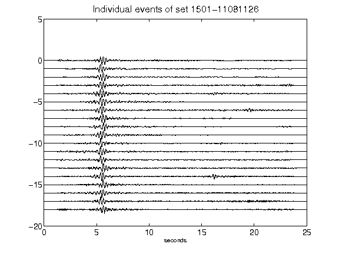](figures/1501-11081126_AllEv.png)[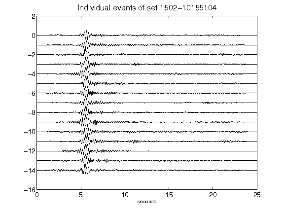](figures/1502-10155104_AllEv.png)[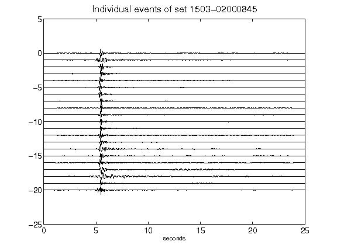](figures/1503-02000845_AllEv.png)[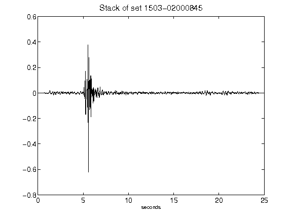](figures/1503-02000845_Stack.png)[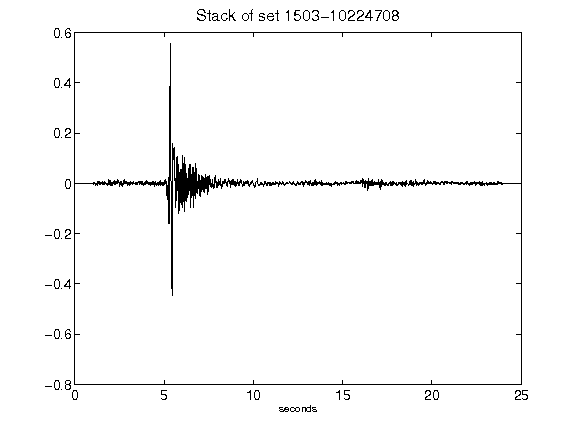](figures/1503-10224708_Stack.png)[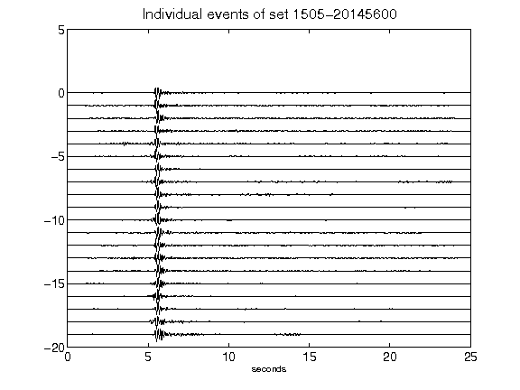](figures/1505-20145600_AllEv.png)