# Repeating Earthquake Activity at RCM

## Waveforms
[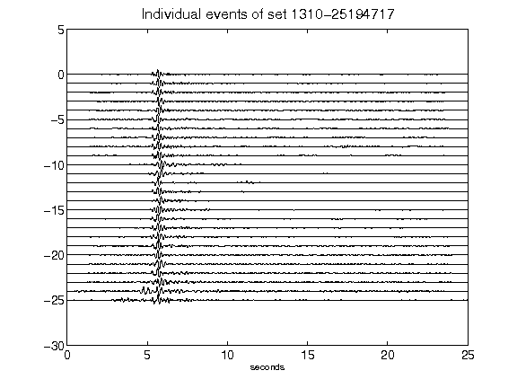](figures/1310-25194717_AllEv.png)[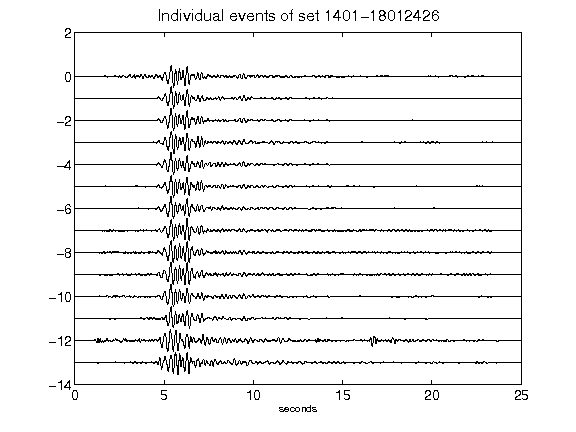](figures/1401-18012426_AllEv.png)[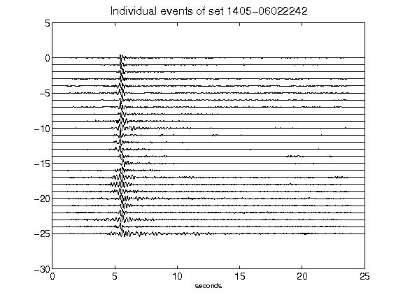](figures/1405-06022242_AllEv.png)[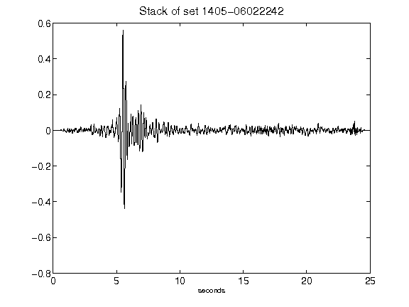](figures/1405-06022242_Stack.png)[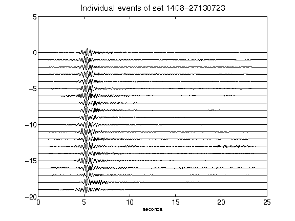](figures/1408-27130723_AllEv.png)[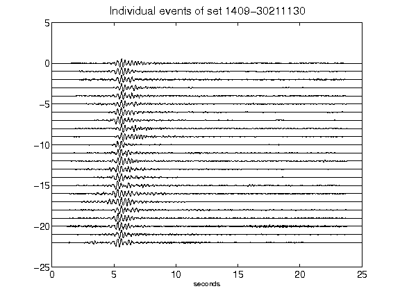](figures/1409-30211130_AllEv.png)[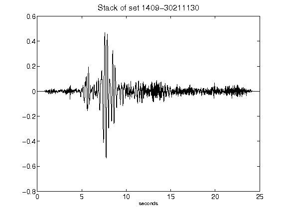](figures/1409-30211130_Stack.png)[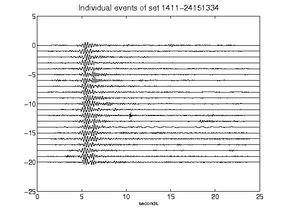](figures/1411-24151334_AllEv.png)[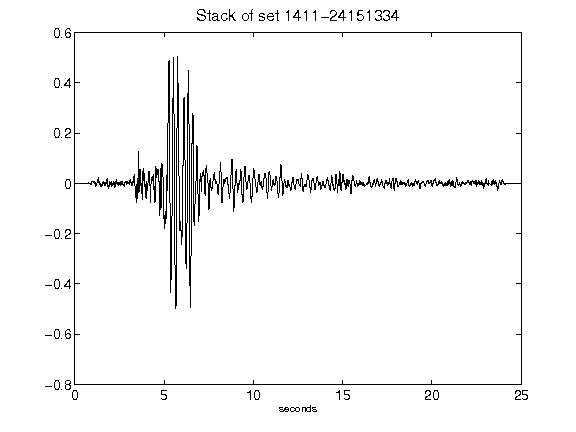](figures/1411-24151334_Stack.png)[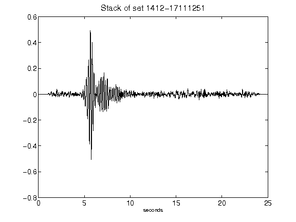](figures/1412-17111251_Stack.png)[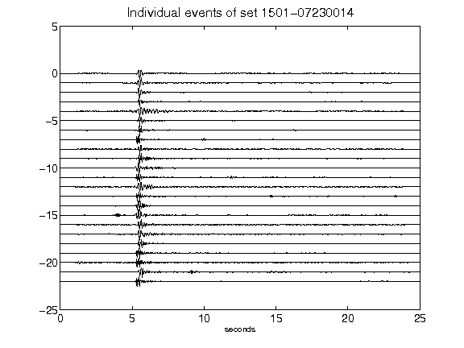](figures/1501-07230014_AllEv.png)[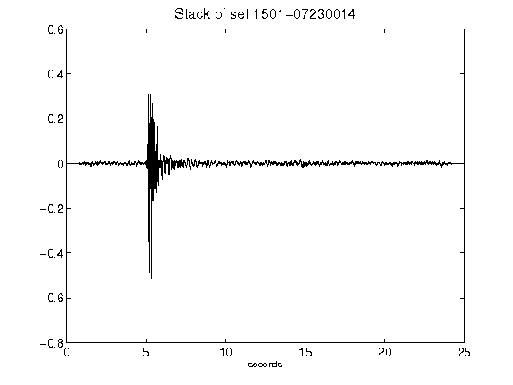](figures/1501-07230014_Stack.png)[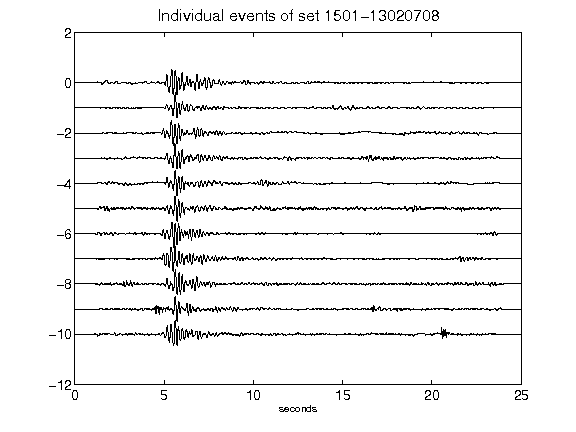](figures/1501-13020708_AllEv.png)[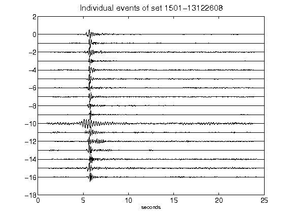](figures/1501-13122608_AllEv.png)[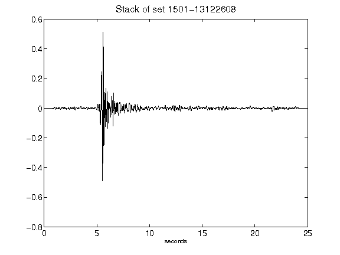](figures/1501-13122608_Stack.png)[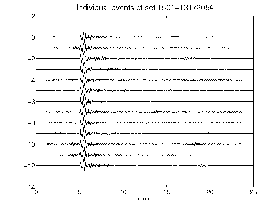](figures/1501-13172054_AllEv.png)[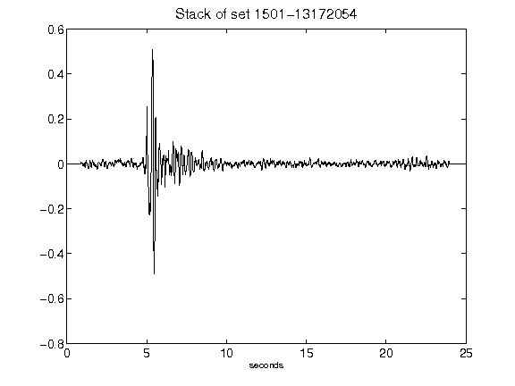](figures/1501-13172054_Stack.png)[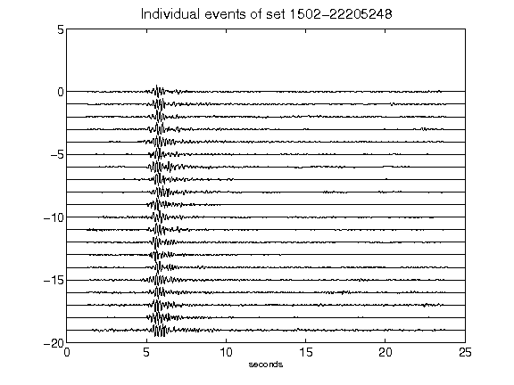](figures/1502-22205248_AllEv.png)[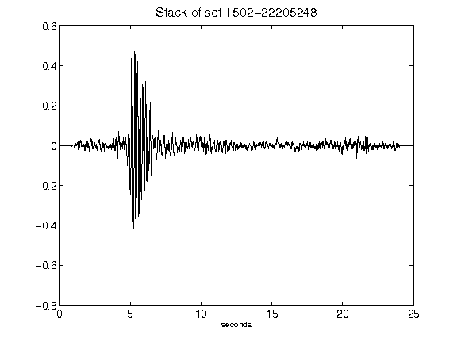](figures/1502-22205248_Stack.png)[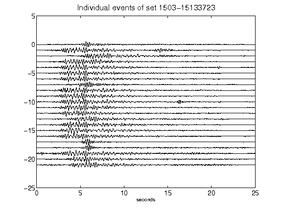](figures/1503-15133723_AllEv.png)[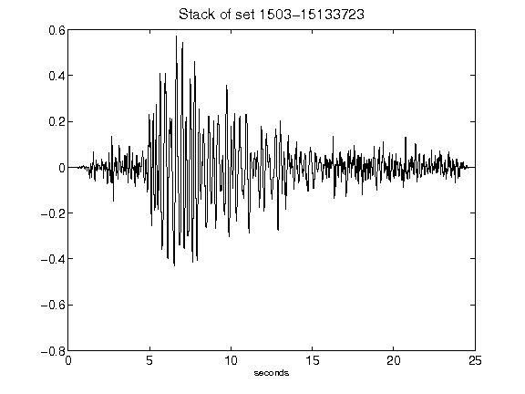](figures/1503-15133723_Stack.png)[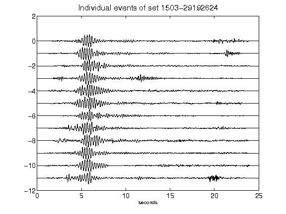](figures/1503-29192624_AllEv.png)[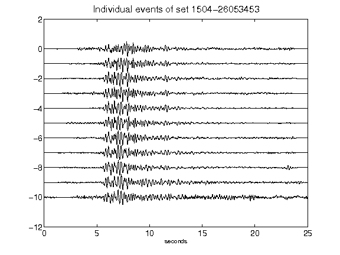](figures/1504-26053453_AllEv.png)[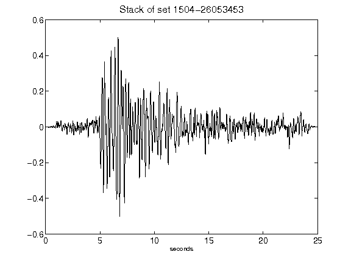](figures/1504-26053453_Stack.png)[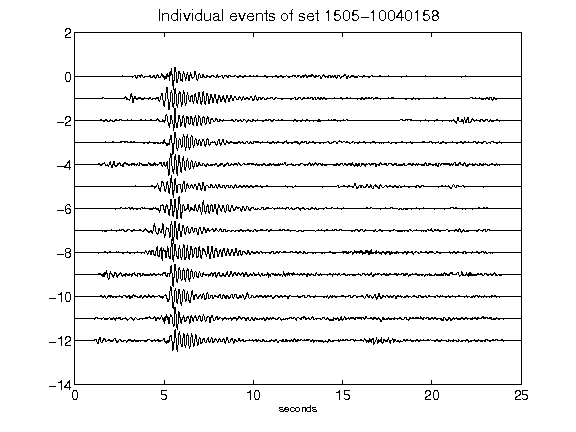](figures/1505-10040158_AllEv.png)[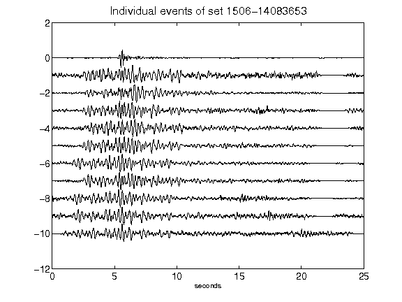](figures/1506-14083653_AllEv.png)[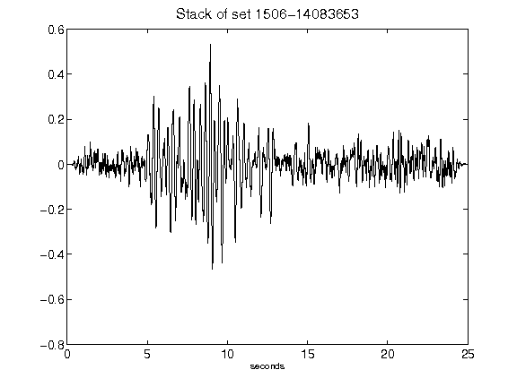](figures/1506-14083653_Stack.png)