# Repeating Earthquake Activity at RCM

## Waveforms
[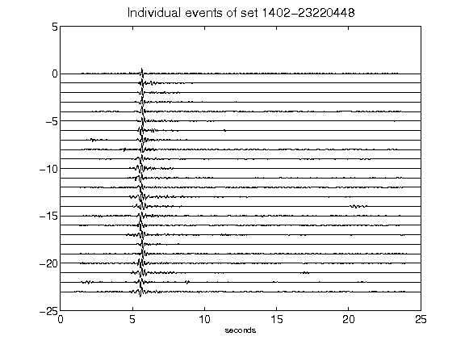](figures/1402-23220448_AllEv.png)[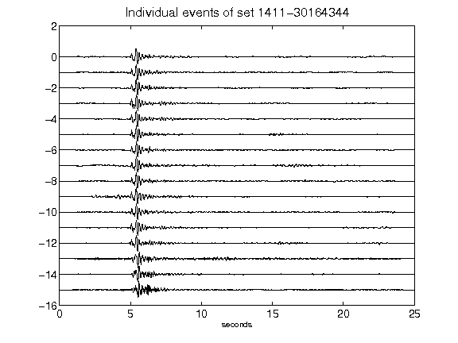](figures/1411-30164344_AllEv.png)[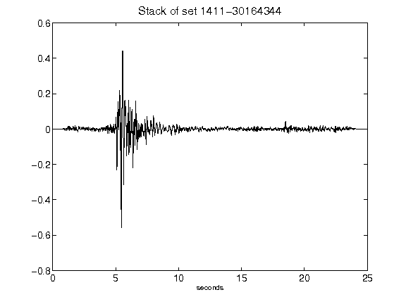](figures/1411-30164344_Stack.png)[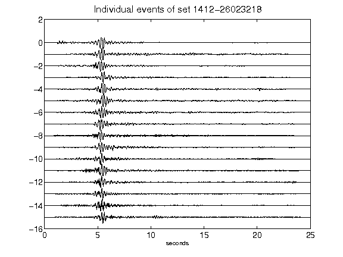](figures/1412-26023218_AllEv.png)[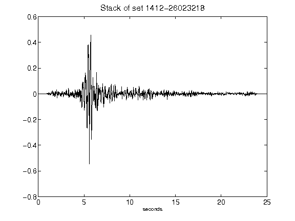](figures/1412-26023218_Stack.png)[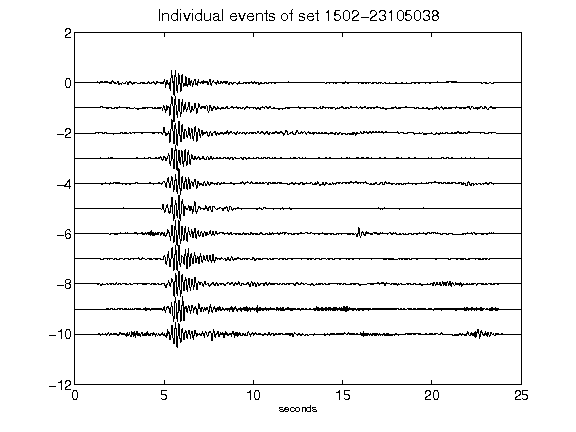](figures/1502-23105038_AllEv.png)[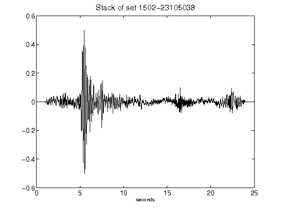](figures/1502-23105038_Stack.png)[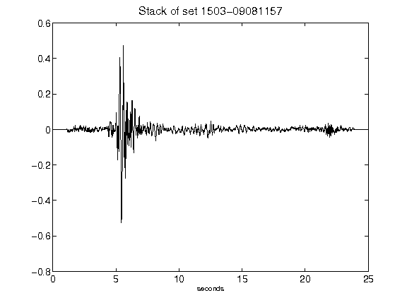](figures/1503-09081157_Stack.png)[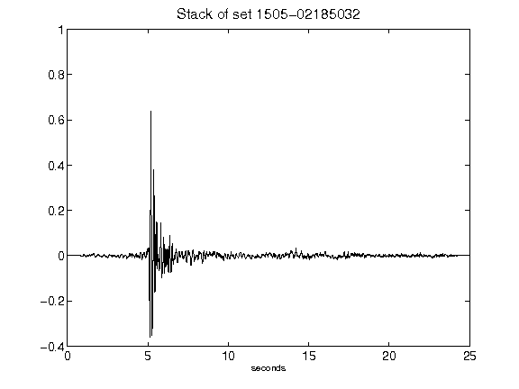](figures/1505-02185032_Stack.png)[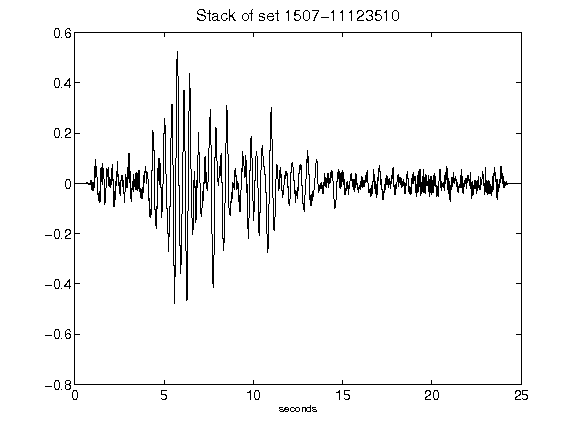](figures/1507-11123510_Stack.png)[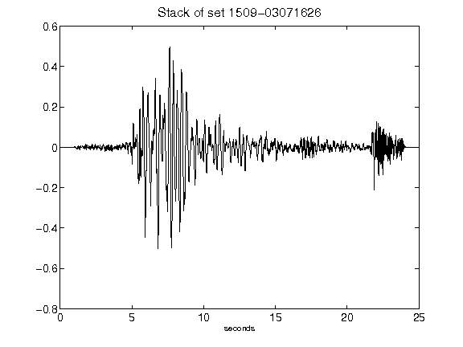](figures/1509-03071626_Stack.png)[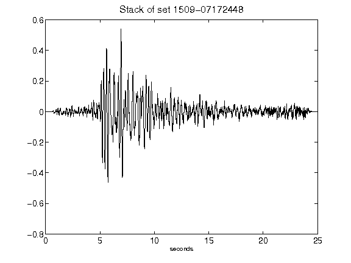](figures/1509-07172448_Stack.png)