# Repeating Earthquake Activity at RCM

## Waveforms
[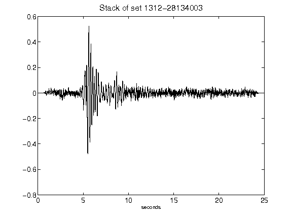](figures/1312-28134003_Stack.png)[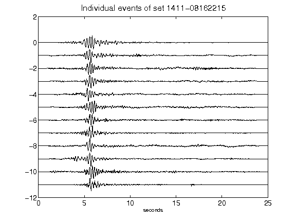](figures/1411-08162215_AllEv.png)[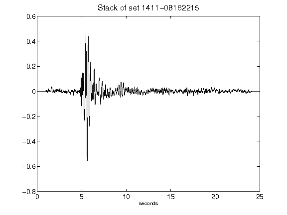](figures/1411-08162215_Stack.png)[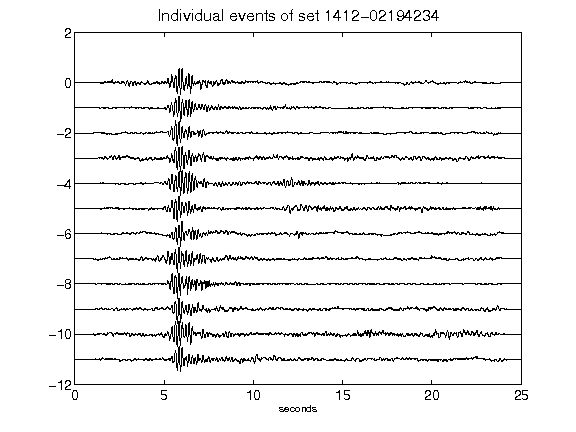](figures/1412-02194234_AllEv.png)[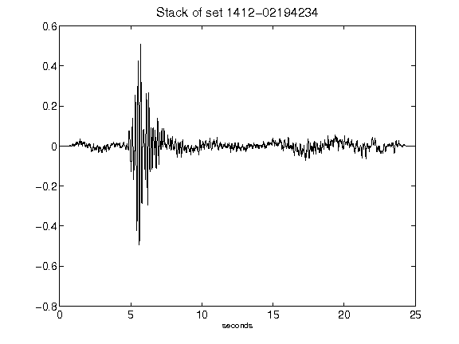](figures/1412-02194234_Stack.png)[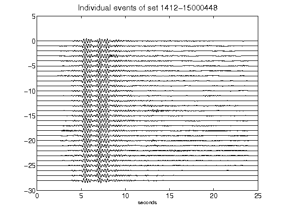](figures/1412-15000448_AllEv.png)[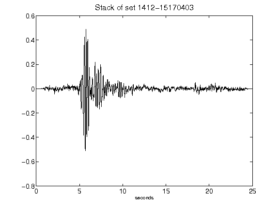](figures/1412-15170403_Stack.png)[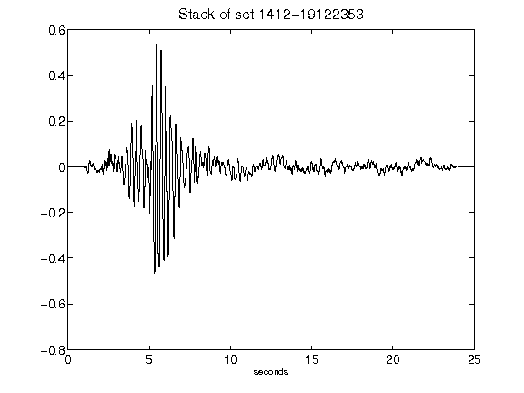](figures/1412-19122353_Stack.png)[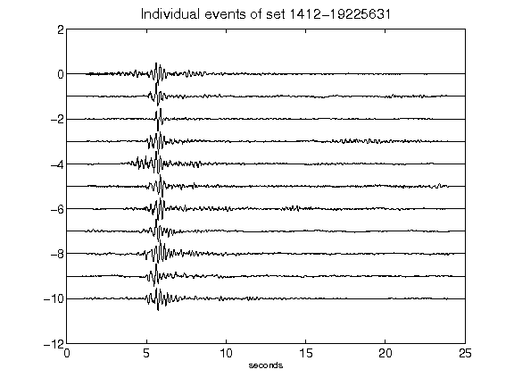](figures/1412-19225631_AllEv.png)[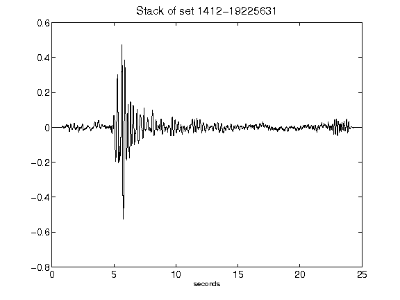](figures/1412-19225631_Stack.png)[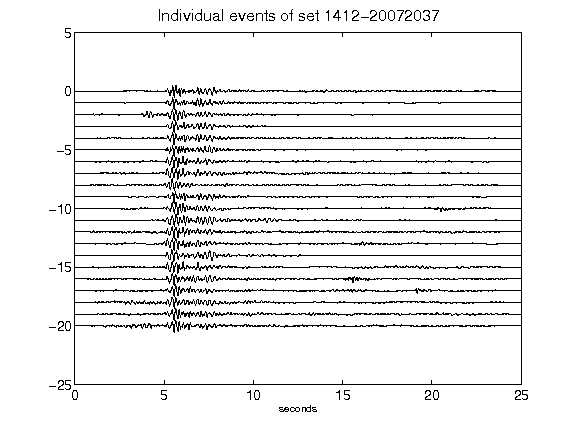](figures/1412-20072037_AllEv.png)[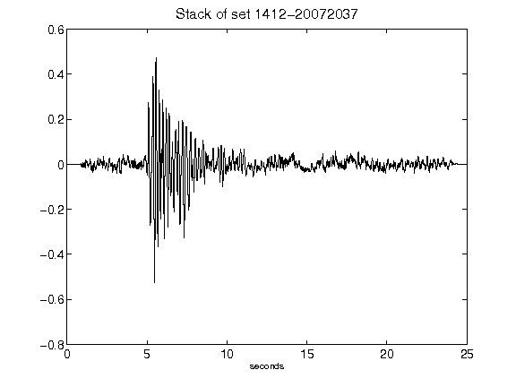](figures/1412-20072037_Stack.png)[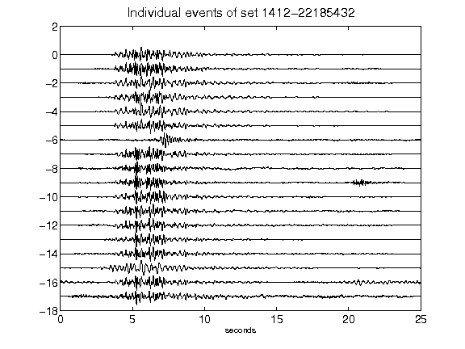](figures/1412-22185432_AllEv.png)[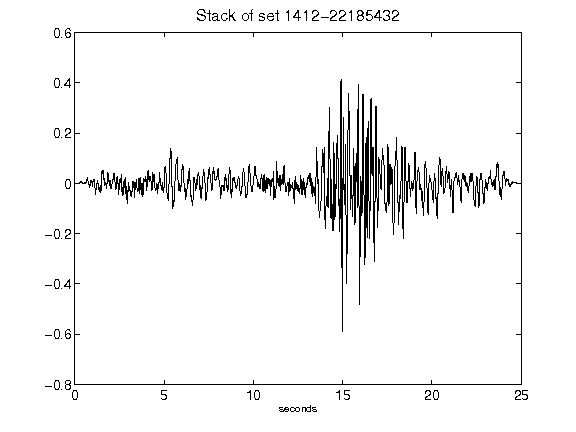](figures/1412-22185432_Stack.png)[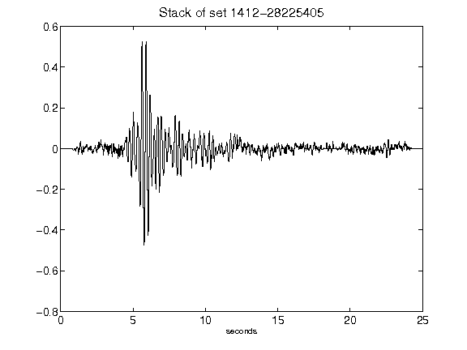](figures/1412-28225405_Stack.png)[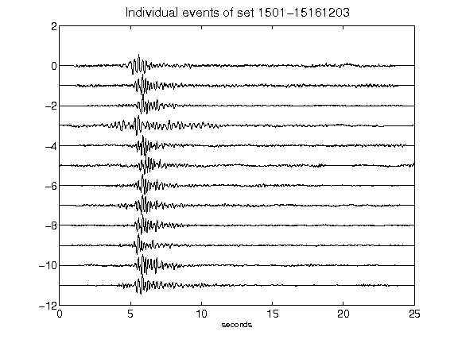](figures/1501-15161203_AllEv.png)[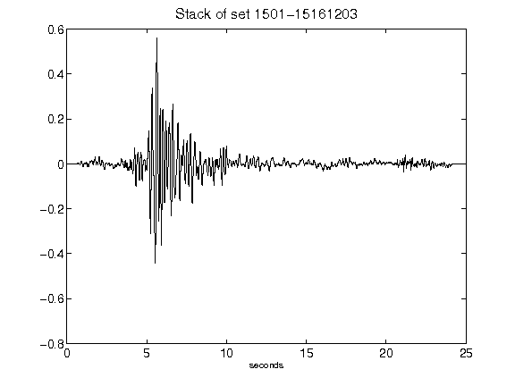](figures/1501-15161203_Stack.png)[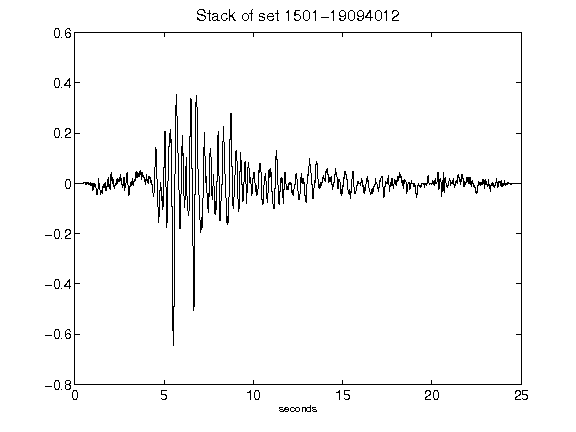](figures/1501-19094012_Stack.png)[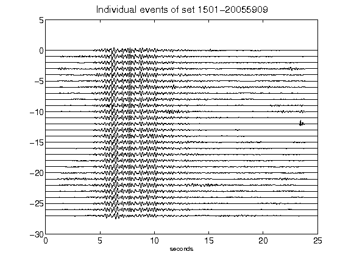](figures/1501-20055909_AllEv.png)[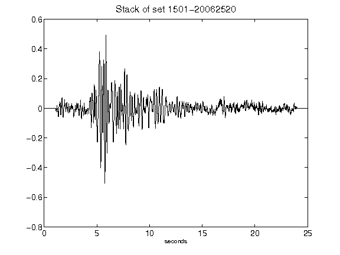](figures/1501-20062520_Stack.png)[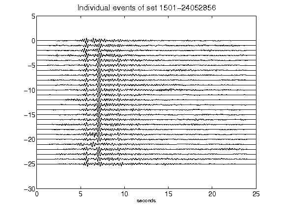](figures/1501-24052856_AllEv.png)