# Repeating Earthquake Activity at RCM

## Waveforms
[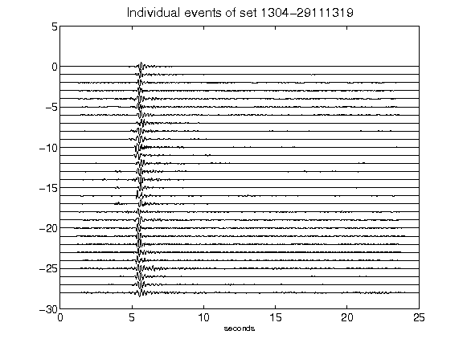](figures/1304-29111319_AllEv.png)[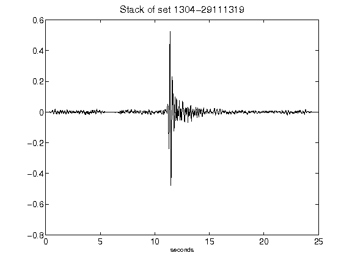](figures/1304-29111319_Stack.png)[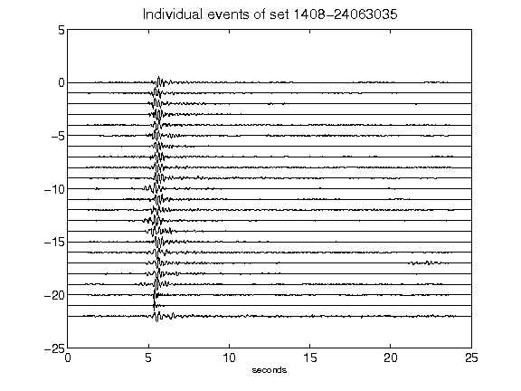](figures/1408-24063035_AllEv.png)[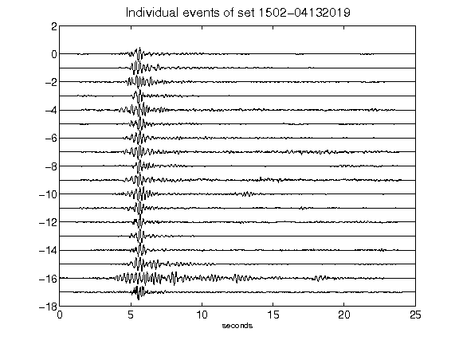](figures/1502-04132019_AllEv.png)[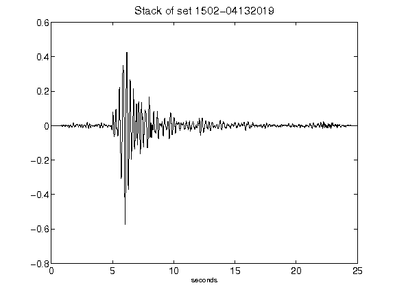](figures/1502-04132019_Stack.png)[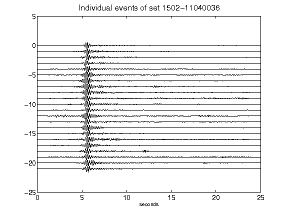](figures/1502-11040036_AllEv.png)[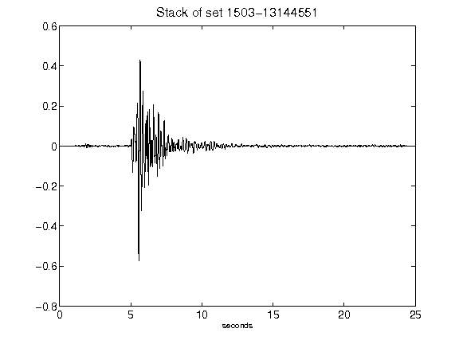](figures/1503-13144551_Stack.png)[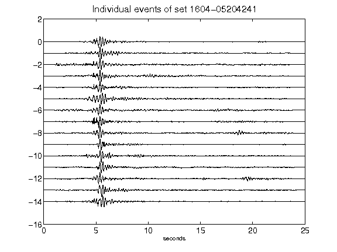](figures/1604-05204241_AllEv.png)[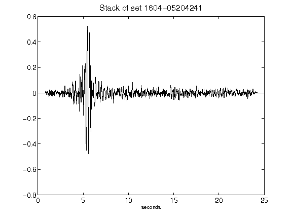](figures/1604-05204241_Stack.png)[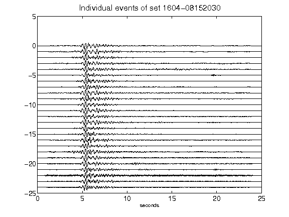](figures/1604-08152030_AllEv.png)[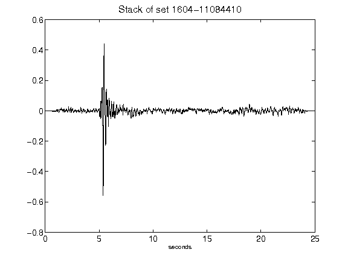](figures/1604-11084410_Stack.png)[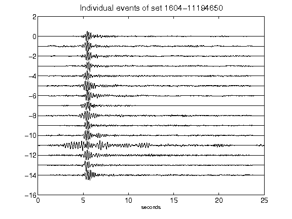](figures/1604-11194650_AllEv.png)[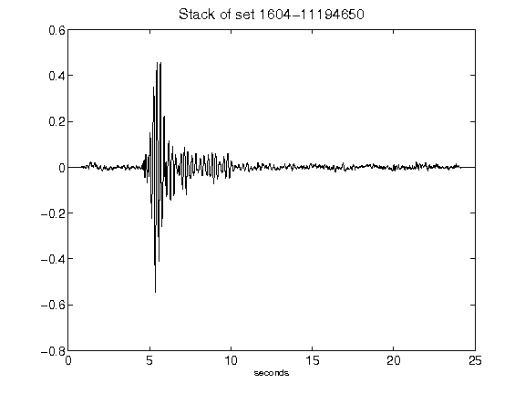](figures/1604-11194650_Stack.png)[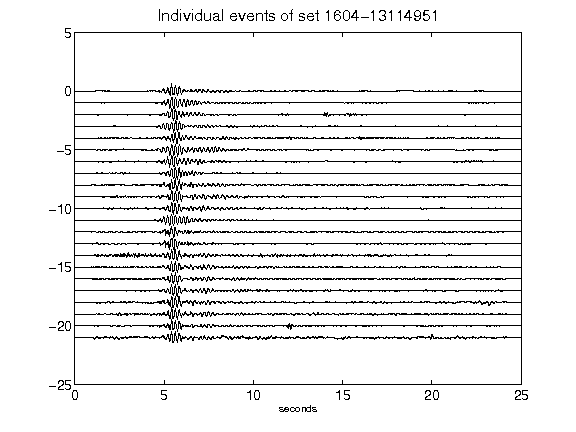](figures/1604-13114951_AllEv.png)[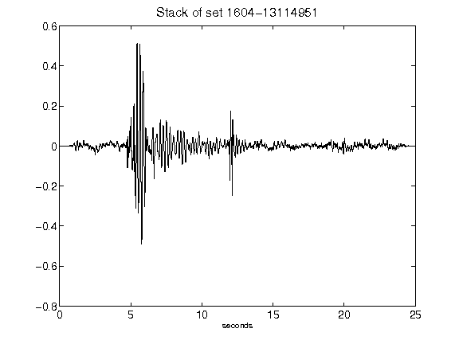](figures/1604-13114951_Stack.png)[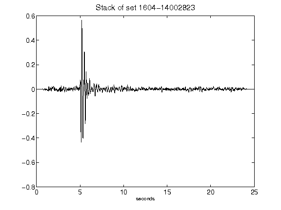](figures/1604-14002823_Stack.png)[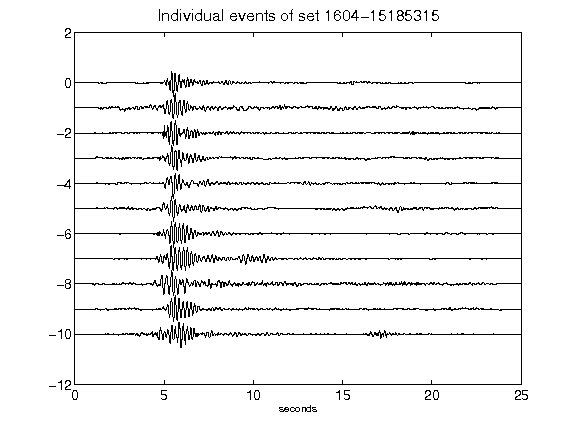](figures/1604-15185315_AllEv.png)[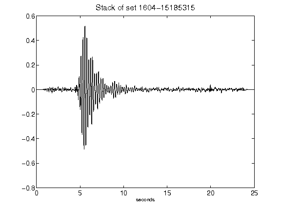](figures/1604-15185315_Stack.png)[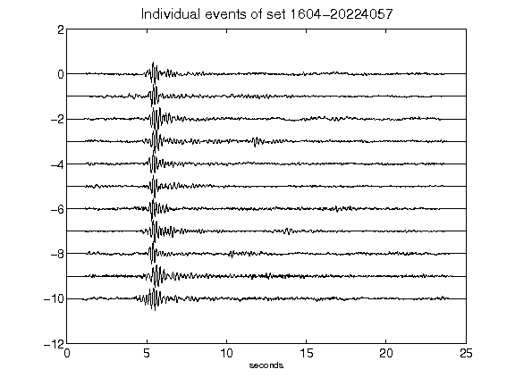](figures/1604-20224057_AllEv.png)[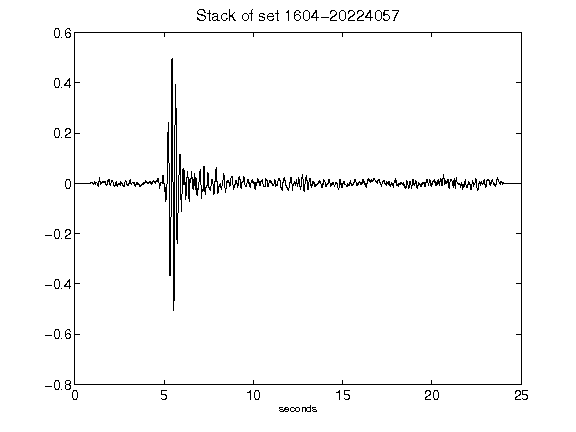](figures/1604-20224057_Stack.png)